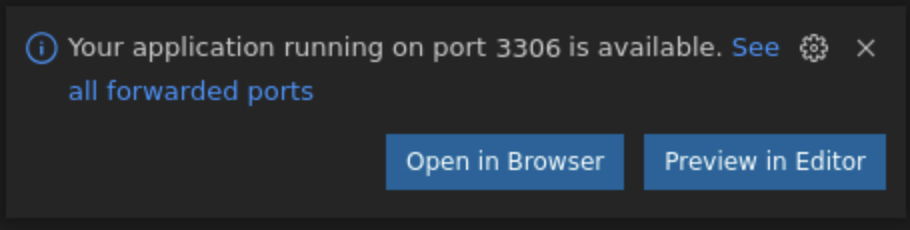
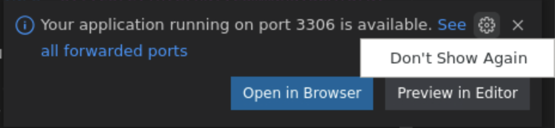

# Build and run the application

## Introduction

This section of the lab takes you through the steps to build and run the sample application.

Estimated Lab Time: 10 minutes

### Objectives

In this lab, you will:

* Build and run the application
* Send requests to publish metrics to OCI Metrics

## Task 1: Build and run the application with `mn:run`

1. From the same terminal in VS Code, run the following command with `mn:run` to build and start the application on port 8080.

``` bash
<copy>
./mvnw install -pl lib -am && MICRONAUT_ENVIRONMENTS=oraclecloud ./mvnw mn:run -pl oci
</copy>
```

## Task 2: Send requests to publish metrics to OCI Metrics

1. Open a second terminal in VS Code using the **Terminal>New Terminal** menu.

2. From the second terminal, send a few test requests (2 each) with cURL, as follows:

	a) Get all the books:

	``` bash
	<copy>
	curl localhost:8080/books | jq
	</copy>
	```

	VS Code may prompt you to open the URL in a browser as shown below. Just click the **Configure Notifications** gear icon and then click **Don't Show Again**.

   

   

	b) Get a book by its ISBN:

	``` bash
	<copy>
	curl localhost:8080/books/9781680502398 | jq
	</copy>
	```

   c) Get a list of all the available metrics:

	``` bash
	<copy>
	curl localhost:8080/metrics | jq
	</copy>
	```

   d) Get a particular metric value:

	``` bash
	<copy>
	curl localhost:8080/metrics/http.server.requests | jq
	</copy>
	```

   e) Get the value of the metric created on the `/books` endpoint:

	``` bash
	<copy>
	curl localhost:8080/metrics/books.index | jq
	</copy>
	```

   f) Get the value of the custom metric that contains the total number of books containing the word "microservices" in their title:

	``` bash
	<copy>
	curl localhost:8080/metrics/microserviceBooksNumber.latest | jq
	</copy>
	```

## Task 3: Stop the application

1. In the first terminal in VS Code, use `CTRL+C` to stop the application.

Congratulations! You've successfully completed this lab. Your Java application can successfully publish metrics to OCI Monitoring.

You may now **proceed to the next lab**.

## Acknowledgements

* **Author** - [](var:author)
* **Contributors** - [](var:contributors)
* **Last Updated By/Date** - [](var:last_updated)
