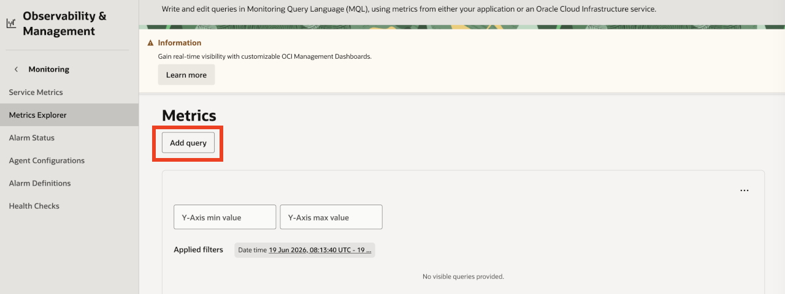
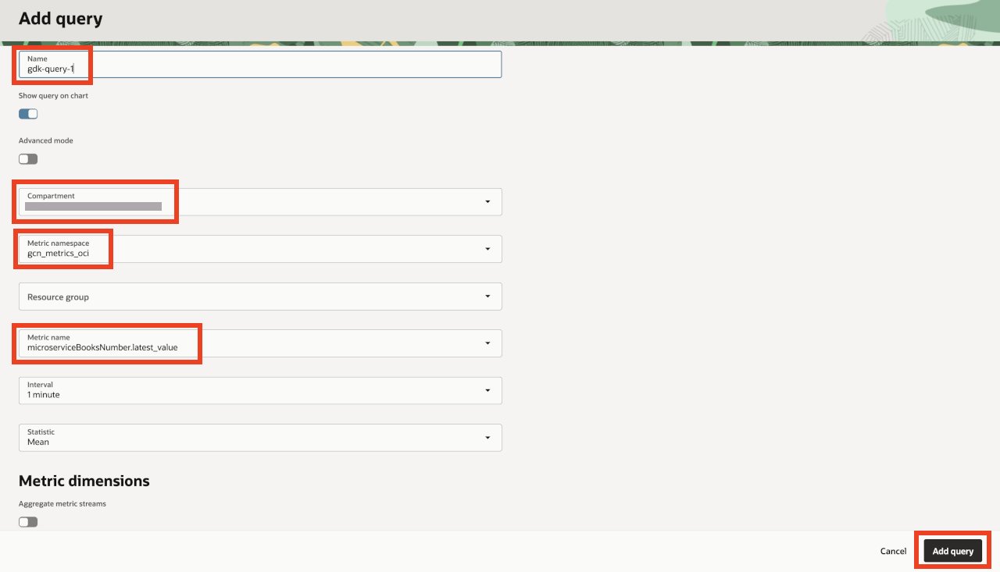
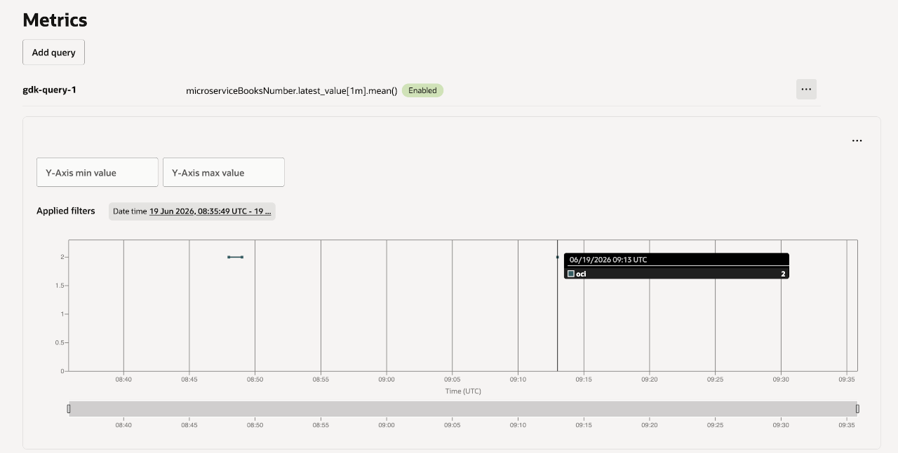

# View the published metrics in OCI Monitoring

## Introduction

This lab shows how to visualize the published metrics in Metrics Explorer from the Oracle Cloud Console.

Estimated Lab Time: 15 minutes

### Objectives

In this lab, you will:

* View the published metrics in OCI Monitoring

## Task 1: View the published metrics in OCI Monitoring

1. From the Oracle Cloud Console, navigate to **OCI Console >> Observability & Management**. Under **Monitoring**, click **Metrics Explorer**.

    

2. From the **Metrics Explorer** landing page, click **Add Query**.

    

3. Enter name as `gdk-query-1`. Select your workshop compartment from the **Compartment** drop down list. Select the **Metric namespace** as `gcn_metrics_oci`. Select the **Metric name** as `microserviceBooksNumber.latest_value`. Leave the other default values unchanged. Click **Add query**.

    

4. Visualize the selected metric.

    

Congratulations! You've successfully completed this lab. You can visualize the metrics published by the sample application in the OCI Metrics Explorer.

You may now **proceed to the next lab**.

## Acknowledgements

* **Author** - 
* **Contributors** - 
* **Last Updated By/Date** - 
