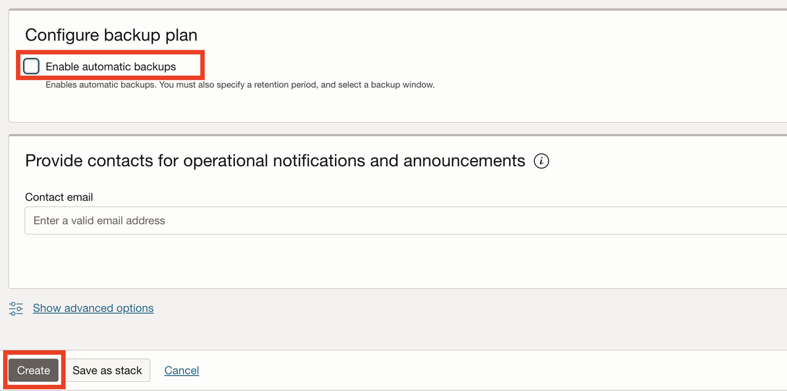

# Provision an OCI MySQL HeatWave Database

## Introduction

This lab describes the steps to create a new OCI MySQL HeatWave Database instance.

Estimated Lab Time: 10 minutes

### Objectives

In this lab, you will:

* Create MySQL HeatWave Database instance

## Task 1: Create MySQL HeatWave Database instance

1. From the Oracle Cloud Console, open the navigation menu, click **Databases**. Under **HeatWave MySQL**, click **DB Systems**

   

2. Select your workshop compartment from the **Compartment** drop down list on the left

   

3. Click **Create DB System**.

    

4. You will see the **Create DB System** screen. Select **Development or testing**.

    

5. Under the **Create administrator credentials** section, enter the username as "mysqladmin" and a password of your choice.

    

6. Ensure **Standalone** is selected.

    

7. Select from the dropdown list *llw-net-* for **VCN** and *LLW Public Subnet(Regional)* for **Subnet**.

    

8. Under the **Configure hardware** section, deselect **Enable HeatWave cluster**. Leave the other default values unchanged.

    

9. Under the **Configure backup plan** section, deselect **Enable automatic backups**. Click **Create**.

    

    It takes about 10 minutes to provision an OCI MySQL DB System instance. Meanwhile, proceed to the next step.

Congratulations! In this lab, you created a new OCI MySQL HeatWave Database instance in your workshop compartment.

You may now **proceed to the next lab**.

## Acknowledgements

* **Author** - 
* **Contributors** - 
* **Last Updated By/Date** - 
