# Set up compute instance

## Introduction
This lab will show you how to set up a Resource Manager stack that will generate the Oracle Cloud objects needed to run your workshop.

Estimated Time: 15 minutes

Watch the video below for a walk-through of this Environment Setup lab.
[Lab walk-through](youtube:anPEOZYBdyA)

### About Terraform and Oracle Cloud Resource Manager

For more information about Terraform and Resource Manager, please see the appendix below.

### Objectives

- Create Compute + Networking Resource Manager Stack
- Connect to compute instance

### Prerequisites

This lab assumes you have:

- An Oracle Cloud account
- You have completed the *Lab: Prepare Setup*

## Task 1: Create Stack:  Compute + Networking

1. Identify the ORM stack zip file downloaded in *Lab: Prepare Setup*

2. Log in to Oracle Cloud

3. Open up the hamburger menu in the top left corner.  Click **Developer Services**, and choose **Resource Manager > Stacks**. Choose the compartment in which you would like to install the stack. Click **Create Stack**.

  

  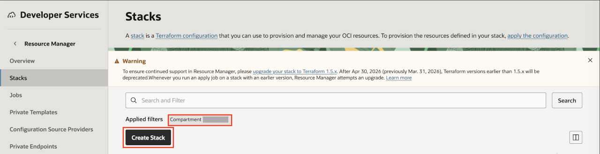

4. Select **My Configuration**, choose the **.Zip file** button, click the **Browse** link, and select the zip file that you downloaded or drag-n-drop for the file explorer.

  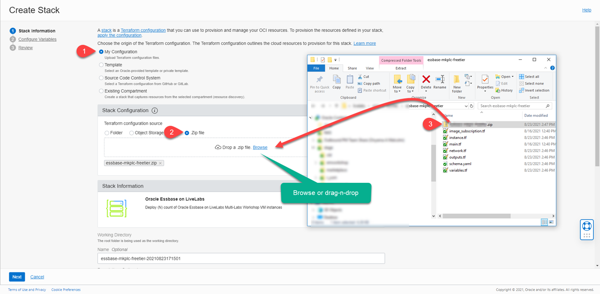

5. Click **Next**.

6. Enter or select the following:

    - **Instance Count:** Accept the default, **1**
    - **Select Availability Domain:** Select an availability domain from the dropdown list.
    - **Need Remote Access via SSH?:** Keep the default as unchecked. You don't need SSH for this workshop.

  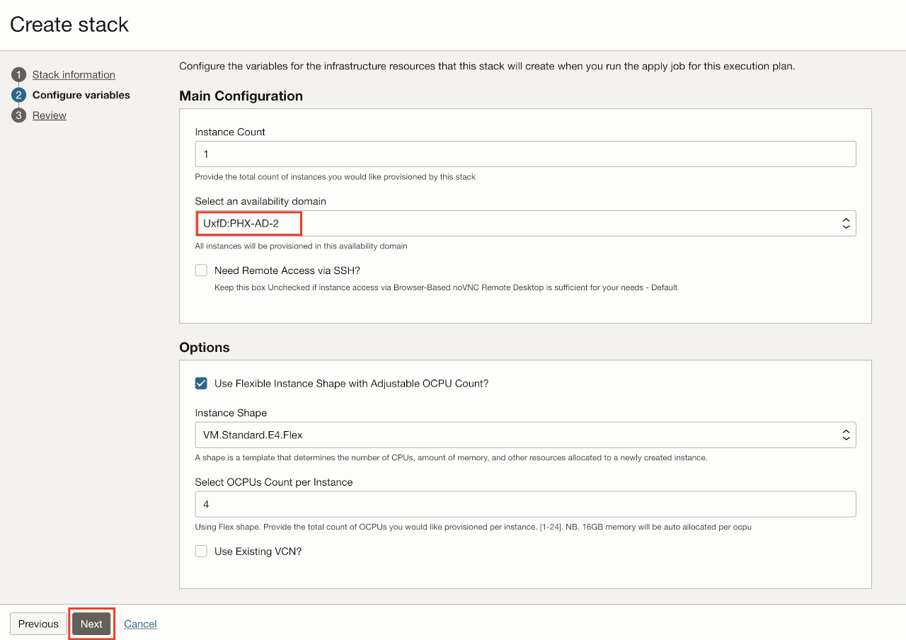

    - **Use Flexible Instance Shape with Adjustable OCPU Count?:** Keep the default as checked.
    - **Instance Shape:** Keep the default, **VM.Standard.E4.Flex**, or select from the list of Flex shapes in the dropdown menu.
    - **Instance OCPUS:** Accept the default, **4**. It will provision 4 OCPUs and 64GB of memory. Please ensure you have the capacity available.
    - **Use Existing VCN?:** Accept the default by leaving this unchecked. This will create a **new VCN**.

7. Click **Next**.

8. Select **Run Apply** and click **Create**.

  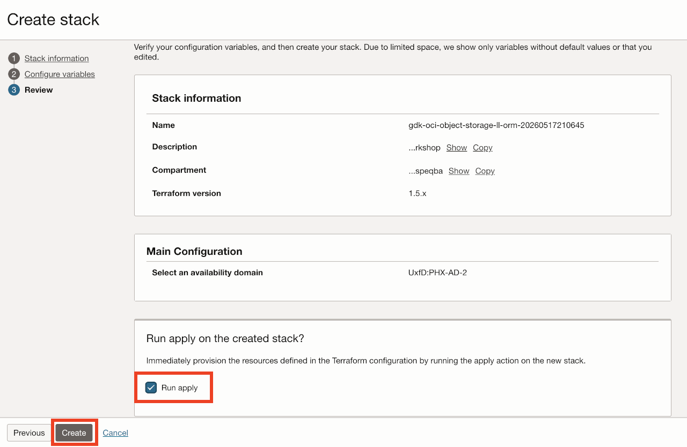

9. Your stack is now created and the *Apply* action triggered is running to deploy your environment!

  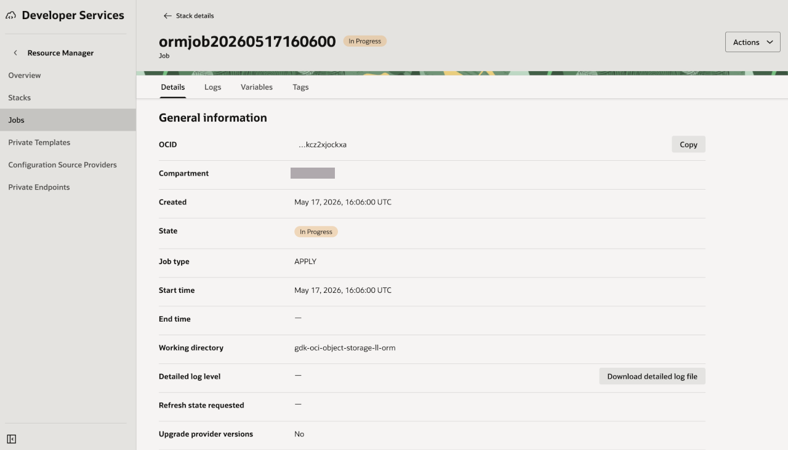

## Task 2: Terraform Apply

In the prior steps, we elected to trigger the *terraform apply action* on stack creation.

1. Review the job output.

  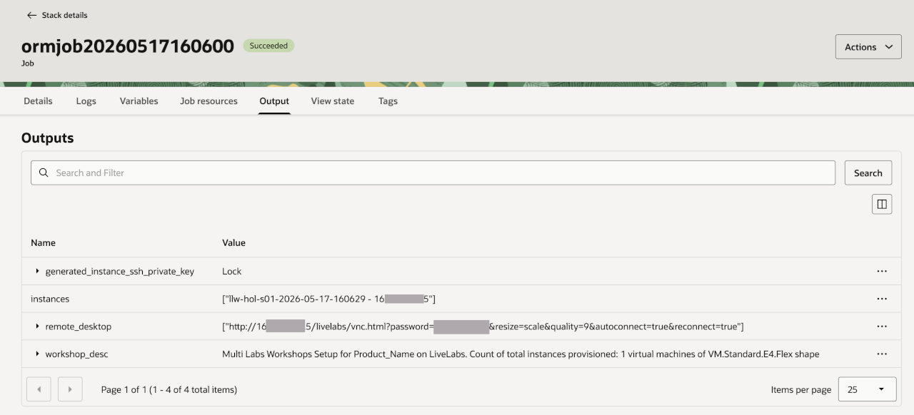

2. Congratulations, your environment has been created!

3. Your instance name, IP address, and remote desktop URL are displayed.

## Task 3: Access the Graphical Remote Desktop

For ease of execution of this workshop, your VM instance has been pre-configured with a remote graphical desktop accessible using any modern browser on your laptop or workstation. Proceed as detailed below to log in.

1. Go to **Stack Details**, **Application Information** tab, and click on the remote desktop URL

  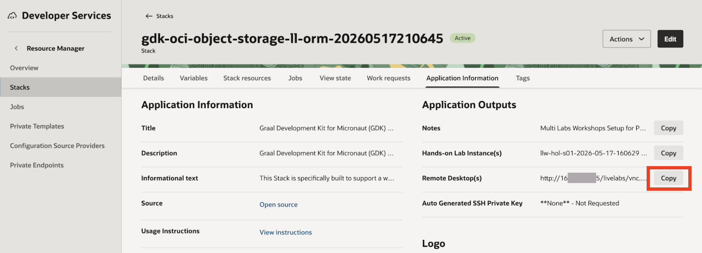

2. Paste the URL in a new browser tab.

  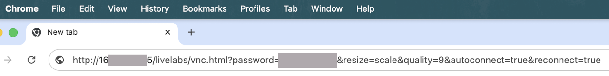

3. This should open the remote desktop in the browser. Close the  *Can't update Chrome* popup. From the **noVNC Settings** > **Scaling Mode** and select **Remote Resizing**.

  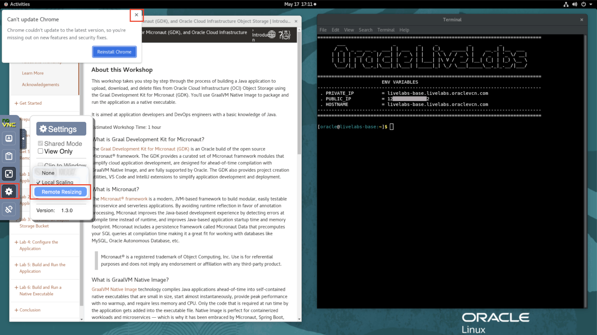

    >**Note:** While rare, you may see an error on the browser - “*Deceptive Site Ahead*” or similar depending on your browser type as shown below.

    Public IP addresses used for LiveLabs provisioning come from a pool of reusable addresses and this error is because the address was previously used by a compute instance long terminated, but that wasn't properly secured, got bridged, and was flagged. You can safely ignore and proceed by clicking on *Details*, and finally, on *Visit this unsafe site*.

  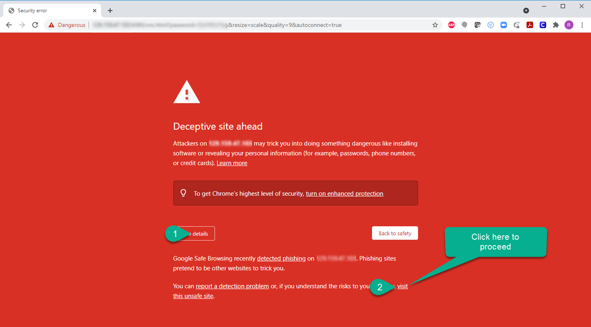

You may now **proceed to the next lab**.

## Appendix 1:  Terraform and Resource Manager

Terraform is a tool for building, changing, and versioning infrastructure safely and efficiently. Configuration files describe to Terraform the components needed to run a single application or your entire datacenter. In this lab, a configuration file has been created for you to build a network and compute components. The compute component you will build creates an image out of Oracle's Cloud Marketplace. This image is running Oracle Linux 7.

Resource Manager is an Oracle Cloud Infrastructure service that allows you to automate the process of provisioning your Oracle Cloud Infrastructure resources. Using Terraform, Resource Manager helps you install, configure, and manage resources through the "infrastructure-as-code" model. To learn more about OCI Resource Manager, watch the video below.

[Oracle Cloud Infrastructure Resource Manager](youtube:udJdVCz5HYs)

## Appendix 2: Troubleshooting Tips

If you encountered any issues during the lab, follow the steps below to resolve them.  If you are unable to resolve them, please skip to the **Need Help** lab on the left menu to submit your issue to our support email.

- Limits Exceeded
- Flex Shape Not Found
- Instance shape selection grayed out

### **Issue #1:** Limits Exceeded

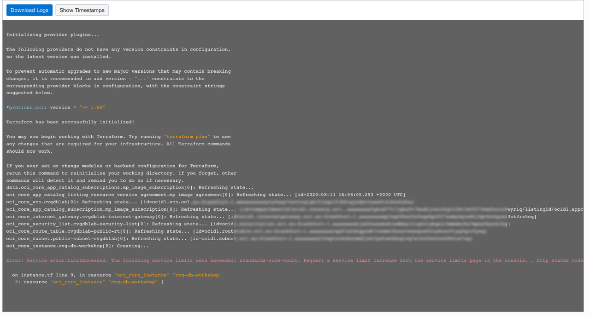

#### Issue #1 Description

When creating a stack, your ability to create an instance is based on the capacity you have available for your tenancy.

*Please ensure that you have available cloud credits. Go to **Governance** -> **Limits, Quotas and Usage,** select **compute**, and ensure that you have **more than** the micro tier available.  If you have only 2 micro computes, this workshop will NOT run.*

#### Fix for Issue #1

If you have other compute instances you are not using, you can go to those instances and delete them. If you are using them, follow the instructions to check your available usage and adjust your variables.

1. Click the Hamburger menu, go to **Governance** -> **Limits, Quotas and Usage**
2. Select **Compute**
3. These labs use the following compute types.  Check your limit, your usage, and the amount you have available in each availability domain (click **Scope** to change Availability Domain)
4. Look for *Cores for Standard.E2 based VM and BM instances*, *Cores for Standard.xx.Flex based VM and BM instances*, and *Cores for Optimized3 based VM and BM instances*
5. Click the Hamburger menu -> **Resource Manager** -> **Stacks**
6. Click the stack you created previously
7. Click **Edit Stack** -> **Configure Variables**.
8. Scroll down to **Options**
9. Change the **shape** based on the availability you have in your system
10. Click **Next**
11. Click **Save Changes**
12. Click **Terraform Actions** -> **Apply**

### **Issue #2:** Flex Shape Not Found

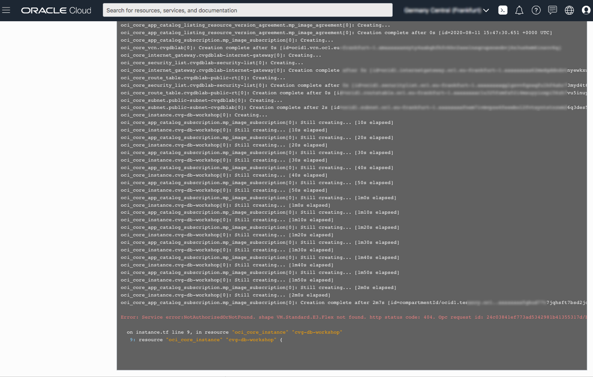

#### Issue #2 Description

When creating a stack, your ability to create an instance is based on the capacity you have available for your tenancy.

#### Fix for Issue #2

If you have other compute instances you are not using, you can go to those instances and delete them.  If you are using them, follow the instructions to check your available usage and adjust your variables.

1. Click the Hamburger menu, go to **Governance** -> **Limits, Quotas and Usage**
2. Select **Compute**
3. These labs use the following compute types.  Check your limit, your usage, and the amount you have available in each availability domain (click **Scope** to change Availability Domain)
4. Look for *Cores for Standard.E2 based VM and BM instances*, *Cores for Standard.xx.Flex based VM and BM instances*, and *Cores for Optimized3 based VM and BM instances*
5. Click the hamburger menu -> **Resource Manager** -> **Stacks**
6. Click the stack you created previously
7. Click **Edit Stack** -> **Configure Variables**.
8. Scroll down to Options
9. Change the **shape** based on the availability you have in your system
10. Click **Next**
11. Click **Save Changes**
12. Click **Terraform Actions** -> **Apply**

### **Issue #3:** Instance Shape LOV Selection Grayed Out

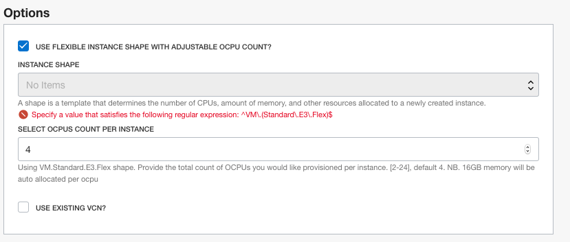

#### Issue #3 Description

When creating a stack, select the option *"Use Flexible Instance Shape with Adjustable OCPU Count"*, but the *"Instance Shape"* LOV selection is grayed out, and the following error message is displayed:***"Specify a value that satisfies the following regular expression: ^VM\.(Standard\.E3\.Flex)$"***

This issue is an indication that your tenant is not currently configured to use flexible shapes (e3flex)

#### Fix for Issue #3

Modify your stack to use fixed shapes instead.

1. Uncheck the option *"Use Flexible Instance Shape with Adjustable OCPU Count"* to use a fixed shape instead

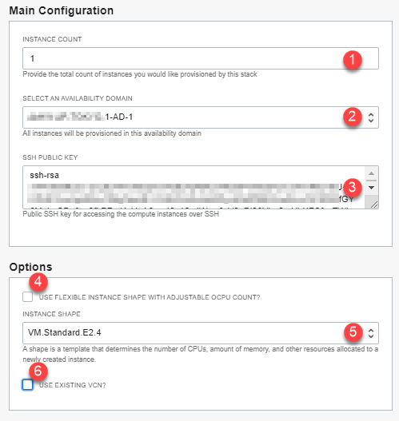

You may now **proceed to the next lab**.

## Acknowledgements
* **Author** - Rene Fontcha, LiveLabs Platform Lead, NA Technology
* **Contributors** - Arabella Yao, Product Manager, Database Product Management
* **Last Updated By/Date** - Sachin Pikle, May 2026