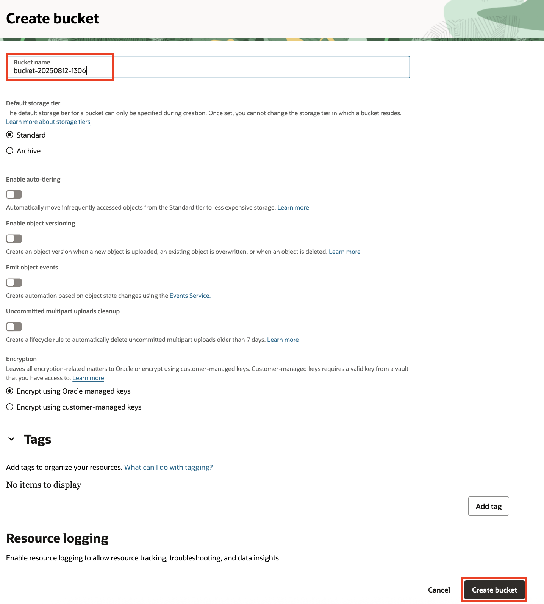

# Provision an OCI Object Storage Bucket

## Introduction

This lab describes the steps to create a new OCI Object Storage Bucket.

Estimated Lab Time: 10 minutes

### Objectives

In this lab, you will:

* Create an Object Storage bucket
* View the bucket details

## Task 1: Create an Object Storage Bucket

1. From the Oracle Cloud Console, open the navigation menu, click **Storage**. Under **Object Storage & Archive Storage**, click **Buckets**.

   

2. Select your workshop compartment from the **Compartment** drop down list. <if type="desktop">To find the compartment name, return to the **Login Details** screen, then copy the value of the **Compartment Name**, paste it in the **Compartment** drop down list in the Oracle Cloud Console and select the filtered compartment.

   
</if>

   

3. Click **Create Bucket**.

4. On the **Create Bucket** screen, leave the default values unchanged and click **Create**.

   **Note:** OCI Object Storage bucket names are case-sensitive and must be unique in the tenancy.

   

   The bucket gets created in a few seconds. The next task describes how to view the bucket details.

## Task 2: View the Bucket Details

1. You will see your bucket in the **Buckets** list. Click the bucket name hyperlink to go to the bucket details screen.

   

2. On the bucket details screen, navigate to the **Objects** list. There are no objects listed because the bucket is empty.

   

3. Note down the bucket name. You will need it in the next lab.

Congratulations! In this lab, you created a new OCI Object Storage bucket in your workshop compartment.

You may now **proceed to the next lab**.

## Acknowledgements

* **Author** - 
* **Contributors** - 
* **Last Updated By/Date** - 
