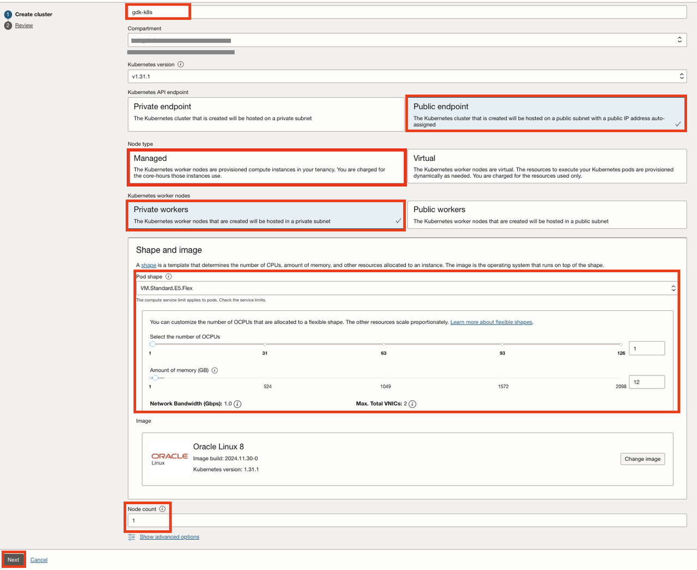
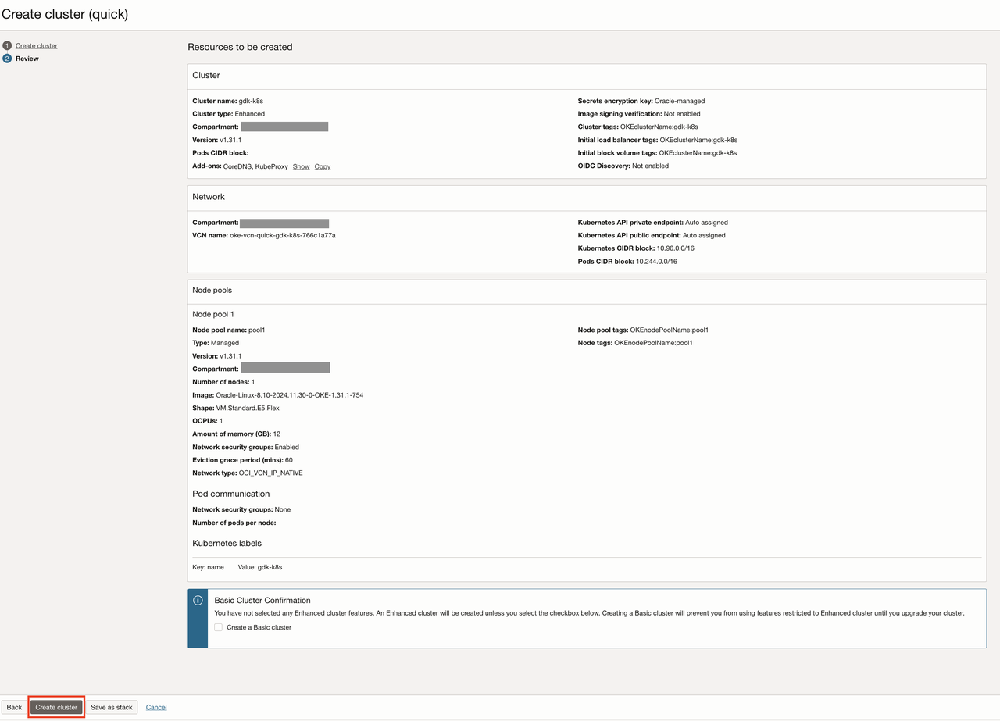
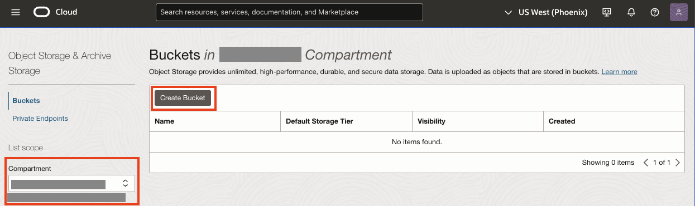
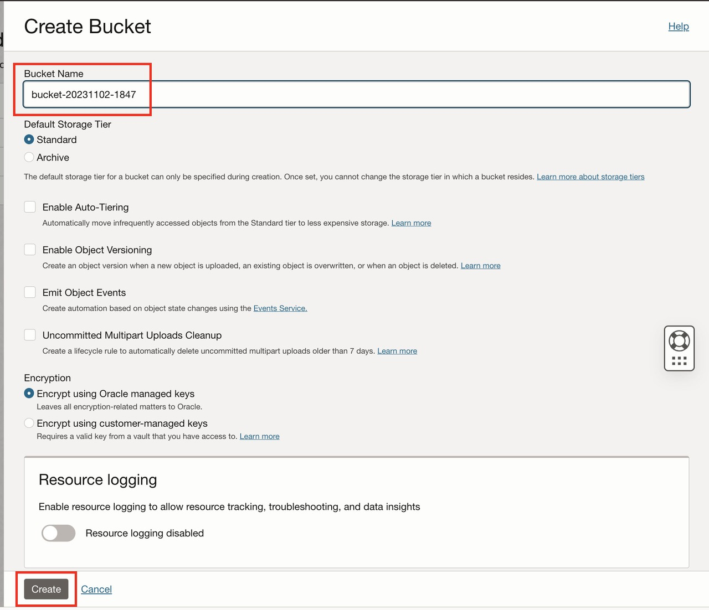
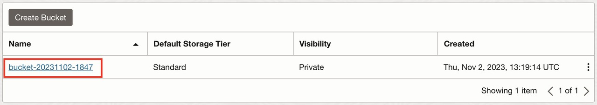
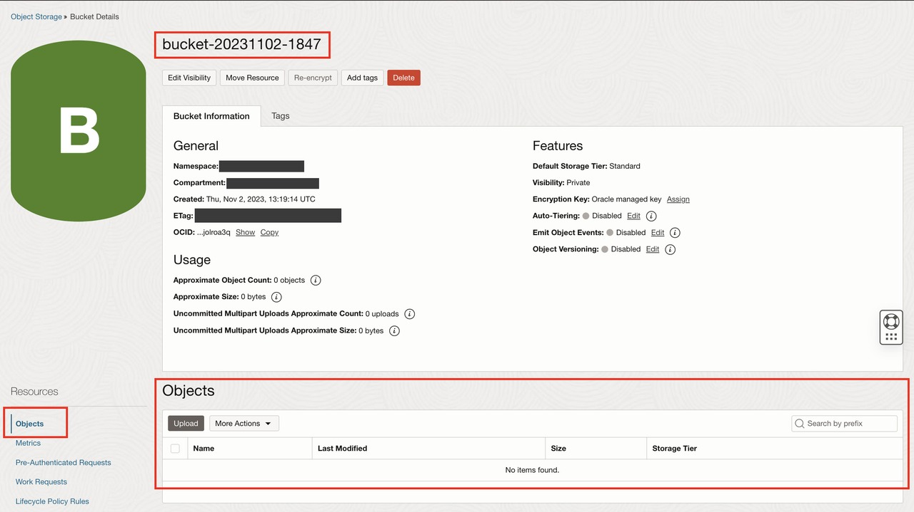

# Provision an OKE Cluster, an OCIR Repository, and an Object Storage bucket

## Introduction

The GDK microservice application exposes REST APIs to upload, download, and delete files from an OCI Object Storage bucket. The  application is packaged as a native executable inside a container image. The container image is pushed to an OCI Container Registry (OCIR) repository and is deployed to an OKE cluster. 

This lab describes the steps to create an OKE Cluster, an OCIR Repository, and an Object Storage bucket.

Estimated Lab Time: 10 minutes

### Objectives

In this lab, you will:

* Provision an OKE Cluster
* Provision an OCIR Repository
* Provision an Object Storage bucket

## Task 1: Provision an OKE Cluster

1. From the Oracle Cloud Console, open the navigation menu, click **Developer Services**. Under **Containers & Artifacts**, click **Kubernetes Clusters (OKE)**.

   

2. Select your workshop compartment from the **Compartment** drop down list on the left. 

    

3. Click **Create cluster**.

    

4. You will see the **Create cluster** screen with default values, select **Quick Create**, click **Submit**

    

5. We will use an `Enhanced` cluster type as we are using OCI Workload Identity authentication in this workshop. A single-node cluster is sufficient for this workshop. Enter the name for your cluster, for example, `gdk-k8s`. Select `Public Endpoint` for the Kubernetes API endpoint; `Managed` for Node type, `Private workers` for Kubernetes worker nodes, `VM.Standard.E5.Flex` for the Pod shape, and `1` for Node count. Click **Next**.

    

6. Review the resources to be created. Click **Create cluster**.

    

    It may take a few minutes to accept the request. When complete, click **Close**.

    The system will need several minutes to provision the underlying resources. Meanwhile, we can proceed ahead with the rest of the workshop.

## Task 2: Provision an OCIR Repository

1. From the Oracle Cloud Console, open the navigation menu, click **Developer Services**. Under **Containers & Artifacts**, click **Container Registry**.

   

2. Select your workshop compartment from the **Compartment** drop down list on the left.

    

3. Click **Create repository**.

    

4. You will see the **Create repository** screen with default values. Check the **Compartment Name**, select "Private" in  the **Access**, paste "gdk-oke/os-oke" to the **Repository Name** field, click **Create**.

    

## Task 3: Provision an Object Storage Bucket

1. From the Oracle Cloud Console, open the navigation menu, click **Storage**. Under **Object Storage & Archive Storage**, click **Buckets**.

   

2. Select your workshop compartment from the **Compartment** drop down list on the left.

   

3. Click **Create Bucket**.

4. On the **Create Bucket** screen, leave the default values unchanged and click **Create**.

   **Note:** OCI Object Storage bucket names are case-sensitive and must be unique in the tenancy.

   

   The bucket gets created in a few seconds.

5. You will see your bucket in the **Buckets** list. Click the bucket name hyperlink to go to the bucket details screen.

   

6. On the bucket details screen, scroll down to the **Objects** list. There are no objects listed because the bucket is empty.

   

7. Note down the bucket name. You will need it in the next lab.

Congratulations! In this lab, you created an OKE Cluster, an OCIR Repository, and an Object Storage bucket in your workshop compartment.

You may now **proceed to the next lab**.

## Acknowledgements

* **Author** - 
* **Contributors** - 
* **Last Updated By/Date** - 
