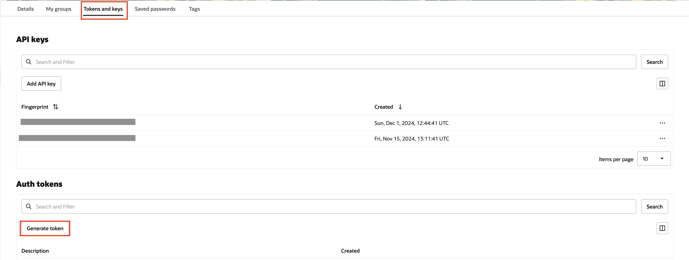
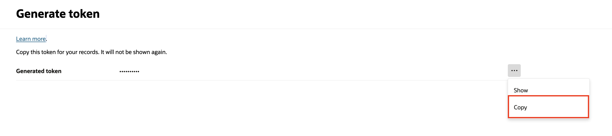

# Configure the Application

## Introduction

This lab provides instructions to configure the application to use OKE, OCIR and Object Storage.

The [Micronaut Oracle Cloud](https://micronaut-projects.github.io/micronaut-oracle-cloud/latest/guide/index.html) project provides integration between Micronaut applications and Oracle Cloud, including using Vault as a distributed configuration source.

Estimated Lab Time: 05 minutes

### Objectives

In this lab, you will:

* Check the application properties
* Configure environment variables
* Configure authentication token for OCIR login
* Configure OKE Workload Identity authentication

## Task 1: Check the application properties

1. In VS Code, open `application-oraclecloud.properties`. The application configuration uses two environment variables `OCI_OS_BUCKET_NAME` and `OCI_OS_NS` to connect to the Object Storage bucket.

	_oci/src/main/resources/application-oraclecloud.properties_

	``` properties
	micronaut.object-storage.oracle-cloud.default.bucket=${OCI_OS_BUCKET_NAME}
	micronaut.object-storage.oracle-cloud.default.enabled=true
	micronaut.object-storage.oracle-cloud.default.namespace=${OCI_OS_NS}
	```

## Task 2: Configure environment variables

1. Open a new terminal in VS Code using the **Terminal > New Terminal** menu.

2. Set the environment variable `OCI_OS_NS` to store your tenancy namespace. 

	```bash
	<copy>
	export OCI_OS_NS=$(oci os ns get --auth instance_principal --query "data" --raw-output)
	</copy>
	```	

	Alternatively, run the following command to set the value manually. Replace the placeholder `<your-tenancy-namespace>` with your value. To get the value, go to Oracle Cloud Console >> **Profile** icon on the top right >> Tenancy details >> Object Storage namespace.

	```bash
	<copy>
	export OCI_OS_NS='<your-tenancy-namespace>'
	</copy>
	```


3. Confirm the value set by running the following command:

	```bash
	<copy>
	echo $OCI_OS_NS
	</copy>
	```

4. Set the environment variable `OCIR_USERNAME` to store your OCIR username in the format "tenancy_namespace/username". Replace the placeholder `<username>` with your value.

	```bash
	<copy>
	export OCIR_USERNAME="$OCI_OS_NS/<username>"
	</copy>
	```

5. Confirm the value set by running the following command:

	```bash
	<copy>
	echo $OCIR_USERNAME
	</copy>
	```

6. Set the environment variable `OCI_REGION` to store your cloud region identifier, for example, “us-phoenix-1”. Replace the placeholder `<region>` with your value.

	```bash
	<copy>
	export OCI_REGION="<region>"
	</copy>
	```

7. Confirm the value set by running the following command:

	```bash
	<copy>
	echo $OCI_REGION
	</copy>
	```

8. Set the environment variable `OCI_CLUSTER_ID` to store the OCID of your OKE cluster. Replace the placeholder `<your-cluster-OCID>` with your value.

	```bash
	<copy>
	export OCI_CLUSTER_ID="<your-cluster-OCID>"
	</copy>
	```

9. Confirm the value set by running the following command:

	```bash
	<copy>
	echo $OCI_CLUSTER_ID
	</copy>
	```

10. Set the environment variable `OCI_OS_OKE_IMAGE` used in the _oci/pom.xml_, in the docker push command, and to substitute the placeholder used in the _k8s.yml_ file.

	```bash
	<copy>
	export OCI_OS_OKE_IMAGE=$OCI_REGION.ocir.io/$OCI_OS_NS/gdk-oke/os-oke:latest
	</copy>
	```

11. Confirm the value set by running the following command:

	```bash
	<copy>
	echo $OCI_OS_OKE_IMAGE
	</copy>
	```

12. Set the environment variable `K8S_NAMESPACE` to store your Kubernetes namespace. This value is used in the Kubernetes yml files used to deploy your application to OKE.

	```bash
	<copy>
	export K8S_NAMESPACE=gdk-k8s
	</copy>
	```

13. Confirm the value set by running the following command:

	```bash
	<copy>
	echo $K8S_NAMESPACE
	</copy>
	```

14. Set the environment variable `OCI_OS_BUCKET_NAME` to store the bucket name you created. Replace the placeholder `<your-bucket-name>` with your value.

	```bash
	<copy>
	export OCI_OS_BUCKET_NAME=<your-bucket-name>
	</copy>
	```

15. Confirm the value set by running the following command:

	```bash
	<copy>
	echo $OCI_OS_BUCKET_NAME
	</copy>
	```

16. Set the environment variable `OCI_CLI_AUTH` to use Instance Principals to run kubectl commands from the OCI instance running the LiveLabs noVNC Remote Desktop.

	```bash
	<copy>
	export OCI_CLI_AUTH=instance_principal
	</copy>
	```

17. Confirm the value set by running the following command:

	```bash
	<copy>
	echo $OCI_CLI_AUTH
	</copy>
	```

## Task 3: Configure authentication token for OCIR login

1. From the Oracle Cloud Console, click the **Profile** icon on the top right. Then click on your username (account email address).

	

2. From the **Profile details** screen, click **Auth tokens** under **Resources**. Click **Generate token**.

	

3.  Enter a description.

4. Copy the generated token value.

	

5. In the same terminal in VS Code, set the environment variable `AUTH_TOKEN` used to authenticate to OCIR.

	Oracle Cloud Infrastructure restricts you to two authentication tokens at the same time. If you already have two tokens, use an existing one or delete one that you are not using.

	```bash
	<copy>
	export AUTH_TOKEN='copied value'
	</copy>
	```

6. Confirm the value set by running the following command:

	```bash
	<copy>
	echo $AUTH_TOKEN
	</copy>
	```

## Task 4: Configure OKE Workload Identity authentication

1. In VS Code, open `bootstrap-oraclecloud.properties`. The application is configured to use `OKE Workload Identity` authentication when it is running in an OKE cluster.

	_oci/src/main/resources/bootstrap-oraclecloud.properties_

	```properties
	oci.config.oke-workload-identity.enabled=true
	```

2. The following steps show you how to set up an `OKE Workload Identity` policy to allow the application running in OKE to manage (upload, list, download, and delete) objects in the OCI Object Storage bucket.

3. From the Oracle Cloud Console navigation menu, go to **Identity & Security >> Identity >> Policies**.

	

4. Go to your workshop compartment.

5. Click  **Create Policy**.

6. Enter a name and description.

7. Select your workshop compartment.

8. In the **Policy Builder** section, click **Show manual editor**.

9. Enter the following policy statement in the text area. Replace the placeholders `WORKSHOP_COMPARTMENT_NAME` with your workshop compartment name, `K8S_NAMESPACE` with the Kubernetes namespace value set above, and `CLUSTER_ID` with the OCID of your OKE cluster.

	```text
	<copy>
	Allow any-user to manage objects in compartment WORKSHOP_COMPARTMENT_NAME where all {request.principal.type='workload', request.principal.namespace ='K8S_NAMESPACE', request.principal.service_account = 'gdk-service-acct', request.principal.cluster_id ='CLUSTER_ID'}
	</copy>
	```

	To learn more about OKE workloads access to OCI Resources, see [Granting Workloads Access to OCI Resources](https://docs.oracle.com/en-us/iaas/Content/ContEng/Tasks/contenggrantingworkloadaccesstoresources.htm).

10. Add a second policy statement to set up Instance Principal using a Dynamic Group-less policy to allow the OCI instance running the LiveLabs noVNC Remote Desktop access to the OKE cluster (for kubectl and oci cli). Replace the placeholders `WORKSHOP_COMPARTMENT_NAME` with your workshop compartment name, `WORKSHOP_COMPARTMENT_OCID` with your workshop compartment OCID.
	
	```text
	<copy>
	Allow any-user to manage cluster-family in compartment WORKSHOP_COMPARTMENT_NAME where ALL { request.principal.type='instance', request.principal.compartment.id='WORKSHOP_COMPARTMENT_OCID' }
	</copy>
	```

	To learn more about the supported authentication options, see [Micronaut Oracle Cloud Authentication](https://micronaut-projects.github.io/micronaut-oracle-cloud/snapshot/guide/#authentication).

Congratulations! In this lab, you configured the application to use OKE, OCIR and Object Storage.

You may now **proceed to the next lab**.

## Acknowledgements

* **Author** - [](var:author)
* **Contributors** - [](var:contributors)
* **Last Updated By/Date** - [](var:last_updated)
