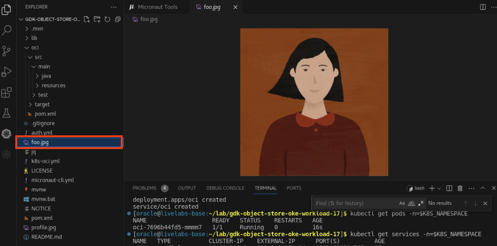

# Test the Application

## Introduction

This lab provides instructions for testing the application with OCI Object Storage.

Estimated Lab Time: 05 minutes

### Objectives

In this lab, you will:

* Get the external IP address of the OCI Load Balancer
* Test the application

## Task 1: Get the external IP address of the OCI Load Balancer

1. In the same terminal in VS Code, run the following command to get the URL of the Kubernetes service (OCI Load Balancer) and set it in an environment variable:

	```bash
	<copy>
	export IP=$(kubectl get svc gdk-os-oke-oci -n=$K8S_NAMESPACE -o json | jq -r .status.loadBalancer.ingress[0].ip)
	</copy>
	```

2. Confirm the value set by running the following command:

	```bash
	<copy>
	echo $IP
	</copy>
	```

## Task 2: Test the application

1. In the same terminal in VS Code, send an HTTP POST request to the `/pictures/foo` endpoint to upload a _profile.jpg_ picture to the bucket:

	```bash
	<copy>
	curl -i -F "fileUpload=@profile.jpg" http://$IP:8080/pictures/foo
	</copy>
	```


2. Check the bucket contents. Go to the **OCI Console** >> **Storage** >> **Object Storage & Archive Storage** >> **Buckets** >> **Bucket Details** screen opened in the browser.

   Refresh the screen and scroll down to the **Objects** list. You should see an object named _foo.jpg_.

   

3. From the same terminal in VS Code, send an HTTP GET request to the `pictures/foo` endpoint to download the picture from the bucket:

	```bash
	<copy>
	curl http://$IP:8080/pictures/foo -O -J
	</copy>
	```

4. You should see the profile picture _foo.jpg_ downloaded in your project's root directory in VS Code. Click the picture to view it.

   

5.  From the same terminal in VS Code, send an HTTP DELETE request to the `/pictures/foo` endpoint to delete the picture from the bucket:

	```bash
	<copy>
	curl -X DELETE http://$IP:8080/pictures/foo
	</copy>
	```

6. Check the bucket contents. Go to the **OCI Console** >> **Storage** >> **Object Storage & Archive Storage** >> **Buckets** >> **Bucket Details** screen opened in the browser.

   Refresh the screen and scroll down to the **Objects** list. The object _foo.jpg_ has been deleted from the bucket.

   

Congratulations! In this section, you successfully tested the application.

You may now **proceed to the next lab**.

## Acknowledgements

* **Author** - [](var:author)
* **Contributors** - [](var:contributors)
* **Last Updated By/Date** - [](var:last_updated)
