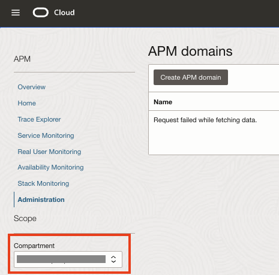

# Create the OCI APM Domain

## Introduction

This lab provides instructions to create a new OCI APM Domain service.

Estimated Lab Time: 05 minutes

### Objectives

In this lab, you will:

* Create the OCI APM Domain

## Task 1: Create a new OCI APM Domain

1. From the Oracle Cloud Console navigation menu, go to **Observability & Management**. Under **Application Performance Monitoring**, click **Administration**.

   

2. Select your workshop compartment from the **Compartment** drop down list on the left.

    

3. Click **Create APM Domain**.

    

5. You will see the **Create APM Domain** screen. Enter the Name as "gdk-apm-domain". Click **Create** to create the APM Domain.

    

   It can take about two minutes to create the domain.

6. From the **APM Domains** list, click **gdk-apm-domain** to go to the **Domain Details** screen.

    

Congratulations! In this lab, you created an APM Domain.

You may now **proceed to the next lab**.

## Acknowledgements

* **Author** - 
* **Contributors** - 
* **Last Updated By/Date** - 
