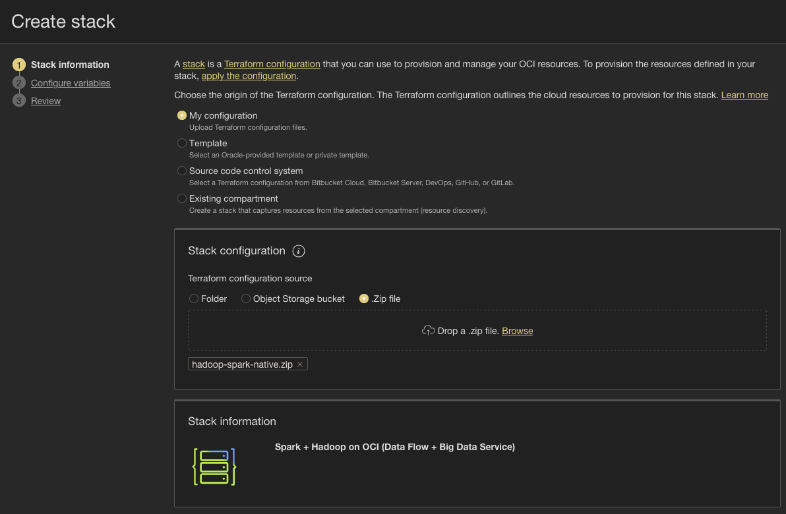

# Deploy the Managed Hadoop & Spark Stack (Native)

## Introduction

In this lab, you will deploy the **Native track** stack with OCI Resource Manager. The stack provisions a managed **OCI Big Data Service** (Hadoop) cluster, **OCI Data Flow** (serverless Spark) applications with an optional warm pool, the **Object Storage** buckets they use, and a private **operator** host behind an **OCI Bastion** that comes pre-loaded with the sample jobs.

Estimated Time: 40 minutes (most of it is Big Data Service provisioning)

### Objectives

In this lab, you will:

- Obtain the Terraform stack and create it in OCI Resource Manager
- Configure the deployment through the Resource Manager form
- Run **Plan** and **Apply** to provision the platform
- Review the stack outputs you'll use to connect and run jobs

### Prerequisites

This lab assumes you have:

- Completed the Prerequisites lab (SSH key, public IP, IAM permissions)
- Your SSH **public** key and your workstation's public IP (`x.x.x.x/32`) ready

## Task 1: Get the Terraform Stack

The stack ships as a release asset on the [automation-hub releases page](https://github.com/dranicu/oci-automation-hub/releases). The release archive bundles both tracks (`native/` and `opensource/`), and Resource Manager creates a stack from a `.zip` that has the Terraform files **at its root**, so you unpack the release and re-zip just the `native` folder.

1. Download the release archive, then zip the `native` folder so its Terraform is at the zip root:

    ```bash
    <copy>
    cd ~
    curl -L -o hadoop-spark-oci-sample.zip https://github.com/dranicu/oci-automation-hub/releases/download/hadoop-spark-oci-sample/hadoop-spark-oci-sample.zip
    unzip -q hadoop-spark-oci-sample.zip
    cd hadoop-spark-oci-sample/native
    zip -r ~/hadoop-spark-native.zip . -x '.terraform/*' '*.tfstate*' '.git/*'
    echo "Stack zip created at: ~/hadoop-spark-native.zip"
    </copy>
    ```

   You now have `~/hadoop-spark-native.zip` ready to upload.

## Task 2: Create the Stack in Resource Manager

1. In the OCI Console, open the navigation menu and go to **Developer Services** → **Resource Manager** → **Stacks**.

2. Choose the compartment where you want to deploy, then click **Create stack**.

3. Under **Origin of the Terraform configuration**, select **My configuration**, then **.Zip file**, and upload `~/hadoop-spark-native.zip`.

    

4. Give the stack a **Name** (e.g. `hadoop-spark-native`) and confirm the compartment, then click **Next**.

## Task 3: Configure the Deployment

Resource Manager renders a form from the stack's `schema.yaml`. Fill in the values for a standard, operator-driven deployment.

1. **Placement**
    - **Region**: your region
    - **Compartment**: your target compartment
    - **Resource name prefix**: e.g. `bigdata` (lower-case letters, digits, hyphens)

2. **Big Data Service (Hadoop)** — leave **Deploy Big Data Service (Hadoop)** checked:
    - **Cluster version**: `ODH2_0`
    - **Cluster profile**: `HADOOP_EXTENDED`
    - **High availability**: off (turn on for the secure/HA use case)
    - **Secure cluster (Kerberos + Ranger)**: off (turn on for the secure/HA use case)
    - **Cluster admin password**: a strong password (min 8 chars — used for Ambari)
    - **SSH public key**: paste the contents of `~/.ssh/id_rsa.pub`
    - Accept the default node sizes, or reduce worker OCPUs/memory to save cost. Worker count minimum is 3.

3. **Data Flow (Spark)** — leave **Deploy Data Flow (Spark) applications** checked. Keep the logs / warehouse / scripts buckets enabled (defaults). To try the low-latency use case, also enable **Create a Data Flow warm pool** and set min/max executors (e.g. 1 / 4).

4. **IAM / Policies** — leave **Create tenancy-level IAM policies** checked (requires IAM admin rights; untick only if an administrator pre-created the dynamic group and policy).

5. **Operator VM + Bastion** — this is how you'll run the jobs, so enable it:
    - **Deploy operator VM behind OCI Bastion**: **on**
    - **Create an OCI Bastion**: on
    - **Bastion client allow-list (/32 only)**: your public IP as `x.x.x.x/32` (from the Prerequisites lab)


6. Click **Next**, review the summary, leave **Run apply** unchecked for now, and click **Create**.

## Task 4: Run Plan and Apply

1. On the stack detail page, click **Plan** and wait for the job to finish with **Succeeded**. Review the resources Terraform will create.

2. Click **Apply**, confirm, and monitor the job.
    - The apply provisions networking, Object Storage, IAM, Data Flow, the operator, the Bastion, and the Big Data Service cluster.
    - **Big Data Service provisioning takes roughly 30 minutes** — the apply is not done until it reaches **Succeeded**.


## Task 5: Review the Outputs

1. On the stack page, open the **Application information** tab (or the job's **Outputs**). Note these values — you'll use them in the next lab:

    | Output | What it's for |
    |--------|---------------|
    | `operator_bastion_session_hint` | A ready-to-run `oci bastion session create-managed-ssh ...` command |
    | `operator_private_ip` | The operator host's private IP (your SSH target) |
    | `bastion_id` / `bastion_name` | The OCI Bastion you connect through |
    | `bds_cluster_id` | The Big Data Service cluster OCID |
    | `bds_utility_node_ips` | Utility node IPs (Ambari / Hue / Spark History) |
    | `scripts_bucket_uri`, `logs_bucket_name`, `warehouse_bucket_name` | Object Storage buckets the jobs use |


   > The operator boots, installs tooling, writes a `deployment.env` descriptor of what was deployed, and **pulls the use-case scripts from the scripts bucket** using its instance principal. This finishes shortly after the apply — no action needed from you.

You may now **proceed to the next lab** to connect to the operator and run the use cases.

## Troubleshooting

- **Apply fails on IAM**: your user can't create tenancy-level dynamic groups/policies. Untick **Create tenancy-level IAM policies**, have an administrator pre-create them, and re-apply.
- **Bastion allow-list rejected**: the field accepts only single-host `/32` CIDRs. Enter your exact IP (find it with `curl ifconfig.me`), not a range.
- **BDS stuck in CREATING**: this is normal — allow ~30 minutes. The use-case scripts detect a still-provisioning cluster and tell you to wait for `ACTIVE`.

## Learn More

- [OCI Big Data Service — Creating a Cluster](https://docs.oracle.com/en-us/iaas/Content/bigdata/create-cluster.htm)
- [OCI Data Flow — Overview](https://docs.oracle.com/en-us/iaas/data-flow/using/dfs_getting_started.htm)
- [OCI Resource Manager — Creating Stacks](https://docs.oracle.com/en-us/iaas/Content/ResourceManager/Tasks/create-stack.htm)

## Acknowledgements

* **Author** - Dragos Nicu, Cloud Infrastructure Engineer
* **Last Updated By/Date** - Dragos Nicu, July 2026
