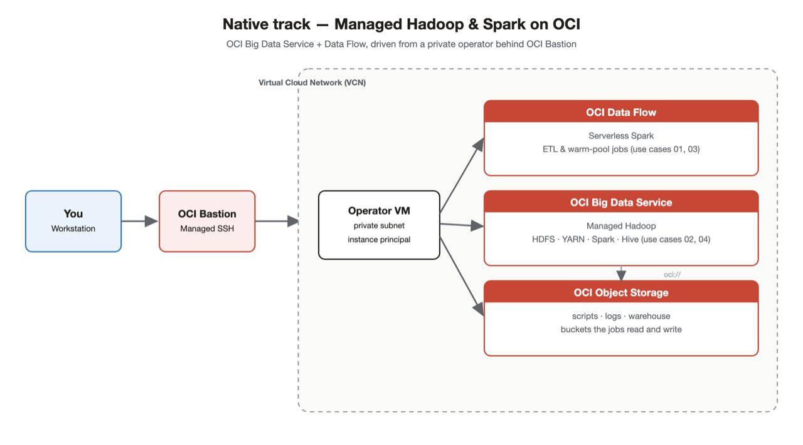
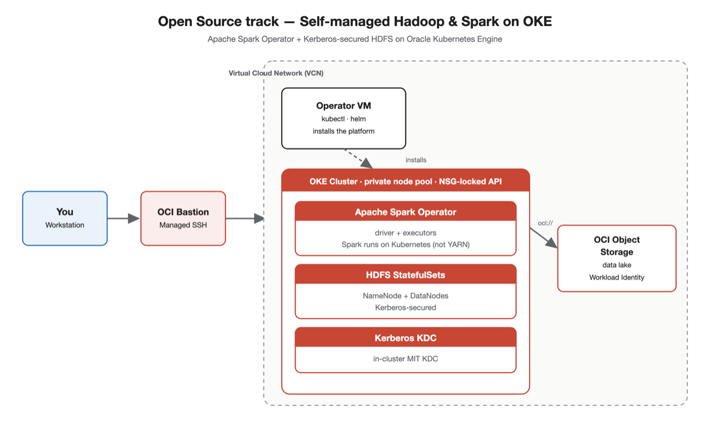

# Introduction

## About this Workshop

In this workshop, you will deploy and run **Apache Hadoop and Apache Spark on Oracle Cloud Infrastructure (OCI)** using ready-made Terraform stacks. Everything is driven from **OCI Resource Manager** (managed Terraform) — you fill in a form, click **Apply**, and the stack provisions the full platform for you. A private **operator** host, reachable only through the **OCI Bastion** service, comes pre-loaded with the sample jobs so you can run real Spark workloads end to end.

The workshop is offered as **two independent tracks**. Pick the one that matches how you want to run big data on OCI:

- **Native track — Managed OCI services.** Deploys **OCI Big Data Service** (a fully managed Hadoop cluster with HDFS, YARN, Spark and Hive) and **OCI Data Flow** (serverless Spark), backed by **Object Storage**. You manage almost nothing — Oracle runs the cluster and the Spark control plane.
- **Open Source track — Self-managed on Kubernetes.** Deploys a security-hardened **Oracle Kubernetes Engine (OKE)** cluster running open-source **Apache Hadoop (HDFS)** and the **Apache Spark Operator**, with an in-cluster **Kerberos KDC** and optional **Object Storage** data lake. You run the open-source software yourself on Kubernetes.

Both tracks share the same Introduction, Prerequisites and Cleanup, and both use the same deploy → connect → run flow, so you can complete one track and then try the other.

Estimated Workshop Time: 90 minutes (per track)

### What is Apache Hadoop?

Apache Hadoop is an open-source framework for distributed storage and processing of large datasets across clusters of commodity hardware. Its core components are:

- **HDFS (Hadoop Distributed File System)**: a fault-tolerant, replicated file system that spreads data across nodes.
- **YARN (Yet Another Resource Negotiator)**: the cluster resource manager and job scheduler.
- **MapReduce**: the original batch processing engine (largely superseded by Spark for new workloads).

### What is Apache Spark?

Apache Spark is a fast, general-purpose distributed processing engine for big data. It runs in-memory, exposes APIs in Python (PySpark), Scala, Java and R, and includes libraries for SQL, streaming, machine learning and graph processing. Spark can run on **YARN** (on a Hadoop cluster), on **Kubernetes**, or as a fully **serverless** service (OCI Data Flow).

### The two ways to run Hadoop & Spark on OCI

| | **Native track** | **Open Source track** |
|---|---|---|
| Compute for Spark | OCI Data Flow (serverless) + Big Data Service (YARN) | Spark Operator on OKE (Kubernetes) |
| Hadoop / HDFS | Managed by OCI Big Data Service | Self-managed HDFS StatefulSets on OKE |
| Who operates it | Oracle (managed service) | You (open-source software on Kubernetes) |
| Best when you want | Least operational overhead, fastest time to value | Full control, portability, Kubernetes-native workflows |
| Security model | Kerberos + Apache Ranger (BDS), IAM, Bastion | In-cluster Kerberos, RBAC, NetworkPolicies, Workload Identity |

### Objectives

In this workshop, you will:

- Deploy a complete Hadoop & Spark platform on OCI with a single Resource Manager stack
- Connect to a private operator host through the OCI Bastion service
- Run real Spark jobs end to end (ETL, analytics, and storage round-trips)
- Understand the trade-offs between managed OCI services and self-managed open source
- Clean up all the resources you created

### Prerequisites

This workshop assumes you have:

- An Oracle Cloud Infrastructure (OCI) tenancy
- An OCI user with permissions to create the required resources (detailed in the Prerequisites lab)
- Basic familiarity with the OCI Console
- Basic knowledge of the command line and SSH

### Architecture Overview

Both tracks follow the same access pattern: you deploy a stack, then reach a private **operator** host through the OCI Bastion to run the sample jobs. What the operator drives differs per track.

**Native track — OCI Big Data Service + Data Flow:**

**Open Source track — Hadoop & Spark on OKE:**

## Learn More

- [OCI Big Data Service Documentation](https://docs.oracle.com/en-us/iaas/Content/bigdata/home.htm)
- [OCI Data Flow Documentation](https://docs.oracle.com/en-us/iaas/data-flow/using/home.htm)
- [OCI Container Engine for Kubernetes (OKE)](https://docs.oracle.com/en-us/iaas/Content/ContEng/home.htm)
- [Apache Spark](https://spark.apache.org/) · [Apache Hadoop](https://hadoop.apache.org/)
- [GitHub Repository: hadoop-spark-oci-sample](https://github.com/dranicu/oci-automation-hub/tree/main/hadoop-spark-oci-sample)

## Acknowledgements

* **Author** - Dragos Nicu, Cloud Infrastructure Engineer
* **Last Updated By/Date** - Dragos Nicu, July 2026
