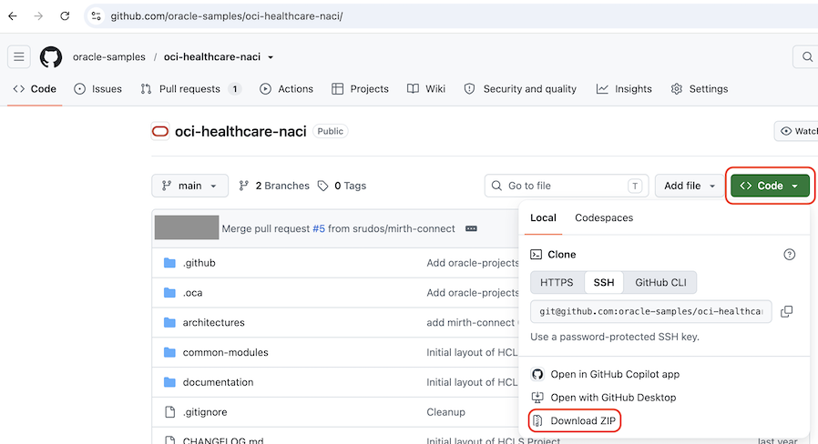

# Obtain Terraform Configuration

## Introduction

This lab describes how to download the Terraform configuration that you will use in the next two labs.

Estimated Lab Time: 5 minutes

### Objectives

In this lab, you will:

* Retrieve the sample Terraform configuration from an Oracle-maintained GitHub repository. 

Perform only one of the two tasks below.

## Task 1: Download the GitHub Repository Using Your Browser

If you don't have Git installed and configured on your computer, you can download the sample Terraform configuration directly from GitHub.

1. Go to the [oci-healthcare-naci](https://github.com/oracle-samples/oci-healthcare-naci/) repository.

2. Click **Code**, and then select **Download ZIP**.
    

3. Your browser downloads a ZIP file named `oci-healthcare-naci-main.zip`.

## Task 2: Clone the repo

If you have Git installed on your computer, you can clone the repository.

1. Clone the repository.

	```bash
	<copy>
	git clone git@github.com:oracle-samples/oci-healthcare-naci.git
	</copy>
	```

You may now **proceed to the next lab**.

## Acknowledgements

* **Author** - [](var:author)
* **Contributors** - [](var:contributors)
* **Last Updated By/Date** - [](var:last_updated)
