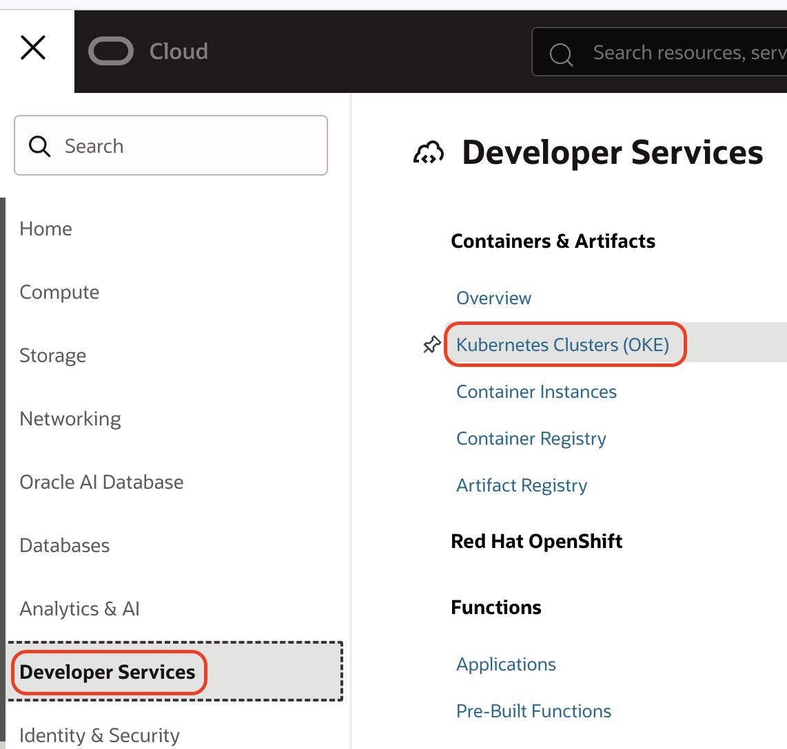
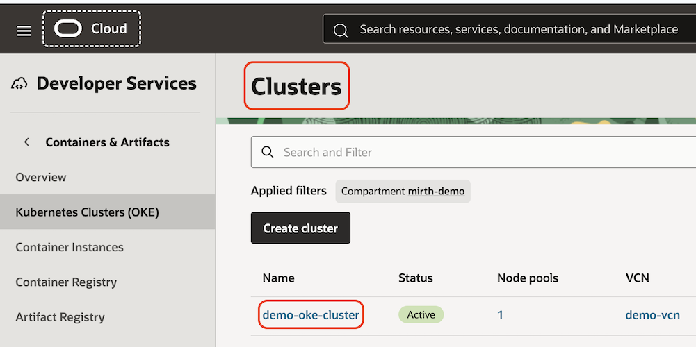
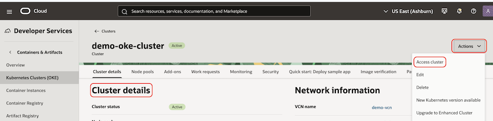
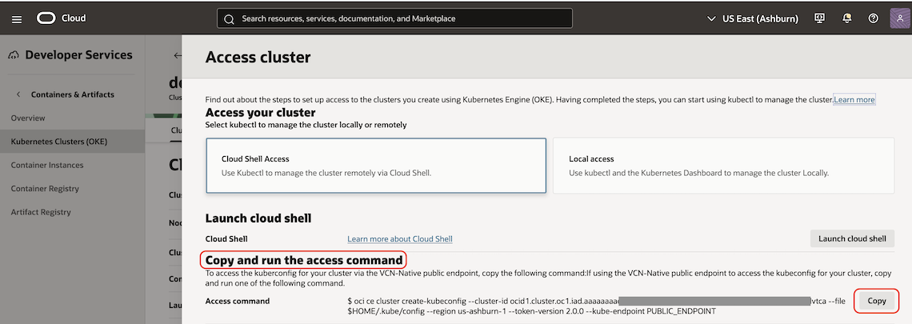

# Provision OCI resources

## Introduction

This lab describes how to provision the minimum OCI resources required to deploy the open-source Mirth Connect integration engine. You will use the sample Terraform configuration that you downloaded or cloned in the previous lab.

Estimated Lab Time: 30 minutes

### Objectives

In this lab, you will:

* Configure Terraform input variables.
* Use Terraform to provision the required OCI resources.
* Configure access to the OKE cluster.
* Verify access to the OKE cluster.

## Task 1: Set Terraform input variable values

1. Go to the directory where you downloaded or cloned the GitHub repository.
2. Unzip if the file was downloaded as a compressed file.
3. Go to the following directory: `oci-healthcare-naci/architectures/mirth-connect-oke-demo/infra`.
4. Open `terraform.tfvars`in a text editor. 
5. Update the Terraform input variables for your environment. Sample values are shown below. Replace placeholder values with values appropriate for your environment.
	```bash
		# =========================
		# Network / Access
		# =========================
		public_allowed_ips = [
		"xx.xx.xx.xx/32",    # Office
		"xx.xx.xx.xx/32"     # Home
		]

		vcn_cidr             = "10.0.0.0/16"
		public_subnet_cidr   = "10.0.1.0/24"
		private_subnet_cidr  = "10.0.2.0/24"

		# =========================
		# OCI Authentication
		# =========================
		tenancy_ocid      = "<oci_tenancy_ocid>"
		user_ocid         = "<oci_user_ocid>"
		fingerprint       = "<api_key_fingerprint>"
		private_key_path  = "<local_path_to_your_api_private_key>"
		region            = "us-ashburn-1"
		compartment_ocid  = "<compartment_ocid>"

		# =========================
		# SSH
		# =========================
		ssh_public_key_path = "<local_path_to_your_ssh_public_key>"

		# =========================
		# OKE Cluster
		# =========================
		cluster_name				= "demo-oke-cluster"
		cluster_kubernetes_version	= "v1.36.0"
		node_pool_size   			= 1
		node_shape       			= "VM.Standard.E5.Flex"
		node_ocpus       			= 1
		node_memory_gbs  			= 8

		# using "Oracle-Linux-8.10-2026.04.30-3-OKE-1.36.0-1462"
		node_image_ocid = "ocid1.image.oc1.iad.aaaaaaaa4oxftqqja3omtzreqdr4d7yophhp4iriopirvwakkoc2pxrylduq"
		
		# =========================
		# Object Storage
		# =========================
		bucket_name = "demo-oke-bucket"

		customer_secret_key_display_name = "demo-oke-accesskey"

		# =========================
		# PostgreSQL DB System
		# =========================
		psql_admin_username = "<set_psql_admin_username_here>"
		psql_admin_password = "<set_psql_admin_password_here>"
		# psql_mirth_username = "<set_psql_mirth_db_username_here>"
		# psql_mirth_password = "<set_psql_mirth_db_password_here>"

		psql_db_version = "15"
		psql_shape      = "PostgreSQL.VM.Standard.E5.Flex"
		psql_ocpus      = 2
		psql_memory_gbs = 16

		# =========================
		# Test VM
		# =========================
		# using "Oracle-Linux-8.10-2025.11.20-0"
		test_vm_image_ocid = "ocid1.image.oc1.iad.aaaaaaaazigqixefhjb6jew2etuzox5erpff6wjtjhe5lzextgxm76jymz2q"
	```

6. Save `terraform.tfvars`.
	**Important:** The `terraform.tfvars` file can contain sensitive information, including credentials. Do not commit this file to a source code repository.

## Task 2: Provision OCI resources using Terraform

1. Make sure that your current working directory is: 
	`oci-healthcare-naci/architectures/mirth-connect-oke-demo/infra`.

2. Initialize the Terraform working directory.
	```bash
		<copy>
		terraform init
		</copy>
	```

3. Preview the OCI infrastructure resources that Terraform will provision.
	```bash
		<copy>
		terraform plan
		</copy>
	```

4. Apply the Terraform configuration to provision the OCI resources.
	```bash
		<copy>
		terraform apply -auto-approve
		</copy>
	```

5. Wait for Terraform to finish provisioning the resources.

## Task 3: Set up OKE cluster access

1. Sign in to the OCI Console. From the navigation menu, go to **Developer Services**, and then select **Kubernetes Clusters(OKE)**.
	

2. On the **Clusters** page, select **demo-oke-cluster**.
	

3. On the **Cluster details** page, select **Actions**, and then select **Access cluster**.
	

4. Under **Copy and run the access command**, click **Copy**. You will use this command to configure your local `kubeconfig` file.
	

5. Open a terminal on your computer, paste the copied command, and run it.

## Task 4: Validate OKE cluster access

1. Run the following command to verify that you can access the OKE cluster:
	```bash
		kubectl get node
	```
2. Verify that the node has a `Ready` status. The output should be similar to the following:
	```bash
		NAME         STATUS   ROLES   AGE   VERSION
		10.0.2.248   Ready    node    26m   v1.36.0
	```
You may now **proceed to the next lab**.

## Acknowledgements

* **Author** - [](var:author)
* **Contributors** - [](var:contributors)
* **Last Updated By/Date** - [](var:last_updated)
