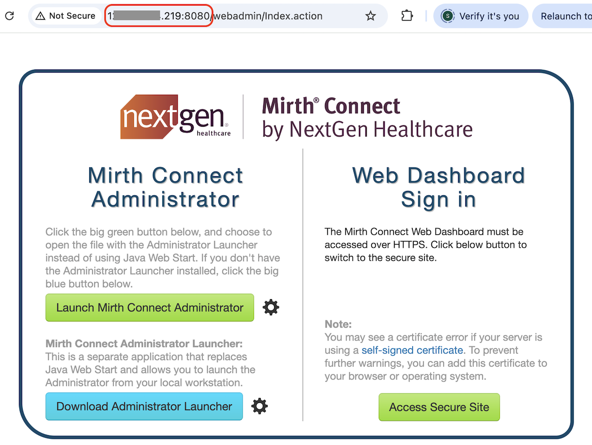

# Deploy Mirth Connect

## Introduction

This lab describes how to deploy the open-source Mirth Connect integration engine to Oracle Kubernetes Engine (OKE) by using the sample Terraform configuration obtained earlier in this workshop.

Estimated Lab Time: 10 minutes

### Objectives

In this lab, you will:

* Configure Terraform input variables.
* Use Terraform to deploy Mirth Connect to OKE.
* Verify the deployment and access Mirth Connect.

## Task 1: Set Terraform input variable values

1. Go to the following directory: 

    `oci-healthcare-naci/architectures/mirth-connect-oke-demo/apps`.

2. Open `terraform.tfvars` in a text editor. Update the Terraform input variables for your environment. Sample values are shown below:
    ```bash
		# =========================
		# OCI Authentication
		# =========================
		tenancy_ocid      = "<oci_tenancy_ocid>"
		user_ocid         = "<oci_user_ocid>"
		fingerprint       = "<api_key_fingerprint>"
		private_key_path  = "<local_path_to_your_api_private_key>"
		region            = "us-ashburn-1"

		# =========================
		# PostgreSQL DB System (used by Mirth Connect)
		# =========================
		psql_admin_username = "<set_psql_admin_username_here>"
		psql_admin_password = "<set_psql_admin_password_here>"
		psql_mirth_username = "<set_psql_mirth_db_username_here>"
		psql_mirth_password = "<set_psql_mirth_db_password_here>"
	```
	**Important:** Replace the placeholder values with values appropriate for your environment. The `terraform.tfvars` file contains sensitive information, including database credentials. Do not commit this file to a source code repository.

3. Save `terraform.tfvars`.

## Task 2: Deploy Mirth Connect using Terraform

1. Make sure that your current working directory is:

    `oci-healthcare-naci/architectures/mirth-connect-oke-demo/apps`.

2. Initialize the Terraform working directory.
    ```bash
		<copy>
		terraform init
		</copy>
	```

3. Preview the changes that Terraform will make.
    ```bash
		<copy>
		terraform plan
		</copy>
	```

4. Apply the Terraform configuration to deploy Mirth Connect.
    ```bash
		<copy>
		terraform apply -auto-approve
		</copy>
	```

5. Wait for Terraform to finish deploying Mirth Connect.

## Task 3: Access Mirth Connect

1. Run the following command to display the `mirth-connect` service:
    ```bash
		<copy>
		kubectl get service mirth-connect
		</copy>
	```
2. Note the value in the `EXTERNAL-IP` column. The output should be similar to the following:
    ```bash
		NAME            TYPE           CLUSTER-IP      EXTERNAL-IP      PORT(S)                         AGE
		kubernetes      ClusterIP      10.96.0.1       <none>           443/TCP,12250/TCP               64m
		mirth-connect   LoadBalancer   10.96.157.162   <EXTERNAL-IP>	8080:30257/TCP,8443:31454/TCP   55m

	```

3. In a web browser, go to `http://<EXTERNAL-IP>:8080`. Replace `<EXTERNAL-IP>` with the external IP address form the previous step.
    

## Acknowledgements
* **Author** - [](var:author)
* **Contributors** - [](var:contributors)
* **Last Updated By/Date** - [](var:last_updated)
