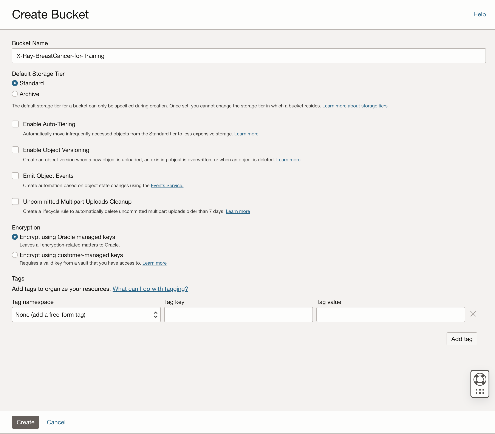
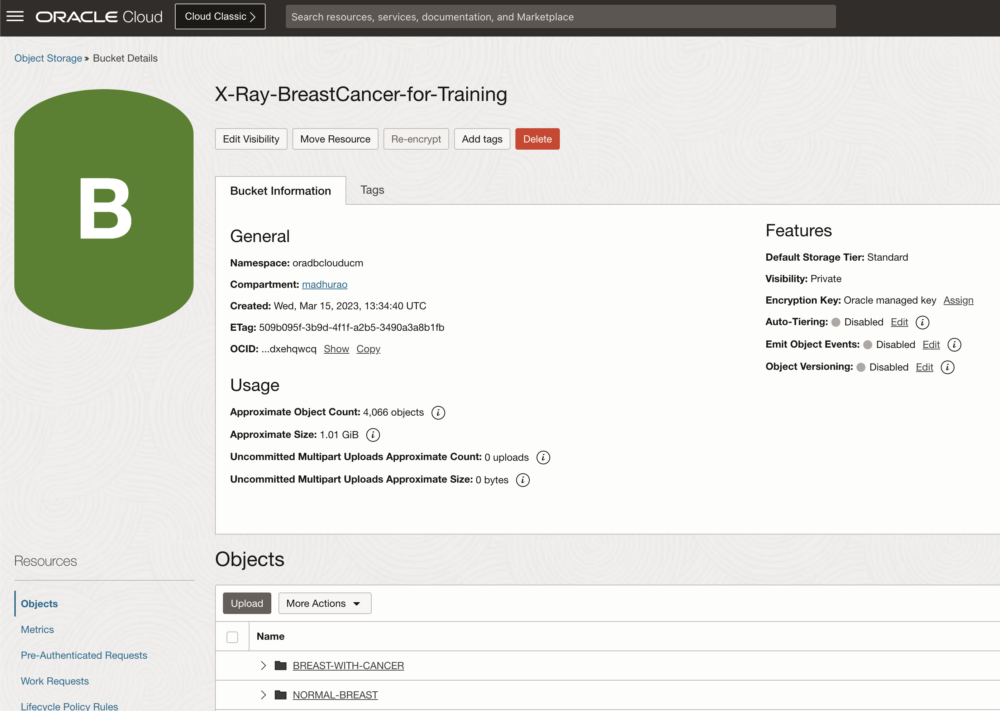

# Lab 3: Create image library

## Introduction

TBC - To be completed. 

This lab walks you through the steps to organize an image library in Object Storage. You will have an option to download images directly to OCI Cloud Shell and then from Cloud Shell into Object Storage. Alternatively, you can also load images to Object Storage from your laptop, assuming you have already download images to your laptop. The first approach is faster and recommended.

Estimated time: 30 minutes

### About OCI Object Storage

OCI Object Storage service is an internet-scale, high-performance storage platform that offers reliable and cost-efficient data durability. The Object Storage service can store an unlimited amount of unstructured data of any content type, including analytic data and rich content, like images and videos.

### Objectives

In this lab, you will:

* Create a new bucket within Object Storage
* Set bucket visibility and access
* Download images from Kaggle.com to OCI Cloud Shell
* Load images from OCI Cloud Shell to your bucket
* Alternatively, load images to Object Storage from your computer

### Prerequisites

This lab assumes you have:

* Completed **Lab 2: Setup environment** lab and already logged into OCI console

## Task 1: Create a new bucket

You will organize your image library in a new **Object Storage Bucket**.

1. Navigate to Buckets page

    From the **Navigator** menu (top-left corner) select **Storage** and then **Buckets**.

    

2. Create a new bucket

    When defining a new bucket, you should provide a **Bucket Name** of your choosing and then leave everything else as default:
    * choose *Standard* for **Default Storage Tier**,
    * use *Encrypt* using Oracle managed keys for **Encryption** and
    * provide some **Tags** if you want to improve your OCI management and control.
    * In order to make your image library visible to other users or services, you have to update its visibility to Public. Default visibility is set to Private. And in this case we will keep visibility as **Private**

    Please pay attention that you've selected correct compartment, ie. **aidemo** compartment in our case, if you have created compartment with any other name please select that..

    Then create bucket with name  **X-Rays-BreastCancer-for-Training** and then click **Create Bucket**.

    

    Verify Bucket Details

    

    Similarly, create another bucket **X-Rays-LungCancer-for-Training** and then click **Create Bucket**.

    

    Verify Bucket Details

    
  
## Task 3a: Load images to Object Storage using OCI CLI

Original image dataset resides on Kaggle.com. We will download the required images into our local desktop/laptop machine where OCI Cli has been setup and upload these images using OCI Cli Command, There are many other options to upload images into a bucket eighter by manually uploading each image using OCI Console for image upload into a bucket or downloading these images into cloud shell and uploading from there:

* Download image to local laptop/desktop,
* Unzip downloaded image dataset to OCI Cloud Shell file system 
* Create separate folders for each classification type for example normal ct scan of lungs will be stored in one folder and the ct scan images of lung cancer with different types will be stored in another folder.
* perform images bulk load to Object Storage into respective folders in bucket folders.
* Assumption: OCI CLI has been setup if not please refer Lab 2
 
1. Download images to local desktop or laptop

    Images can be downloaded from Kaggle.com by issuing the following command:

    ```console
    <copy>wget -x -c --load-cookies kaggle_cookies.txt https://www.kaggle.com/datasets/paultimothymooney/chest-xray-pneumonia/download?datasetVersionNumber=2</copy>
    ```

    Image archive download starts and you can track progress. This operation won't take long to complete.

    

7. Unzip image archive

    When image archive is downloaded, create a new folder for images and unzip all images into that folder.

    ```console
    <copy>
    mkdir pneumonia-dataset

    unzip www.kaggle.com/datasets/paultimothymooney/chest-xray-pneumonia/download\?datasetVersionNumber\=2 -d pneumonia-dataset/
    </copy>
    ```

    This operation won't take much time as well. After unzip is completed, a new */pneumonia-dataset/chest-xray* folder is created. You will use content of *train* and *val* folders.

    For example, you can check the number of images in /train/NORMAL and /train/PNEUMONIA folders.

    

8. Load images to Object Storage

    In the last step, you will load images from Cloud Shell to Object storage. 

    Return to Cloud Shell and issue the following command to load images. The content of the *train* folder will be uploaded. This will also create two new folders, NORMAL and PNEUMONIA. respectively:

    ```console
    <copy>
    oci os object bulk-upload -ns frly8pi3k85f -bn X-Ray-Images-for-Training --src-dir /home/X_Ray/pneumonia-dataset/chest_xray/chest_xray/train --overwrite --content-type 'image/jpeg'
    </copy>
    ```

    Again, you can track the process. It might take a little bit longer than download, but not by much. When completed, you can verify the number of images copied into your bucket.

    
 
## Task 4: Verify images are loaded properly

When you have successfully completed the task of loading images to Object Storage, make sure that you've uploaded all images and that images are correctly placed in *PNEUMONIA* and *NORMAL* folders:

1. Verify images are loaded into proper folders.

    

    

2. Check if you can see your images

    You are using a private bucket with pre-authenticated request. This means, that you will not be able to see your image using URL provided in object details.

    Navigate to one of the folders, ie. NORMAL and click on the menu icon on the right. Select **View Object Details**. 

    

    This opens details of selected image. If the visibility is set to public, then image URL will contain active link and you will be able to view an image. If it is set to private, then image URL is simple text.

    

    Copying image URL into your browser will not display an image, because visibility for the bucket is set to *private*. In order to be able to view an image, you must replace first part of the image URL with the URL that you stored when you were creating pre-authenticated request (PAR).

    For example, if the URL of an image is:

    ```text
    https://objectstorage.eu-frankfurt-1.oraclecloud.com/n/...domain.../b/X-Ray-Images-for-Training/o/PNEUMONIA%2Fperson1000_bacteria_2931.jpeg
    ```

    and PAR URL is:

    ```text
    https://objectstorage.eu-frankfurt-1.oraclecloud.com/p/...some code.../n/...domain.../b/X-Ray-Images-for-Training/o/
    ```

    then replace first part of the image URL with PAR URL and add only image name at the end, for example: `PNEUMONIA/person1000_bacteria_2931.jpg`. New URL should look like this:

     ```text
    https://objectstorage.eu-frankfurt-1.oraclecloud.com/p/...some code.../n/...domain.../b/X-Ray-Images-for-Training/o/PNEUMONIA%2Fperson1000_bacteria_2931.jpeg
    ```

    You can now open an image with this combined URL, for example:

    

    If you don't use combined URL, then your browser would display the following error:

    

    This concludes this lab. You can **proceed now to the next lab**.

## Learn More

* [OCI Object Storage](https://docs.oracle.com/en-us/iaas/Content/Object/home.htm)
* [OCI CLI Command Reference](https://docs.oracle.com/en-us/iaas/tools/oci-cli/3.22.3/oci_cli_docs/oci.html)


## Acknowledgements 