# Diagnose Cardiovascular disease with ECG and OCI Anomaly Detection

## Introduction

This lab walks you through the steps detecting Cardiovascular disease with Electrocardiogram (ECG) Reports and [**OCI Anomaly Detection**](https://www.oracle.com/in/artificial-intelligence/anomaly-detection/).

An **ECG** is a simple, non-invasive test that records the electrical activity of the heart. An ECG can help diagnose certain heart conditions, including **abnormal heart rhythms and coronary heart disease** (heart attack and angina).

Electrocardiography is the process of producing an electrocardiogram (ECG or EKG ), a recording of the heart's electrical activity through repeated cardiac cycles. It is an electrogram of the heart, which is a graph of voltage versus time of the heart's electrical activity using electrodes placed on the skin. 

These electrodes detect the small electrical changes that are a consequence of cardiac muscle depolarization followed by repolarization during each cardiac cycle (heartbeat). Changes in the normal ECG pattern occur in numerous cardiac abnormalities, including cardiac rhythm disturbances (such as atrial fibrillation[6] and ventricular tachycardia), inadequate coronary artery blood flow (such as myocardial ischemia and myocardial infarction), and electrolyte disturbances (such as hypokalemia and hyperkalemia).

Identify normal v/s fast v/s slow v/s irregular heartbeats with ECG reports.
 


Identifying normal versus abnormal ECG reports.


**Important**

This workshop provides a basic example of using OCI Vision, OCI Anomaly Detection and other AI services. This example is for illustration and demonstration purposes only and isn't intended to replace any medical imagery analysis tool or official diagnosis recommendation made by a professional. Users need to receive the proper regulated compliance and approvals before using for medical and diagnostic use.

Estimated Time: 30 minutes.  

### About OCI Anomaly Detection

[**OCI Anomaly Detection**](https://www.oracle.com/in/artificial-intelligence/anomaly-detection/) is an AI service that provides real-time and batch anomaly detection for univariate and multivariate time series data. Through a simple user interface, organizations can create and train models to detect anomalies and identify unusual behavior, changes in trends, outliers, and more.

**Proprietary anomaly detection algorithms**

OCI Anomaly Detection algorithms, backed by more than 150 patents, detect anomalies earlier with fewer false alarms. These algorithms work together to ensure higher sensitivity and better false alarm avoidance than other machine learning (ML) approaches, such as neural nets and support vector machines.

**Intelligent data preprocessing**

OCI Anomaly Detection provides multiple data processing techniques that account for errors and imperfections in real-world input data, such as from low-resolution sensors. It automatically identifies and fixes data quality issues—resulting in fewer false alarms, better operations, and more accurate results.
 
### Objectives

In this lab, you will:
 
* Approach to ECG Interpretation - ECG Data Preparation
* Upload the ECG Training data to OCI Object storage
* Create and Train the ECG Model
* Review Model and Data settings
* Detect ECG Anomalies

### Prerequisites

This lab assumes you have:

* You have Completed **Get Started**, **Setup Policies** lab and have required access to Create OCI Anomaly Detection

## Task 1: Approach to ECG Interpretation - ECG Data Preparation
 
1. ECG Data Preparation in CSV format that contains timestamp and corresponding ECG reading, for the sake of simplicity we are calling this as **beat_measure**, save this file as *normal-ecg-training-data.csv*

    

    > **Note 1:**  In general, when measuring amplitudes of waves or complexes, the units are expressed in mm, and when measuring lengths for intervals, the units are expressed in seconds or milliseconds (ms). If each small box is equal to 0.04 seconds or 1 mm, then the standard ECG speed is 1 mm per 0.04 seconds, or 25 mm per second.
  
     

    read more about it at an [*Approach to ECG Interpretation*](https://www.healio.com/cardiology/learn-the-heart/ecg-review/ecg-interpretation-tutorial/approach-to-ecg-interpretation)

    > **Note 2:** From Google search, look for *download normal ecg report in CSV format* and download from any of your favourite data sources or bring your own data.

## Task 2: Upload the ECG Training data to OCI Object storage

It is assumed that you have access to create OCI Bucket and Upload Objects to OCI Bucket, if not please verify previous labs in this workshop. From the top left navigation of cloud.oracle.com under **Storage** services select **Buckets**

1. Access OCI Object storage Bucket and Upload CSV file. 

    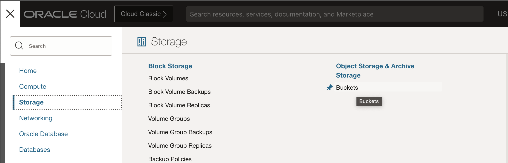 

2. Create seperate folder ECG Training data upload in OCI Bucket.

     

2. Verify Uploaded file

     

## Task 3: Create and Train the ECG Model

**Univariate anomaly detection**: Univariate anomaly detection (UAD) refers to the problem of identifying anomalies in a single time series data. A single time series data contains timestamped values for one signal, such as metric or measure.

1. From the top left navigation of cloud.oracle.com under **Analytics & AI** services select **Anomaly Detection**

     

2. On the overview page you can learn more about Anomaly Detection

    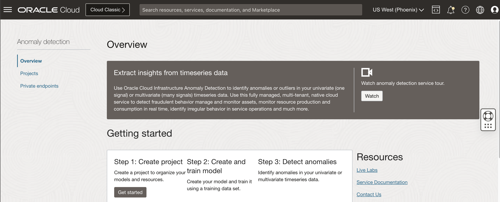 

3. Click on **Projects** tab and **Create Project**, provide project name and description

    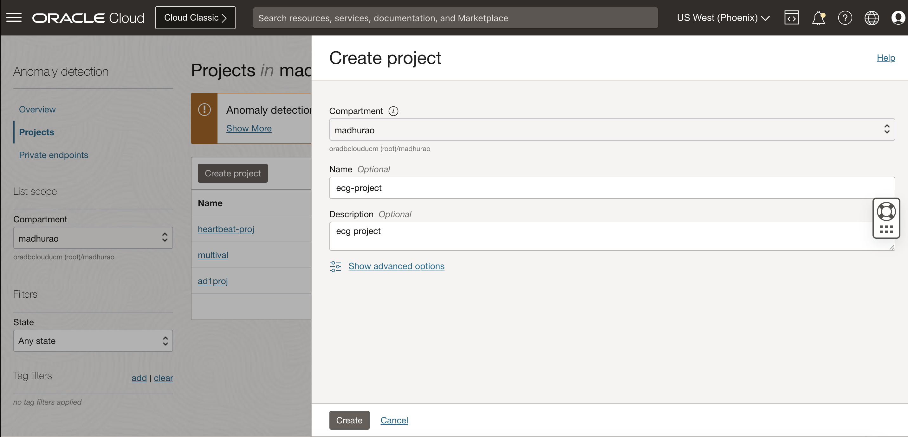 

4. Once the Project is created, then click on **Create and train model**

    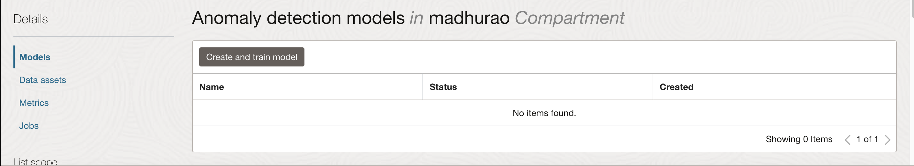

5. Choose the training dataset, in our case we will **create new dataset**

     

6. Under **Type** Select **Oracle object storage**, you also have other options like select **Oracle Autonomous Database Transaction Processing** or **InfluxDB**

    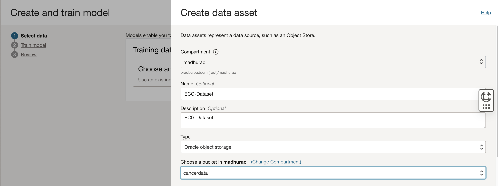 

7. Review the data and select the CSV file that we uploaded in earlier step

    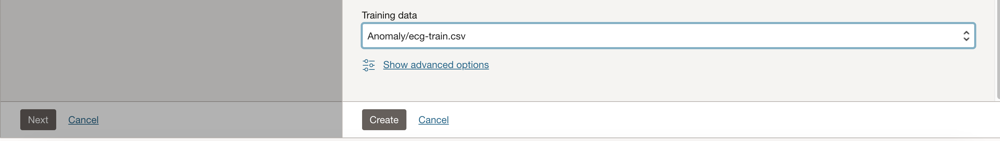 

8. Click Create.

    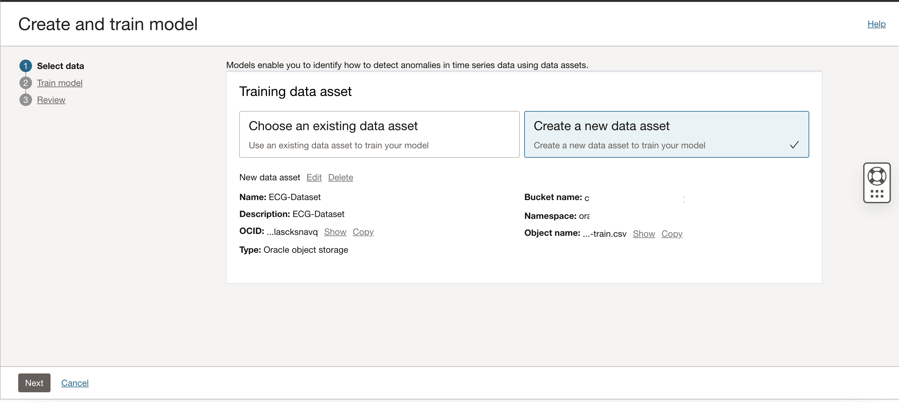 

9. Click Next, Provide the Model name and leave other default values

    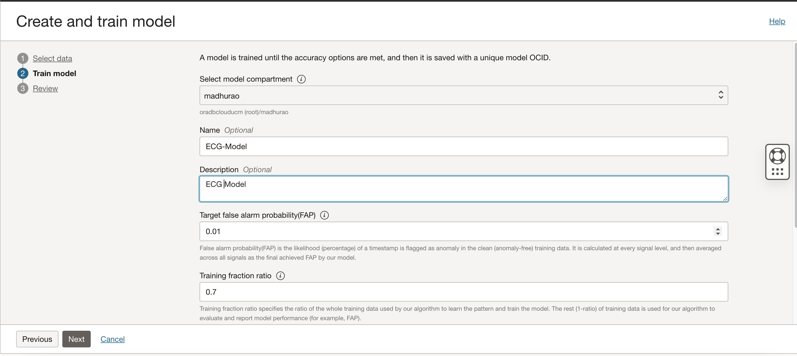 

10. Select the Algorithm in our case we will select **Univariate OCSVM**
 
    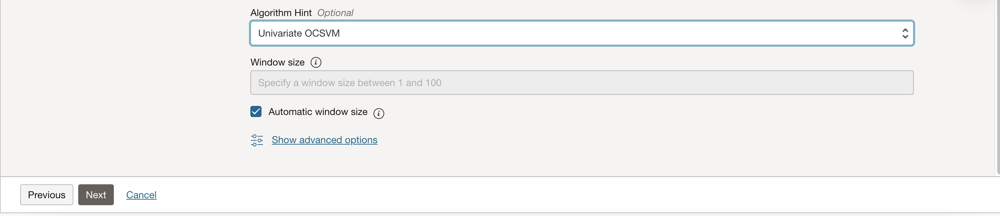 

11. Review details and click on **Create and train** button

    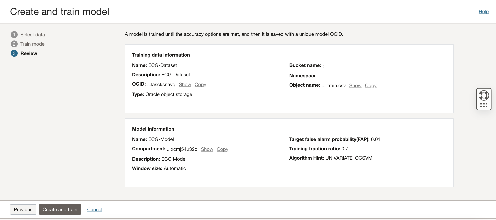 
 
## Task 4: Review Model and Data settings

1. Once the model creation process is complete, click on **Data assets** in the left navigation.
 
    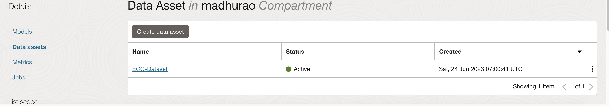 

2. Review the filename and bucket details.

     

3. Click on **Models** and click on the **ECG-Model** that we have created

    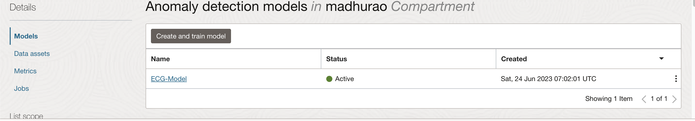 

4. Review the Model information, you can also make note of Model OCID which would be required if you plan to do an external integration.

     

    Click on **Model Information**

     

5. Download and Review the Model details. 

    ```json
    <copy> 
        {
        "rowReductionDetails": null,
        "signalDetails": [
            {
                "signalName": "beat_measure",
                "mviRatio": 0,
                "isQuantized": null,
                "fap": 0.0021,
                "min": 2.28,
                "max": 3.53,
                "std": 0.1527,
                "status": "ACCEPTED",
                "details": null
            }
        ],
        "isTrainingGoalAchieved": true,
        "fap": 0.0021,
        "windowSize": 100,
        "warning": null
    }
    </copy>
    ```

    > **Note 2:**  These model details might vary depending upon different training dataset and different conditions of patients.
    
## Task 5: Detect ECG Anomalies

1. Click on **Detect Anomalies** button 

    

2. Upload Sample ECG CSV Data file, Sensitivity can be left to default or select 0.5 and click **Detect**

    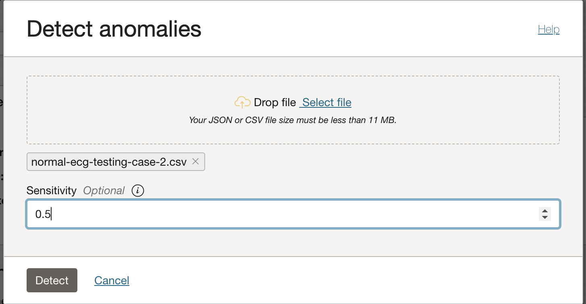 

    * <span style="color: #E29E1D;">**Orange lines**</span> indicates the actual input value of a signal, purple line indicates the predicted value by the machine learning model, and <span style="color: red;">**Red lines**</span> indicates anomaly being detected at that timestamp.
    * The anomaly score per signal shows the significance of anomaly at individual signal level for a given timestamp. *Not all the signals flag anomalies at the same time*.
    * The aggregated anomaly score indicates the significance of anomaly for a given timestamp by considering the anomaly from all signals together.

     

     

    Observe the estimated value v/s actual value

     

3. View only Anomalies plotted in *red dot and dashes*.
 
    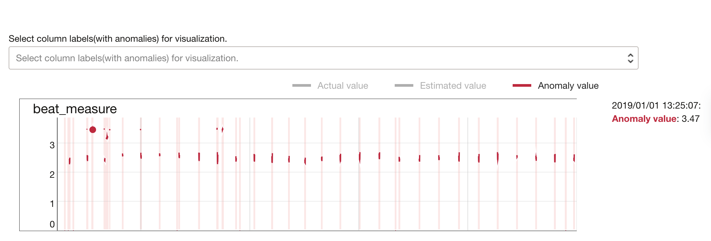 

4. View only Actual Values. Some of these <span style="color: #E29E1D;">**long orange lines**</span> can also be false alarms which can be ignored

     

    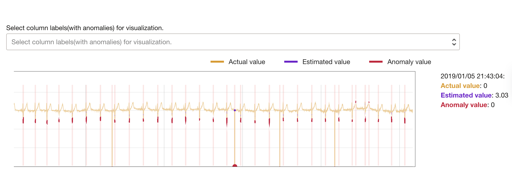 

5. Anomaly score per signal v/s timestamp

    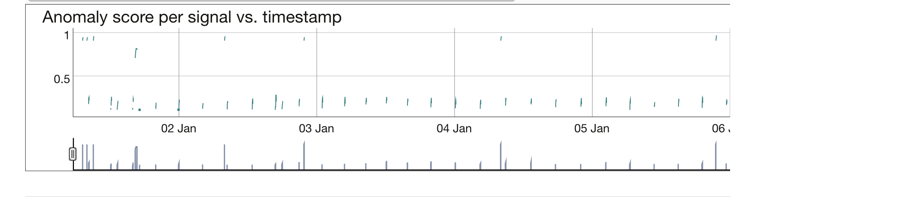 

     
 
    This concludes this lab and you can **proceed to the next lab**.

## Learn More

* [Wiki Source](https://en.wikipedia.org/wiki/Electrocardiography)
* [ECG findings and CHD](https://www.sevencountriesstudy.com/ecg-predictors-and-coronary-heart-disease/)

## Acknowledgements

* **Author** - Madhusudhan Rao B M, Principal Product Manager, Oracle Database
* **Last Updated By/Date** - June 24th, 2023.