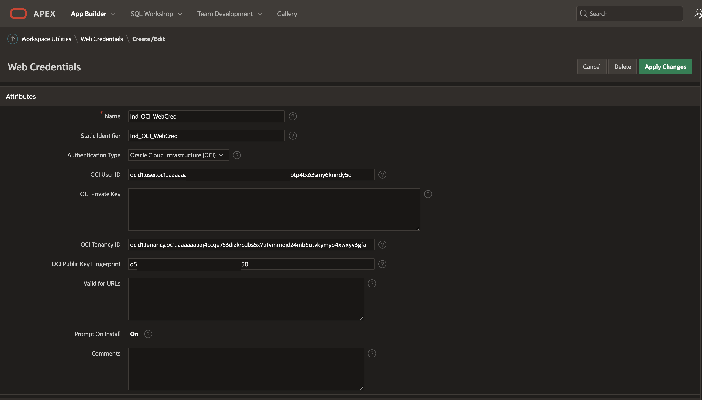
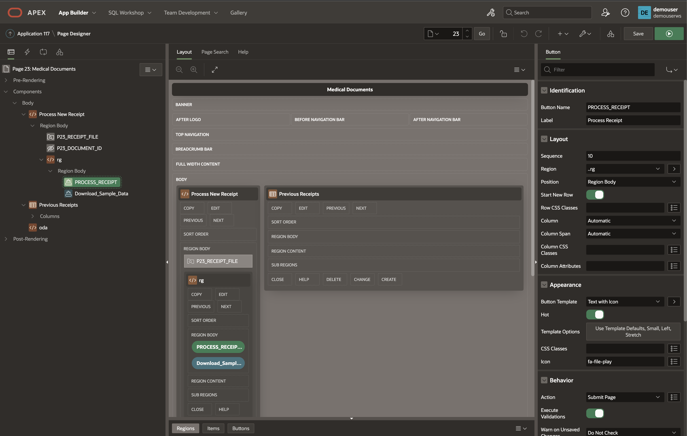
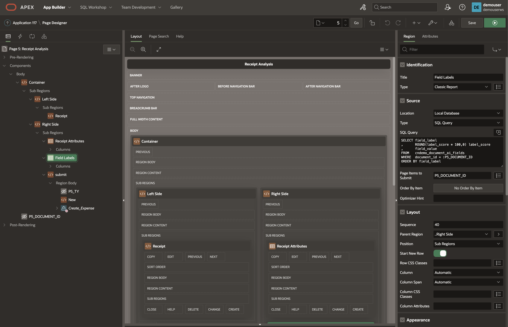
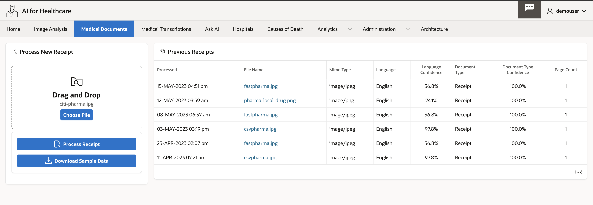

# Oracle APEX Application for Medical Receipt processing 

## Introduction

This Lab walks you through the process of creating the Oracle Apex front-end Application. Oracle Apex is a low-code Application development platform. The application will detect the text in uploaded image and send JSON response back, it can also detect the type of document such as for example invoice or receipts.

* Upload the image from the local file system to the OCI object storage bucket using OCI Object storage rest APIs
* Input this image to the Document understanding Pretrained AI model
* Receive the response JSON and parse it to get key-value pair and write into table. 

Estimated Time: 30 minutes.

### About Oracle APEX

Oracle APEX is the world's most popular enterprise low-code application platform that enables you to build scalable, secure enterprise apps, with world-class features. These apps can be deployed anywhere - cloud or on-premises

Using APEX, developers can quickly develop and deploy compelling apps that solve real problems and provide immediate value. You don't need to be an expert in a vast array of technologies to deliver sophisticated solutions. Focus on solving the problem and let APEX take care of the rest.

### Objectives

In this lab, you will:

* Setup Oracle APEX Web Credentials
* Create required schema - 
    * Tables: MACHINE LEARNING CONFIGS, DOCUMENT AI DOCS, DOCUMENT AI FIELDS
    * PL/SQL Procedure DOCUMENT\_AI\_PK, Triggers etc.
* Create Oracle APEX Page
* Verify Oracle APEX File upload settings
* Create Custom Reports and Verify Results of uploaded receipt file.
* Create Expense Item from uploaded receipt

### Prerequisites

This lab assumes you have:

* Completed previous labs of this workshop.
* You have an Oracle APEX workspace already created.

## Task 1: Setup Oracle APEX Web Credentials

Oracle APEX Web Credentials provides a convenient and secure mechanism for storing the following types of credentials:

* Basic Authentication (Username & password)
* OAuth2 Client Credentials (Client ID & Client Secret)
* OCI Native Authentication (Access Oracle Cloud Resources, e.g., Object Storage)
* HTTP Header (The credential is added to the REST request as an HTTP Header)
* URL Query String (The credential is added to the URL of the REST request as a Query String Parameter).

We will be using OCI Native Authentication required to connect with Object Storage

1. Create Web Credentials

    

    

    

2. Provide user OCID, tenancy OCID, fingerprint and authentication type as **Oracle Cloud Infrastructure**

    
 
## Task 2: Create Table - DOCUMENT AI DOCS
 
1. Create **DOCUMENT\_AI\_DOCS** table.

    DOCUMENT\_AI\_DOCS table is primarily used to store the JSON response after uploading the image to object storage, querying the image against a Document Understanding pre-trained AI model. The JSON response contains the OCI Labels and their corresponding confidence scores. 

2. Some of the Pre-trained models are:
    
    * Optical Character Recognition (OCR)
    * Document Classification.
    * Table Extraction.
    * Key Value Extraction (Receipts)
    * Optical Character Recognition (OCR) PDF.

    ```sql
    <copy> 
    CREATE TABLE  "DOCUMENT_AI_DOCS" 
    (	
        "DOCUMENT_ID" NUMBER GENERATED BY DEFAULT ON NULL AS IDENTITY MINVALUE 1 MAXVALUE 9999999999999999999999999999 INCREMENT BY 1 START WITH 1 CACHE 20 NOORDER  NOCYCLE  NOKEEP  NOSCALE  NOT NULL ENABLE, 
        "FILE_NAME" VARCHAR2(100) COLLATE "USING_NLS_COMP" NOT NULL ENABLE, 
        "MIME_TYPE" VARCHAR2(100) COLLATE "USING_NLS_COMP" NOT NULL ENABLE, 
        "OBJECT_STORE_URL" VARCHAR2(1000) COLLATE "USING_NLS_COMP" NOT NULL ENABLE, 
        "DOC_AI_JSON" CLOB COLLATE "USING_NLS_COMP", 
        "LANGUAGE_CODE" VARCHAR2(10) COLLATE "USING_NLS_COMP", 
        "LANGUAGE_SCORE" NUMBER, 
        "DOCUMENT_TYPE_CODE" VARCHAR2(50) COLLATE "USING_NLS_COMP", 
        "DOCUMENT_TYPE_SCORE" NUMBER, 
        "PAGE_COUNT" NUMBER, 
        "STATUS_CODE" VARCHAR2(25) COLLATE "USING_NLS_COMP" DEFAULT ON NULL 'WIP' NOT NULL ENABLE, 
        "CREATION_DATE" TIMESTAMP (6) WITH LOCAL TIME ZONE NOT NULL ENABLE, 
        "CREATED_BY" VARCHAR2(255) COLLATE "USING_NLS_COMP" NOT NULL ENABLE, 
        "LAST_UPDATE_DATE" TIMESTAMP (6) WITH LOCAL TIME ZONE NOT NULL ENABLE, 
        "LAST_UPDATED_BY" VARCHAR2(255) COLLATE "USING_NLS_COMP" NOT NULL ENABLE, 
        "LABEL1" VARCHAR2(100) COLLATE "USING_NLS_COMP", 
        "LABEL1_SCORE" NUMBER, 
        "LABEL2" VARCHAR2(100) COLLATE "USING_NLS_COMP", 
        "LABEL2_SCORE" NUMBER, 
        "AISPEECHTRANS_JOBID" VARCHAR2(1000) COLLATE "USING_NLS_COMP", 
        "AISPEECH_PREFIX" VARCHAR2(1000) COLLATE "USING_NLS_COMP", 
        CONSTRAINT "DOCUMENT_AI_DOCS_PK" PRIMARY KEY ("DOCUMENT_ID")
    USING INDEX  ENABLE
    )  DEFAULT COLLATION "USING_NLS_COMP"
    /

    CREATE OR REPLACE EDITIONABLE TRIGGER  "DOCUMENT_AI_DOCS_BIU" 
    BEFORE INSERT OR UPDATE ON DOCUMENT_AI_DOCS FOR EACH ROW
    BEGIN
    IF INSERTING THEN
        :new.created_by       := COALESCE(SYS_CONTEXT('APEX$SESSION','APP_USER'),SYS_CONTEXT('USERENV', 'SESSION_USER'));
        :new.creation_date    := current_timestamp;
        :new.last_updated_by  := COALESCE(SYS_CONTEXT('APEX$SESSION','APP_USER'),SYS_CONTEXT('USERENV', 'SESSION_USER'));
        :new.last_update_date := current_timestamp;
    ELSIF UPDATING THEN
        :new.last_updated_by  := COALESCE(SYS_CONTEXT('APEX$SESSION','APP_USER'),USER);
        :new.last_update_date := current_timestamp;
    END IF;
    END;

    /
    ALTER TRIGGER  "DOCUMENT_AI_DOCS_BIU" ENABLE
    / 
    </copy>
    ```

## Task 4: Create Table - DOCUMENT AI FIELDS

DOCUMENT\_AI\_FIELDS table is used to store the labels and corresponding scores. This is what we get after the parsing of the JSON response.

1. Create **DOCUMENT\_AI\_FIELDS** .

    ```sql
    <copy> 
     CREATE TABLE  "DOCUMENT_AI_FIELDS" 
    (	"WORD_ID" NUMBER GENERATED BY DEFAULT ON NULL AS IDENTITY MINVALUE 1 MAXVALUE 9999999999999999999999999999 INCREMENT BY 1 START WITH 1 CACHE 20 NOORDER  NOCYCLE  NOKEEP  NOSCALE  NOT NULL ENABLE, 
        "DOCUMENT_ID" NUMBER NOT NULL ENABLE, 
        "FIELD_TYPE_CODE" VARCHAR2(50) COLLATE "USING_NLS_COMP" NOT NULL ENABLE, 
        "FIELD_LABEL" VARCHAR2(100) COLLATE "USING_NLS_COMP", 
        "LABEL_SCORE" NUMBER, 
        "FIELD_VALUE" VARCHAR2(1000) COLLATE "USING_NLS_COMP", 
        "CREATION_DATE" TIMESTAMP (6) WITH LOCAL TIME ZONE NOT NULL ENABLE, 
        "CREATED_BY" VARCHAR2(255) COLLATE "USING_NLS_COMP" NOT NULL ENABLE, 
        "LAST_UPDATE_DATE" TIMESTAMP (6) WITH LOCAL TIME ZONE NOT NULL ENABLE, 
        "LAST_UPDATED_BY" VARCHAR2(255) COLLATE "USING_NLS_COMP" NOT NULL ENABLE, 
        "EXPENSE" VARCHAR2(50) COLLATE "USING_NLS_COMP", 
        CONSTRAINT "DOCUMENT_AI_FIELDS_PK" PRIMARY KEY ("WORD_ID")
    USING INDEX  ENABLE
    )  DEFAULT COLLATION "USING_NLS_COMP"
    /

    CREATE INDEX  "DOCUMENT_AI_FIELDS_N1" ON  "DOCUMENT_AI_FIELDS" ("DOCUMENT_ID")
    /

    CREATE OR REPLACE EDITIONABLE TRIGGER  "DOCUMENT_AI_FIELDS_BIU" 
    BEFORE INSERT OR UPDATE ON CNDEMO_DOCUMENT_AI_FIELDS FOR EACH ROW
    BEGIN
    IF INSERTING THEN
        :new.created_by       := COALESCE(SYS_CONTEXT('APEX$SESSION','APP_USER'),SYS_CONTEXT('USERENV', 'SESSION_USER'));
        :new.creation_date    := current_timestamp;
        :new.last_updated_by  := COALESCE(SYS_CONTEXT('APEX$SESSION','APP_USER'),SYS_CONTEXT('USERENV', 'SESSION_USER'));
        :new.last_update_date := current_timestamp;
    ELSIF UPDATING THEN
        :new.last_updated_by  := COALESCE(SYS_CONTEXT('APEX$SESSION','APP_USER'),USER);
        :new.last_update_date := current_timestamp;
    END IF;
    END;

    /
    ALTER TRIGGER  "DOCUMENT_AI_FIELDS_BIU" ENABLE
    /
    </copy>
    ```
   
## Task 5: Create PL/SQL Package

You can login to Oracle APEX Workspace and select SQL worksheet to run any of the SQL commands or Create Tables or Packages.

1. Create PL/SQL Package Specs.

    ```sql
    <copy>
    create or replace PACKAGE DOCUMENT_AI_PK AS  
    GC_OCI_OBJ_STORE_BASE_URL  CONSTANT VARCHAR2(500)  := 'https://objectstorage.us-phoenix-1.oraclecloud.com/n/xnamespace/b/xbucket/o/DocumentAI/'; 
    GC_OCI_DOC_AI_URL          CONSTANT VARCHAR2(500)  := 'https://vision.aiservice.us-phoenix-1.oci.oraclecloud.com/20220125/actions/analyzeDocument'; 
    -- https://document.aiservice.us-phoenix-1.oci.oraclecloud.com - check for update
    -- https://docs.oracle.com/en-us/iaas/api/#/en/document-understanding/20221109/
    GC_OCI_DOC_AI_TIMEOUT_SECS CONSTANT NUMBER         := 15; 
    GC_WC_CREDENTIAL_ID        CONSTANT VARCHAR2(50)   := 'Ind_OCI_WebCred'; --APEX_OCI_WEB  _CREDENTIAL 
    GC_OCY_DOC_AI_PAYLOAD      CONSTANT VARCHAR2(32000) := '{ 
    "compartmentId": "ocid1.compartment.oc1..aaaaaaaaud6tkd-your-compartment-ocid-ixcmj54u32q", 
    "document": { 
        "namespaceName": "xnamespace", 
        "bucketName": "xbucket", 
        "objectName": "DocumentAI/#FILE_NAME#", 
        "source": "OBJECT_STORAGE" 
    }, 
    "features": [ 
        { 
        "featureType": "TEXT_DETECTION",
        "generateSearchablePdf": true 
        }, 
        { 
        "featureType": "DOCUMENT_CLASSIFICATION", 
        "maxResults": 5 
        }, 
        { 
        "featureType": "LANGUAGE_CLASSIFICATION", 
        "maxResults": 5 
        }, 
        { 
        "featureType": "KEY_VALUE_DETECTION" 
        }, 
        { 
        "featureType": "TABLE_DETECTION" 
        } 
    ] 
    }'; 
        
    PROCEDURE process_file 
    (p_apex_file_name  IN VARCHAR2, 
    x_document_id    OUT document_ai_docs.document_id%TYPE); 
    
    PROCEDURE render_document 
    (x_document_id  IN document_ai_docs.document_id%TYPE); 
    
    END DOCUMENT_AI_PK;

    </copy>
    ```

2. Replace *xnamespace* with your OCI namespace and *xbucket* with your file upload bucket where documents will be temporarily uploaded for AI analysis

    Create Package Body

    ```sql
    <copy>
    create or replace PACKAGE DOCUMENT_AI_PK AS  
    GC_OCI_OBJ_STORE_BASE_URL  CONSTANT VARCHAR2(500)  := 'https://objectstorage.us-phoenix-1.oraclecloud.com/n/oradbclouducm/b/X-Ray-Images-Staging/o/DocumentAI/'; 
    GC_OCI_DOC_AI_URL          CONSTANT VARCHAR2(500)  := 'https://vision.aiservice.us-phoenix-1.oci.oraclecloud.com/20220125/actions/analyzeDocument'; 
    GC_OCI_DOC_AI_TIMEOUT_SECS CONSTANT NUMBER         := 15; 
    GC_WC_CREDENTIAL_ID        CONSTANT VARCHAR2(50)   := 'Ind_OCI_WebCred'; --APEX_OCI_BLOG_CREDENTIAL 
    GC_OCY_DOC_AI_PAYLOAD      CONSTANT VARCHAR2(32000) := '{ 
    "compartmentId": "ocid1.compartment.oc1..aaaaaaaaud6tkdn6n23-yourcompartment-viqyneyroixcmj54u32q", 
    "document": { 
        "namespaceName": "xnamespace", 
        "bucketName": "xbucket", 
        "objectName": "DocumentAI/#FILE_NAME#", 
        "source": "OBJECT_STORAGE" 
    }, 
    "features": [ 
        { 
        "featureType": "TEXT_DETECTION",
        "generateSearchablePdf": true 
        }, 
        { 
        "featureType": "DOCUMENT_CLASSIFICATION", 
        "maxResults": 5 
        }, 
        { 
        "featureType": "LANGUAGE_CLASSIFICATION", 
        "maxResults": 5 
        }, 
        { 
        "featureType": "KEY_VALUE_DETECTION" 
        }, 
        { 
        "featureType": "TABLE_DETECTION" 
        } 
    ] 
    }'; 
        
    PROCEDURE process_file 
    (p_apex_file_name  IN VARCHAR2, 
    x_document_id    OUT document_ai_docs.document_id%TYPE); 
    
    PROCEDURE render_document 
    (x_document_id  IN document_ai_docs.document_id%TYPE); 
    
    END DOCUMENT_AI_PK;
    --============== plsql package body
    create or replace PACKAGE BODY DOCUMENT_AI_PK  
    IS 
    ------------------------------------------------------------------------------- 
    PROCEDURE put_file 
    (p_mime_type         IN VARCHAR2, 
    p_file_blob         IN BLOB, 
    p_file_name         IN VARCHAR2, 
    x_object_store_url OUT VARCHAR2) IS 
    
    l_response            CLOB; 
    
    BEGIN 
    
    -- Build the full Object Storage URL. 
    x_object_store_url := GC_OCI_OBJ_STORE_BASE_URL || p_file_name; 
    
    -- Set Mime Type of the file in the Request Header. 
    apex_web_service.g_request_headers.DELETE; 
    apex_web_service.g_request_headers(1).name  := 'Content-Type'; 
    apex_web_service.g_request_headers(1).value := p_mime_type; 
    
    -- Call Web Service to PUT file in OCI. 
    l_response := apex_web_service.make_rest_request 
    (p_url                  => UTL_URL.ESCAPE(x_object_store_url), 
        p_http_method          => 'PUT', 
        p_body_blob            => p_file_blob,  
        p_credential_static_id => GC_WC_CREDENTIAL_ID); 
    
    IF apex_web_service.g_status_code != 200 then 
        raise_application_error(-20111,'Unable to Upload File to OCI.'); 
    END IF; 
    
    EXCEPTION WHEN OTHERS THEN 
    RAISE; 
    END put_file; 
    
    --------------------------------------------------------------- 
    ---------------------------------------------------------------  
    PROCEDURE upload_file 
    (p_apex_file_name    IN VARCHAR2, 
    x_file_name        OUT VARCHAR2, 
    x_object_store_url OUT VARCHAR2, 
    x_document_id      OUT document_ai_docs.document_id%TYPE) IS 
    
    CURSOR cr_file_info IS 
        SELECT filename 
        ,      blob_content 
        ,      mime_type 
        FROM   apex_application_temp_files 
        WHERE  name = p_apex_file_name; 
    
    lr_file_info          cr_file_info%ROWTYPE; 
    
    BEGIN 
    
    -- Get the File BLOB Content and File Name uploaded from APEX. 
    OPEN  cr_file_info; 
    FETCH cr_file_info INTO lr_file_info; 
    CLOSE cr_file_info; 
    
    x_file_name := lr_file_info.filename; 
    
    -- Post file to OCI Object Store. 
    put_file 
    (p_mime_type        => lr_file_info.mime_type, 
        p_file_blob        => lr_file_info.blob_content, 
        p_file_name        => lr_file_info.filename, 
        x_object_store_url => x_object_store_url); 
    
    -- Create Document Record 
    INSERT INTO document_ai_docs (file_name, mime_type, object_store_url) 
    VALUES (lr_file_info.filename, lr_file_info.mime_type, x_object_store_url)  
    RETURNING document_id INTO x_document_id; 
    
    EXCEPTION WHEN OTHERS THEN 
    RAISE; 
    END upload_file; 
    
    --------------------------------------------------------------- 
    --------------------------------------------------------------- 
    PROCEDURE document_ai 
    (p_file_name   IN VARCHAR2, 
    p_document_id IN document_ai_docs.document_id%TYPE) IS 
    
    CURSOR cr_document_data (cp_json IN CLOB) IS 
        SELECT jt.* 
        FROM   JSON_TABLE(cp_json, '$' 
                COLUMNS (document_type_code      VARCHAR2(50)  PATH '$.detectedDocumentTypes[0].documentType', 
                        document_type_score     NUMBER        PATH '$.detectedDocumentTypes[0].confidence', 
                        language_code           VARCHAR2(50)  PATH '$.detectedLanguages[0].languageCode', 
                        language_score          NUMBER        PATH '$.detectedLanguages[0].confidence', 
                        page_count              NUMBER        PATH '$.documentMetadata.pageCount')) jt; 
    
    CURSOR cr_document_fields (cp_json IN CLOB) IS 
        SELECT jt.* 
        FROM   JSON_TABLE(cp_json, '$.words[*]' 
                COLUMNS (page_number       NUMBER        PATH '$.pageNumber', 
                        NESTED PATH '$.documentFields[*]' COLUMNS 
                        (field_type_code VARCHAR2(50)   PATH '$.text', 
                            field_label     VARCHAR2(100)  PATH '$.text.name', 
                            label_score     NUMBER         PATH '$.fieldLabel.confidence', 
                            field_value     VARCHAR2(1000) PATH '$.fieldValue.value' 
                            ))) jt 
        WHERE  jt.field_type_code = 'KEY_VALUE'; 
    
    l_request_json        VARCHAR2(32000); 
    l_response_json       CLOB; 
    lr_document_data      cr_document_data%ROWTYPE; 
    
    BEGIN 
    
    -- Replace the uploaded filename in the JSON payload to be sent to Document AI. 
    l_request_json := REPLACE(GC_OCY_DOC_AI_PAYLOAD, '#FILE_NAME#', p_file_name); 
    
    -- Set Content-Type in the Request Header. This is required by the Document AI REST Service. 
    apex_web_service.g_request_headers.DELETE; 
    apex_web_service.g_request_headers(1).name  := 'Content-Type'; 
    apex_web_service.g_request_headers(1).value := 'application/json'; 
    
    -- Call the Document AI analyzeDocument REST Web Service. 
    l_response_json := apex_web_service.make_rest_request 
    (p_url                  => GC_OCI_DOC_AI_URL, 
        p_http_method          => 'POST', 
        p_body                 => l_request_json, 
        p_credential_static_id => GC_WC_CREDENTIAL_ID);
        --p_credential_static_id => 'APEX_OCI_BLOG_CREDENTIAL'); 
    
    IF apex_web_service.g_status_code != 200 then 
        raise_application_error(-20112,'Unable to call OCI Document AI.'); 
    END IF; 
    
    -- Get Document Level Data from the JSON response. 
    OPEN  cr_document_data (cp_json => l_response_json); 
    FETCH cr_document_data INTO lr_document_data; 
    CLOSE cr_document_data; 
    
    -- Get Key Value Fields from JSON and populate table. 
    FOR r_field IN cr_document_fields (cp_json => l_response_json) LOOP 
        INSERT INTO document_ai_fields (document_id,field_type_code,field_label,label_score,field_value) 
        VALUES (p_document_id,r_field.field_type_code,r_field.field_label,r_field.label_score,r_field.field_value); 
    END LOOP; 
    
    -- Update Document Table with Results. 
    UPDATE document_ai_docs 
    SET    doc_ai_json         = l_response_json 
    ,      language_code       = lr_document_data.language_code 
    ,      language_score      = lr_document_data.language_score 
    ,      document_type_code  = lr_document_data.document_type_code 
    ,      document_type_score = lr_document_data.document_type_score 
    ,      page_count          = lr_document_data.page_count 
    WHERE  document_id         = p_document_id; 
    
    EXCEPTION WHEN OTHERS THEN 
    RAISE; 
    END document_ai; 
    
    --------------------------------------------------------------- 
    --------------------------------------------------------------- 
    PROCEDURE process_file 
    (p_apex_file_name  IN VARCHAR2, 
    x_document_id    OUT document_ai_docs.document_id%TYPE) IS 
    
    l_object_store_url    VARCHAR2(1000); 
    l_file_name           VARCHAR2(100); 
    
    BEGIN 
    
    -- Get file and upload to OCI Object Storage. 
    upload_file 
    (p_apex_file_name   => p_apex_file_name,  
        x_file_name        => l_file_name, 
        x_object_store_url => l_object_store_url, 
        x_document_id      => x_document_id); 
    
    -- Call OCI Document AI and parse the results. 
    document_ai 
        (p_file_name   => l_file_name, 
        p_document_id => x_document_id); 
    
    EXCEPTION WHEN OTHERS THEN 
    RAISE; 
    END process_file; 
    
    --------------------------------------------------------------- 
    --------------------------------------------------------------- 
    FUNCTION get_file (p_request_url IN VARCHAR2) RETURN BLOB IS 
    
    l_file_blob           BLOB; 
    
    BEGIN 
    
    -- Call OCI Web Service to get the requested file. 
    l_file_blob := apex_web_service.make_rest_request_b 
    (p_url                  => UTL_URL.ESCAPE(p_request_url), 
        p_http_method          => 'GET', 
        p_credential_static_id => GC_WC_CREDENTIAL_ID); 
    
    IF apex_web_service.g_status_code != 200 then 
        raise_application_error(-20112,'Unable to Get File.'); 
    END IF; 
    
    RETURN l_file_blob; 
    
    EXCEPTION WHEN OTHERS THEN 
    RAISE; 
    END get_file; 
    
    --------------------------------------------------------------- 
    --------------------------------------------------------------- 
    PROCEDURE render_document 
    (x_document_id  IN document_ai_docs.document_id%TYPE) IS 
    
    CURSOR cr_document IS 
        SELECT mime_type 
        ,      object_store_url 
        FROM   document_ai_docs 
        WHERE  document_id = x_document_id; 
    
    lr_document           cr_document%ROWTYPE; 
    l_file_blob           BLOB; 
    
    BEGIN 
    
    -- Get the OCI URL and Mimetytpe of the receipt file. 
    OPEN  cr_document; 
    FETCH cr_document INTO lr_document; 
    CLOSE cr_document; 
    
    -- Get the file BLOB from OCI Object Storage. 
    l_file_blob := get_file (p_request_url => lr_document.object_store_url); 
    
    -- Output the file so it shows in APEX. 
    owa_util.mime_header(lr_document.mime_type,false); 
    htp.p('Content-Length: ' || dbms_lob.getlength(l_file_blob));  
    owa_util.http_header_close;   
    wpg_docload.download_file(l_file_blob); 
    
    EXCEPTION WHEN OTHERS THEN 
    RAISE; 
    END render_document; 
    
    END;
 
    </copy>
    ```

## Task 6: Verify File upload settings 

In the Oracle APEX page, we will use the file upload Dropzone plugin, or we can also use the regular file upload page item.

1. In APEX Page. Onclick of submit button invoke Apex **Process** by name **process file**

     
  
2. This will invoke the PL/SQL procedure passing the document id and filename of uploaded file.

    

    ```sql
    <copy>
    BEGIN
    document_ai_pk.process_file (p_apex_file_name => :P23_RECEIPT_FILE, x_document_id => :P23_DOCUMENT_ID); 
    END;  
    </copy>
    ```  

    

## Task 7: Create Custom reports to display key value pairs and document features

1. From the JSON response received from Document Understanding AI service, this reponse is written into a table and JSON is parsed, create 2 custom reports with following queries to display the result of document processed.

    

2. Custom report query for Receipt Attributes

    ```sql
    <copy>
    SELECT file_name
    ,      mime_type
    ,      language_code
    ,      TO_CHAR(ROUND(language_score * 100 ,1),'fm999.0') || '%' language_score
    ,      INITCAP(document_type_code) document_type
    ,      TO_CHAR(ROUND(document_type_score * 100,1),'fm999.0') || '%' document_type_score
    ,      page_count
    FROM   document_ai_docs
    WHERE  document_id = :P5_DOCUMENT_ID
    </copy>
    ```

3. Custom report query for Field Labels

    ```sql
    <copy>
    SELECT field_label
    ,      ROUND(label_score * 100,0) label_score
    ,      field_value
    FROM   document_ai_fields
    WHERE  document_id = :P5_DOCUMENT_ID
    ORDER BY field_label 
    </copy>
    ```

    where P5\_DOCUMENT\_ID is page item of document id of uploaded document.
 
## Task 8: Create Oracle Apex Page to Upload file and display results
 
Upload the file verify the document properties where image is converted into text

1. Upload Sample image file 

    

2. View other uploaded receipts

    

3. View response

    
  
This concludes this lab and you can **proceed to the next lab**.

## Learn More

* [Analyze Document](https://docs.oracle.com/en-us/iaas/tools/oci-cli/3.28.0/oci_cli_docs/cmdref/ai-vision/analyze-document.html)
* [Document Understanding](https://docs.oracle.com/en-us/iaas/document-understanding/document-understanding/using/home.htm)

## Acknowledgements

* **Author** - Madhusudhan Rao B M, Principal Product Manager, Oracle Database
* **Last Updated By/Date** - May 23rd, 2023