# Oracle Speech AI and Generative AI Integration

## Introduction

In this Lab, we will see how to integrate [OCI AI Speech](https://www.oracle.com/artificial-intelligence/speech/) Input as prompts to [Cohere](https://cohere.com/) AI Service and [Oracle Generative AI](https://docs.oracle.com/en-us/iaas/Content/generative-ai/concepts.htm).
   
You can ask Questions like 

Example 1
  
*please help me with common cold curing*

Cohere would respond back as

*1. Get plenty of rest. 2. Drink lots of fluids, such as water, juice, and clear broth. 3. Use saline nose drops to relieve congestion. 4. Sip warm liquids such as broth, tea, or apple cider. 5. Take over-the-counter medications such as ibuprofen or acetaminophen to reduce fever and aches. 6. Use a humidifier or take a warm, steamy shower to help ease congestion. 7. Gargle with warm salt water to soothe a sore throat. 8. Avoid contact with people who have colds. 9. Avoid smoking and secondhand smoke. 10. Increase your vitamin C intake.*

Example 2

*Hello doctor, I have pain in my neck, please help me thank you*

Cohere would respond back as

*There are a few things you can do to help reduce the pain in your neck. First, try to identify the cause of the pain. If it is due to a specific activity, such as typing or writing, try to take a break from that activity. Second, try to relax your neck muscles. You can do this by gently massaging them or by taking a warm bath. Third, try to ensure that your neck is properly supported when you are sitting or lying down. You can do this by using a pillow or by placing your head on a soft surface. Finally, if the pain is severe or persists for more than a few days, you should seek medical attention.*
 
Estimated Time: 30 minutes.

### About Oracle Generative AI

Cloud Infrastructure (OCI) [Generative AI](https://www.oracle.com/in/artificial-intelligence/generative-ai/large-language-models/) is a fully managed service available via API to seamlessly integrate these versatile language models into a wide range of use cases, including writing assistance, summarization, and chat.

This lab will show a hands-on approach to building AI-driven innovative applications using Oracle Generative AI services and low code Oracle APEX Applications. We will test our AI model with questions related to Neurology, Weather conditions, Writing emails, Generating Java code, Generating SQL, or even how to make mixed fruit jam. The Oracle AI Language Translation Service can easily translate these AI response texts into various languages.

Oracle Beta Programs Preview the future of OCI today: You can request access from [here](https://apexadb.oracle.com/ords/f?p=102:100) and follow that link for more details.

Assumption/Requirements: You have already installed Oracle APEX workspace and have access to OCI Generative AI service. Your Administrator has set up OCI Policies for Generative AI access, or you have Administrator privileges in your tenancy.

We will look at two options to run Generative AI.

  * Cloud console - playground
  * Oracle APEX Application 

### About Cohere

Please read about [Cohere](https://cohere.com/) and their usage terms and conditions.

### Objectives

In this lab, you will:

* Create Cohere Key
* Understand Cohere Authentication  
* Integrating Oracle Speech AI Output with Cohere
* Cohere Integration with Oracle APEX without using OCI Speech AI

### Prerequisites

This lab assumes you have:

* Completed previous labs under Speech AI series. (Lab 11 to Lab 13)
* Intermediate knowledge of Oracle APEX and PL/SQL

## Task 1: Create Cohere Key  

1. Sign up and Sign in and [generate AI API Key](https://dashboard.cohere.ai/api-keys)  

2. Generate Cohere API Key and read API key [limitations](https://docs.cohere.com/docs/going-live)

     

## Task 2: Getting AI Response from Cohere 

1. Review the request JSON, Call API end point at https://api.cohere.ai/v1/generate

    ```json
    <copy> 
        {  
            "model": "command",
            "prompt": "Your input text here",
            "max_tokens": 300,
            "temperature": 0.9,
            "k": 0,
            "stop_sequences": [],
            "return_likelihoods": "NONE"
    }   
    </copy>
    ```

2. Review the response JSON

    ```json
    <copy> 
        {
            "id": "2c5fd5d6-743c-4a52-****-*****",
            "generations": [
                {
                    "id": "46907fbb-1d86-40fc-ba70-806d658ee901",
                    "text": "\n your answer goes here  "
                }
            ],
            "prompt": "your question goes here",
            "meta": { "api_version": 
                        { 
                            "version": "1" 
                        } 
                    }
    }
    </copy>
    ```

3. PL/SQL Code to send request and get response back from Cohere, you can create an Oracle APEX Dynamic Region to display the results taking input from a page item after submitting the page. Construct PL/SQL Code block, Replace this code in the PL/SQL Dynamic content window, use [JSON_TABLE](https://docs.oracle.com/en/database/oracle/oracle-database/19/sqlrf/JSON_TABLE.html) to create a PL/SQL cursor 


     

1. Response Dynamic PL/SQL block code

    ```sql
    <copy> 
        DECLARE
    
        l_url    VARCHAR2(4000) := 'https://api.cohere.ai/v1/generate';  
        l_input VARCHAR2(4000) := :P48_INPUT;
        
            l_body   VARCHAR2(4000) := '{
                "model": "command",
                "prompt": "'||l_input||'",
                "max_tokens": 300,
                "temperature": 0.9,
                "k": 0,
                "stop_sequences": [],
                "return_likelihoods": "NONE"
                }';
            l_response_json CLOB;
            l_text VARCHAR2(4000);

        CURSOR C1  IS 
            SELECT jt.* 
            FROM   JSON_TABLE(l_response_json, '$' 
                    COLUMNS (text VARCHAR2(2000)  PATH '$.generations[0].text' )) jt; 

        BEGIN

        if l_input is not null then

        apex_web_service.g_request_headers(1).name := 'Content-Type';
            apex_web_service.g_request_headers(1).value := 'application/json';
            apex_web_service.g_request_headers(2).name := 'Authorization';
            apex_web_service.g_request_headers(2).value := 'Bearer Your-cohere-API-Key';

        l_response_json := apex_web_service.make_rest_request( 
            p_url => l_url, 
            p_http_method => 'POST', 
            p_body => l_body  
        );

        --Htp.p(l_response_json ); 

            For row_1 In C1 Loop
                l_text := row_1.text;
                    Htp.p(  l_text );  
            End Loop;

            end if;

        END;     
    </copy>
    ```

    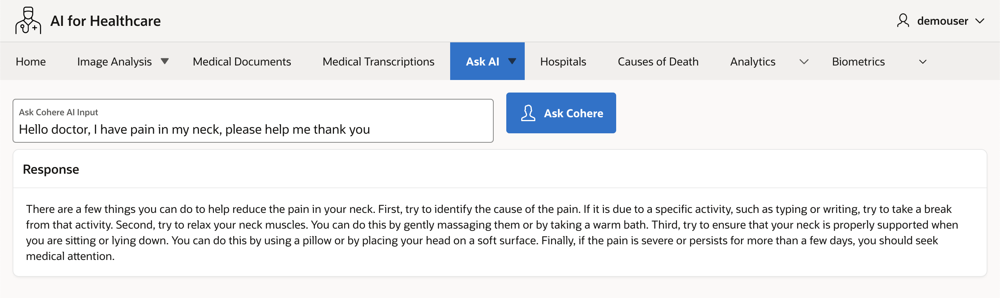 

## Task 3: Cohere Integration with OCI Speech AI
 
1. Create PL/SQL Dynamic Content, This will open Speech AI Job file, Extract the Voice to text converted content from the JSON file. feed this as Input to Cohere prompt and display results back from cohere.

    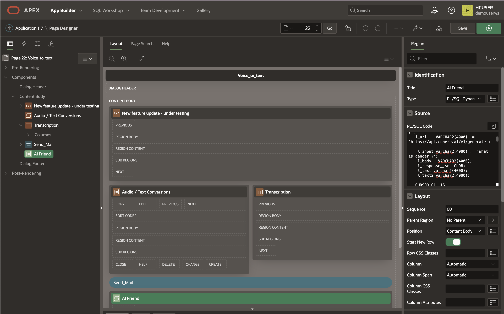
 
2. PL/SQL Code block
   
    ```sql
        <copy>
        DECLARE 
            l_response clob;
            l_http_status_code number;
            l_inputaudio varchar2(2000) := :P22_OBJ;
            l_filename varchar2(100) := :P22_FN;
            -- please check this URL will vary in your object storage settings
            l_spjob varchar2(2000) := 'https://objectstorage.us-phoenix-1.oraclecloud.com/n/tenancyname/b/bucketname/o/'||:P22_SPJOB||'bucketname_Input/'||:P22_FN||'.json';
            
            l_url    VARCHAR2(4000) := 'https://api.cohere.ai/v1/generate';  
        
            l_input varchar2(4000) := 'What is cancer?';
            l_body   VARCHAR2(4000); 
            l_response_json CLOB;
            l_text varchar2(4000);
            l_text2 varchar2(4000);

            CURSOR C1  IS 
                SELECT jt.* 
                FROM   JSON_TABLE(l_response, '$' 
                        COLUMNS (transcription VARCHAR2(2000)  PATH '$.transcriptions[0].transcription' )) jt; 
            
                CURSOR C2  IS 
                SELECT jt.* 
                FROM   JSON_TABLE(l_response_json, '$' 
                        COLUMNS (text VARCHAR2(2000)  PATH '$.generations[0].text' )) jt; 
            
                BEGIN  
                        apex_web_service.g_request_headers.delete(); 
                        apex_web_service.g_request_headers(1).name  := 'Content-Type'; 
                        apex_web_service.g_request_headers(1).value := 'application/json';  

                        l_response := apex_web_service.make_rest_request(    
                        p_url => l_spjob,
                        p_http_method => 'GET' 
                        ); 
                
                        l_http_status_code := apex_web_service.g_status_code; 
                        if l_http_status_code = 200 then 
                            apex_collection.create_or_truncate_collection( 'REST_COLLECTION' ); 
                            apex_collection.add_member( 
                                p_collection_name => 'REST_COLLECTION', 
                                p_clob001 =>         l_response  ); 
                        end if;     
                
                        For row_1 In C1 Loop
                        l_text := row_1.transcription; 
                        End Loop;
                
                    apex_web_service.g_request_headers(1).name := 'Content-Type';
                    apex_web_service.g_request_headers(1).value := 'application/json';
                    apex_web_service.g_request_headers(2).name := 'Authorization';
                    apex_web_service.g_request_headers(2).value := 'Bearer Your-Cohere-API-Key';
                
                    l_body  := '{
                        "model": "command",
                        "prompt": "'||l_text||'",
                        "max_tokens": 300,
                        "temperature": 0.9,
                        "k": 0,
                        "stop_sequences": [],
                        "return_likelihoods": "NONE"
                        }';

                    if l_text is not null then 

                    l_response_json := apex_web_service.make_rest_request( 
                        p_url => l_url, 
                        p_http_method => 'POST', 
                        p_body => l_body  
                    );

                    For row_2 In C2 Loop
                            l_text2 := row_2.text;
                            Htp.p(  '<b>AI Response </b>'|| l_text2 );  
                        End Loop;

                    end if; 

                END; 
        </copy>
        ```

3. 1st example of AI Input

    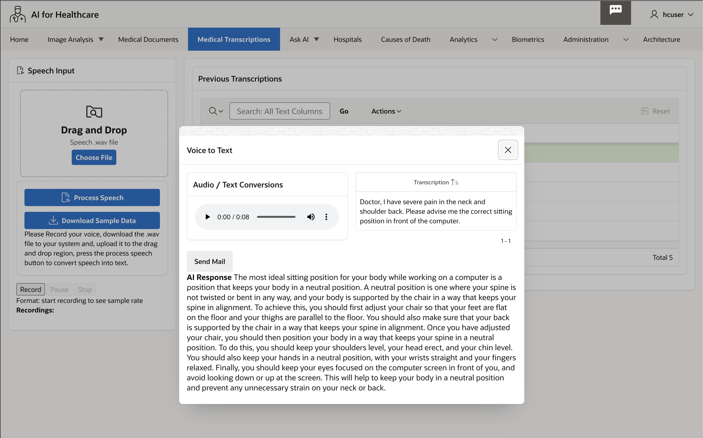

4. 2nd example of AI Input

    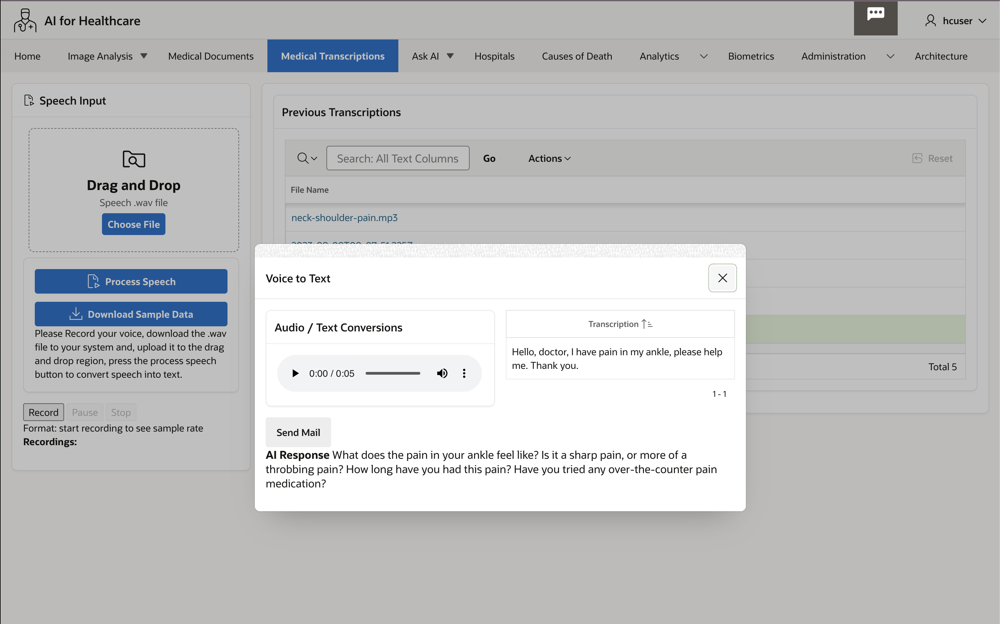
   
    > **Congratulations**, you have completed **OCI Speech with Cohere AI Integration** Lab. The subsequent labs are optional, however, please proceed to the next lab to learn more about **Setup Oracle Digital Assistant**. 

## Task 4: Oracle Generative AI - Playground

Optionally if you would like to use Oracle Generative AI instead of Cohere, please follow the tasks below. This is a 3 step process.

1. Log in to Oracle Cloud at cloud.oracle.com, change region to US Midwest Chicago
Under left navigation select Analytics and AI, under AI Services select Generative AI.

    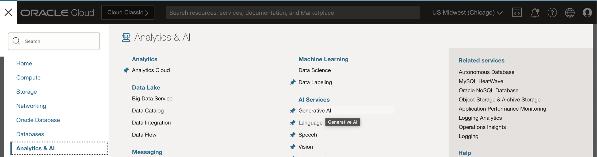

2. Click on playground in the left navigation and select the default settings ( Cohere model cohere.command v15.6), you can change the settings if required.

    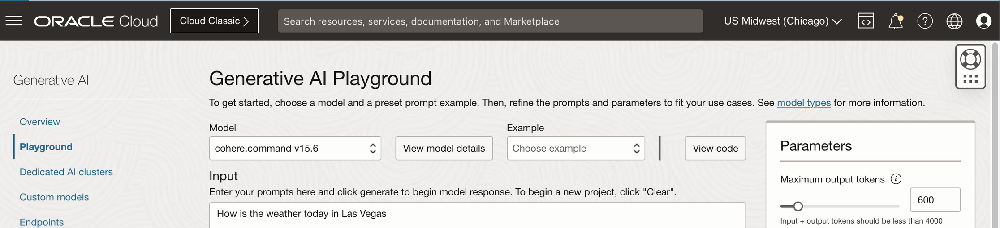
    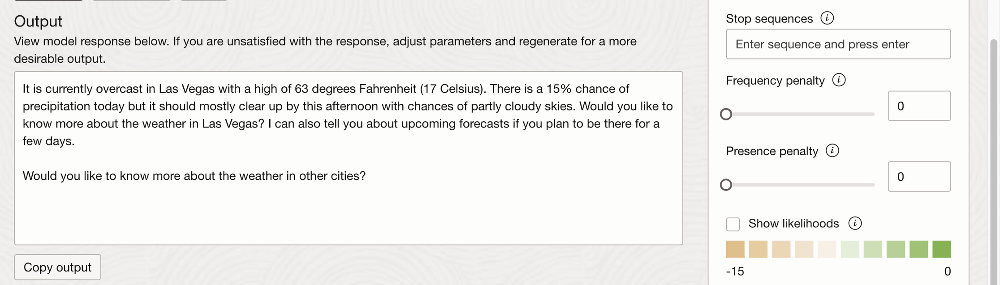

    ```
    <copy> 
    Input: How is the weather today in Las Vegas

    Output: It is currently overcast in Las Vegas with a high of 63 degrees Fahrenheit (17 Celsius). There is a 15% chance of precipitation today but it should mostly clear up by this afternoon with chances of partly cloudy skies. Would you like to know more about the weather in Las Vegas? I can also tell you about upcoming forecasts if you plan to be there for a few days.

    Would you like to know more about the weather in other cities?
    </copy>
    ```

    At this stage you can view Java or Python code in the console.

## Task 5: Oracle Generative AI with Oracle APEX

Running Generative AI Application inside Oracle APEX is a three step process.

* Create Web Credentials.
* Create Oracle APEX page 
* Create Process with PL/SQL code block.

We will see these steps in next few tasks.

## Task 6: Create Web Credentials

If you have already created web credentials then you can ignore this step, Oracle APEX Web Credentials provides a convenient and secure mechanism for storing the following types of credentials:

* Basic Authentication (Username & password)
* OAuth2 Client Credentials (Client ID & Client Secret)
* OCI Native Authentication (Access Oracle Cloud Resources, e.g., Object Storage)
* HTTP Header (The credential is added to the REST request as an HTTP Header)
* URL Query String (The credential is added to the URL of the REST request as a Query String Parameter).
  
1. In the APEX top navigation, Select App Builder, Click on Workspace Utilities

    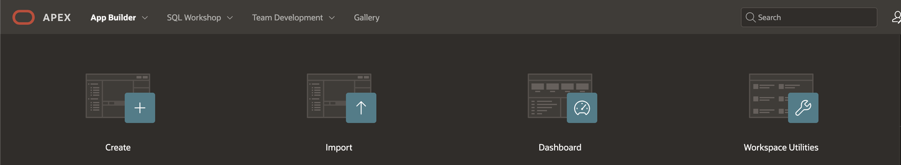

2. Select Web Credentials

    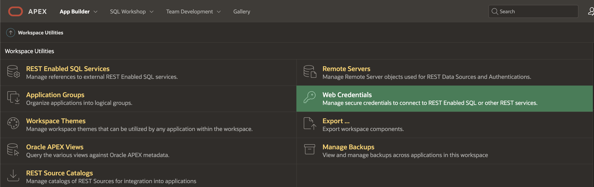

3. Click on Create

    

4. Provide User OCID, Tenancy OCID, Fingerprint, Private Key and Authentication type as Oracle Cloud Infrastructure. 
    
    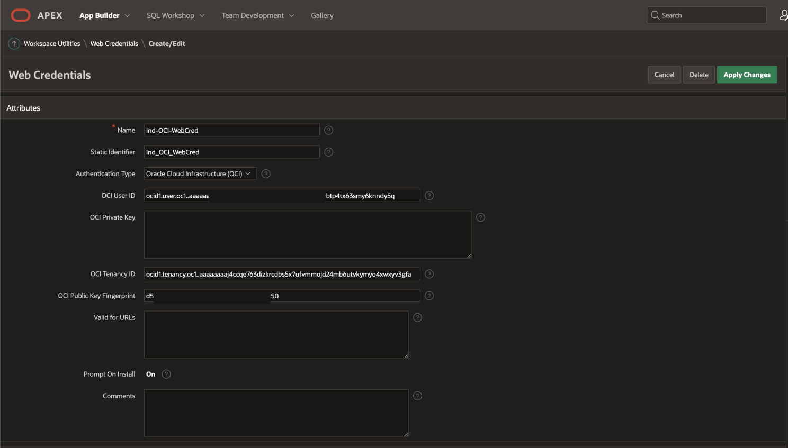

## Task 7: Create Oracle APEX page with following page items

1. This page will have the following APEX page items
   
    * AI\_INPUT -> Text field to accept user's input text
    * Button -> to call Generative AI REST Service using PL/SQL code block
    * AI\_OUTPUT -> Type Rich Text Editor to display AI response as output. under settings choose TinyMCE and format as Markdown
  
    Region and layout can be your own choice

## Task 8: PL/SQL code block process

1.  Under Processing Tab, Create a Process, Type will be Execute code, Source Language is PL/SQL code block.

    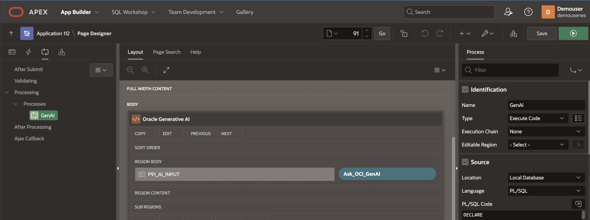

2. We would like to execute the code when the Button is Pressed, select the button by its name.

    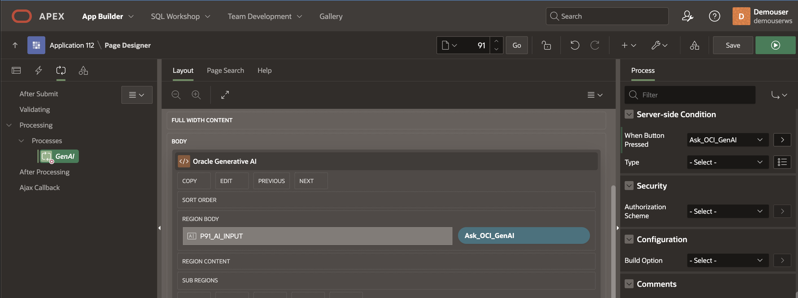

3. Copy paste this PL/SQL code block, you can also download it from my GitHub repo, replace your compartment id, credential name and page numbers in input and output APEX page items. 
   
    ```
    <copy> 
        -- PL/SQL code block to Generate AI Text from Oracle Generative AI service
        -- Author: Madhusudhan Rao
        -- Replace Compartment OCID, Web credentials and page number for APEX page items P91_AI_INPUT, P91_AI_OUTPUT
        ----------------------

        DECLARE
        
        l_genai_rest_url    VARCHAR2(4000) := 'https://inference.generativeai.us-chicago-1.oci.oraclecloud.com/20231130/actions/generateText'; 

        l_web_cred        CONSTANT VARCHAR2(50)   
        := '<Your_Web_Credentials>';   
        l_input varchar2(4000) := :P91_AI_INPUT;
        l_response_json CLOB;
        l_text varchar2(4000);
        
        -- Request payload JSON
            l_ocigabody varchar2(1000) := '{ 
                    "inferenceRequest": {
                            "runtimeType": "COHERE",
                            "prompt": "'||l_input||'",
                            "maxTokens": 500,
                            "numGenerations": 1,
                            "returnLikelihoods": "GENERATION",
                            "isStream": false
                    }, 
                    "servingMode": { 
                        "servingType": "ON_DEMAND",
                        "modelId": "cohere.command-light"
                    }, 
                    "compartmentId": "<Your-Compartment-OCID>"
            }';

        -- Cursor for Response Payload 
        CURSOR C1  IS 
                    SELECT jt.* 
                    FROM   JSON_TABLE(l_response_json, '$' 
                            COLUMNS (text VARCHAR2(4000)  PATH '$.inferenceResponse[0].generatedTexts[0].text' )) jt; 

        BEGIN

        if l_input is not null then

                apex_web_service.g_request_headers.DELETE; 
                apex_web_service.g_request_headers(1).name  := 'Content-Type'; 
                apex_web_service.g_request_headers(1).value := 'application/json';  

                l_response_json := apex_web_service.make_rest_request 
                (p_url                  => l_genai_rest_url, 
                    p_http_method          => 'POST', 
                    p_body                 => l_ocigabody, 
                    p_credential_static_id => l_web_cred); 

            For row_1 In C1 Loop
                l_text := row_1.text; 
                    -- Display AI Response
                    :P91_AI_OUTPUT := l_text; 
            End Loop;

            end if;

        END;
    </copy>
    ``` 
4. Few important request parameters
   
   * Tokens: A token is a word, part of a word, or a punctuation. For example, apple is a token and friendship is made up of two tokens, friend and ship.  
   * Temperature:How random to generate the output text. To generate the same output for a prompt every time you run that prompt, use 0. To generate a random new text for that prompt, increase the temperature. Default temperature is 1
   * Likelihood: In a large language model's output, how likely it would be for a token to follow the current generated token. When a large language model generates a new token for the output text, a likelihood is assigned to all tokens, where tokens with higher likelihoods are more likely to follow the current token. 

## Task 9: Run the page by pressing the Green button

1. Run the Oracle APEX Page by clicking on Green button as shown.

    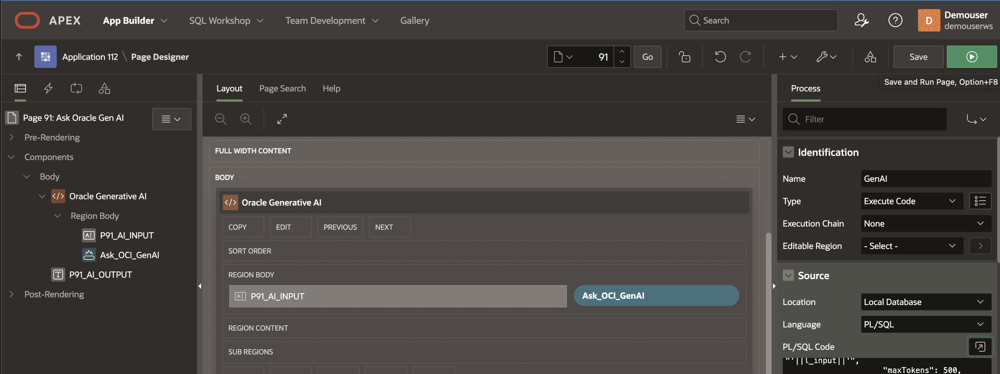

## Task 10: Generative AI responses to various input Prompts 

1. We can observe various response from Generative AI based on different input prompts 

    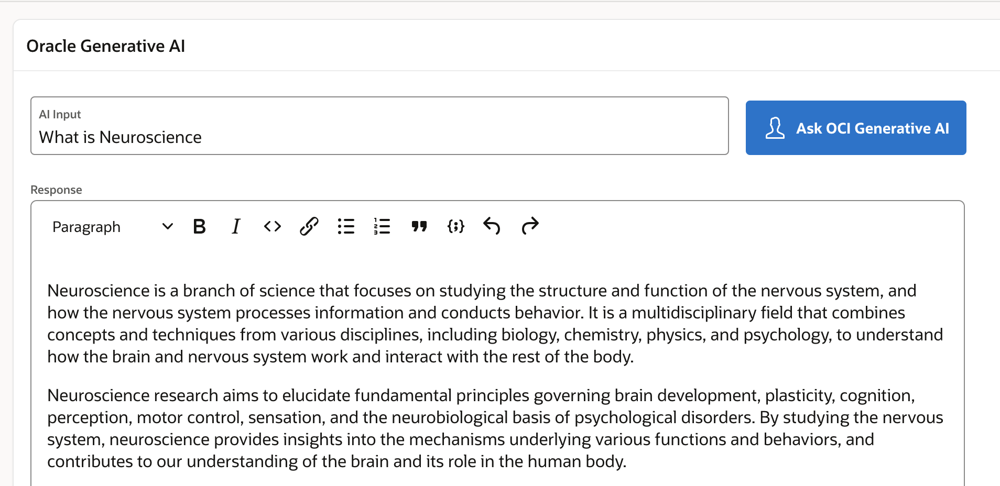

2. Writing Email

    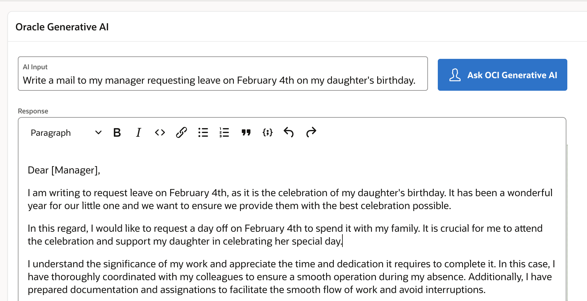

3. Writing Code

    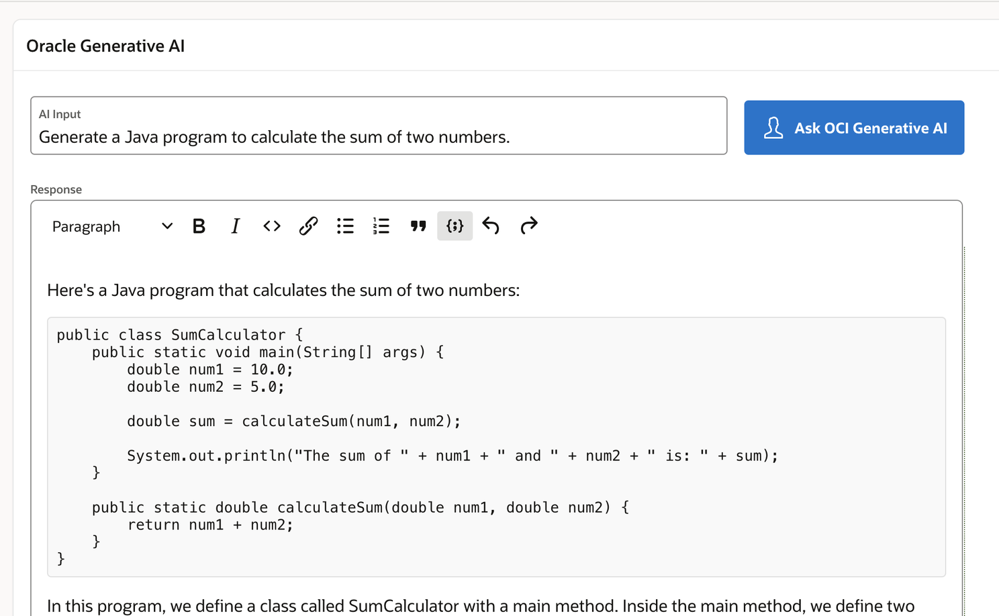

4. Writing Documentary

    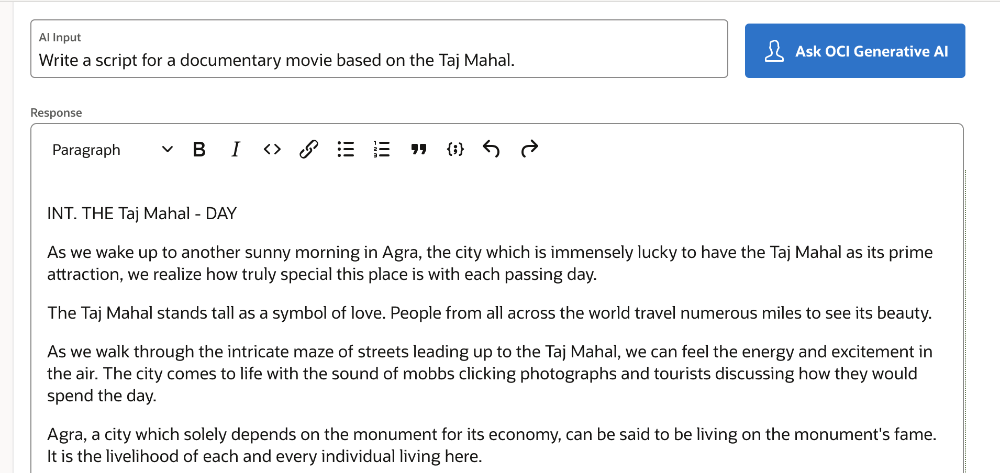

5. Generating SQL

    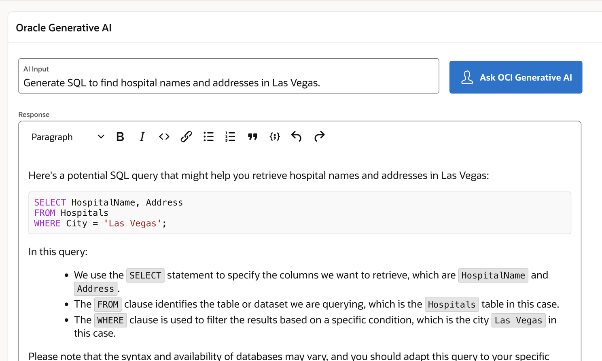

6. Generating responses to other languages for example Simplified Chinese input as shown below.  

    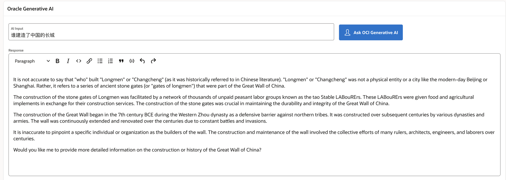

## Learn More
  
* [JSON Developer Guide](https://docs.oracle.com/en/database/oracle/oracle-database/19/adjsn/function-JSON_TABLE.html#GUID-0172660F-CE29-4765-BF2C-C405BDE8369A)
* [Oracle to Deliver Powerful and Secure Generative AI Services for Business](https://www.oracle.com/in/news/announcement/oracle-to-deliver-powerful-and-secure-generative-ai-service-for-business-2023-06-13/)
* [Concepts for Generative AI](https://docs.oracle.com/en-us/iaas/Content/generative-ai/concepts.htm) 
* [How to build intelligent applications using Oracle Generative AI and Oracle APEX](https://www.linkedin.com/pulse/how-build-intelligent-apps-oracle-generative-ai-apex-madhusudhan-rao-z423f)

## Acknowledgements
* **Author** - Madhusudhan Rao B M, Principal Product Manager, Oracle Database
* **Last Updated By/Date** - May 23rd, 2023.