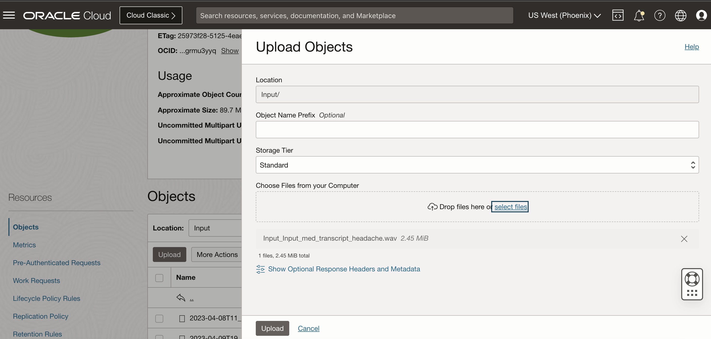
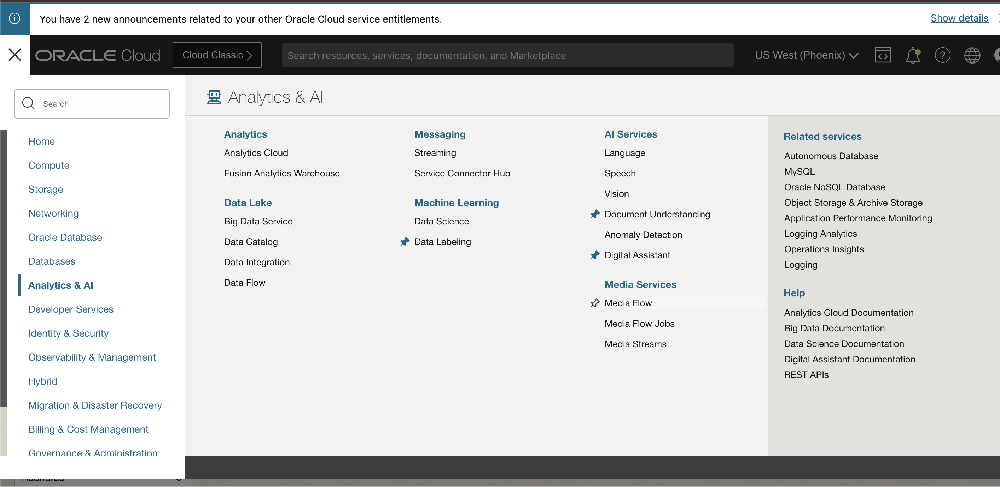
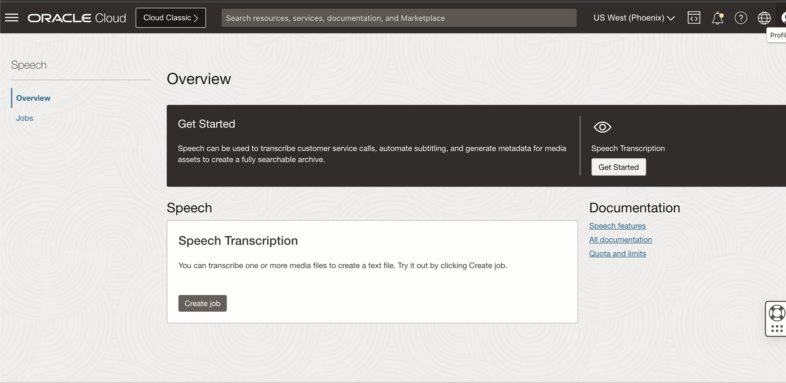
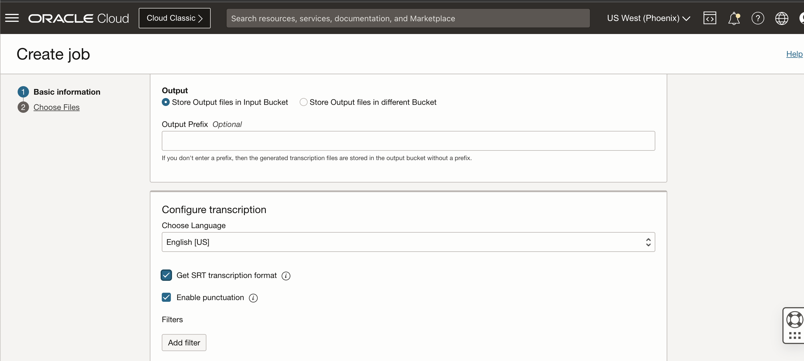
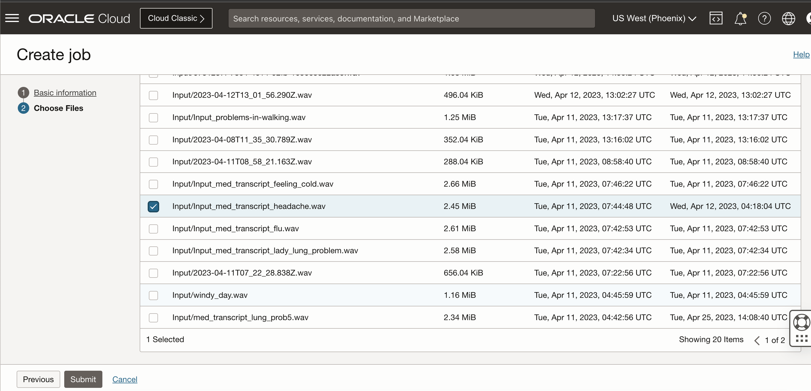
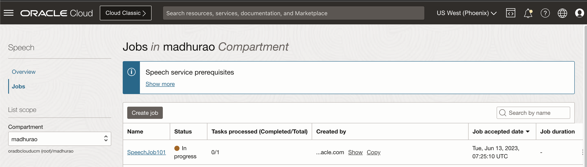
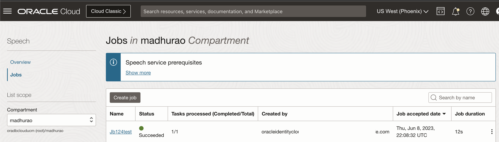
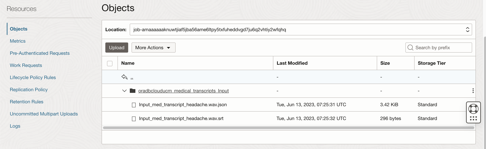
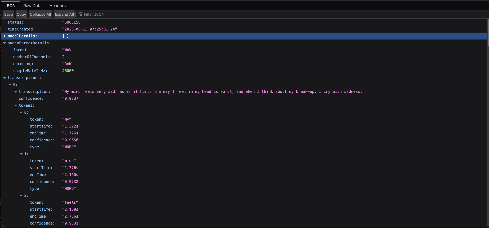

# Create an Image Library to Detect Breast Cancer

## Introduction

This lab walks you through organising an image library in OCI Object Storage. You will load images to Object Storage directly from your laptop using OCI CLI. There are other options to upload images to object storage, such as using OCI Cloud Shell.
 
Estimated time: 30 minutes

### About OCI Object Storage

OCI Object Storage service is an internet-scale, high-performance storage platform that offers reliable and cost-efficient data durability. The Object Storage service can store an unlimited amount of unstructured data of any content type, including analytic data and rich content, like images and videos.

### Objectives

In this lab, you will:
 
* Generate Audio File
* Upload Audio file to OCI Bucket 
* Create Speech Transcription Job
* Review Transcription Job Output in JSON and .SRT files

### Prerequisites

This lab assumes you have:

* Completed **Setup environment** and **Setup OCI CLI** lab and already logged into OCI console

## Task 1: Generate Audio File (.wav or .mp3 format)  

1. Use tools such as [Audacity](https://www.audacityteam.org/download/) or Apple QuickTime Player to convert your Audio into .wav or .mp3 files; alternatively, you can also download Audio files from any external sources. 

    
 
## Task 2: Upload Audio file to OCI Bucket

1. On cloud.oracle.com, Navigate to the bucket where you wish to upload the input audio files, select a folder under that bucket, and click the upload button.

    

2. Browse and upload file from your local file system.

    

## Task 3: Create Speech Transcription Job

1. On cloud.oracle.com, Navigate to Analytics & AI, and Select Speech under AI Services
 
    

2. Review the overview tab, and go through the Oracle Documentation links. 

    

3. Click on Jobs and provide basic information. 

    

4. You can also provide a prefix to optional output folder under the selected Bucket.

    

5. Choose OCI Bucket and then select the file which was uploaded. Click on the Submit button.

    

6. The speech transcription job will change from creating status to active status within few seconds.
 
    

    

## Task 4: Review Transcription Job Output in JSON and .SRT files

1. Click on the Active Speech Job for more details.

    

2. Click on Output Bucket

    

3. Download the JSON Output Object

    

    Open the JSON file in a browser like Firefox or any notepad, review the JSON structure.

    

4. Rename the .srt to .txt file and open it in any text editor.

    
 

This concludes this lab. You can **proceed now to the next lab**.

## Learn More

[Speech Transcription Jobs](https://docs.oracle.com/en-us/iaas/Content/speech/using/create-trans-job.htm) 
 
## Acknowledgements

* **Author** - Madhusudhan Rao B M, Principal Product Manager, Oracle Database
* **Last Updated By/Date** - May 23rd, 2023.