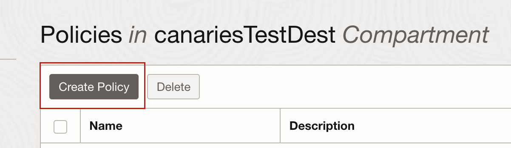
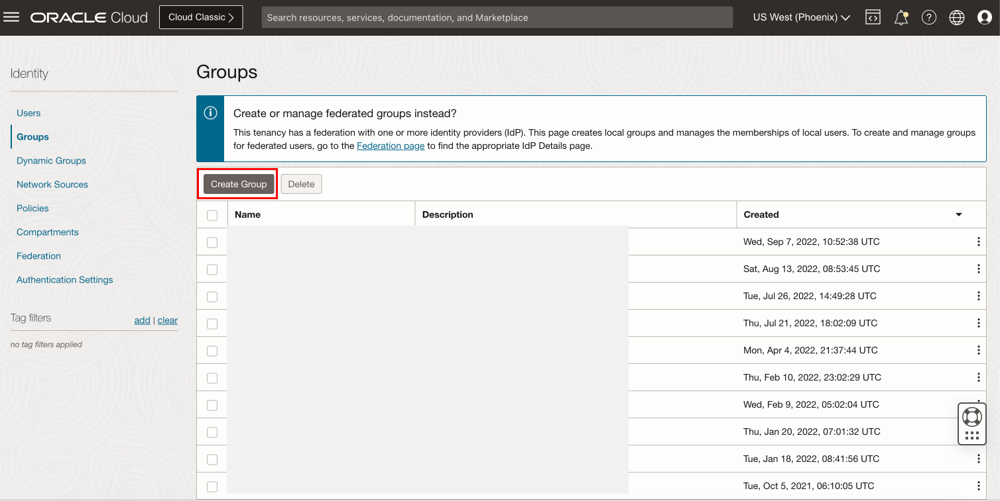
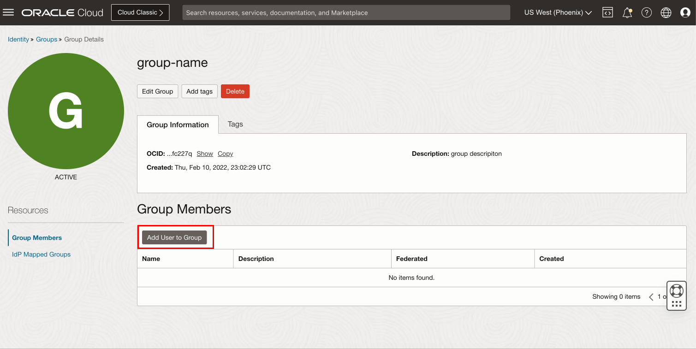
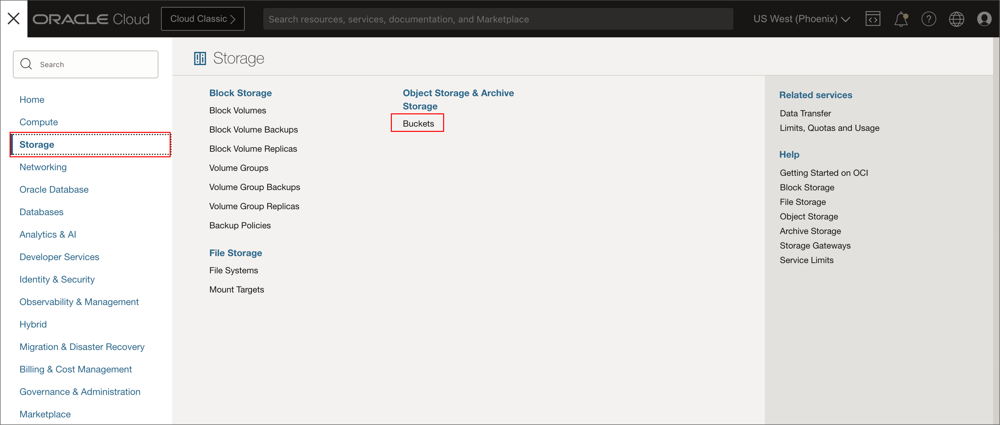
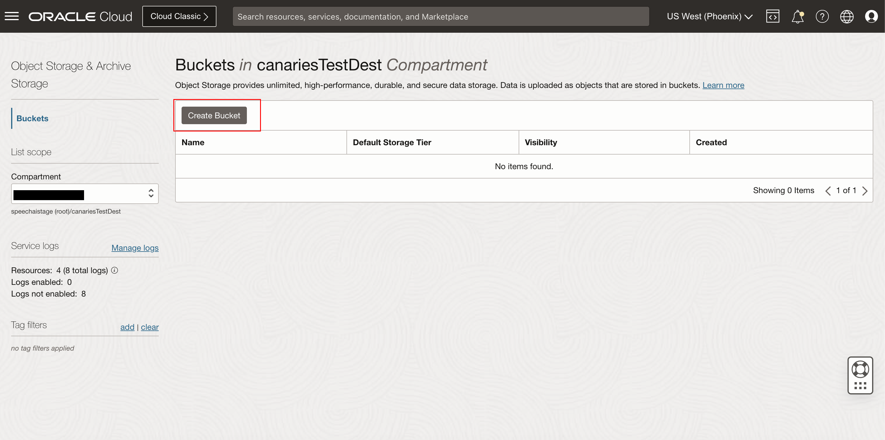

# Setup Policies and Create Bucket

## Introduction

In this session, we will help users get familiar with OCI Speech and teach them how to use our services via the cloud console.

Estimated Lab Time: 10-15 minutes

### Objectives

In this lab, you will:

- Setup OCI Speech Policies.
- Create OCI Bucket. 

### Prerequisites:

- A Free tier or paid tenancy account in OCI (Oracle Cloud Infrastructure)
- Tenancy is whitelisted to be able to use OCI Speech

## Task 1: Log into OCI

1. Login into OCI

    To setup environment, you need OCI administrator's privileges. If you've got these privileges, login into OCI at [cloud.oracle.com](https://www.oracle.com/cloud/sign-in.html). the below image indicates SSO Login as an administrative user. If you have administrative previleges and complete access over a tenancy then you need not create any of the policies below steps.

    

    If you do not have administrative privileges into tenancy, you might have to login as federated user, that is the user created by the administrator

    

    In case you haven't got OCI administrator's privileges, you should ask your OCI administrator to perform the rest of the tasks in this lab.

## Task 2: Create a new compartment

You will use one compartment for all required objects in this workshop, hence you need to create one.

1. Navigate to Compartments page

    In OCI console, open the **Navigator** menu. Navigate to **Identity & Security** and then choose **Compartments**.

    

2. Create a new compartment

    The list of all active compartments is displayed. Click **Create Compartment** to start creating a new compartment.

    

3. Review compartment details

    Make note of compartment OCID

    

## Task 3: Policy setup

Before you start using OCI Speech, your tenancy administrator should set up the following policies by following below steps:

1. Navigate to Policies

    Log into OCI Cloud Console. Using the Burger Menu on the top left corner, navigate to Identity & Security and click it, and then select Policies item under Identity.
        

2. Create Policy

    Click "Create Policy
        

3. Create a new policy with the following statements:

    If you want to allow all the users in your tenancy to use speech service, create a new policy with the below statement:
        ```
        <copy>
        allow any-user to manage ai-service-speech-family in tenancy
        allow any-user to manage object-family in tenancy
        allow any-user to read tag-namespaces in tenancy
        allow any-user to use ons-family in tenancy
        allow any-user to manage cloudevents-rules in tenancy
        allow any-user to use virtual-network-family in tenancy
        allow any-user to manage function-family in tenancy
        </copy>
        ```
        

    If you want to limit access to a user group, first create a group

    Navigate to OCI groups:
        

    Click "Create Group"
        

    Add group name and description, click create
        

    To add users click "Add User to Group" and select user from dialog
        

    Create a new policy with the below statement:
        ```
        <copy>
        allow group group-name to manage ai-service-speech-family in tenancy
        allow group group-name to manage object-family in tenancy
        allow group group-name to read tag-namespaces in tenancy
        allow group group-name to use ons-family in tenancy
        allow group group-name to manage cloudevents-rules in tenancy
        allow group group-name to use virtual-network-family in tenancy
        allow group group-name to manage function-family in tenancy
        </copy>
        ```
        

## Task 4: Create OCI Bucket
  
You need to upload the audio files into Oracle object storage, to be used in the transcription job(s) in next steps.

1. Create an Object Storage Bucket (This step is optional in case the bucket is already created)

    First, From the OCI Services menu, click Object Storage.
    

    Then, Select Compartment from the left dropdown menu. Choose the compartment matching your name or company name.
    

    Next click Create Bucket.
    

    Next, fill out the dialog box:
    * Bucket Name: Provide a name <br/>
    * Storage Tier: STANDARD

    Then click Create
    
  
Congratulations on completing this lab!

You may now **proceed to the next lab**

## Learn More

[OCI Speech Policies](https://docs.oracle.com/en-us/iaas/Content/speech/using/policies.htm)

[OCI Object Storage](https://docs.oracle.com/en-us/iaas/Content/Object/Concepts/objectstorageoverview.htm)