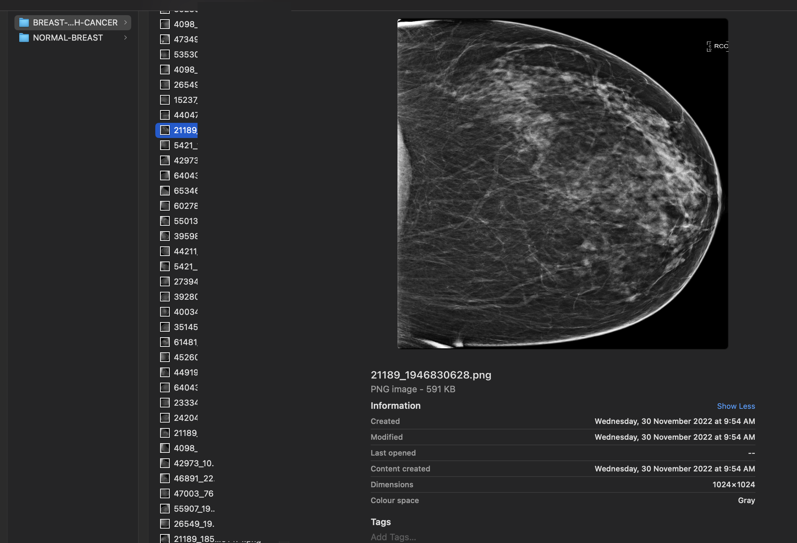

# Create Image Library to Detect Breast Cancer

## Introduction

This lab walks you through organising an image library in OCI Object Storage. You will load images to Object Storage directly from your laptop using OCI CLI. There are other options to upload images to object storage, such as using OCI Cloud Shell.

[Youtube video on Create Image Library](youtube:Y3xsaFSwRmA:large)

Estimated time: 30 minutes

### About OCI Object Storage

OCI Object Storage service is an internet-scale, high-performance storage platform that offers reliable and cost-efficient data durability. The Object Storage service can store an unlimited amount of unstructured data of any content type, including analytic data and rich content, like images and videos.

### Objectives

In this lab, you will:
 
* Data Preparation by Classifying Images. 
* Load images to Object Storage using OCI CLI
* Verify images are correctly loaded

### Prerequisites

This lab assumes you have:

* Completed **Setup environment** and **Setup OCI CLI** lab and already logged into OCI console

## Task 1: Data Preparation by Classifying Images. 

1. Create folder **XRayBreastCancer** under this, create two folders **NORMAL\_BREAST** and **BREAST\_WITH\_CANCER**, and place the files in their respective folder

2. Images with Breast Cancer

    

3. Images with Normal Breast

    

    > **Note:** From Google search, look for *Breast Cancer Detection Dataset* and download from any of your favourite data sources or bring your own data.
 
## Task 2: Load images to Object Storage using OCI CLI

1. Upload images from main folder into OCI Object storage, subfolders will be automatically created

    ```text
    <copy>oci os object bulk-upload --namespace < namespace > -bn < bucket_name > --src-dir < local folder > --overwrite --content-type 'image/*'</copy>
    ```

2. Replace namespace, bucket_name and local folder as per your settings, for example

    ```text
    <copy>oci os object bulk-upload --namespace mytenancyname -bn X-Rays-BreastCancer-for-Training --src-dir /Users/myuser/XRayBreastCancer --overwrite --content-type 'image/*'</copy>
    ```
 
## Task 3: Verify images are correctly loaded

1. You can now verify the objects in the bucket by using OCI CLI or just by accessing the bucket in the OCI console. delete any hidden files like .DS files which get uploaded if you are using macOS

    ```text
    <copy>oci os object list --namespace <object_storage_namespace> --bucket-name <bucket_name></copy>
    ```

2. On OCI Console under Bucket that you have created, you can view the newly created folders and files

    
 
This concludes this lab. You can **proceed now to the next lab**.

## Learn More

* [OCI Object Storage](https://docs.oracle.com/en-us/iaas/Content/Object/home.htm)
* [OCI CLI Command Reference](https://docs.oracle.com/en-us/iaas/tools/oci-cli/3.22.3/oci_cli_docs/oci.html)
 
## Acknowledgements

* **Author** - Madhusudhan Rao B M, Principal Product Manager, Oracle Database
* **Last Updated By/Date** - May 23rd, 2023.