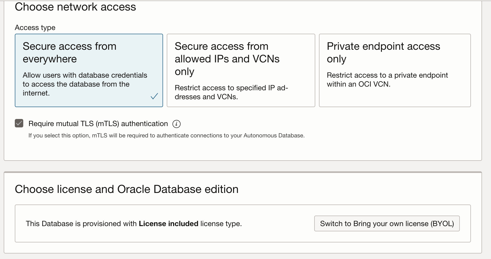
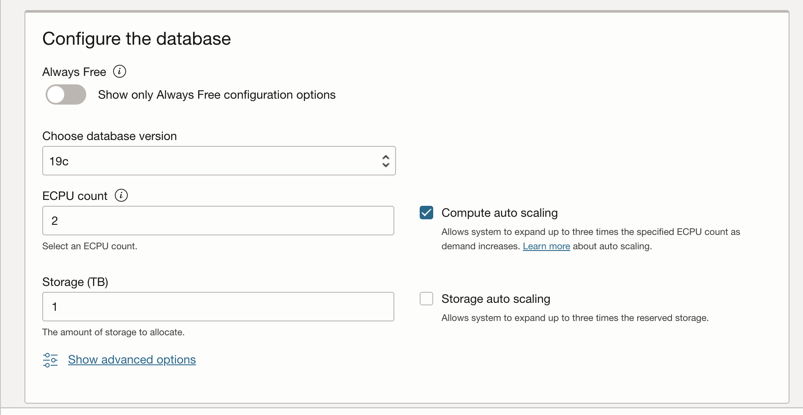
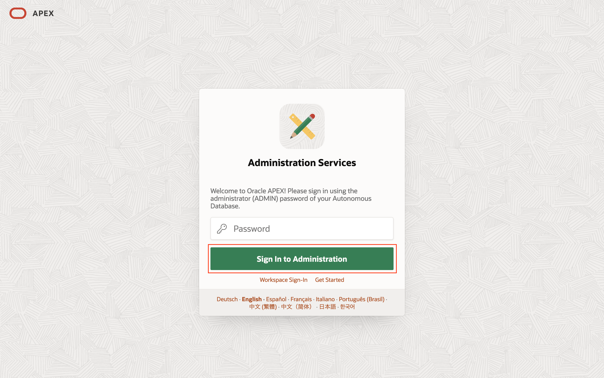
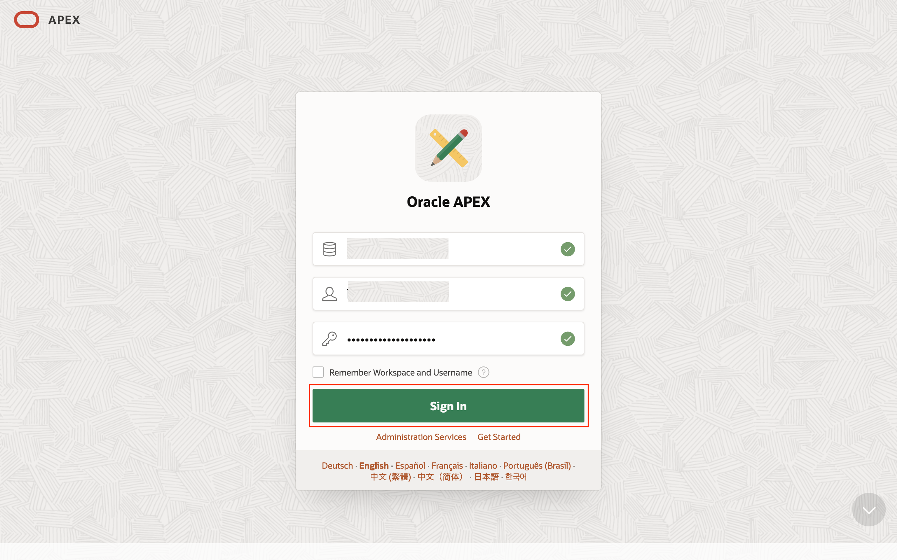
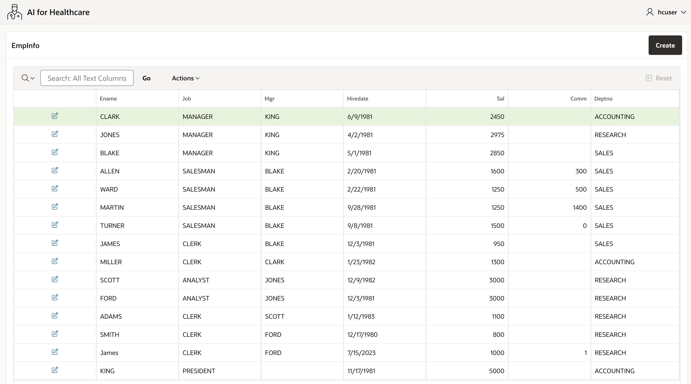
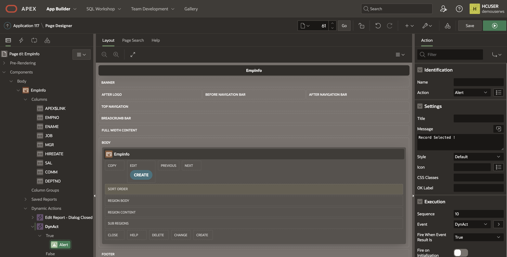
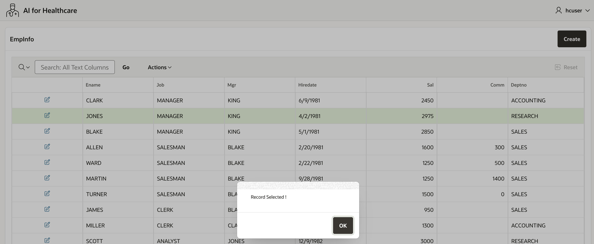
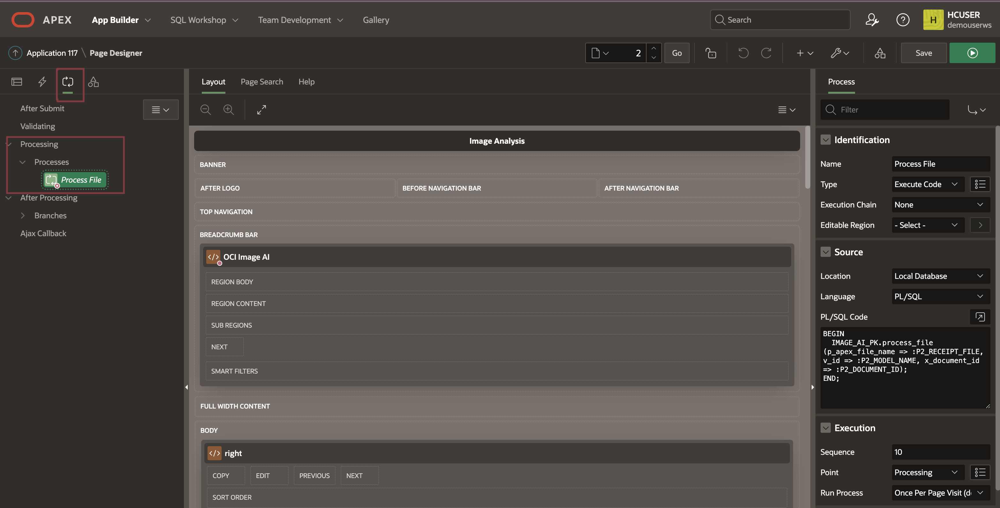

# Provision Autonomous Database and Connect Using SQL Worksheet

## Introduction

This lab walks you through the steps to quickly provision an Oracle Autonomous Database on Oracle Cloud. You will use this database in subsequent labs of this workshop. In this lab, you will then connect to the database using SQL Worksheet, a browser-based tool that is easily accessible from the Autonomous Data Warehouse.

<!-- [](youtube:a6Jm7lYaCWI) -->

Estimated lab time: 15 minutes

### Objectives

-   Provision a new Autonomous Data Warehouse
-   Learn how to connect to your new autonomous database using SQL Worksheet


### Prerequisites

-   This lab requires completion of the **Get Started** section in the Contents menu on the left.  


## Task 1: Choose ADW from the Services Menu

1. Log in to the Oracle Cloud.
2. Once you are logged in, you are taken to the cloud services dashboard where you can see all the services available to you. Click the navigation menu in the upper left to show top level navigation choices. 

3. Click on **Oracle Database** > **Autonomous Data Warehouse**.

    

    Select the compartment where you have access to create or use an Oracle Autonomous Database Instance. 

    Click on **Create Autonomous Database** button

    


    > Note: Avoid the use of the **ManagedCompartmentforPaaS** compartment as this is an Oracle default used for Oracle Platform Services.
 
    
## Task 2: Create the Autonomous Database Instance
 
1.  This brings up the __Create Autonomous Database__ screen where you will specify the configuration of the instance.
2. Provide basic information for the autonomous database:
  
    - __Display Name__ - Enter a memorable name for the database for display purposes. For this lab, use __FirstName LastName__ example (John Smith).
    - __Database Name__ - Use letters and numbers only, starting with a letter. Maximum length is 14 characters. (Underscores not initially supported.) For this lab, use __YOURNAME__ example (JOHNSMITH). 
    - __Choose a compartment__ - Select a compartment for the database from the drop-down list.

    

3. Choose a workload type. Select the workload type for your database from the choices:

    - __Data Warehouse__ - For this lab, choose __Data Warehouse__ as the workload type.
    - __Transaction Processing__ - Alternately, you could have chosen Transaction Processing as the workload type. 
    - __Deployment Type__ - For this lab, choose __Serverless__ as the deployment type.
    - __Dedicated Infrastructure__ - Alternately, you could have chosen Dedicated Infrastructure as the workload type.

    

    <b>Choose the Data Warehouse as workload type for this course.  Do not choose one of the others. Each student is only allowed 2 ECPU instance for ADW (depending upon the resources available for this lab).</b>
 
  
    <if type="freetier">
    Choose database version: Select **19c** for the database version from this drop-down list.

    
    </if>
    <if type="freetier23ai">   
    Choose database version: Select **23ai** for the database version from this drop-down list.

    
    </if>
  
- __ECPU count (2)__ - Leave default.
- __Storage (TB)__ - Leave default.
- __Storage auto scaling__ (off) - Leave default. 

## Task 3: Advanced Options

1. Under the **Advanced Options** select **Edit License selection** 

    

    Under Advanced Options choose a license type. For this lab, choose **Bring Your Own License** (BYOL) enabled.
  
2. Create administrator credentials: 
 
     

    > Note: __Password and Confirm Password__ - Specify the password for ADMIN user of the service instance.
    - The password must meet the following requirements:
    - The password must be between 12 and 30 characters long and must include at least one uppercase letter, one lowercase letter, and one numeric character.
    - The password cannot contain the username.
    - The password cannot contain the double quote (") character.
    - The password must be different from the last 4 passwords used.
    - The password must not be the same password that is set less than 24 hours ago.
    - Re-enter the password to confirm it. Make a note of this password.

3. Backup

    - __Backup retention__ - Leave default. 
  
    

    
4. Choose network access:
    - For this lab, accept the default, **Secure access from everywhere**.
   
    

5. In the Contacts for operational notifications and announcements section, provide a contact email address. The Contact email field allows you to list contacts to receive operational notices and announcements as well as unplanned maintenance notifications.

    

6.  Click **Create**.
 
7.    Your instance will begin provisioning. In a few minutes the state will turn from Provisioning to Available. At this point, your Autonomous Data Warehouse database is ready to use! Have a look at your instance's details here including its name, database version, CPU count and storage size.
   
    

8. A Check database lifecycle state informational box is displayed. You can navigate through this tour or choose to skip it. Click Skip tour. A Skip guided tour dialog box is displayed. Click Skip.

    In a few minutes, the instance status changes to Available. At this point, your Autonomous Data Warehouse database instance is ready to use! Review your instance's details including its name, database version, ECPU count, and storage size.

    

> Note: In the following screen sample, the database display name is Training-Database and the database name is TrainingDatabase. In your example, your database display name and database name might be different.

## Task 4: Navigate to Database Actions

1. Navigate to the **Autonomous Database details** page of the Autonomous Database instance that you provisioned earlier. Click the **Database actions** drop-down list, and then select **View all database actions** or **SQL**.

    

## Task 5: Connect with SQL Worksheet

Although you can connect to your autonomous database from local PC desktop tools like Oracle SQL Developer, you can conveniently access the browser-based SQL Worksheet directly from your Autonomous Data Warehouse or Autonomous Transaction Processing console.

1. From the **Database Actions** tool, navigate to the SQL Worksheet. Click the **Selector** menu. In the **Development** section, click **SQL**.

    

    The SQL Worksheet is displayed. The first time you access the SQL Worksheet, informational boxes are displayed. Click the X icons to close those boxes. You can also click the **Collapse** icon to increase the worksheet area.

    
 
2. Learn more about the SQL Worksheet features using the tooltips when you hover over an icon. You will run queries by entering your commands in the worksheet. Click the **Run Statement** icon to run the command and view the output in the Query Result tab in tabular format. Click the Run Script icon to run a script and display the output in the Script Output tab in text format. You can clear your worksheet by clicking the trash icon.

    

3. The first time you open SQL Worksheet, a series of pop-up informational boxes introduce you to the main features. Click **Next** to take a tour through the informational boxes.
 

## Task 6: Run scripts in SQL Worksheet

Run a query on a sample Oracle Autonomous Database data set.

1. Copy and paste the code snippet below to your SQL Worksheet. One of the two ADW sample data sets that you can access from any ADW instance. Take a moment to examine the script. Make sure you click the Run Statement button to run it in SQL Worksheet so that all the rows display on the screen.
  
        <copy>
        select sysdate from dual; 
        </copy>

    

        <copy>
        select /* low */ c_city,c_region,count(*)
        from ssb.customer c_low
        group by c_region, c_city
        order by count(*);
        </copy>

    

2. Take a look at the output response from your Autonomous Data Warehouse.

3. When possible, ADW also caches the results of a query for you.  If you run identical queries more than once, you will notice a much shorter response time when your results have been cached.

4. You can find more sample queries to run in the <a href="https://www.oracle.com/autonomous-database/autonomous-data-warehouse/">ADW documentation.</a>
<!-- 
## Introduction

Learn how to provision Autonomous Database using the OCI console.

Estimated Time: 5 minutes

### Objectives

In this lab, you will:

- Learn how to provision a new Oracle Autonomous Database
- Learn some of the important Oracle APEX How to's (This is Optional)

### Prerequisites

- This lab requires completion of the Get Started section in the Contents menu on the left.

## Task 1: Create or select a compartment
 
A compartment is a collection of cloud assets, like compute instances, load balancers, databases, and so on. By default, a root compartment was created for you when you created your tenancy (for example, when you registered for the trial account). It is possible to create everything in the root compartment, but Oracle recommends that you create sub-compartments to help manage your resources more efficiently.

If you are using an Oracle LiveLabs-provided sandbox, you don't have privileges to create a compartment and should skip this first task. Oracle LiveLabs has already created a compartment for you and you should use that one. Even though you can't create a compartment, you can review the steps below to see how it is done.

> **Note:**  If you already have a compartment created, you can **optionally skip this Task**.


1. Click the three-line menu on the top left of the console. Scroll down to the bottom of the menu, click **Identity & Security -> Compartments**.

    

    Then, click the **Create Compartment** button to create a sub-compartment.

    

2. Give the compartment a name and description. Be sure your root compartment appears as the parent compartment. Press the blue **Create Compartment** button.

    

    The compartment is created and you can use it for your cloud services!

## Task 2: Choose Autonomous Database from the services menu

1. Log in to the Oracle Cloud.
2. Once you log in, the cloud services dashboard shows all the services available to you. Click the **navigation menu** in the upper left to show top-level navigation choices.

3. This lab shows the provisioning of an Autonomous Data Warehouse database. Click on **Oracle Database**, then select **Autonomous Data Warehouse**.

    


4. Make sure your Workload Type is __Data Warehouse__ or __All__ to see your Autonomous Data Warehouse instances. Use the __List Scope__ drop-down menu to select a compartment. <if type="livelabs">Enter the first part of your user name, for example `LL185` in the Search Compartments field to quickly locate your compartment.
 
    <if type="freetier">
    

    > **Note:** Avoid using the `ManagedCompartmentforPaaS` compartment, as this is an Oracle default used for Oracle Platform Services.
   </if>

5. This console shows that no databases yet exist. If there were a long list of databases, you could filter the list by the **State** of the databases (Available, Stopped, Terminated). You can also sort by __Workload Type__. In this example, __Data Warehouse__ is the workload type.

    

<if type="freetier">
1. You can see your current default **region** in the top right-hand corner of the page.
    
</if>

## Task 3: Create the Oracle Autonomous Database instance

1. Click **Create Autonomous Database** to start the instance creation process.

    

2.  This brings up the __Create Autonomous Database__ screen, where you will specify the instance's configuration.

3. Specify basic information for the Autonomous Database:

    - __Compartment__ - Leave the default compartment.
    - __Display Name__ - Enter a memorable name for the database for display purposes. For example, use __DEMO\_ADW__.
    - __Database Name__ - Use letters and numbers only, starting with a letter. The maximum length is 30 characters.  
    <if type="freetier">
         
    </if>
    - __Workload Type__ - For this lab, choose __Data Warehouse__ as the workload type.
    - __Deployment Type__ - For this lab, choose __Serverless__ as the deployment type.
      
    - __Always Free__ - For this lab, we will leave Always Free **unchecked**.
    - __Choose database version__ - Select a database version **19c** from the available versions.
    - **Choose network access**: For this lab, accept the default, **Secure access from everywhere**.
    

    <if type="freetier">
    Choose a license type. For this lab, choose __License Included__. The two license types are:
    </if> 

    - __Bring Your Own License (BYOL)__ - Select this type when your organization has existing database licenses. [learn more](https://www.oracle.com/cloud/pricing/)
    - __License Included__ - Select this type when you want to subscribe to new database software licenses and the database cloud service.
    - __Oracle Database Edition__ - Select __Oracle Database Enterprise Edition__. This option is available only if you have selected __Bring Your Own License (BYOL)__

4. Configure the database:
 
    - __ECPU count__ - Number of ECPU for your service. For this lab, specify __2 ECPU__.  
    - __Storage (TB)__ - Select your storage capacity in terabytes. For this lab, specify __1 TB__ of storage.  
    - __Auto Scaling__ - Auto Scaling - For this lab, keep auto-scaling **unchecked**. If autoscaling is enabled, the system will automatically use up to three times more CPU and IO resources to meet workload demand. learn more about [auto scaling](https://docs.oracle.com/en/cloud/paas/autonomous-database/adbsa/autonomous-auto-scale.html)
 
        
  
        Backup retention period, default to 60 days.

        Create administrator credentials:

        

    - __Password and Confirm Password__ - Specify the password for the **ADMIN** user of the service instance.  
    - Autonomous Database requires strong passwords.
  
1. The **Contact Email** field allows you to list contacts to receive operational notices and announcements as well as unplanned maintenance notifications. This is optional.

    
 
    Click on __Create Autonomous Database__. button

    

2.   Your instance will begin provisioning. In a few minutes, the State will turn from Provisioning to Available. At this point, your Autonomous Data Warehouse database is ready to use! Have a look at your instance's details here, including its name, database version, OCPU count, and storage size.

    

    
 

## Task 4: Access Database Actions run SQL queries 

1. From Database Actions menu we can run common tasks such as running SQL queries, Data Modeler, REST API development etc.  

    Click the **Database Actions** button.

    

    

    Select the **SQL** tab to open the **SQL worksheet**.

     -->
     
## Task 7: How to create an Oracle APEX Workspace

1. Once the Autonomous Database has been fully provisioned, return to the *Autonomous Database* page, locate the instance's display name, and then click on it to view the ADB's details page. Click the *Tools* tab. 
2. Click the *Copy* button to copy the URL to launch the Oracle APEX development environment. Open the link in a new browser window or tab.

3. For new Autonomous Database instances, this should launch the **Administration Services** login screen. Enter the password for the *admin* user and click the **Sign In to Administration** button.

4. Again, for new Autonomous Database instances, after a successful login, the browser will redirect to the page shown below. Click the **Create Workspace** button.

5. Click and select the **New Schema** option.

1. Enter the desired **Workspace Name** and **Workspace Username**. The will be used to create an Oracle Database user account. Also, provide a new **Workspace Password** that conforms to the same password policy. Click the **Create Workspace** button to create the workspace.

1. After the workspace has been successfully provisioned, click the button on the top-right, and then click the **Sign out** button to return to the App Builder login screen.

1. Enter the workspace name, username, and password set earlier when creating the workspace. Click the **Sign In** button to access the newly created workspace.

1. After successful authentication, the browser will redirect to the default App Builder landing page where workspace administrators and developers will have access to various functionalities to develop and manage APEX applications.


## Task 8: How to run SQL queries in Oracle APEX

There are several ways to run SQL queries, few most frequently used techniques are listed below.

1. You can run SQL queries in APEX Workspace under **SQL Workshop** in top navigation and select Option **SQL Commands**
2. Copy paste SQL queries in the editor window and click on **Run** button

    

3. Some times you might need to run SQL queries within an APEX page for example displaying data from a table, such SQL queries can be written in SQL Query Editor, this query executes during the page runtime. 

    

4. Some times you might need to run SQL queries based on a button click, in that case create **Dynamic Action** under the button, and add **Execute server side code**

    

## Task 9: How to setup Oracle APEX Web Credentials

Oracle APEX Web Credentials provides a convenient and secure mechanism for storing the following types of credentials:

* Basic Authentication (Username & password)
* OAuth2 Client Credentials (Client ID & Client Secret)
* OCI Native Authentication (Access Oracle Cloud Resources, e.g., Object Storage)
* HTTP Header (The credential is added to the REST request as an HTTP Header)
* URL Query String (The credential is added to the URL of the REST request as a Query String Parameter).

We will be using OCI Native Authentication required to connect with Object Storage

1. In the APEX top navigation Select **App Builder**, Click on **Workspace Utilities**   

    

    Select **Web Credentials**

    

    Click on **Create**

    

    Provide **User OCID**, **Tenancy OCID**, **Fingerprint**, **Private Key** and authentication type as **Oracle Cloud Infrastructure**

    

    > **Note:** If you are new to OCI, Information on how to get these OCIDs is provided in next Lab **Setup OCI CLI**.

## Task 10: How to login to Oracle APEX

We will see how to login to Oracle APEX environment

1. Typically Oracle APEX Urls will be like this 
   
    ```text
    <copy>
    https://randomid-dbname.dbtype.regionid.oraclecloudapps.com/ords/f?p=appnumber:pagenumber:sessionid 
    </copy>
    ``` 

    For example 

    ```text
    <copy>
    https://doesnotmatter.adb.us-phoenix-1.oraclecloudapps.com/ords/f?p=4550:1:714943545900442
    </copy>
    ``` 

3. Login with the Workspace name, Username and Password as provided by the Workspace Administrator

    

## Task 11: How to create Blank Oracle APEX page

1. First you need to create Blank Application or Application that uses sample Apps, from there you can create APEX pages
2. Click on the Application that has been created.
3. Click **Create Page** button blank APEX page

    

    Select **Blank Page** and Click **Next**

    

    Provide page name and **Create Page**

    

## Task 12: How to Create Low-Code Data Driven APEX page with CRUD Operations

Similarly, if you want to create a no-code data driven page that allows you to perform CRUD operations on a table, 

1. Select **Interactive Grid** Template

    

    Provide page name, Include page form

    

    Page mode can be Drawer or Normal. Select the database table on which you would like to do CRUD Operations (Create, Read, Update and Delete records)

    

    This automatically picks up the primary key of that table.

    

    Two Pages are Automatically Generated, first one will display data and second one will be a record edit page. 

    

    Click on the Run button at top right with an arrow symbol. This will display page in run mode. 

    

    Click on the Edit Icon on extreme left of a record, this will open a popup

    

## Task 13: How to Create Dynamic Actions 

Sometimes, you may want to create Dynamic Actions on a table data or on a button click, such as executing a server side code that invokes a PL/SQL procedure or runs a Javascript code or just submits a page.

1. Select **Dynamic Actions**, Create a new Dynamic Action
2. Select an Event type for example Click, Double Click, Selection Change etc..
  
    

3. Create **True** Action, In this example we will select **Alert** if a record is selected.

    

## Task 14: How to Create APEX Chart

Sometimes, you may want to display data in a chart for example Bar Chart or Pie Chart or Stacked Bar chart etc. for this the SQL Query should contain a Label and a Numeric Value 

1. Create a new **Region**
2. Drag and Drop **Chart** into that newly created region.
  
    

3. Write a SQL Query and select Label and Value

    ```sql
    <copy>
        Select ENAME, SAL from EMP;
    </copy>
    ``` 

    

4. Run the page (Pages are Automatically saved when you run them)

    

## Task 15: How to Create a Page Process

Sometimes, you may want to execute a PL/SQL code block immediately after a page has been submitted and before next page loads, This you can do by adding a process that invokes PL/SQL procedure on a button click or page submit

1. Click on the 3rd Icon in top left navigation of the APEX page, Expand the process tree, Under Processes add a new process. On the right side.

    

    Sample PL/SQL Code block

    ```sql
    <copy>
    BEGIN
        IMAGE_AI_PK.process_file 
            (p_apex_file_name => :P2_RECEIPT_FILE, 
            v_id => :P2_MODEL_NAME, 
            x_document_id => :P2_DOCUMENT_ID);
    END;
    </copy>
    ``` 
 
2. Apex Button that Submits page.

    

## Task 16: How to configuring Oracle APEX Applications to Send Email

1. Before you can send email from an Application Builder application, you must:

    * Log in to Oracle Application Express Administration Services and configure the email settings on the Instance Settings page. See [APEX Mail](https://docs.oracle.com/database/apex-5.1/AEAPI/APEX_MAIL.htm#AEAPI341)

    The most efficient approach to sending email is to create a background job (using the DBMS\_JOB or DBMS\_SCHEDULER package) to periodically send all mail messages stored in the active mail queue. To call the APEX\_MAIL package from outside the context of an Application Express application, you must call apex\_util.set\_security\_group\_id as in the following example

    ```sql
    <copy>
     for c1 in (
            select workspace_id
            from apex_applications
            where application_id = p_app_id )
        loop
        apex_util.set_security_group_id(p_security_group_id => c1.workspace_id);
        end loop;
    </copy>
    ```

## Task 17: How to send mail in Plain Text format  

1. In the APEX Page add following PL/SQL Dynamic Action on Button click to send mail.

    ```sql
    <copy>
        DECLARE
        l_body      CLOB;
        BEGIN
            l_body := 'Thank you for your interest in the APEX_MAIL 
        package.'||utl_tcp.crlf||utl_tcp.crlf;
            l_body := l_body ||'  Sincerely,'||utl_tcp.crlf;
            l_body := l_body ||'  The Application Express Team'||utl_tcp.crlf;
            apex_mail.send(
                p_to       => 'some_user@somewhere.com',  
                 -- change to your email address
                p_from     => 'some_sender@somewhere.com', 
                -- change to a real senders email address
                p_body     => l_body,
                p_subj     => 'APEX_MAIL Package - Plain Text message');
        END;
        / 
    </copy>
    ```

## Task 18: How to send mail in Text / HTML message

1. In the APEX Page add following PL/SQL Dynamic Action on Button click to send mail.

    ```sql
    <copy>
        DECLARE
        l_body      CLOB;
        l_body_html CLOB;
        BEGIN
            l_body := 'To view the content of this message, please use an HTML enabled mail client.'||utl_tcp.crlf;

            l_body_html := '<html>
                <head>
                    <style type="text/css">
                        body{font-family: Arial, Helvetica, sans-serif;
                            font-size:10pt;
                            margin:30px;
                            background-color:#ffffff;}

                        span.sig{font-style:italic;
                            font-weight:bold;
                            color:#811919;}
                    </style>
                </head>
                <body>'||utl_tcp.crlf;
            l_body_html := l_body_html ||'<p>Thank you for your interest in the <strong>APEX_MAIL</strong> package.</p>'||utl_tcp.crlf;
            l_body_html := l_body_html ||'  Sincerely,<br />'||utl_tcp.crlf;
            l_body_html := l_body_html ||'  <span class="sig">The Application Express Dev Team</span><br />'||utl_tcp.crlf;
            l_body_html := l_body_html ||'</body></html>'; 
            apex_mail.send(
            p_to   => 'some_user@somewhere.com',    
            p_from => 'some_sender@somewhere.com',  
            p_body      => l_body,
            p_body_html => l_body_html,
            p_subj      => 'APEX_MAIL Package - HTML formatted message');
        END;
        /  
    </copy>
    ```
  
You may now **proceed to the next lab**.

## Learn more

- See the [Autonomous Database GetStarted Guide](https://docs.oracle.com/en/cloud/paas/autonomous-database/adbsa/getting-started.html)  for using Autonomous Data Warehouse.
- Go to the [Data Warehousing Insider blog](https://blogs.oracle.com/datawarehousing/) for more information on network connectivity options mentioned in this workshop.

## Acknowledgements

- **Author** - Madhusudhan Rao, Oracle Database Product Manager 
* **Last Updated By/Date** - Sept 23rd, 2025
* **Updates** - Redwood Theme Updated, Quarterly QA Completed Sept 2025
