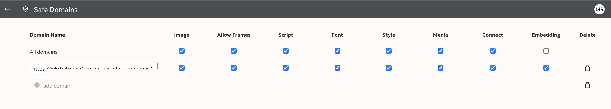
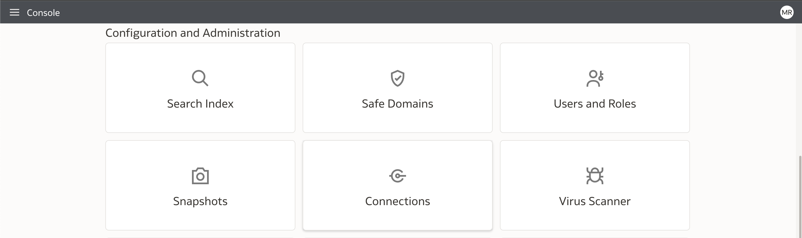
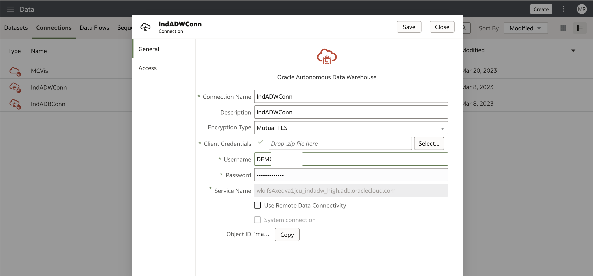
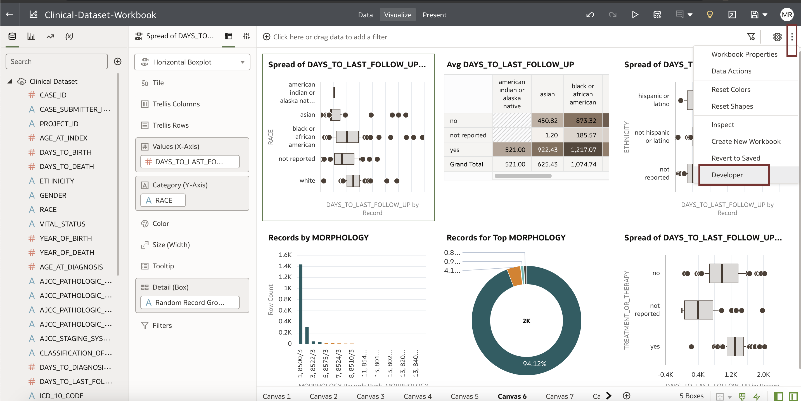
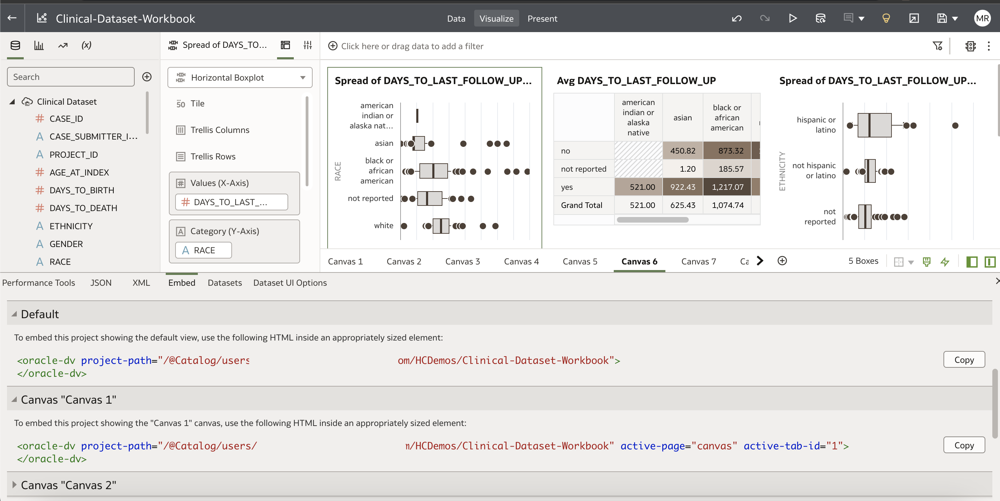
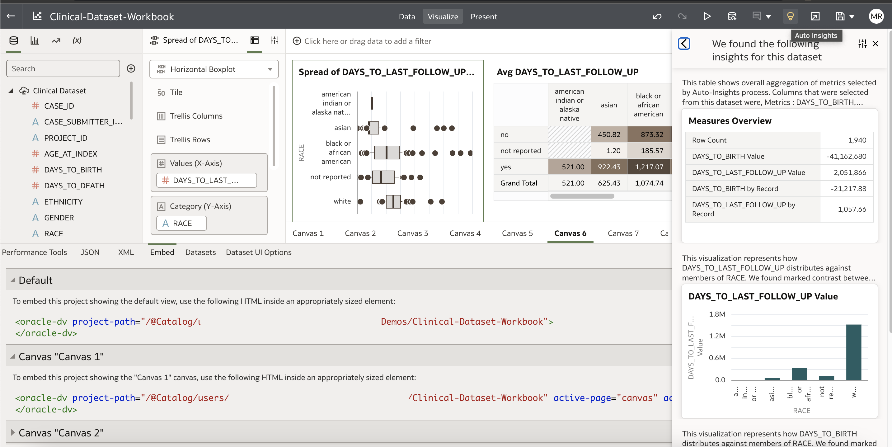

# Oracle Analytics Cloud for Clinical Data Analysis

## Introduction

This workshop walks you through the steps of creating an Oracle Analytics cloud instance, creating Analytics reports or Data Visualization and making these reports available in Oracle APEX Application. We will take the example of Analysing Clinical Data, but there are limitless opportunities to Analyse Healthcare Data using Oracle Analytics cloud.
 
### About Analytics Platform

The Oracle Analytics platform is a cloud native service that provides the capabilities required to address the entire analytics process including data ingestion and modeling, data preparation and enrichment, and visualization and collaboration, without compromising security and governance. Embedded machine learning and natural language processing technologies help increase productivity and build an analytics-driven culture in organizations. Start on-premises or in the cloud—Oracle Analytics supports a hybrid deployment strategy, providing flexible paths to the cloud.
  
Estimated Time: 60 minutes.  
 
### Objectives

In this lab, you will:
 
* Create Oracle Analytics Cloud Instance
* Log in to Oracle Analytics Cloud Instance
* Setup Autonomous Database Connection
* Create New Dataset from Table
* Create Data Visualization
* View reports in Designer Mode
* Copy Analytics Report Embed URLs
* Embed Reports in APEX Application
   
### Prerequisites

This lab assumes you have:

* Completed previous labs of this workshop: **Setup environment** and logged into **Oracle APEX workspace**

## Task 1: Create Oracle Analytics Cloud Instance
 
Login to cloud.oracl.com from the top left navigation select **Analytics & AI** and then select **Analytics** Cloud under **Analytics**
 


Click on **Create Instance**. Provide details such as Name, Description and OCPU


Select License Type and Edition


Once Analytics Instance is ready, click on **Access Information**


## Task 2: Log in to Oracle Analytics Cloud Instance

Log in to Analytics Cloud Instance, Click on **Console**


Under **Safe Domain** provide your APEX Instance URL



Click on Connections Tab.



## Task 3: Setup Autonomous Database Connection


Select **Oracle Autonomous Data Warehouse** button


Provide Database Connection Details and Upload Database Wallet, Encryption type can be **Mutual TLS**



You can also add additional report users, if required.


## Task 4: Create New Dataset from Table

Click on create data set and you should be able to all the tables that the user has access to.


## Task 5: Create Data Visualization

Create workbook, where you can drag and drop database columns to create different types of Visualization


Click on **Developer** Option under extreme right menu



## Task 6: View reports in Designer Mode

You can click on **Data Insights** that can generate various visualizations or you can create your own visualizations
 


## Task 7: Copy Analytics Report Embed URLs 

Copy Analytics Report Embed URLs when you click on **Developer** Option







## Task 8: Embed Reports in APEX Application

Add HTML code snippet in the APEX Application region, Add project path as shown below.

```html
<copy>
    <div style="width:100%;height:1200px" >
    <oracle-dv 
    project-path="/@Catalog/users/username/foldername/Clinical-Dataset-Workbook" >
    </oracle-dv>
    </div>
</copy>
```


Add Call to embedding.js

```html
<copy>
https://yourinstance.analytics.ocp.oraclecloud.com/public/dv/v1/embedding/standalone/embedding.js
</copy>
```

Run the APEX Page to view Oracle Analytics Reports


This concludes this lab and you can **proceed to the next lab**.

## Learn More

* [Analytics Platform](https://www.oracle.com/in/business-analytics/analytics-platform/)

## Acknowledgements
* **Author** - Madhusudhan Rao B M, Principal Product Manager, Oracle Database
* **Last Updated By/Date** - June 20th, 2023.