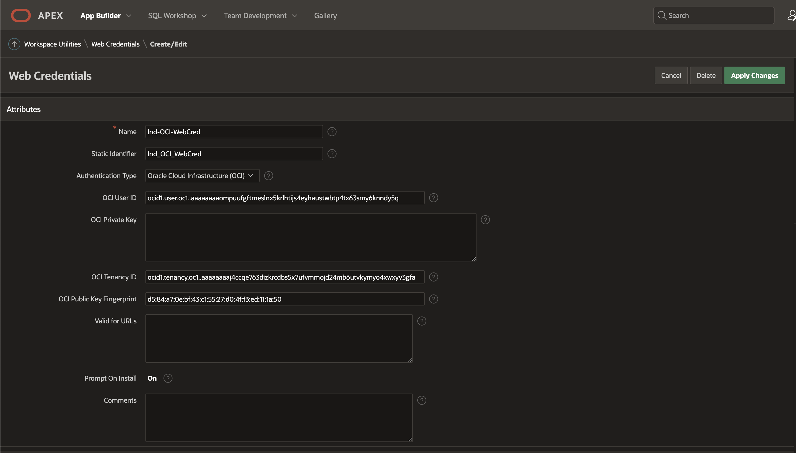

# Lab 7: Creating Oracle APEX user interface for OCI Vision

## Introduction

TBC - To be completed. 

This lab walks you through the steps to train custom Image Classification model and to perform basic testing using OCI Vision.

Estimated Time: 90 minutes (up to 6 hours if maximum training duration is selected).

### About Oracle APEX

OCI Vision is a serverless, cloud native service that provides deep learning-based, prebuilt, and custom computer vision models over REST APIs. OCI Vision helps you identify and locate objects, extract text, and identify tables, document types, and key-value pairs from business documents like receipts.

### Objectives

In this lab, you will:

* Set a staging bucket required for storing temporary prediction results
* Create a new image classification model using OCI Vision
* Test a model using OCI Vision

### Prerequisites

This lab assumes you have:

* Completed previous labs of this workshop: **Lab 1: Setup environment**, **Lab 2: Create image library** and **Lab 3: Label images**.
* You have an Oracle APEX workspace already created.


## Task 1: Setup Oracle APEX Web Credentials

In the previous lab, you have labeled all images (records) in your dataset, which is prerequisite to start working with **Vision** service. In this lab, you will create your first **vision**, image classification, model and you will run some tests to confirm it is working properly.

1. Create Web Credentials

    

    

    

    

 
## Task 2: Create required Tables 

In the previous lab, you have labeled all images (records) in your dataset, which is prerequisite to start working with **Vision** service. In this lab, you will create your first **vision**, image classification, model and you will run some tests to confirm it is working properly.

1. Navigate to Vision page

    Using **Navigator** (on the left) navigate to **Analytics & AI** and then choose **Vision**.

    ```sql
    <copy>{
    "compartmentId": "ocid1.compartment.oc1..aaaaaaaaud6tkdn6n23cbvc4hexs6n4hggetkwo4viqyneyroixcmj54u32q",
    "image": {
        "source": "INLINE",
        "data": "......"
    },
    "features": [
        {
        "modelId": "ocid1.aivisionmodel.oc1.phx.amaaaaaaknuwtjialsvxmpvyobz6zg4wkgkehk7yaxywphmazehr5ora75wq",
        "featureType": "IMAGE_CLASSIFICATION",
        "maxResults": 5
        }
    ]
    }</copy>
    ```
 
2. Continue with customer project setup

    Click **Projects** on the left side menu list, confirm you are in correct **Compartment** (ie. *X-Rays-Image-Classification*) and click **Create Project**

    

3. Define new custom project

    Select compartment in which you would like to create your vision model. Give your model **name** and provide **short description**. Click **Create project**.

    

## Task 3: Create PL/SQL Packages

You can login to Oracle APEX Workspace and select SQL worksheet to run any of the SQL commands or Create Tables or Packages.

1. Create PL/SQL Package Body

    ```sql
    <copy>
    create or replace PACKAGE IMAGE_AI_PK AS 
    ------------------------------------------------------------------------------- 
    -- NAME        : IMAGE_AI_PK 
    -- FILE NAME   : IMAGE_AI_PK.sql  
    -- Author   19-Mar-2023  Madhusudhan Rao B M for IMAGE AI Service. 
    ------------------------------------------------------------------------------- 
    
    GC_WC_CREDENTIAL_ID        CONSTANT VARCHAR2(50)   := 'Ind_OCI_WebCred';  
    
    --- Dynamic variables coming from MACHINE_LEARNING_CONFIGS Table ---------
    v_GC_OCI_OBJ_STORE_BASE_URL   MACHINE_LEARNING_CONFIGS.GC_OCI_OBJ_STORE_BASE_URL%TYPE;
    v_GC_OCI_DOC_AI_URL           MACHINE_LEARNING_CONFIGS.GC_OCI_DOC_AI_URL%TYPE;
    v_GC_OCI_DOC_AI_TIMEOUT_SECS  MACHINE_LEARNING_CONFIGS.GC_OCI_DOC_AI_TIMEOUT_SECS%TYPE;
    v_GC_WC_CREDENTIAL_ID         MACHINE_LEARNING_CONFIGS.GC_WC_CREDENTIAL_ID%TYPE;
    v_GC_OCI_REQ_AI_PAYLOAD       MACHINE_LEARNING_CONFIGS.GC_OCI_REQ_AI_PAYLOAD%TYPE;
     
    GC_OCY_DOC_AI_PAYLOAD      CONSTANT VARCHAR2(32000) := '{
    "compartmentId": "ocid1.compartment.oc1..aaaaaaaaud6tkd-your-compartment-ocid-roixcmj54u32q",
    "image": {
        "source": "OBJECT_STORAGE",
        "namespaceName": "Your-Tenancy-name",
        "bucketName": "Your-bucket-name",
        "objectName": "ImageAI/#FILE_NAME#"
    },
    "features": [
        {
        "modelId": "ocid1.aivisionmodel.oc1.phx.amaaaaaaknuwt-your-vision-model-ocid-ktfthw3gakucq",
        "featureType": "IMAGE_CLASSIFICATION",
        "maxResults": 5
        }
    ]
    }'; 

    PROCEDURE process_file 
    (p_apex_file_name  IN VARCHAR2, 
    v_id IN MACHINE_LEARNING_CONFIGS.ID%TYPE,
    x_document_id    OUT cndemo_document_ai_docs.document_id%TYPE); 
    
    PROCEDURE render_document 
    (x_document_id  IN cndemo_document_ai_docs.document_id%TYPE); 
    
    END IMAGE_AI_PK; 
    </copy>
    ```

    Create Package body

    ```sql
    <copy>create or replace PACKAGE BODY IMAGE_AI_PK  
    IS 
    ------------------------------------------------------------------------------- 
    -- NAME        : IMAGE_AI_PK 
    -- FILE NAME   : IMAGE_AI_PK.sql  
    -- Author   19-Mar-2023  Madhusudhan Rao for IMAGE AI Service. 
    ------------------------------------------------------------------------------- 
    
    --------------------------------------------------------------------------------
    PROCEDURE initialize (v_id IN MACHINE_LEARNING_CONFIGS.ID%TYPE) AS
    -- -----------------------------------------------------------------
            BEGIN
            SELECT GC_OCI_OBJ_STORE_BASE_URL,
                    GC_OCI_DOC_AI_URL,
                    GC_OCI_DOC_AI_TIMEOUT_SECS,
                    GC_WC_CREDENTIAL_ID,
                    GC_OCI_REQ_AI_PAYLOAD
            INTO   v_GC_OCI_OBJ_STORE_BASE_URL,
                    v_GC_OCI_DOC_AI_URL,
                    v_GC_OCI_DOC_AI_TIMEOUT_SECS,
                    v_GC_WC_CREDENTIAL_ID,
                    v_GC_OCI_REQ_AI_PAYLOAD
            FROM   MACHINE_LEARNING_CONFIGS WHERE ID = v_id;
            END initialize;
    
    -------------------------------------------------------------------------------- 
    --------------------------------------------------------------------------------
    PROCEDURE put_file 
    (p_mime_type         IN VARCHAR2, 
    p_file_blob         IN BLOB, 
    p_file_name         IN VARCHAR2, 
    x_object_store_url OUT VARCHAR2) IS 
    
    l_response            CLOB; 
    
    BEGIN 
    
    -- Build the full Object Storage URL. 
    --x_object_store_url := GC_OCI_OBJ_STORE_BASE_URL || p_file_name;
    x_object_store_url := IMAGE_AI_PK.v_GC_OCI_OBJ_STORE_BASE_URL || p_file_name;  
    
    -- Set Mime Type of the file in the Request Header. 
    apex_web_service.g_request_headers.DELETE; 
    apex_web_service.g_request_headers(1).name  := 'Content-Type'; 
    apex_web_service.g_request_headers(1).value := p_mime_type; 
    
    -- Call Web Service to PUT file in OCI. 
    l_response := apex_web_service.make_rest_request 
    (p_url                  => UTL_URL.ESCAPE(x_object_store_url), 
        p_http_method          => 'PUT', 
        p_body_blob            => p_file_blob, 
        --p_credential_static_id => GC_WC_CREDENTIAL_ID); 
        p_credential_static_id => GC_WC_CREDENTIAL_ID); 
    
    IF apex_web_service.g_status_code != 200 then 
        raise_application_error(-20111,'Unable to Upload File to OCI.'); 
    END IF; 
    
    EXCEPTION WHEN OTHERS THEN 
    RAISE; 
    END put_file; 
    
    -------------------------------------------------------------------------------- 
    
    -------------------------------------------------------------------------------- 
    PROCEDURE upload_file 
    (p_apex_file_name    IN VARCHAR2, 
    x_file_name        OUT VARCHAR2, 
    x_object_store_url OUT VARCHAR2, 
    x_document_id      OUT cndemo_document_ai_docs.document_id%TYPE) IS 
    
    CURSOR cr_file_info IS 
        SELECT filename 
        ,      blob_content 
        ,      mime_type 
        FROM   apex_application_temp_files 
        WHERE  name = p_apex_file_name; 
    
    lr_file_info          cr_file_info%ROWTYPE; 
    
    BEGIN 
    
    -- Get the File BLOB Content and File Name uploaded from APEX. 
    OPEN  cr_file_info; 
    FETCH cr_file_info INTO lr_file_info; 
    CLOSE cr_file_info; 
    
    x_file_name := lr_file_info.filename; 
    
    -- Post file to OCI Object Store. 
    put_file 
    (p_mime_type        => lr_file_info.mime_type, 
        p_file_blob        => lr_file_info.blob_content, 
        p_file_name        => lr_file_info.filename, 
        x_object_store_url => x_object_store_url); 
    
    -- Create Document Record 
    INSERT INTO cndemo_document_ai_docs (file_name, mime_type, object_store_url) 
    VALUES (lr_file_info.filename, lr_file_info.mime_type, x_object_store_url)  
    RETURNING document_id INTO x_document_id; 
    
    EXCEPTION WHEN OTHERS THEN 
    RAISE; 
    END upload_file; 
    
    -------------------------------------------------------------------------------- 
    -------------------------------------------------------------------------------- 
    PROCEDURE document_ai 
    (p_file_name   IN VARCHAR2, 
    p_document_id IN cndemo_document_ai_docs.document_id%TYPE) IS 
    
    CURSOR cr_document_data (cp_json IN CLOB) IS 
        SELECT jt.* 
        FROM   JSON_TABLE(cp_json, '$' 
                COLUMNS (label1      VARCHAR2(100)  PATH '$.labels[0].name', 
                        label1_score     NUMBER        PATH '$.labels[0].confidence', 
                        label2           VARCHAR2(100)  PATH '$.labels[1].name', 
                        label2_score          NUMBER        PATH '$.labels[1].confidence' )) jt; 
    
    
    CURSOR cr_document_fields (cp_json IN CLOB) IS 
        SELECT jt.* 
        FROM   JSON_TABLE(cp_json, '$.pages[*]' 
                COLUMNS (page_number       NUMBER        PATH '$.pageNumber', 
                        NESTED PATH '$.documentFields[*]' COLUMNS 
                        (field_type_code VARCHAR2(50)   PATH '$.fieldType', 
                            field_label     VARCHAR2(100)  PATH '$.fieldLabel.name', 
                            label_score     NUMBER         PATH '$.fieldLabel.confidence', 
                            field_value     VARCHAR2(1000) PATH '$.fieldValue.value' 
                            ))) jt 
        WHERE  jt.field_type_code = 'KEY_VALUE'; 
        
    l_request_json        VARCHAR2(32000); 
    l_response_json       CLOB; 
    lr_document_data      cr_document_data%ROWTYPE; 
    
    BEGIN 
    
    -- Replace the uploaded filename in the JSON payload to be sent to Vision AI. 
    l_request_json := REPLACE(v_GC_OCI_REQ_AI_PAYLOAD, '#FILE_NAME#', p_file_name); 
    
    -- Set Content-Type in the Request Header. This is required by the Vision AI REST Service. 
    apex_web_service.g_request_headers.DELETE; 
    apex_web_service.g_request_headers(1).name  := 'Content-Type'; 
    apex_web_service.g_request_headers(1).value := 'application/json'; 
    
    -- Call the Vision AI analyze REST Web Service. 
    --v_GC_OCI_OBJ_STORE_BASE_URL
    l_response_json := apex_web_service.make_rest_request 
    (p_url                  => v_GC_OCI_DOC_AI_URL, 
        p_http_method          => 'POST', 
        p_body                 => l_request_json, 
        p_credential_static_id => GC_WC_CREDENTIAL_ID); 
    
    IF apex_web_service.g_status_code != 200 then 
        raise_application_error(-20112,'Unable to call OCI Document AI.'); 
    END IF; 
    
    -- Get Document Level Data from the JSON response. 
    OPEN  cr_document_data (cp_json => l_response_json); 
    FETCH cr_document_data INTO lr_document_data; 
    CLOSE cr_document_data; 
    
    -- Get Key Value Fields from JSON and populate table. 
    FOR r_field IN cr_document_fields (cp_json => l_response_json) LOOP 
        INSERT INTO cndemo_document_ai_fields (document_id,field_type_code,field_label,label_score,field_value) 
        VALUES (p_document_id,r_field.field_type_code,r_field.field_label,r_field.label_score,r_field.field_value); 
    END LOOP; 
        
    UPDATE cndemo_document_ai_docs 
    SET    doc_ai_json         = l_response_json 
    ,      label1       = lr_document_data.label1 
    ,      label1_score      = lr_document_data.label1_score 
    ,      label2  = lr_document_data.label2 
    ,      label2_score = lr_document_data.label2_score  
    WHERE  document_id         = p_document_id; 
    
    EXCEPTION WHEN OTHERS THEN 
    RAISE; 
    END document_ai; 
    
    -------------------------------------------------------------------------------- 
    -------------------------------------------------------------------------------- 
    PROCEDURE process_file 
    (p_apex_file_name  IN VARCHAR2, 
    v_id IN MACHINE_LEARNING_CONFIGS.ID%TYPE,
    x_document_id    OUT cndemo_document_ai_docs.document_id%TYPE) IS 
    
    l_object_store_url    VARCHAR2(1000); 
    l_file_name           VARCHAR2(100); 
    
    BEGIN 

    initialize(v_id);
    
    -- Get file and upload to OCI Object Storage. 
    upload_file 
    (p_apex_file_name   => p_apex_file_name,  
        x_file_name        => l_file_name, 
        x_object_store_url => l_object_store_url, 
        x_document_id      => x_document_id); 
    
    -- Call OCI Vision AI and parse the results. 
    document_ai 
        (p_file_name   => l_file_name, 
        p_document_id => x_document_id); 
    
    EXCEPTION WHEN OTHERS THEN 
    RAISE; 
    END process_file; 
    
    -------------------------------------------------------------------------------- 
    -------------------------------------------------------------------------------- 
    FUNCTION get_file (p_request_url IN VARCHAR2) RETURN BLOB IS 
    
    l_file_blob           BLOB; 
    
    BEGIN 
    
    -- Call OCI Web Service to get the requested file. 
    l_file_blob := apex_web_service.make_rest_request_b 
    (p_url                  => UTL_URL.ESCAPE(p_request_url), 
        p_http_method          => 'GET', 
        p_credential_static_id => GC_WC_CREDENTIAL_ID); 
    
    IF apex_web_service.g_status_code != 200 then 
        raise_application_error(-20112,'Unable to Get File.'); 
    END IF; 
    
    RETURN l_file_blob; 
    
    EXCEPTION WHEN OTHERS THEN 
    RAISE; 
    END get_file; 
    
    -------------------------------------------------------------------------------- 
    -------------------------------------------------------------------------------- 
    PROCEDURE render_document 
    (x_document_id  IN cndemo_document_ai_docs.document_id%TYPE) IS 
    
    CURSOR cr_document IS 
        SELECT mime_type 
        ,      object_store_url 
        FROM   cndemo_document_ai_docs 
        WHERE  document_id = x_document_id; 
    
    lr_document           cr_document%ROWTYPE; 
    l_file_blob           BLOB; 
    
    BEGIN 
    
    -- Get the OCI URL and Mimetytpe of the receipt file. 
    OPEN  cr_document; 
    FETCH cr_document INTO lr_document; 
    CLOSE cr_document; 
    
    -- Get the file BLOB from OCI Object Storage. 
    l_file_blob := get_file (p_request_url => lr_document.object_store_url); 
    
    -- Output the file so it shows in APEX. 
    owa_util.mime_header(lr_document.mime_type,false); 
    htp.p('Content-Length: ' || dbms_lob.getlength(l_file_blob));  
    owa_util.http_header_close;   
    wpg_docload.download_file(l_file_blob); 
    
    EXCEPTION WHEN OTHERS THEN 
    RAISE; 
    END render_document; 
    
    END; 
    </copy>
    ```

## Task 4: Create Page to Upload file and display results
 
1. Create a new vision model

    Project page opens. You can see there is a list of **Models** that is currently empty. So, let's create your first Vision model.

    Click **Create Model**

    

5. Create and train model - Select data step

    Create and Train Model wizard will now take you through a few simple steps.

    In the first step, you need to provide data for the model to be trained on. You are obviously using your X-Ray Images dataset, which was labeled, using **Data Labeling Service** in the previous lab.

    Click **Next** to proceed to the second step.
 
6. Create and Train Model - Train model step

    In this second step, you need to define parameters for the model itself. As you can see, there isn't much to do. Provide a name and description and then define **training duration**.

    As you can see you can choose between *up to 24 hours*, *about an hour* and *custom duration*. In the script, **the recommended** option is chosen, which means up to 24 hours. In fact it should take approx. 5 hours to complete. But feel free to pick your option.

    
 
    Click **Next** to proceed to the **Review** step.

7. Create and Train Model - Review step

    In this step you will only review and confirm the settings. If you are ok with them, click **Create and train**.
 

8. Training in progress ...

    Model training is in progress. In the **Project details: models** page you can monitor the progress by clicking the **Work Request** operation (in this case **CREATE_MODEL**).
 

9. Work request log monitoring

    You can monitor the progress by reviewing **Log Messages**.
 

10. Evaluate your model

    When model training is completed - **State** is *Succeeded* and **% Complete** is *100%*.

    In the **Training metrics** area calculated metrics that were automatically calculated using 10% of images as test dataset. Training metrics **Precision**, **Recall** and **F1 Score** are in this case around 95%.

    
 

## Task 5: Analyze and evaluate your model

1. Test you model using known images
 
    Click **Local File** and upload image

    

    Image will be uploaded and automatically analyzed. **Image** and prediction **Results** are displayed.  

    

    You can repeat and perform prediction for one image which is clearly showing **LUNG_CANCER_LEFT_LOWER_LOBE** with **41% confidence** and **LUNG_CANCER_FLAT_CELLS** with **35% Confidence** and **NORMAL_LUNG** being **0% Confidence**.

    Repeat for any other images

    

    You can repeat and perform prediction for one image which is clearly showing **NORMAL_LUNG** being **97% Confidence** **LUNG_CANCER_LEFT_LOWER_LOBE** with **1% confidence** and **LUNG_CANCER_FLAT_CELLS** with **1% Confidence**.


    **Please Note:** As an alternative you can create a bucket upload the images to that bucket, get the par url and use **Object storage** radio button, this will also bring same result but request JSON will change for input source element.
 

## Task 5: Review Request and Response JSON

Review Request Response JSON this will be essential for us while building Application front end

1. Analyze predictions, confidence, requests and responses

    You have already checked **Results** on the right side of the page. 

    Beside a table showing **Prediction Confidence** for each of the **Labels** you can see two additional items in the **Results** area: *Request* and *Response*.

    Expand *Request*. This is request code for JSON call which is requesting prediction to be performed on the selected image (some values are masked).

    ```json
    <copy>{
    "compartmentId": "ocid1.compartment.oc1..aaaaaaaaud6tkdn6n23cbvc4hexs6n4hggetkwo4viqyneyroixcmj54u32q",
    "image": {
        "source": "INLINE",
        "data": "......"
    },
    "features": [
        {
        "modelId": "ocid1.aivisionmodel.oc1.phx.amaaaaaaknuwtjialsvxmpvyobz6zg4wkgkehk7yaxywphmazehr5ora75wq",
        "featureType": "IMAGE_CLASSIFICATION",
        "maxResults": 5
        }
    ]
    }</copy>
    ```

    Expand *Response* and observe the JSON response with prediction results.

    ```json
    <copy>{
    "imageObjects": null,
    "labels": [
        {
        "name": "NORMAL_LUNG",
        "confidence": 0.9721929
        },
        {
        "name": "LUNG_CANCER_LEFT_LOWER_LOBE",
        "confidence": 0.011257403
        },
        {
        "name": "LUNG_CANCER_FLAT_CELLS",
        "confidence": 0.010139201
        },
        {
        "name": "LUNG_CANCER_LARGE_CELLS",
        "confidence": 0.006410511
        }
    ],
    "ontologyClasses": [
        {
        "name": "NORMAL_LUNG",
        "parentNames": [],
        "synonymNames": []
        },
        {
        "name": "LUNG_CANCER_FLAT_CELLS",
        "parentNames": [],
        "synonymNames": []
        },
        {
        "name": "LUNG_CANCER_LARGE_CELLS",
        "parentNames": [],
        "synonymNames": []
        },
        {
        "name": "LUNG_CANCER_LEFT_LOWER_LOBE",
        "parentNames": [],
        "synonymNames": []
        }
    ],
    "imageText": null,
    "detectedFaces": null,
    "imageClassificationModelVersion": "version",
    "objectDetectionModelVersion": null,
    "textDetectionModelVersion": null,
    "faceDetectionModelVersion": null,
    "errors": []
    }</copy>
    ```

    This concludes this lab and you can **proceed to the next lab**.

## Learn More

* [OCI Vision](https://docs.oracle.com/en-us/iaas/vision/vision/using/home.htm)
* [WPG_DOCLOAD](https://docs.oracle.com/en/database/oracle/oracle-database/19/arpls/WPG_DOCLOAD.html)


## Acknowledgements
 