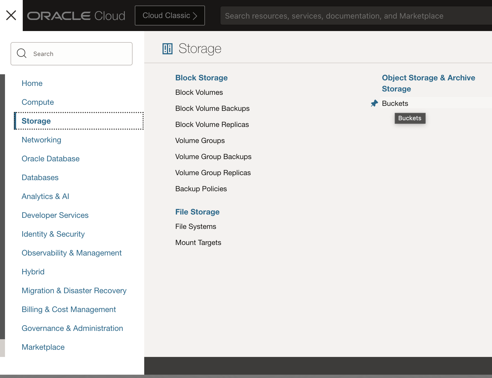
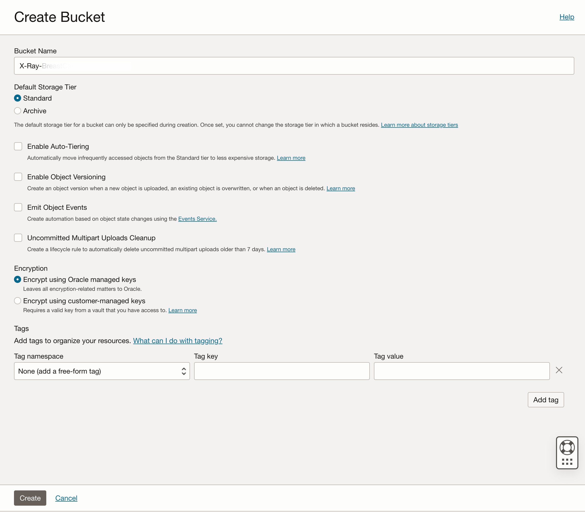
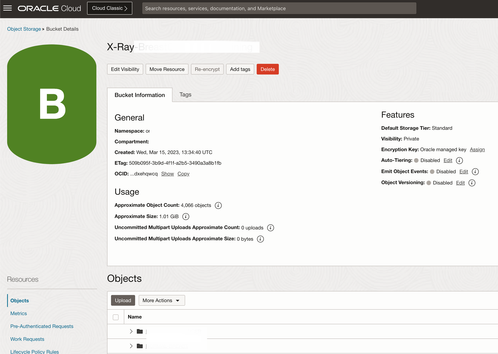
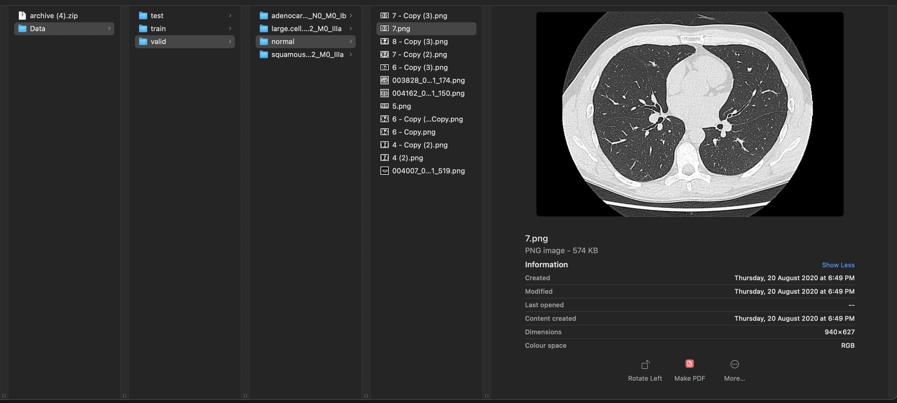
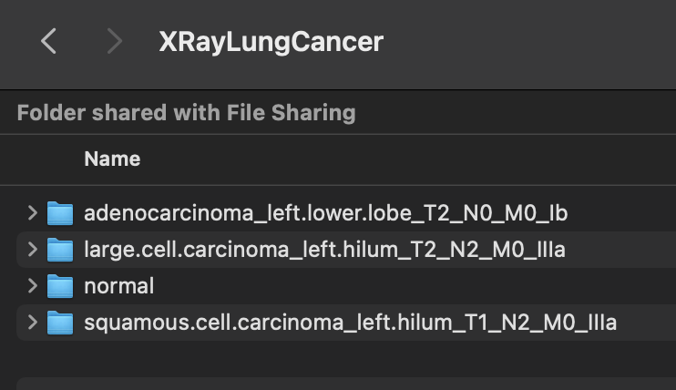
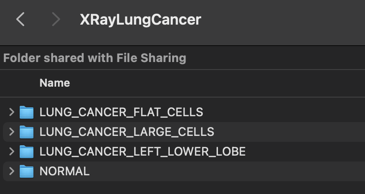
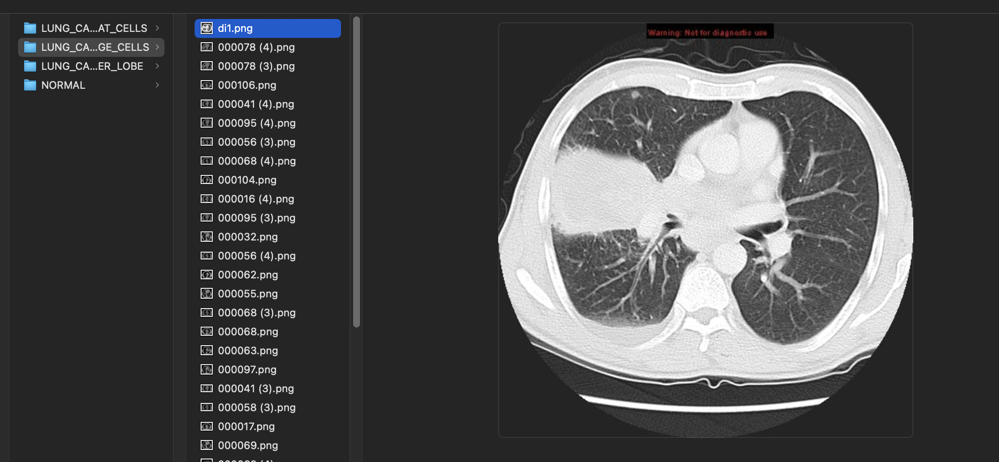
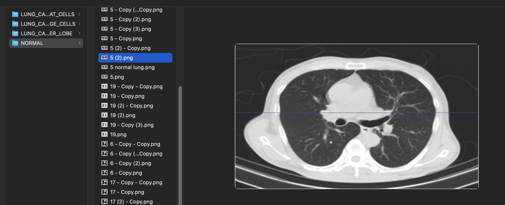
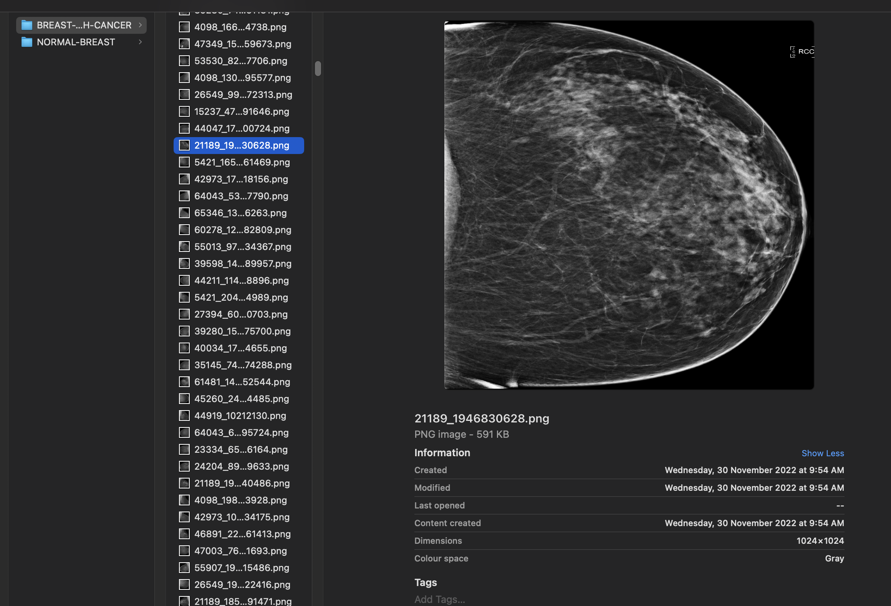
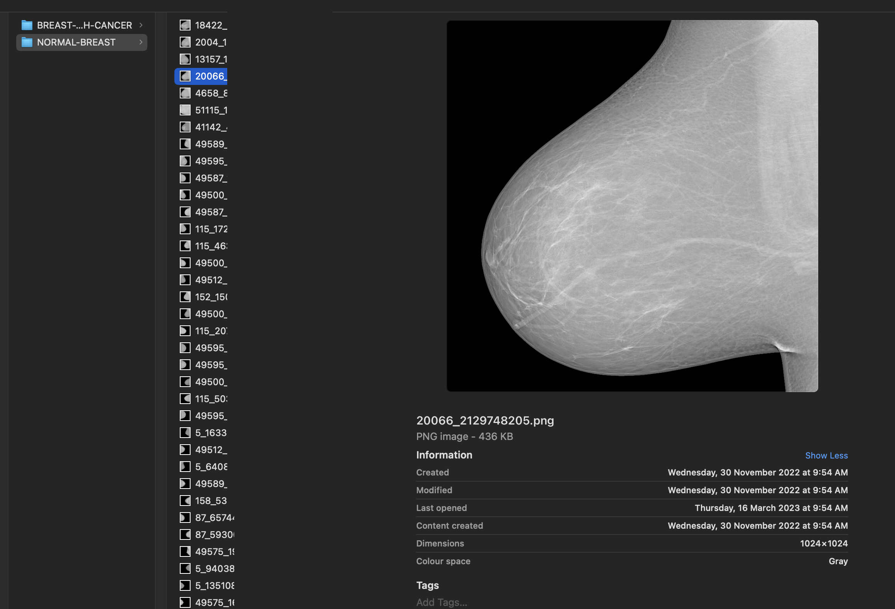

# Lab 3: Create image library

## Introduction

TBC - To be completed. 

This lab walks you through the steps to organize an image library in Object Storage. You will have an option to download images directly to OCI Cloud Shell and then from Cloud Shell into Object Storage. Alternatively, you can also load images to Object Storage from your laptop, assuming you have already download images to your laptop. The first approach is faster and recommended.

Estimated time: 30 minutes

### About OCI Object Storage

OCI Object Storage service is an internet-scale, high-performance storage platform that offers reliable and cost-efficient data durability. The Object Storage service can store an unlimited amount of unstructured data of any content type, including analytic data and rich content, like images and videos.

### Objectives

In this lab, you will:

* Create a new bucket within Object Storage
* Set bucket visibility and access
* Download images from Kaggle.com to OCI Cloud Shell
* Load images from OCI Cloud Shell to your bucket
* Alternatively, load images to Object Storage from your computer

### Prerequisites

This lab assumes you have:

* Completed **Lab 2: Setup environment** lab and already logged into OCI console

## Task 1: Create a new bucket

You will organize your image library in a new **Object Storage Bucket**.

1. Navigate to Buckets page

    From the **Navigator** menu (top-left corner) select **Storage** and then **Buckets**.

    

2. Create a new bucket

    When defining a new bucket, you should provide a **Bucket Name** of your choosing and then leave everything else as default:
    * choose *Standard* for **Default Storage Tier**,
    * use *Encrypt* using Oracle managed keys for **Encryption** and
    * provide some **Tags** if you want to improve your OCI management and control.
    * In order to make your image library visible to other users or services, you have to update its visibility to Public. Default visibility is set to Private. And in this case we will keep visibility as **Private**

    Please pay attention that you've selected correct compartment, ie. **aidemo** compartment in our case, if you have created compartment with any other name please select that..

    Then create bucket with name  **X-Rays-BreastCancer-for-Training** and then click **Create Bucket**.

    

    Verify Bucket Details

    

    Similarly, create another bucket **X-Rays-LungCancer-for-Training** and then click **Create Bucket**.
 

## Task 2: Lung Cancer - Classify Images to Folders (Data Preparation)

You will organize your image library in a new **Object Storage Bucket**.

Let us start with Lung Cancer Image Library.

Download [Chest CT-Scan images Dataset] (https://www.kaggle.com/datasets/mohamedhanyyy/chest-ctscan-images) 124 mb zip file, This will download file by name archive.zip, extract the zip file this will create directory structure as shown below.



Create new Local folder on your laptop **XRayLungCancer**

Copy folders and files from Data/train/* to XRayLungCancer, The Source folder should look as below



Rename large.cell.carcinoma\_left.hilum\_T2\_N2\_M0\_IIIa folder to **LUNG\_CANCER\_LARGE\_CELLS**

Rename normal folder to **NORMAL\_LUNG**

Rename adenocarcinoma\_left.lower.lobe\_T2\_N0\_M0\_Ib folder to **LUNG\_CANCER\_LEFT\_LOWER\_LOBE**

Rename squamous.cell.carcinoma\_left.hilum\_T1\_N2\_M0\_IIIa folder to **LUNG\_CANCER\_FLAT\_CELLS**

The Destination folder should look as below



Large Cell Lung Cancer



Normal Lung Image



Download [filenames list](files/normal-lungs.txt) in the above folder to verify your folder. or create a folder with these files

## Task 3: Breast Cancer - (Optional) Classify Images to Folders (Data Preparation)

Download [Breast Cancer Detection-ROI-1024 Dataset] (https://www.kaggle.com/datasets/aryamaanthakur/rsna-breast-cancer-detection-roi-1024) 14 GB zip file, This will download file by name archive.zip, extract the zip file this will create directory structure as shown below. This will download around 54000 images

Create folder **XRayBreastCancer** under this create 2 folders **NORMAL\_BREASTS** and **BREAST\_CANCER** and place the files in respective folder

You can create a folder with approximately 2000 images with Breast Cancer 



Download [filenames list](files/breast-cancer-images.txt) in the above folder.

Images with Normal Breast



Download [filenames list](files/normal-breasts.txt) in the above folder.

## Task 4: Load images to Object Storage using OCI CLI

Upload images from main folder into OCI Object storage, subfolders will be automatically created

```text
<copy>oci os object bulk-upload -ns <Namespace Name> -bn <Bucket Name> --src-dir <Source Folder> --overwrite --content-type 'image/*'</copy>
```

for example in case of lung cancer

```text
<copy>oci os object bulk-upload -ns mytenancy -bn X-Rays-BreastCancer-for-Training --src-dir /Users/myuser/XRayBreastCancer --overwrite --content-type 'image/*'</copy>
```

for example in case of breast cancer

```text
<copy>oci os object bulk-upload -ns mytenancy -bn X-Rays-LungCancer-for-Training --src-dir /Users/myuser/XRayLungCancer --overwrite --content-type 'image/*'</copy>
```


 
## Task 5: Verify images are loaded properly

 TBC. To be completed

This concludes this lab. You can **proceed now to the next lab**.

## Learn More

* [OCI Object Storage](https://docs.oracle.com/en-us/iaas/Content/Object/home.htm)
* [OCI CLI Command Reference](https://docs.oracle.com/en-us/iaas/tools/oci-cli/3.22.3/oci_cli_docs/oci.html)
 
## Acknowledgements
* **Author** - Madhusudhan Rao B M, Principal Product Manager, Oracle Database
* **Last Updated By/Date** - May 5th, 2023.