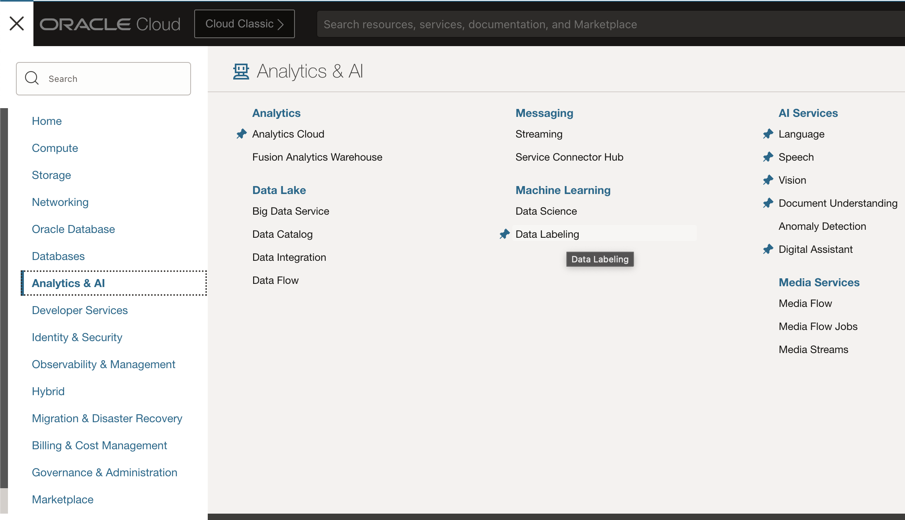
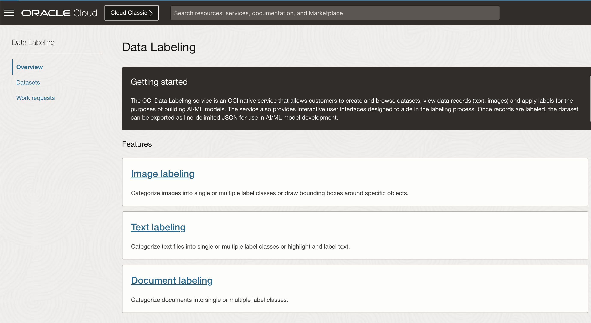
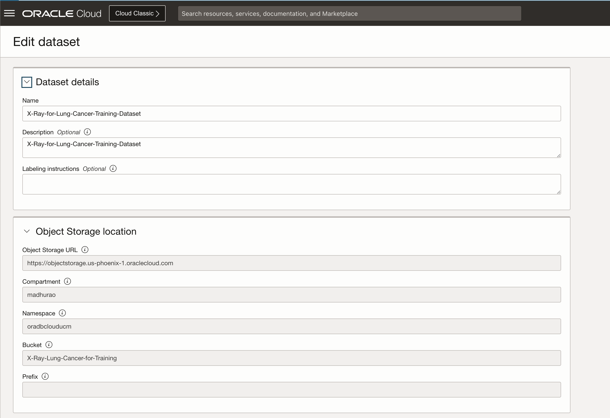
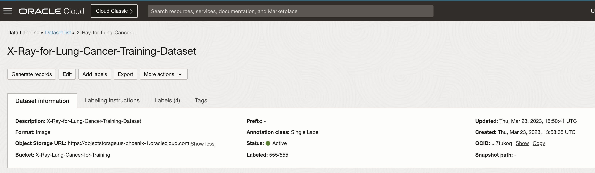
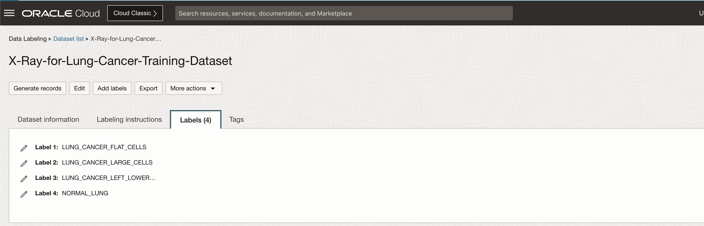
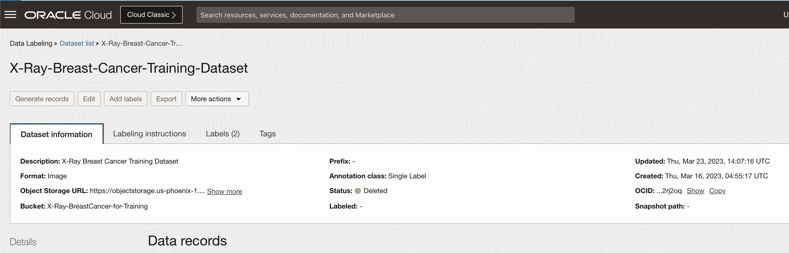
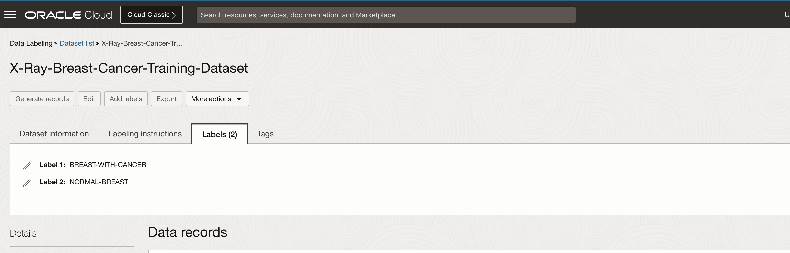
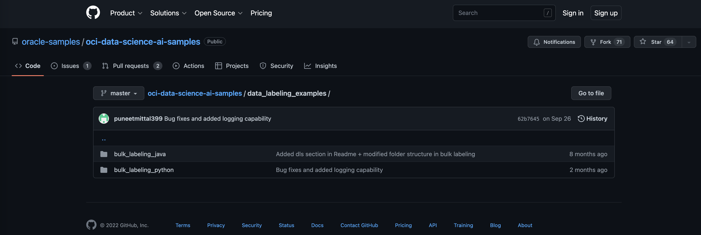
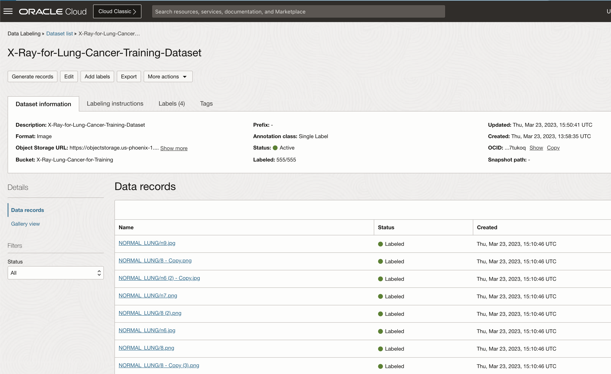
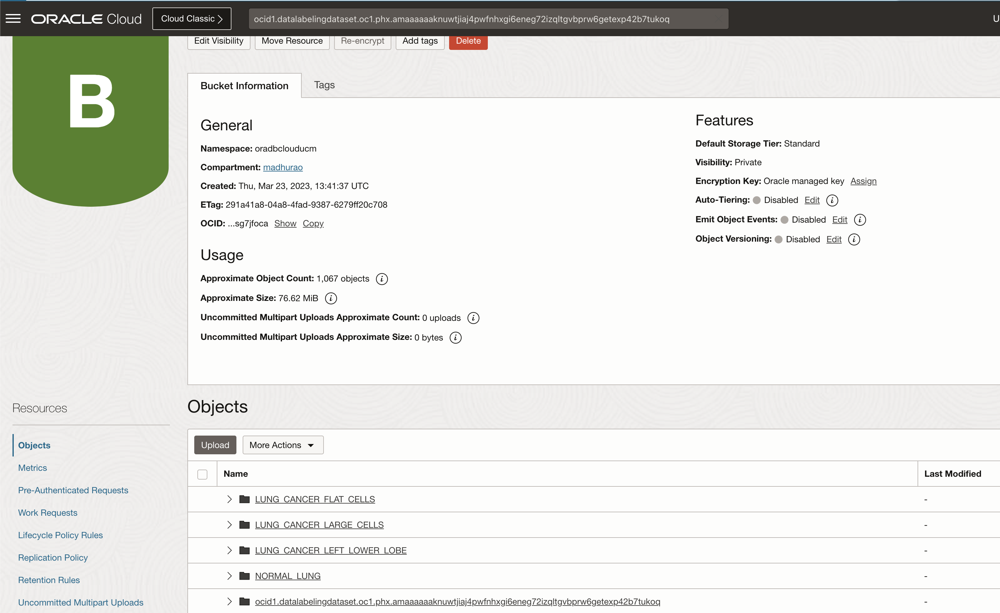

# Lab 5: Label images

## Introduction

This lab walks you through the steps to create a new dataset of records using images from your image library and label those images.

Estimated Time: 30 minutes

### About Data Labeling

Oracle Cloud Infrastructure (OCI) Data Labeling is a service for building labeled datasets to more accurately train AI and machine learning models. With OCI Data Labeling, developers and data scientists assemble data, create and browse datasets, and apply labels to data records through user interfaces and public APIs. The labeled datasets can be exported for model development across Oracle's AI and data science services for a seamless model-building experience.

In case of images, we need to assign a label to an image, which describes and classifies that image. Or using same service, we can annotate parts of images and again tell the system what is that particular part of an image. For example, a wheel as a part of the car in the picture.

### Objectives

In this lab, you will:

* Create a new dataset using images from object storage
* Label images programmatically

### Prerequisites

This lab assumes you have:

* Completed previous labs of this workshop: **Setup environment** and **Create image library**.

## Task 1: Generate dataset records and label images using Data Labeling tool for Lung Cancer

Basic data labeling tool is provided within OCI. With this data labeling tool, you can label one image at the time, which is useful if your image library is not too large. In case of larger libraries, manual image labeling can be very time consuming and error prone. That is why, you will use programmatic data labeling using utilities provided by Oracle. Required code and instructions will be provided in the second task.

But before you continue, you need to perform the first step, **Create Dataset** based on your object storage based image library.

1. Navigate to Data Labeling page

    From the **Navigator** menu select **Analytics & AI** and then **Data Labeling**.

    

2. Go to datasets

    Click on **Datasets** link under **Data Labeling** on the left side of the page.

    

3. Create a new dataset

    This will open **Dataset list** page in selected compartment (make sure you are in correct compartment as you might need to change compartment to the one you've created for this workshop).

    Make sure you've selected your compartment where your image library resides, click **Create dataset**.

    First, **Name** your dataset and optionally add **Description** and provide **Labeling instructions**
  
    Click *Images* from **Dataset format** and *Single label* for **Annotation class**.

    Click **Next**

    

    

    Enter four labels: **LUNG\_CANCER\_FLAT\_CELLS**, **LUNG\_CANCER\_LARGE\_CELLS**, **LUNG\_CANCER\_LEFT\_LOWER\_LOBE** and **NORMAL_LUNG** in **Labels set** field.

    
   

## Task 2: Generate dataset records and label images using Data Labeling tool for Breast Cancer (Optional)

1. Create a new dataset

    This will open **Dataset list** page in selected compartment (make sure you are in correct compartment as you might need to change compartment to the one you've created for this workshop).

    Make sure you've selected your compartment where your image library resides, ie. *X-Rays-Image-Classification* and then click **Create dataset**.

    First, **Name** your dataset and optionally add **Description** and provide **Labeling instructions**
  
    Click *Images* from **Dataset format** and *Single label* for **Annotation class**.

    Click **Next**

     

    Enter four labels: **BREAST\_WITH\_CANCER** and **NORMAL\_BREAST** in **Labels set** field.

    

## Task 3: Bulk image labeling

We have 5000+ images to label. This is too much to label images manually, hence we will use a python program to label images programmatically.

Oracle provides code which can be adjusted and used in your specific case. You can find the *original code* on [Github](https://github.com/oracle-samples/oci-data-science-ai-samples/tree/master/data_labeling_examples).



For the purpose of this labe, we have used original python code and adjusted it already to this workshop requirements. You will upload this adjusted code to your OCI environment and run bulk image labeling from there.

1. Download python code.

    Download [lab2.zip](https://objectstorage.us-ashburn-1.oraclecloud.com/p/b1_vZe_9llVqw_oTDq-SQyRrkDshcuABTHc6QuUDG984jfUi0mbk5x7pOZ7mPDPh/n/c4u04/b/livelabsfiles/o/partner-solutions/oas-and-vision/lab2.zip) to your computer.

    Extract the zip file, it creates a folder structure similar 

    
 
2. Update config.py file with required configuration parameters

    In order to run the data labeling program properly, you need to make some changes in */data-labeling/config.py* and */.oci/config* files.

    Let's update and configure */data-labeling/config.py* first.

    Pre-prepared *config.py* is basically empty at the beginning:

    ```python
    <copy># for help, run:
    # python3 help.py

    # config file path
    config_file_path="< PATH TO OCI CONFIG FILE >"
    # config file profile
    config_profile="DEFAULT"
    # region identifier of DLS Dataset
    # for example: eu-frankfurt-1
    region_identifier="< YOUR REGION >"
    # compartment where DLS Dataset exists
    compartment_id = "ocid1.compartment.oc1.... <YOUR COMPARTMENT OCID> ..."
    # ocid of the DLS Dataset
    dataset_id = "ocid1.datalabelingdataset.oc1.<REGION>.... <YOUR DATASET OCID> ..."
    # an array where the elements are all of the labels that you will use to annotate records in your DLS Dataset with. Each element is a separate label.
    labels = ["NORMAL", "PNEUMONIA"]
    # the algorithm that will be used to assign labels to DLS Dataset records
    labeling_algorithm = "first_match"
    # use for first_match labeling algorithm
    first_match_regex_pattern = r'^([^/]*)/.*$'
    # maximum number of DLS Dataset records that can be retrieved from the list_records API operation for labeling
    # limit=1000 is the hard limit for list_records
    list_records_limit = 1000</copy>
    ```

    The first attribute to change is *config\_file\_path*. This is path to *config* file located in *.oci* folder. You should amend it to something like this:
 

    When updated, *config.py* file should look like this (some values are masked):

    ```python
    <copy>
    # for help, run:
    # python3 help.py
 
    config_file_path="/Users/username/.oci/config"
    # config file profile
    config_profile="DEFAULT"
    # region identifier of DLS Dataset
    region_identifier="us-phoenix-1"
    # compartment where DLS Dataset exists  
    compartment_id = "ocid1.compartment.oc1..aaaaaaaaud6tk-your-compartment-ocid-o4viqyneyroixcmj54u32q"
    # ocid of the DLS Dataset 
    dataset_id = "ocid1.datalabelingdataset.oc1.phx.ama-your-dataset-ocid-43w7lwfo3sng27nztil75ufwxsh2a"
    # an array where the elements are all of the labels that you will use to annotate records in your DLS Dataset with. Each element is a separate label.
    #Labels for Breast Cancer below
    #labels = ["BREAST-WITH-CANCER", "NORMAL-BREAST"]
    #Labels for Lung Cancer below
    labels = ["LUNG_CANCER_FLAT_CELLS", "LUNG_CANCER_LARGE_CELLS", "LUNG_CANCER_LEFT_LOWER_LOBE","NORMAL_LUNG"]
    # the algorithm that will be used to assign labels to DLS Dataset records
    labeling_algorithm = "first_match"
    # use for first_match labeling algorithm
    first_match_regex_pattern = r'^([^/]*)/.*$'
    # maximum number of DLS Dataset records that can be retrieved from the list_records API operation for labeling
    # limit=1000 is the hard limit for list_records
    list_records_limit = 1000
    </copy>
    ```

    main.py will be 

    ```python
    <copy>
    import dls_list_records
    import dls_create_annotation
    import sys
    from config import *
    import datetime
    import labeling_schemas.first_letter as first_letter
    import labeling_schemas.first_match as first_match

    def main():
        num_records = list_records_limit
        count_batches=1
        count_records_total=0
        while num_records == list_records_limit: # if num_records < list_records_limit, that would indicate the last loop i.e. batch
            names, ids, num_records = dls_list_records.main()
            count_records_in_batch=0
            for n in names:
                if labeling_algorithm == "first_match":
                    first_match.main(name=n, record_id=ids[count_records_in_batch])
                elif labeling_algorithm == "first_letter":
                    first_letter.main(name=n, record_id=ids[count_records_in_batch])
                count_records_in_batch+=1
                count_records_total+=1
                print("current time: " + str(datetime.datetime.now()))
                print("current batch #: " + str(count_batches))
                print("# records labeled in current batch: " + str(count_records_in_batch))
            count_batches+=1
        count_batches-=1
        print("-----")
        print("TOTALS:")
        print("current time: " + str(datetime.datetime.now()))
        print("# batches: " + str(count_batches))
        print("# records labeled: " + str(count_records_total))
        print()
    main()
    </copy>
    ```

    To Label Breast Cancer update config.py just change labels and dataset ocid

    ```python
    <copy>
    # for help, run:
    # python3 help.py
 
    config_file_path="/Users/username/.oci/config"
    # config file profile
    config_profile="DEFAULT"
    # region identifier of DLS Dataset
    region_identifier="us-phoenix-1"
    # compartment where DLS Dataset exists  
    compartment_id = "ocid1.compartment.oc1..aaaaaaaaud6tk-your-compartment-4viqyneyroixcmj54u32q"
    # ocid of the DLS Dataset 
    dataset_id = "ocid1.datalabelingdataset.oc1.phx.amaaaaaak-your-dataset-7lwfo3sng27nztil75ufwxsh2a"
    # an array where the elements are all of the labels that you will use to annotate records in your DLS Dataset with. Each element is a separate label.
    labels = ["BREAST-WITH-CANCER", "NORMAL-BREAST"] 
    # the algorithm that will be used to assign labels to DLS Dataset records
    labeling_algorithm = "first_match"
    # use for first_match labeling algorithm
    first_match_regex_pattern = r'^([^/]*)/.*$'
    # maximum number of DLS Dataset records that can be retrieved from the list_records API operation for labeling
    # limit=1000 is the hard limit for list_records
    list_records_limit = 1000
    </copy>
    ```
   
3. Run bulk image labeling program 

    You can finally start with bulk image labeling. Make sure you are in *data-labeling* folder in **Cloud Shell** and run *main.py*.

    ```text
    <copy>python3 main.py</copy>
    ```

    Program will run approx. 30 minutes.
 

## Task 4: Verify Bulk labeling

1. Verify if all the files have been labelled by our python code.

    

2. This will also create a new folder under the same Object storage bucket that has images we read from 

    

This concludes this lab. You can **proceed to the next lab**.

## Learn More

* [OCI Data Labeling](https://docs.oracle.com/en-us/iaas/data-labeling/data-labeling/using/home.htm)
 
## Acknowledgements
* **Author** - Madhusudhan Rao B M, Principal Product Manager, Oracle Database
* **Last Updated By/Date** - May 5th, 2023.