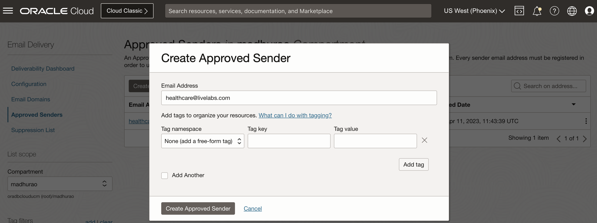
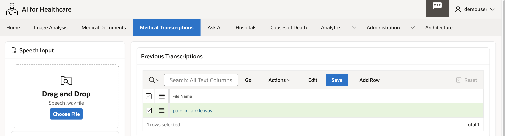
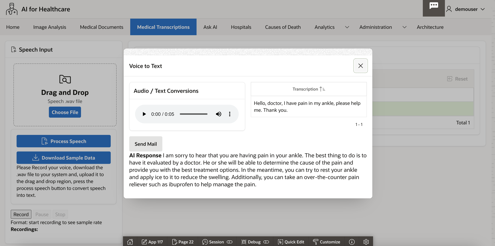
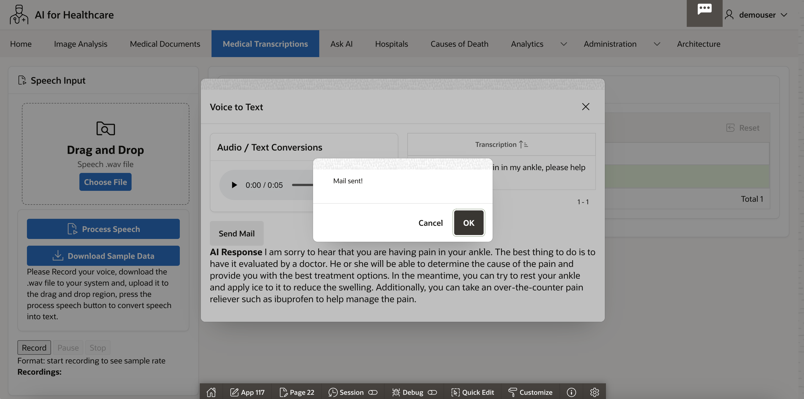
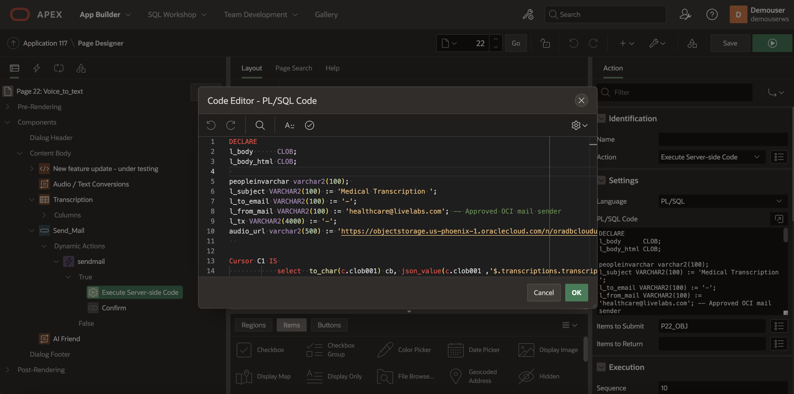
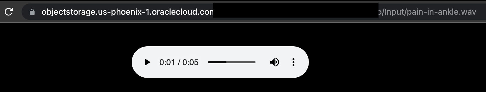

# Setup OCI Email Delivery Service

## Introduction

This workshop walks you through the steps of setting up OCI Email Services. This will help us email Doctors, Patients or any Health official with the required data. For example, we can email transcribed text to Doctor after the patient uploads an audio file or mail once the medical expenses have been approved or rejected. 
 
### About OCI Email Delivery

Oracle Cloud Infrastructure [**(OCI) Email Delivery**](https://www.oracle.com/in/cloud/networking/email-delivery/) helps organizations reach their intended audiences by enabling them to send bulk email with high rates of successful inbox placement. With email message volume rising every year, reaching intended recipients continues to be a significant challenge, even for reputable senders. Email Delivery, built on Oracle Dyn's proven technology, makes that challenge exponentially easier.

Now fully integrated as part of Oracle Cloud Infrastructure, Email Delivery has been helping organizations with large sending needs overcome the challenges of inbox placement for more than a decade. With proven reliability, scale, and ease of use, Email Delivery ensures organizations can have high confidence that messages will reach their target audiences as intended.
  
Estimated Time: 20 minutes.  
 
### Objectives

In this lab, you will:
 
* Generate SMPT Credentials
* EMAIL Delivery Configuration
* Create Approved Sender  
* Configuring Oracle APEX to Send Email
* Plain Text only message
* Plain Text / HTML message
* Sending Speech Transcription and Audio file link in an Email
 

### Prerequisites

This lab assumes you have:

* Access to Oracle cloud account to setup Email Delivery Service 
* Access to Oracle APEX Workspace.

## Task 1: Generate SMPT Credentials

1. Log in to OCI Cloud Console, click on top right navigation and select **User Settings**. 
 
    

2. Click on Left Navigation and select **SMTP Credentials** and Click on **Generate SMPT Credentials** button

    

3. Copy username and password

    

## Task 2: EMAIL Delivery Configuration  

1. From the top left navigation search for **Email**, this will link to **Email Delivery** Service under **Application Integration**. Copy the SMPT Sending Information.  

    

2. Copy the **Public Endpoint**    

    

## Task 3: Create Approved Sender    

1. An approved sender is associated with a compartment and only exists in the region where it was configured. If you create an approved sender in the US West (Phoenix) region, you can’t send email through the US East (Ashburn) region with that sender. 

    Approved Senders email id that will be representing From email address.
 
    

## Task 4: Configuring Oracle APEX to Send Email

1. Before you can send email from an Application Builder application, you must:

    * Log in to Oracle Application Express Administration Services and configure the email settings on the Instance Settings page. See in [Oracle Application Express Administration Guide](https://docs.oracle.com/database/apex-18.1/AEADM/toc.htm).

    The most efficient approach to sending email is to create a background job (using the DBMS\_JOB or DBMS\_SCHEDULER package) to periodically send all mail messages stored in the active mail queue. To call the APEX\_MAIL package from outside the context of an Application Express application, you must call apex\_util.set\_security\_group\_id as in the following example

    ```sql
    <copy>
     for c1 in 
     (
        select workspace_id from apex_applications
            where application_id = p_app_id )
        loop
        apex_util.set_security_group_id(p_security_group_id =>
        c1.workspace_id
    );
    end loop; 
    </copy>
    ```

## Task 5: Plain Text only message  

1. In the APEX Page add following PL/SQL Dynamic Action on Button click to send mail.

    ```sql
    <copy>
        DECLARE
        l_body      CLOB;
        BEGIN
            l_body := 'Thank you for your interest in the APEX_MAIL 
        package.'||utl_tcp.crlf||utl_tcp.crlf;
            l_body := l_body ||'  Sincerely,'||utl_tcp.crlf;
            l_body := l_body ||'  The Application Express Team'||utl_tcp.crlf;
            apex_mail.send(
                p_to       => 'some_user@somewhere.com',  
                 -- change to your email address
                p_from     => 'some_sender@somewhere.com', 
                -- change to a real senders email address
                p_body     => l_body,
                p_subj     => 'APEX_MAIL Package - Plain Text message');
        END;
        / 
    </copy>
    ```

## Task 6: Plain Text / HTML message

1. In the APEX Page add following PL/SQL Dynamic Action on Button click to send mail.

    ```sql
    <copy>
        DECLARE
        l_body      CLOB;
        l_body_html CLOB;
        BEGIN
            l_body := 'To view the content of this message, please use an HTML enabled mail client.'||utl_tcp.crlf;

            l_body_html := '<html>
                <head>
                    <style type="text/css">
                        body{font-family: Arial, Helvetica, sans-serif;
                            font-size:10pt;
                            margin:30px;
                            background-color:#ffffff;}

                        span.sig{font-style:italic;
                            font-weight:bold;
                            color:#811919;}
                    </style>
                </head>
                <body>'||utl_tcp.crlf;
            l_body_html := l_body_html ||'<p>Thank you for your interest in the <strong>APEX_MAIL</strong> package.</p>'||utl_tcp.crlf;
            l_body_html := l_body_html ||'  Sincerely,<br />'||utl_tcp.crlf;
            l_body_html := l_body_html ||'  <span class="sig">The Application Express Dev Team</span><br />'||utl_tcp.crlf;
            l_body_html := l_body_html ||'</body></html>'; 
            apex_mail.send(
            p_to   => 'some_user@somewhere.com',   
            -- change to your email address
            p_from => 'some_sender@somewhere.com', 
            -- change to a real senders email address
            p_body      => l_body,
            p_body_html => l_body_html,
            p_subj      => 'APEX_MAIL Package - HTML formatted message');
        END;
        /  
    </copy>
    ```

## Task 7: Sending Speech Transcription and Audio file link in an Email

1. In **AI for Healthcare** Demo, we send Speech Transcription text and Audio file link in an Email to Doctor, this is how it is implemented. Click on Audio file name, 

    

2. This will open a popup window, click on **Send Mail** button    

    

3. This will send mail sent confirmation

    

4. In the page edit mode Send Mail button has a **Dynamic Action** that **Executes server side Code**
 
    

5. Edit the PL/SQL Code Block and Save.

    

    ```sql
    <copy>
    DECLARE
    l_body      CLOB;
    l_body_html CLOB;
    
    peopleinvarchar varchar2(100); 
    l_subject VARCHAR2(100) := 'Medical Transcription ';
    l_to_email VARCHAR2(100) := '-';
    l_from_mail VARCHAR2(100) := 'healthcare@livelabs.com'; 
    -- Approved OCI mail sender
    l_tx VARCHAR2(4000) := '-';
    audio_url varchar2(500) := 'https://objectstorage.us-phoenix-1.oraclecloud.com/n/yourtenancy/b/yourbucket/o/'||:P22_OBJ;
    
    --JSON Data of Transcription is available at REST_COLLECTION 
    Cursor C1 IS 
                select  to_char(c.clob001) cb, json_value(c.clob001 ,'$.transcriptions.transcription') as transcriptions from apex_collections c
    where c.collection_name = 'REST_COLLECTION';
 
    -- You can get the To mail address from a configuration table or in real life case it will be patient or doctor database table.
    Cursor C2 IS 
                select LABEL_NAME, term1link from RELATED_LABELS where LABEL_NAME='l_to_email';
    
    BEGIN 
        l_body := 'To view the content of this message, please use an HTML enabled mail client.'||utl_tcp.crlf;
        For row_1 In C1 Loop 
                l_tx := row_1.transcriptions;
        End Loop; 

        For row_2 In C2 Loop 
                l_to_email := row_2.term1link;
        End Loop; 

        l_body_html := l_body_html || '  <table>'; 
        l_body_html := l_body_html || '<tr><td>Hi, <br/><br/> <b>Transcription:</b>  ' || l_tx || '  <br/> <b>Audio:</b> <a href='||audio_url||'>Listen Online</a> </b> </td> </tr>' || utl_tcp.crlf;  
        l_body_html := l_body_html || '  </table> '; 
        l_body_html := l_body_html || '<br/> Sincerely, <br/> AI for Healthcare Team <br />' || utl_tcp.crlf  ; 
        apex_mail.send( p_to   => l_to_email , p_from => l_from_mail , p_body  => l_body, p_body_html => l_body_html, p_subj => l_subject  );  
    END; 
    </copy>
    ```

    

    Hear the Audio file through the link

    
 
This concludes this lab and you can **proceed to the next lab**.

## Learn More

* [APEX_MAIL](https://docs.oracle.com/database/121/AEAPI/apex_mail.htm)
* [Blog Step-by-step instructions to send email](https://blogs.oracle.com/cloud-infrastructure/post/step-by-step-instructions-to-send-email-with-oci-email-delivery)

## Acknowledgements

* **Author** - Madhusudhan Rao B M, Principal Product Manager, Oracle Database
* **Last Updated By/Date** - June 22nd, 2023.