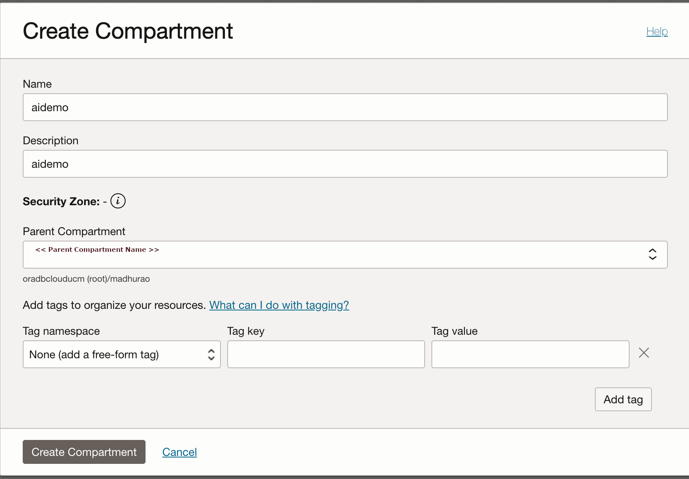
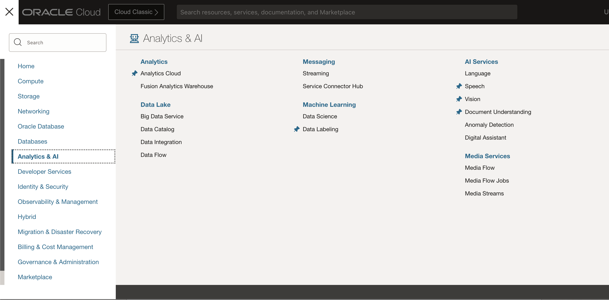
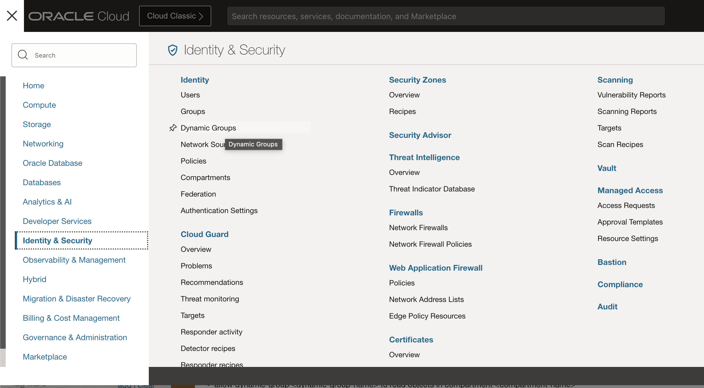
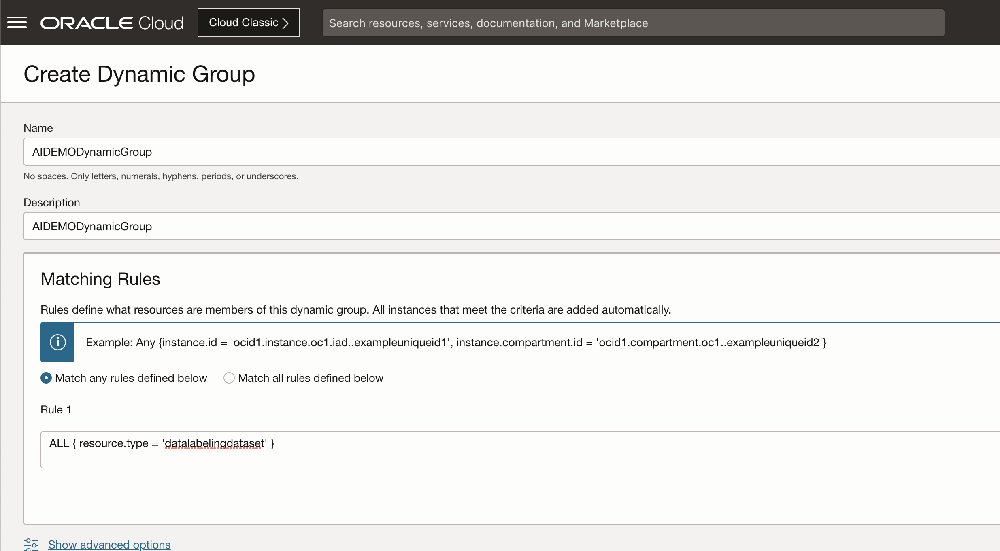
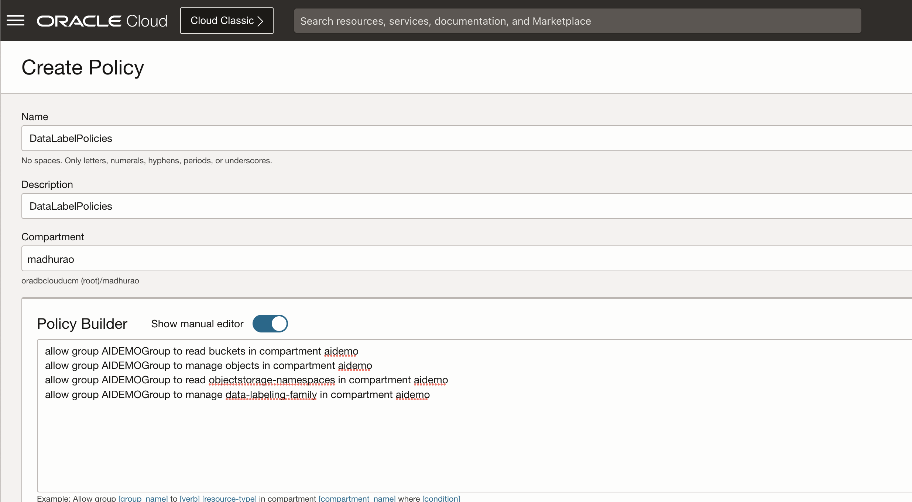
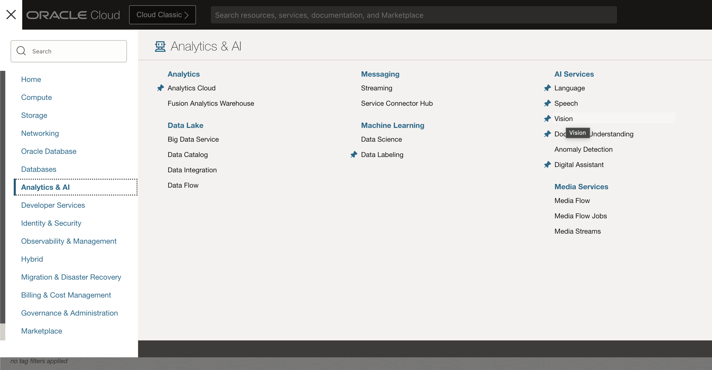
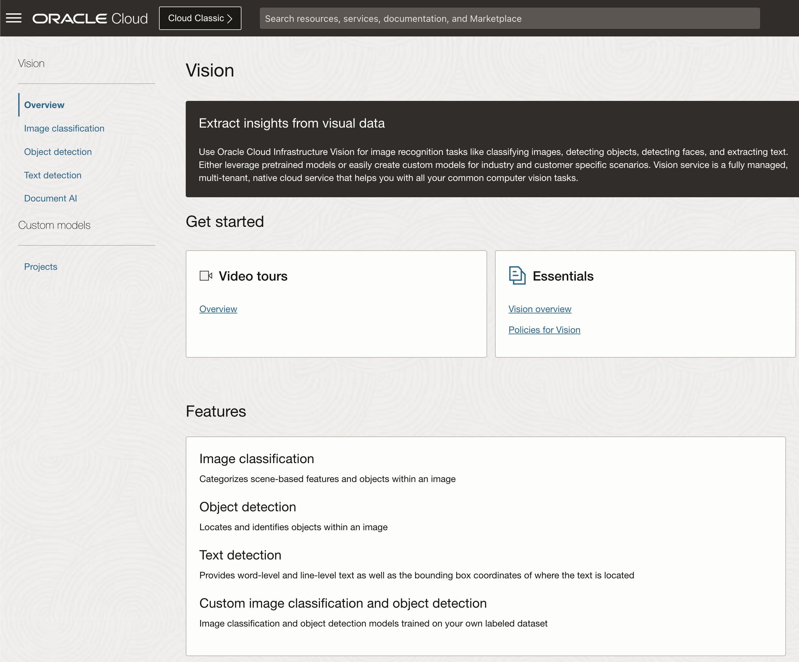
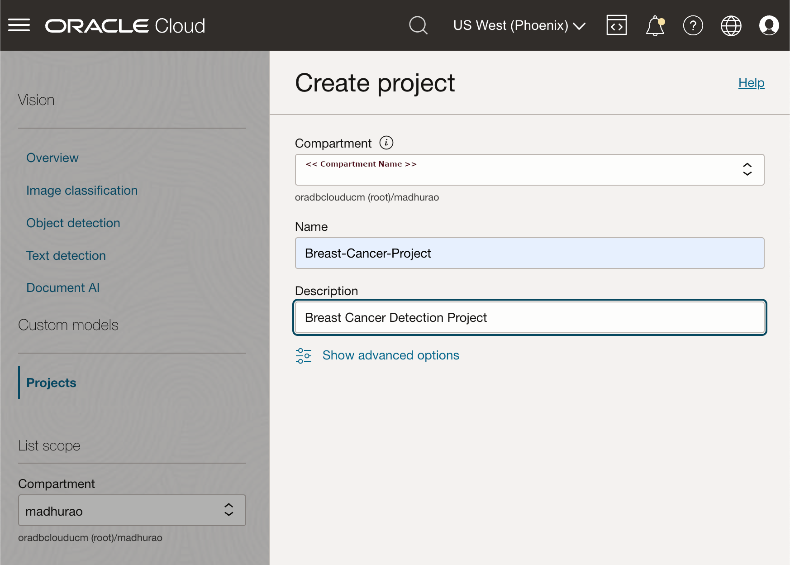

# Lab 2: Setup environment (Optional Steps)

## Introduction

In this lab, we will set up the required policies to run through the workshop as non-administrative users. However, you can skip most parts of this lab if you have administrative access.

### About OCI Policies

If you're just trying out Oracle Cloud Infrastructure or doing a proof-of-concept project with infrastructure resources, you may not need more than a few administrators with full access to everything. In that case, you can simply create any new users you need and add them to the Administrators group. The users will be able to do anything with any kind of resource. And you can create all your resources directly in the tenancy (the root compartment). You don't need to create any compartments yet, or any other policies beyond the Tenant Admin Policy, which automatically comes with your tenancy and can't be changed.

Estimated time: 30 minutes

### Objectives

In this lab, you will:

* Create a new compartment for objects used in workshop
* Set policies for the new OCI group to manage a new compartment
* Create new policies for Vision service 

### Prerequisites

This lab assumes:

* You have an Oracle Cloud account with OCI and IDCS administration privileges or
* Your OCI and IDCS administrator can perform steps in this lab for you.
 
## Task 1: Log into OCI

1. Login into OCI

    To setup environment, you need OCI administrator's privileges. If you've got these privileges, login into OCI at [cloud.oracle.com](https://www.oracle.com/cloud/sign-in.html). the below image indicates SSO Login as an administrative user. If you have administrative previleges and complete access over a tenancy then you need not create any of the policies below steps.

    

    If you do not have administrative privileges into tenancy, you might have to login as federated user, that is the user created by the administrator

    

    In case you haven't got OCI administrator's privileges, you should ask your OCI administrator to perform the rest of the tasks in this lab.

## Task 2: Create a new compartment

You will use one compartment for all required objects in this workshop, hence you need to create one.

1. Navigate to Compartments page

    In OCI console, open the **Navigator** menu. Navigate to **Identity & Security** and then choose **Compartments**.

    

2. Create a new compartment

    The list of all active compartments is displayed. Click **Create Compartment** to start creating a new compartment.

    

3. Review compartment details

    Make note of compartment OCID

    
   

## Task 3: Create a new policy for compartment management

Finally, you need to create a **policy** which grants manage privileges in a new compartment to the new OCI group.

1. Navigate to **Policies** page

    Once again use **Navigator** to navigate to **Identity & Security** and now choose **Policies**.

    

2. Create a new policy

    In the **Policies** page click **Create Policy**.

    

3. Define a new policy

    Provide a new Policy **Name** and **Description**.

    This policy is set at the *root* compartment level, therefore select the *root* compartment of your tenancy.

    In **Policy Builder** section, search for **Let compartment admins manage the compartment** in the **Common policy templates** pulldown list.

    Make sure **Groups** option is selected and then choose your newly created OCI Group from the list of available OCI Groups. For **Location**, select parent compartment which can also be *root* compartment.
 
    Your policy should look like this:

     ```text
     <copy>Allow group < group name > to manage all-resources in compartment < compartment name > </copy>
     ```
   
    for example, 

    ```text
     <copy>Allow group AIDEMOGroup to manage all-resources in compartment aidemo</copy>
    ```

 
## Task 4: Create a new dynamic group and policies for Data Labeling

One of the tasks in this workshop will be data labeling. This is a process in which all images from your training image library will be assigned a single label that describe that specific image.  To be able to perform your data labeling process, you must perform the following prerequisite steps to:

* create one new dynamic group and
* set required policies for data labeling

To find out which steps you need to perform, you can navigate to **Data Labeling** page. You will find detailed instructions there.

1. (optional) Navigate to Data Labeling page

    From the **Navigator** menu select **Analytics & AI** and then **Data Labeling**.

    

2. (optional) Open Datasets sub-page

    Click on **Datasets** link under **Data Labeling** on the left side of the page. This will open **Dataset list** page in selected Compartment (you might need to change compartment to the one you've created for this workshop).

    

3. (optional) Verify data labeling prerequisites

    Expand **Show more information** to display what prerequisites have to be met before you can start your data labeling exercise. If these are not met, then Data Labeling might not run properly.

    

    You have already created a new OCI group, hence creating a new OCI group is not needed. Continue with creating a new dynamic group.

4. Navigate to Dynamic Groups page

    From **Navigator** menu choose **Identity & Security** and then **Dynamic Groups**.

    

5. Create a new dynamic group

    Click **Create** and define a new **Dynamic Group**.

    Provide **Name**, **Description** and enter the following statement to the **Matching Rules**:

    ```text
    <copy>ALL { resource.type = 'datalabelingdataset' }</copy>
    ```

    

6. Set policies for data labeling

    From the **Navigator** menu select **Identity & Security** and then choose **Policies**.

    

7. Create a new policy for non-administrative users

    Make sure that you've selected your *root* compartment first. Then click **Create Policy**.

    The first policy is for non-administrative users. These users are members of previously created OCI Group.

    OCI Group needs the following privileges (assuming OCI Group is called **AIDEMOGroup** and compartment's name is **aidemo**):

    ```text
    <copy>allow group AIDEMOGroup to read buckets in compartment aidemo
    allow group AIDEMOGroup to manage objects in compartment aidemo
    allow group AIDEMOGroup to read objectstorage-namespaces in compartment aidemo
    allow group AIDEMOGroup to manage data-labeling-family in compartment aidemo</copy>
    ```

    
 
8. Create a new policy for dynamic group

    Repeat **Create Policy** for Dynamic Group you've created in the previous step. 

    Make sure that you've selected your *root* compartment.

    Enter the following statements (assuming Dynamic Group is called **AIDEMODynamicGroup** and compartment's name is **aidemo**):

    ```text
    <copy>allow dynamic-group AIDEMODynamicGroup to read buckets in compartment aidemo
    allow dynamic-group AIDEMODynamicGroup to read objects in compartment aidemo
    allow dynamic-group AIDEMODynamicGroup to manage objects in compartment aidemo where any {request.permission='OBJECT_CREATE'}</copy>
    ```
 
    You are now ready to start using Data Labeling service.

## Task 5: Create new policies for OCI Vision service

Similarly to Data Labeling service, you will require some privileges to use OCI Vision service. 

1. (optional) Navigate to Vision page

    Using **Navigator** (on the left) navigate to **Analytics & AI** and then choose **Vision**.

    

    Check Vision overview page

    

2. (optional) Go to custom Projects sub-page

    You will see a menu of Vision options on the left side of the page. As you can see **Vision** service can be used for **Image Classification**, **Object Recognition** and **Document AI**. These services are ready to use services, so you can try them without any preparation.

    In your case, you will create your own custom model. So, Click **Projects**

    

3. Set policies for Vision

    From the **Navigator** menu select **Identity & Security** and then choose **Policies**.

    

4. Create a new policy

    Click **Create Policy**.

    

5. Define policies to access Vision service

    Provide a name of a new policy and description in **Create Policy** dialog page. In the **Policy Builder** section enable **Show manual editor** and enter the following policy:

    ```text
    <copy>allow group AIDEMOGroup to manage ai-service-vision-family in tenancy
    allow group AIDEMOGroup to manage object-family in tenancy</copy>
    ```

    

    Click **Create**.
  

## Learn More

* [OCI Documentation](https://docs.oracle.com/en-us/iaas/Content/home.htm)
* [Data Labeling Service](https://docs.oracle.com/en-us/iaas/data-labeling/data-labeling/using/about.htm)
* [Configure OCI CLI](https://docs.oracle.com/en-us/iaas/Content/API/SDKDocs/cliconfigure.htm)
 
## Acknowledgements
* **Author** - Madhusudhan Rao B M, Principal Product Manager, Oracle Database
* **Last Updated By/Date** - May 23rd, 2023.