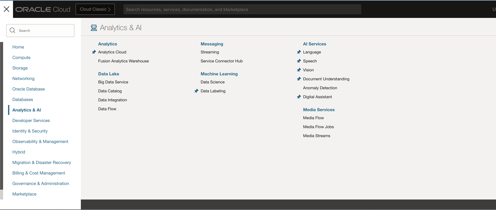
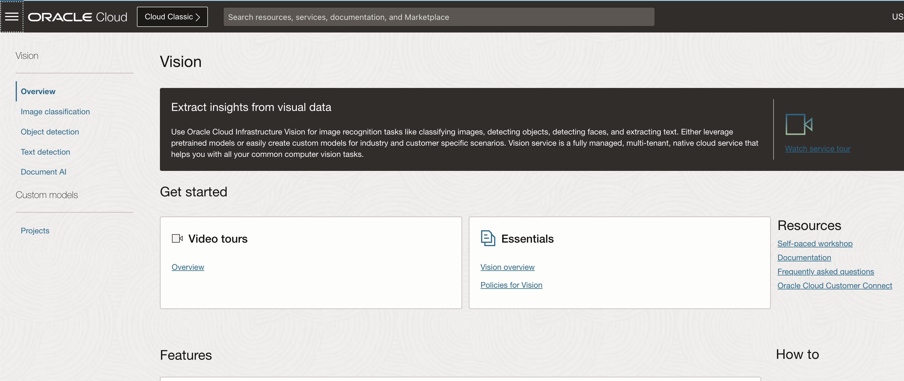
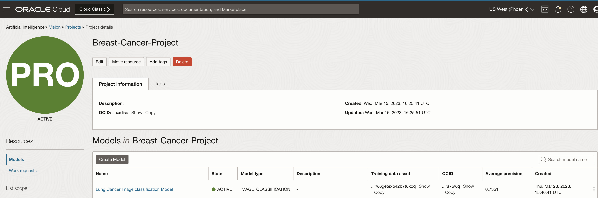
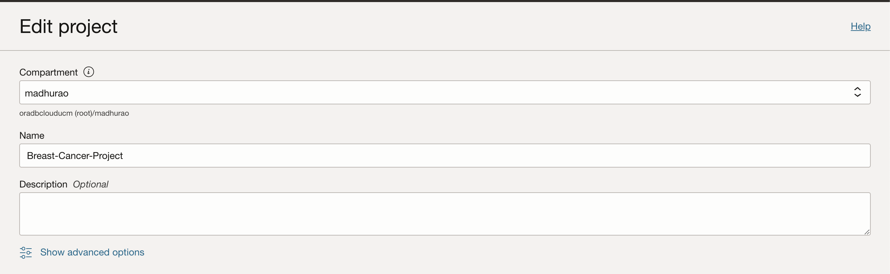
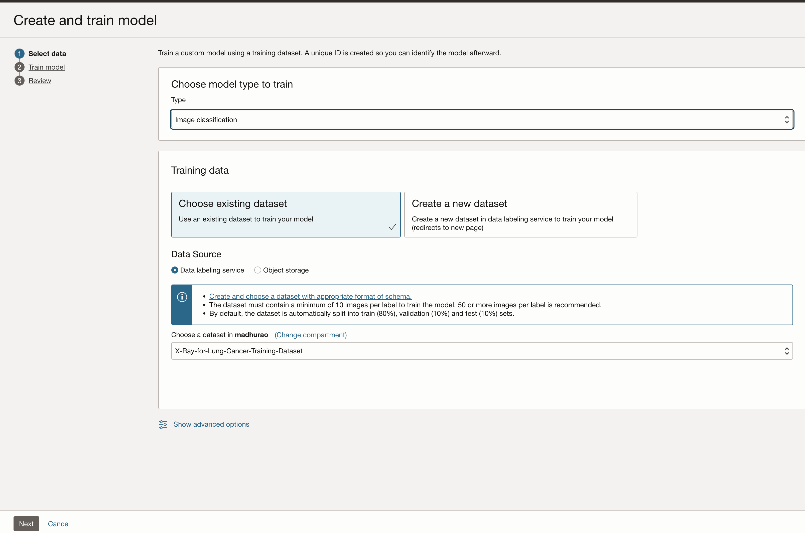
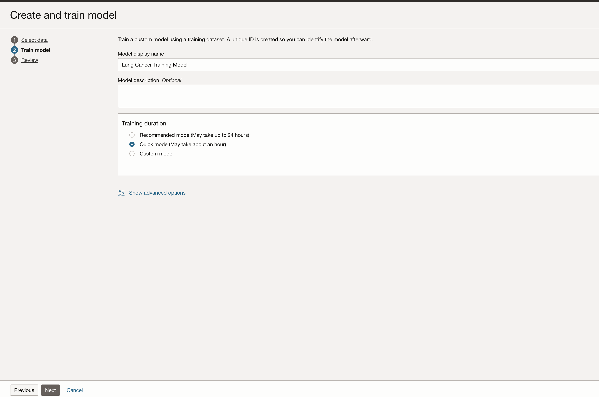
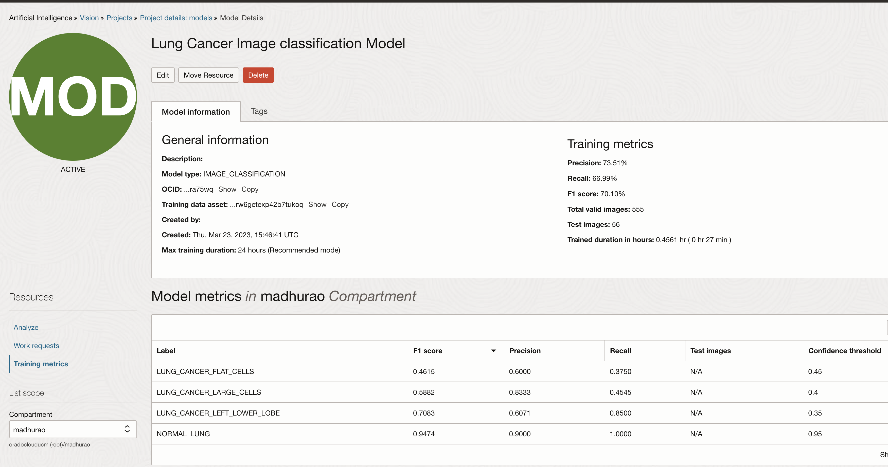
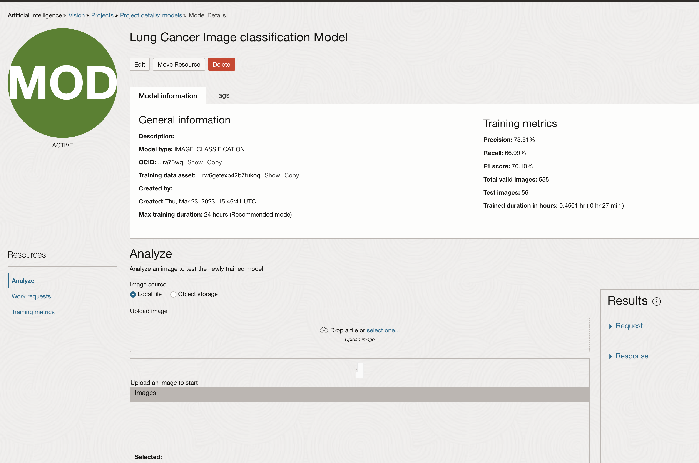
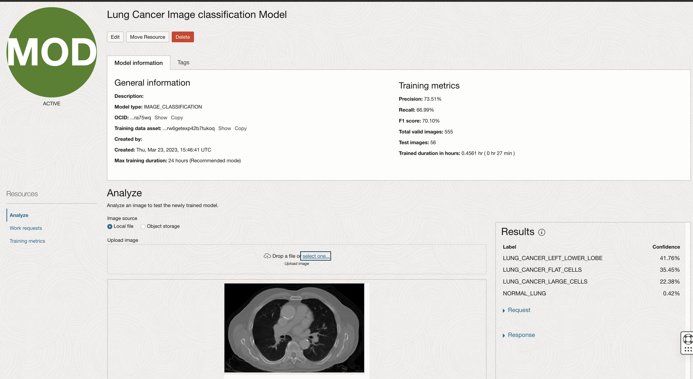

# Lab 5: Train image classification model

## Introduction

TBC - To be completed. 

This lab walks you through the steps to train custom Image Classification model and to perform basic testing using OCI Vision.

Estimated Time: 90 minutes (up to 6 hours if maximum training duration is selected).

### About OCI Vision

OCI Vision is a serverless, cloud native service that provides deep learning-based, prebuilt, and custom computer vision models over REST APIs. OCI Vision helps you identify and locate objects, extract text, and identify tables, document types, and key-value pairs from business documents like receipts.

### Objectives

In this lab, you will:

* Set a staging bucket required for storing temporary prediction results
* Create a new image classification model using OCI Vision
* Test a model using OCI Vision

### Prerequisites

This lab assumes you have:

* Completed previous labs of this workshop: **Lab 1: Setup environment**, **Lab 2: Create image library** and **Lab 3: Label images**.

 
## Task 1: Create your Vision Project

In the previous lab, you have labeled all images (records) in your dataset, which is prerequisite to start working with **Vision** service. In this lab, you will create your first **vision**, image classification, model and you will run some tests to confirm it is working properly.

1. Navigate to Vision page

    Using **Navigator** (on the left) navigate to **Analytics & AI** and then choose **Vision**.

    

    
 
2. Continue with customer project setup

    Click **Projects** on the left side menu list, confirm you are in correct **Compartment** (ie. *X-Rays-Image-Classification*) and click **Create Project**

    

3. Define new custom project

    Select compartment in which you would like to create your vision model. Give your model **name** and provide **short description**. Click **Create project**.

    

## Task 2: Train your Vision model
 
1. Create a new vision model

    Project page opens. You can see there is a list of **Models** that is currently empty. So, let's create your first Vision model.

    Click **Create Model**

    

5. Create and train model - Select data step

    Create and Train Model wizard will now take you through a few simple steps.

    In the first step, you need to provide data for the model to be trained on. You are obviously using your X-Ray Images dataset, which was labeled, using **Data Labeling Service** in the previous lab.

    Click **Next** to proceed to the second step.
 
6. Create and Train Model - Train model step

    In this second step, you need to define parameters for the model itself. As you can see, there isn't much to do. Provide a name and description and then define **training duration**.

    As you can see you can choose between *up to 24 hours*, *about an hour* and *custom duration*. In the script, **the recommended** option is chosen, which means up to 24 hours. In fact it should take approx. 5 hours to complete. But feel free to pick your option.

    
 
    Click **Next** to proceed to the **Review** step.

7. Create and Train Model - Review step

    In this step you will only review and confirm the settings. If you are ok with them, click **Create and train**.
 

8. Training in progress ...

    Model training is in progress. In the **Project details: models** page you can monitor the progress by clicking the **Work Request** operation (in this case **CREATE_MODEL**).
 

9. Work request log monitoring

    You can monitor the progress by reviewing **Log Messages**.
 

10. Evaluate your model

    When model training is completed - **State** is *Succeeded* and **% Complete** is *100%*.

    In the **Training metrics** area calculated metrics that were automatically calculated using 10% of images as test dataset. Training metrics **Precision**, **Recall** and **F1 Score** are in this case around 95%.

    
 

## Task 3: Analyze and evaluate your model

1. Test you model using known images
 
    Click **Local File** and upload image

    

    Image will be uploaded and automatically analyzed. **Image** and prediction **Results** are displayed.  

    

    You can repeat and perform prediction for one image which is clearly showing **LUNG_CANCER_LEFT_LOWER_LOBE** with **41% confidence** and **LUNG_CANCER_FLAT_CELLS** with **35% Confidence** and **NORMAL_LUNG** being **0% Confidence**.

    Repeat for any other images

    

    You can repeat and perform prediction for one image which is clearly showing **NORMAL_LUNG** being **97% Confidence** **LUNG_CANCER_LEFT_LOWER_LOBE** with **1% confidence** and **LUNG_CANCER_FLAT_CELLS** with **1% Confidence**.


    **Please Note:** As an alternative you can create a bucket upload the images to that bucket, get the par url and use **Object storage** radio button, this will also bring same result but request JSON will change for input source element.
 

## Task 4: Review Request and Response JSON

Review Request Response JSON this will be essential for us while building Application front end

1. Analyze predictions, confidence, requests and responses

    You have already checked **Results** on the right side of the page. 

    Beside a table showing **Prediction Confidence** for each of the **Labels** you can see two additional items in the **Results** area: *Request* and *Response*.

    Expand *Request*. This is request code for JSON call which is requesting prediction to be performed on the selected image (some values are masked).

    ```json
    <copy>{
    "compartmentId": "ocid1.compartment.oc1..aaaaaaaaud6tkdn6n23cbvc4hexs6n4hggetkwo4viqyneyroixcmj54u32q",
    "image": {
        "source": "INLINE",
        "data": "......"
    },
    "features": [
        {
        "modelId": "ocid1.aivisionmodel.oc1.phx.amaaaaaaknuwtjialsvxmpvyobz6zg4wkgkehk7yaxywphmazehr5ora75wq",
        "featureType": "IMAGE_CLASSIFICATION",
        "maxResults": 5
        }
    ]
    }</copy>
    ```

    Expand *Response* and observe the JSON response with prediction results.

    ```json
    <copy>{
    "imageObjects": null,
    "labels": [
        {
        "name": "NORMAL_LUNG",
        "confidence": 0.9721929
        },
        {
        "name": "LUNG_CANCER_LEFT_LOWER_LOBE",
        "confidence": 0.011257403
        },
        {
        "name": "LUNG_CANCER_FLAT_CELLS",
        "confidence": 0.010139201
        },
        {
        "name": "LUNG_CANCER_LARGE_CELLS",
        "confidence": 0.006410511
        }
    ],
    "ontologyClasses": [
        {
        "name": "NORMAL_LUNG",
        "parentNames": [],
        "synonymNames": []
        },
        {
        "name": "LUNG_CANCER_FLAT_CELLS",
        "parentNames": [],
        "synonymNames": []
        },
        {
        "name": "LUNG_CANCER_LARGE_CELLS",
        "parentNames": [],
        "synonymNames": []
        },
        {
        "name": "LUNG_CANCER_LEFT_LOWER_LOBE",
        "parentNames": [],
        "synonymNames": []
        }
    ],
    "imageText": null,
    "detectedFaces": null,
    "imageClassificationModelVersion": "version",
    "objectDetectionModelVersion": null,
    "textDetectionModelVersion": null,
    "faceDetectionModelVersion": null,
    "errors": []
    }</copy>
    ```

    This concludes this lab and you can **proceed to the next lab**.

## Learn More

* [OCI Vision](https://docs.oracle.com/en-us/iaas/vision/vision/using/home.htm)


## Acknowledgements
 