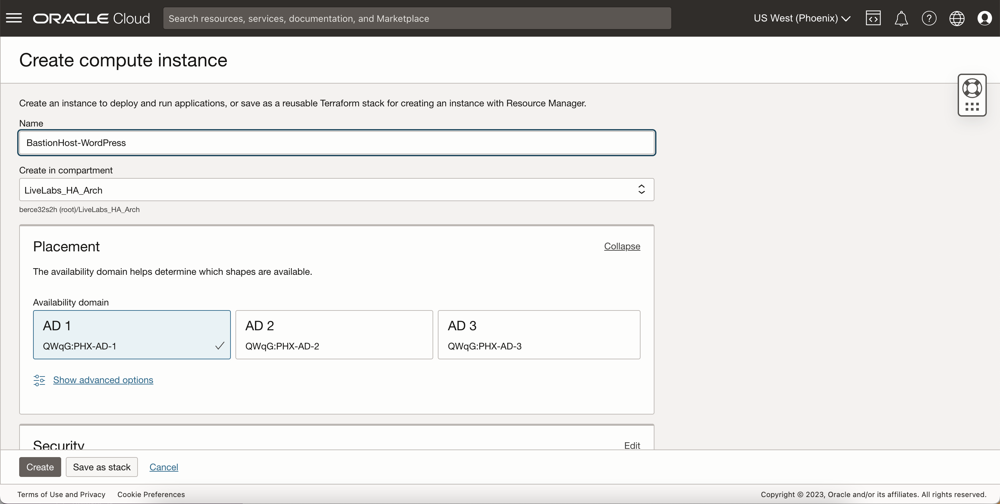
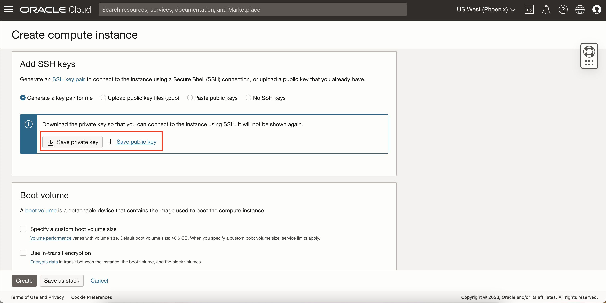

# Provisioning a Compute Instance and Using a Bastion Host

## Introduction

This lab will walk you through how to create Compute instances. More specifically, it will show you how to create a Bastion host in a public subnet that will used to connect to resources in a private subnet.

Estimated Lab Time: -- minutes

### Objectives

In this lab, you will:
* Learn how to provision Compute instances
* Connect to a Bastion host in a public subnet

### Prerequisites

This lab assumes you have:
* An Oracle Cloud account
* All previous labs successfully completed

## Task 1: Creating a Compute Instance for the Bastion Host

1. Click Navigation


  Select Compute


  Select Instances

	

2. Click 'Create Instance'

3. Fill out the Instance Name, Compartment, and Availability Domain
    - Name: BastionHost-WordPress
    - Compartment: *Select Your Compartment*
    - Availability Domain: *Leave as AD1*

   

4. Edit the Image and Shape as Needed
    - For Image: Select **Oracle Linux 8**

    


    - For Shape: Select **VM.Standard.E4.Flex**

    

5. Review the Networking Settings
    - VCN: Select **WordPress-VCN**
    - Subnet: Select the **public subnet**
    - Public IPv4 Address: Select **Assign a public IPv4 address**

    

6. Add SSH Keys
   - Here, select 'Generate a key pair for me' and save both the public and private SSH keys to your computer.
   - Optionally, you can upload or paste your own public SSH key if you already have your own key pair.

  

7. Click 'Create'

    


    Wait for the instance to finish Provisioning. When it is done, the orange block will turn green.

    


## Task 2: Connecting to the Bastion Host

1. Open up a Terminal
    > **Note:** This lab's tutorial will be using Mac Terminal, but you can use other tools such as PuTTY for Windows or even Cloud Shell on the OCI Console.

2. Take note of your Bastion instance's public IP address

  

3. In your Terminal, change the directory to where your Bastion host's SSH Key is located

  ```
  <copy>cd <ssh-key-path></copy>
  ```


  For example, use the code below if your SSH key is in the /Users/JohnDoe/Documents/BastionHost folder.

  ```
  cd /
  ```

  ``
  cd/Users/JohnDoe/Documents/BastionHost
  ``

4. SSH into the Bastion host using the following format

  ```
  <copy>ssh -i <ssh-key-file> opc@<bastion_host_public_ip></copy>
  ```


  > **Note:** If you did not change your directory, make sure to specify the full path for the SSH private key file location (i.e. /Users/JohnDoe/Documents/BastionHost/ssh-key-2023-05-05.key).

4. Verify you have connected to the Bastion host

## Task 3. Add your Bastion host's connection information to the config file for easy access

1. Go into the config file

  ```
  <copy>nano ~/.ssh/config</copy>
  ```

2. Add the Bastion's host configuration using the following format

    ```
    <copy>Host BastionHost
		HostName <bastion_host_public_ip>
		User opc
		Port 22
		IdentityFile <ssh-key-file-full-path></copy>
    ```

3. SSH into the Bastion host To verify the configuration

  ```
  <copy>ssh BastionHost</copy>
  ```


## Acknowledgements
* **Author** - Bernie Castro, Cloud Engineer
* **Last Updated By/Date** - Bernie Castro, May 2023
