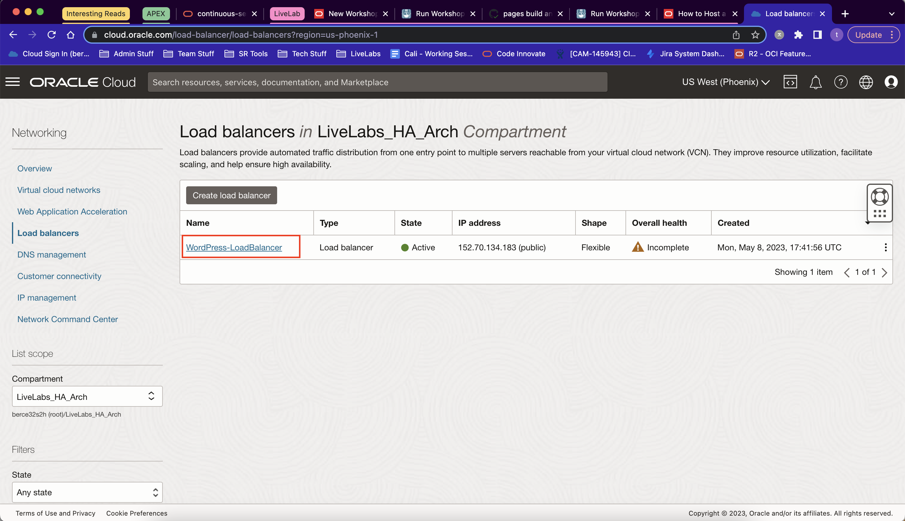
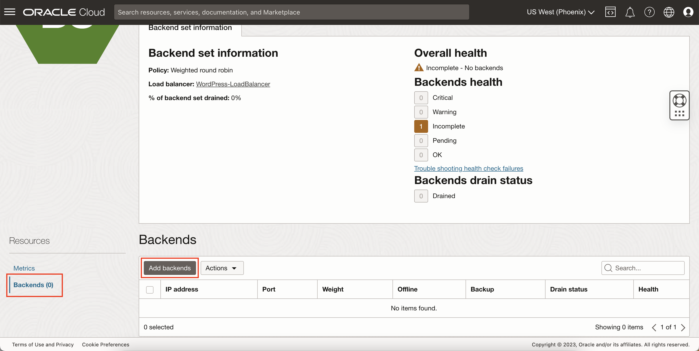
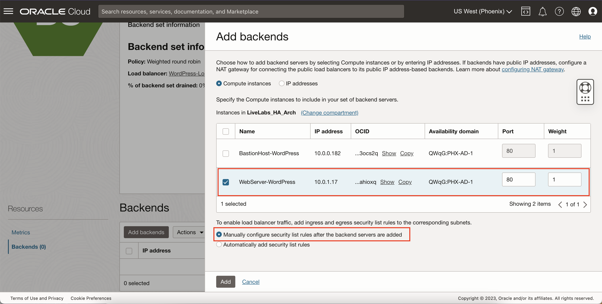

# Provisioning a Compute Instances and Installing WordPress

## Introduction

This lab will walk you through how to create a new compute instance to host your WordPress site and how to connect to it using the Bastion host created in the previous lab. You will also shown how to connect to the WordPress web page by using the Load Balancer also created in a previous lab.

Estimated Lab Time: -- minutes

### Objectives

In this lab, you will:
* Connect to a Compute instance in a private subnet using the Bastion host
* Install WordPress (along with all other necessary packages)

### Prerequisites

This lab assumes you have:
* An Oracle Cloud account
* All previous labs successfully completed

## Task 1: Provisioning a Compute Instance to host WordPress

1. Click Navigation


  Select Compute


  Select Instances

2. Click 'Create Instance'

3. Fill out the Instance Information:


    - Name: **WebServer-WordPress**
    - Compartment: *Select Your Compartment*
    - Availability Domain: *Leave as AD1*
    - Image: Select **Oracle Linux 8**
    - Shape: Select **VM.Standard.E4.Flex**
    - VCN: Select **WordPress-VCN**
    - Subnet: Select the **private subnet**

4. Add SSH Keys


   - Here, select 'Generate a key pair for me' and save both the public and private SSH keys to your computer.
   - Optionally, you can upload or paste your own public SSH key if you already have your own key pair.

  > Note: These keys should be different than the ones attached to your Bastion host, for best security practices.

5. Click Create and wait until it finishes provisioning

6. Once provisioned, take a note of the instance's private IP address.

  

## Task 2: Connecting to your WordPress Instance

1. Go into the config file

    ```
    <copy>nano ~/.ssh/config</copy>
    ```

2. Add the Bastion's host configuration using the following format

    ```
    <copy>Host WordPressServer
		HostName <wordpress_server_private_ip>
		User opc
		Port 22
		IdentityFile <ssh-key-file-full-path>
		ProxyJump BastionHost</copy>
    ```

  > Note: Ideally, your SSH keys for your Bastion host and your web server should be different. So if your SSH key for the Bastion is in the /Users/JohnDoe/Documents/BastionHost folder, your web server's SSH key might be in the /Users/JohnDoe/Documents/WPServer folder.

3. SSH into the WordPress server To verify the configuration

    ```
    <copy>ssh WordPressServer</copy>
    ```

## Task 3: Installing Apache

1. Install Apache HTTP Server and php. 


    Once you are connected to your WordPress instance, use the following commands to install Apache:
    ```
    <copy>sudo yum install httpd -y</copy>
    ```

2. Enable and start Apache HTTP Server
    ```
    <copy>sudo systemctl enable httpd</copy>
    ```

    ```
    <copy>sudo systemctl restart httpd</copy>
    ```

3. Allow HTTP and HTTPS in the local IP tables firewall
    ```
    <copy>sudo firewall-cmd --permanent --add-port=80/tcp</copy>
    ```

    ```
    <copy>sudo firewall-cmd --permanent --add-port=443/tcp</copy>
    ```

    ```
    <copy>sudo firewall-cmd --reload</copy>
    ```

4. Test the info.php page on your web browser

    Example: http://10.10.10.10

  


## Task 4. Attaching Your WordPress Instance to Your Load Balancer and Connecting to Web Server

1. On the OCI Console, click Navigation


  Select Networking


  Select 'Load Balancers'

2. Select your Load Balancer (**WordPress-LoadBalancer**)

  

3. Go to 'Backend Sets' and select the listed default backend set

  

4. Go to 'Backends' and click 'Add backends'

  

5. Select your WordPress instance (**WebServer-WordPress**)

  

  > Note: You can leave on 'Automatically add security list rules' to automatically add the appropriate HTTP rules, but this is not required as this workshop already showed you how to add the required rules, assuming you have completed all the labs to this point. In the future, this feature is useful so you don't have to manually add rules yourself. If you already have the required rules and you leave this on, however, the same rules will be created redundantly.

6. Click 'Add'

7. Wait for the work request to finish

  

8. Test the Apache Server using the Load Balancer's Public IP on your Web Browser


    Example: http://10.10.10.10

    

## Task 5. Install PHP and other required packages

1. Install php and create a test php page
    ```
    <copy>sudo yum install -y php</copy>
    ```

    ```
    <copy>sudo systemctl restart httpd</copy>
    ```

2. Create a test PHP file
    ```
    <copy>echo -e '<?php \nphpinfo();' | sudo tee /var/www/html/test.php</copy>
    ```

3. Test the info.php page on your web browser

    Example: http://10.10.10.10/test.php

  

4. Install MySQL and MySQL Shell
    ```
    <copy>sudo yum -y install https://dev.mysql.com/get/mysql80-community-release-el7-3.noarch.rpm</copy>
    ```

    ```
    <copy>sudo yum -y install mysql-shell</copy>
    ```

5. Install other required packages for WordPress
    ```
   <copy>sudo yum install -y php-mysqlnd php-zip php-gd php-mbstring php-xml php-json</copy>
    ```

    ```
    <copy>sudo systemctl restart httpd</copy>
    ```


## Task 6. Install WordPress

1. Download the latest WordPress
    ```
    <copy>curl -O https://wordpress.org/latest.tar.gz</copy>
    ```

2. Extract latest.tar.gz to /var/www/html (Apache document root).
    ```
    <copy>sudo tar zxf latest.tar.gz -C /var/www/html/ --strip 1</copy>
    ```

3. Adjust ownership.
    ```
    <copy>sudo chown apache. -R /var/www/html/</copy>
    ```

4. Create upload directory, adjust ownership.
    ```
    <copy>sudo mkdir /var/www/html/wp-content/uploads</copy>
    ```

    ```
    <copy>sudo chown apache:apache /var/www/html/wp-content/uploads</copy>
    ```

5. Adjust SE Linux.
    ```
    <copy>sudo chcon -t httpd_sys_rw_content_t /var/www/html -R</copy>
    ```

6. Allow Apache to connect to an external database.
    ```
    <copy>sudo setsebool -P httpd_can_network_connect_db 1</copy>
    ```

## Task 7. Connect to MySQL Shell and create the WordPress user and database

1. Connect to the MySql database service using MySQL Shell.
    ```
    <copy>mysqlsh --sql -u admin -h <MDS end point IP></copy>
    ```

2. Create WordPress database and user.
    ```
    <copy>create database wordpress;</copy>
    ```

    ```
    <copy>create user wp IDENTIFIED BY 'Welcome#12345';</copy>
    ```

    ```
    <copy>GRANT ALL PRIVILEGES ON wordpress.* To wp;</copy>
    ```

    ```
    <copy>\q</copy>
    ```

## Task 8. Configure WordPress

1. From a browser access http://instance public IP/wp-admin/setup-config.php.

2. Click Let’s Go.

3. Fill the following information:


    - Database Name: database you created for WordPress
    - Username: Your database username
    - Password: Your database password
    - Database Host: MySQL Database Service IP address
    - Table Prefix: leave as is. only need to change if multiple WordPress running on the same database

4. Click Run the installation.

5. Fill the following information in the welcome screen:


    - Site Title: WordPress site title
    - Username: WordPress admin
    - Password: WordPress admin password
    - Your Email: your email
    - Click Install WordPress.


    You may now follow the instructions on:
      * First Steps with WordPress: https://wordpress.org/documentation/article/first-steps-with-wordpress-block-editor/

## Acknowledgements
* **Author** - Bernie Castro, Cloud Engineer
* **Last Updated By/Date** - Bernie Castro, May 2023
