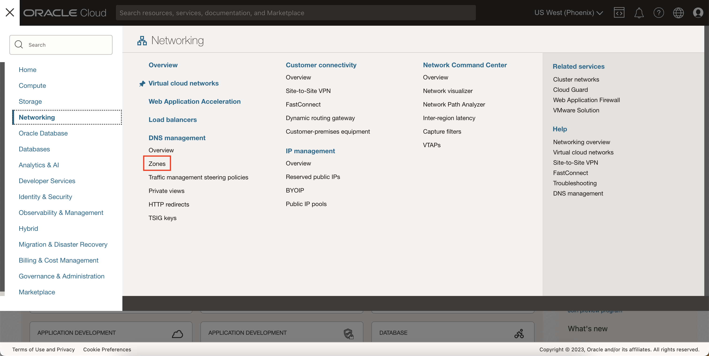
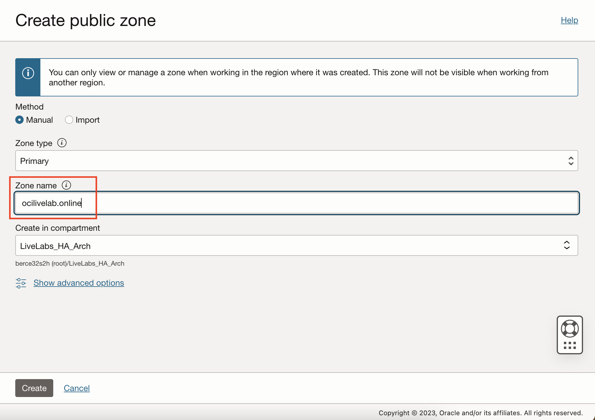
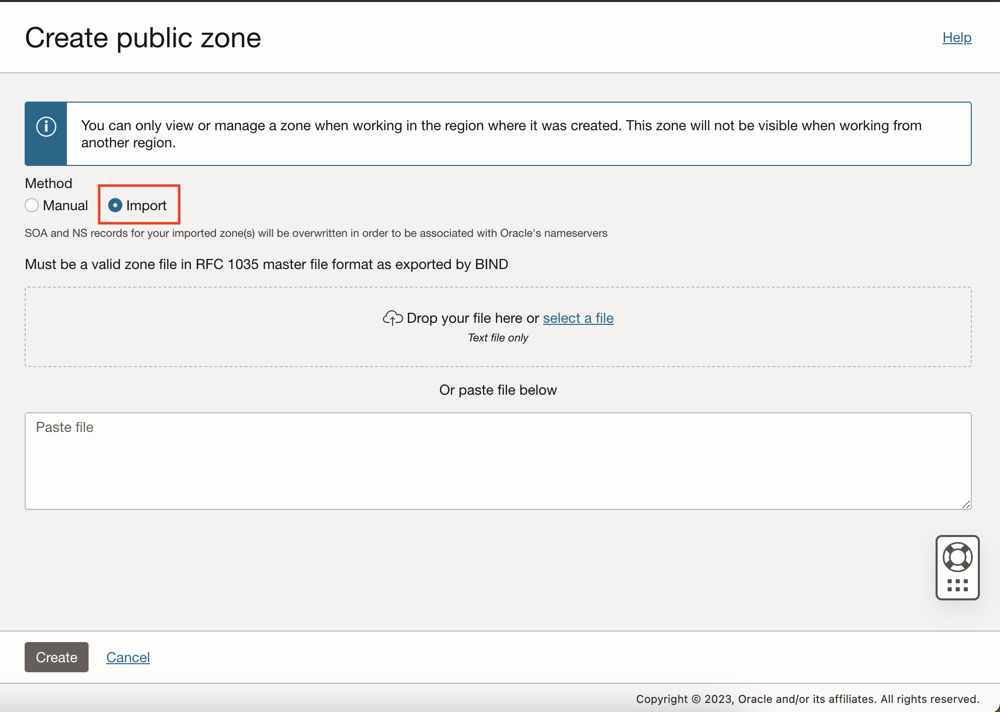
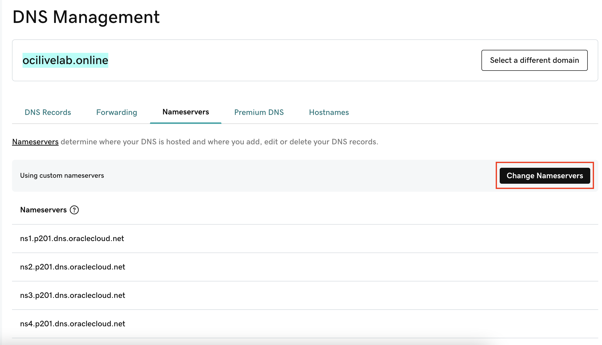
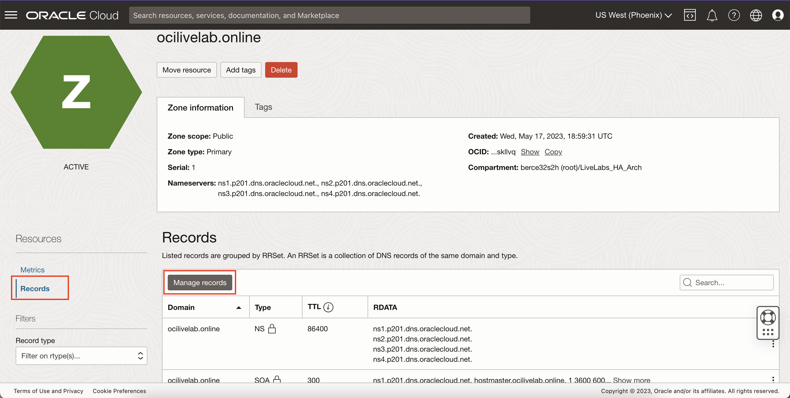
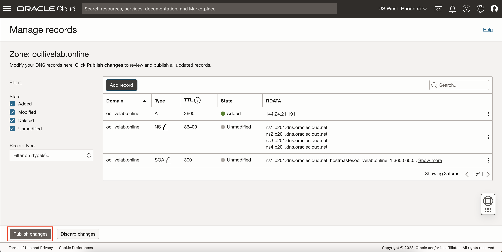

# Work with DNS

## Introduction

This lab will walk you through using your domain name (acquired through a third-party domain name registrar) with Oracle DNS to point to your load balancer's public IP address.

Estimated Time: 10 minutes

### About Domain Name Registrars and Oracle Domain Name System (DNS)
A

### Objectives

In this lab, you will:
* Create a DNS zone on OCI and add an A record
* Change name servers through the domain name registrar
* Access your load balancer via your domain name

### Prerequisites (Optional)

This lab assumes you have:
* An Oracle Cloud account
* All previous labs successfully completed
* A domain name you've acquired through a third-party domain name registrar

## Task 1: Create a DNS Zone

Once you have bought a domain name you wish to use for you site, you are ready to use Oracle DNS.

1. Click Navigation

  Select Networking

  Under DNS Management, click Zones

	

2. Click Create Zone

  

3. Fill out the information for the public zone

    - Method: Manual
    - Zone Type: Primary
    - Zone name: **Your domain name**

  

  Optionally, you cannot import your Zone File if you already have records set up.

  

4. Wait for the Zone to finish provisioning and take note of the 4 nameservers for your zone.

  

5. Through your Domain Name Registrar, go to the DNS management and change the nameservers to the 4 OCI nameservers listed in your zone.

  

  > Note: Depending on the domain registrar, it could take a while for the nameservers to be redirected to OCI.

6. Your domain is now managed by OCI! Now, go to Records in your OCI zone and click Manage Records.

  

7. Click Add Record and fill in the following information and then add record:

    - Type: A - IPv4 Address
    - TTL: 3600 (leave as default)
    - RDATA Address: **your load balancer's IP address**

  

8. Click Publish Changes and then confirm

  

9. Now that your A record shows up in your zone, use your domain name in your web browser to check that it points to your WordPress instance through the load balancer.

  

10. Congratulations! You have successfully got set up Oracle DNS

You may now **proceed to the next lab.**

## Acknowledgements
* **Author** - Bernie Castro, Cloud Engineer
* **Last Updated By/Date** - Bernie Castro, May 2023
