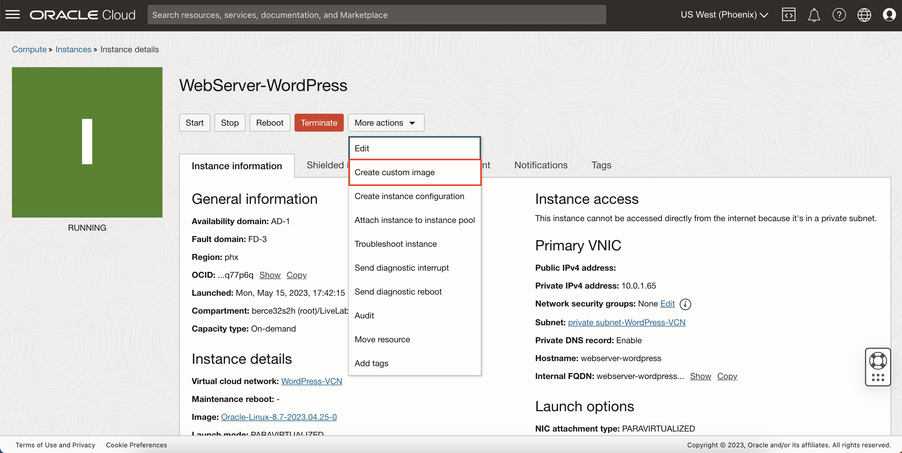
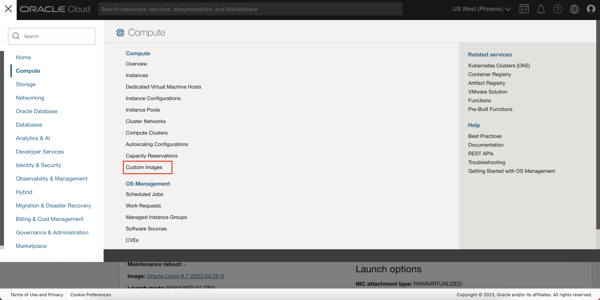
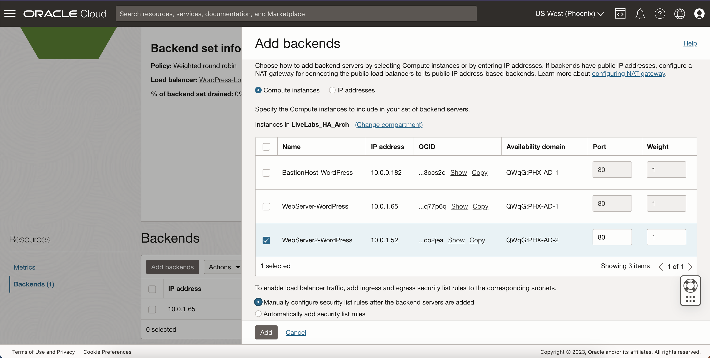
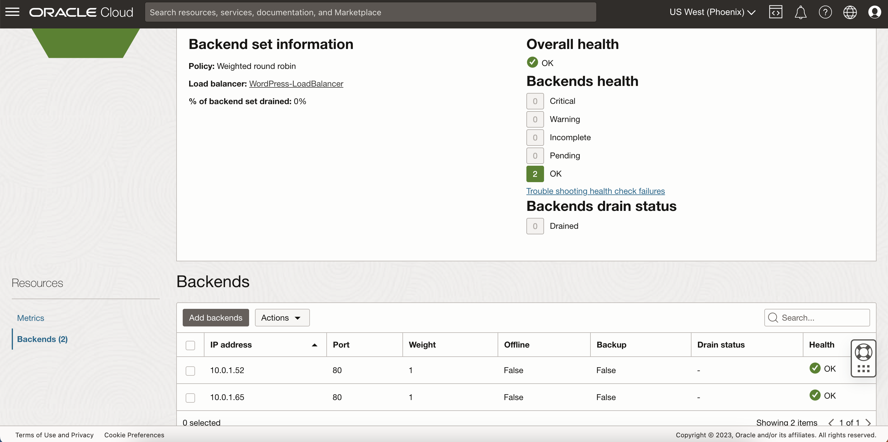

# Make Your WordPress Server Highly Available

## Introduction

This lab will walk you through making your WordPress server highly available by creating copies in different availability domains in case of any outages affecting connectivity.

Estimated Time: 10 minutes

### Objectives

In this lab, you will:
* Create a custom image from your WordPress server
* Create an instance in a different Availability Domain for High Availability

### Prerequisites

This lab assumes you have:
* An Oracle Cloud account
* All previous labs successfully completed

## Task 1: Create copies of your WordPress Server for High Availability

1. Go to your WordPress instance's console page.

  Under More Actions, select 'Create custom image'

  

2. Give it a name and click create the image

  

3. Once it finishes creating, click Navigation

  Under Compute, select Custom Images

  

4. Find your image and click on it.

  

5. On the image console page, click 'Create Instance'

  

6. Fill out the following information to create the new instance:
    - Name: **WebServer2-WordPress**
    - Compartment: **Select Your Compartment**
    - Availability Domain: **AD 2**
    - Image: **your custom image**
    - Shape: VM.Standard.E4.Flex
    - VCN: Select **WordPress-VCN**
    - Subnet: Select the **private subnet**
    - SSH Keys: Upload your WordPress ssh key from before

7. Wait for you instance to finish provisioning.

  

8. Go to your load balancer and then go to your backend set.

  Click 'Add backends' and add your 2nd WordPress instance.

  

9. Wait for the instance to successfully be added to the load balancer's backend set and pass the health check.

  

  Congratulations! You have made your WordPress server available should one of the two utilized availability domains were to experience an outage. The same design could be implemented to a third availability domain or by using different fault domains to increase the server's availability. You can now simulate an outage by stopping one of the instances and trying to access the WordPress server through your domain name or load balancer IP. Repeat the process by stopping the other instance and then by stopping both instances.

## Acknowledgements
* **Author** - Bernie Castro, Cloud Engineer
* **Last Updated By/Date** - Bernie Castro, May 2023
