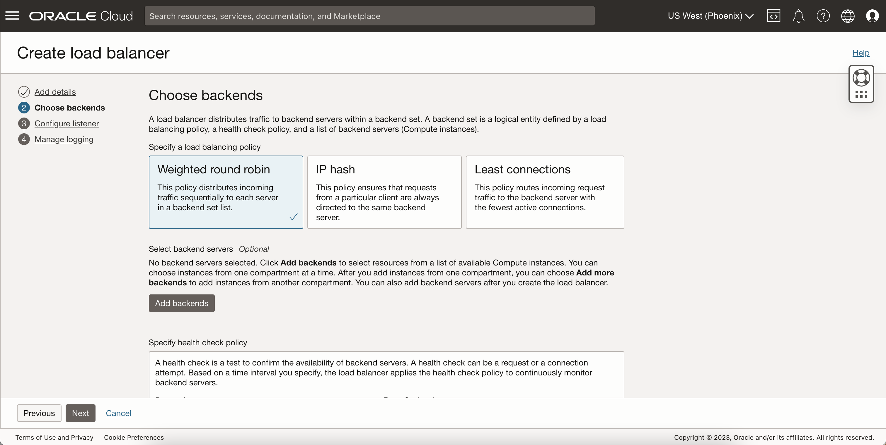
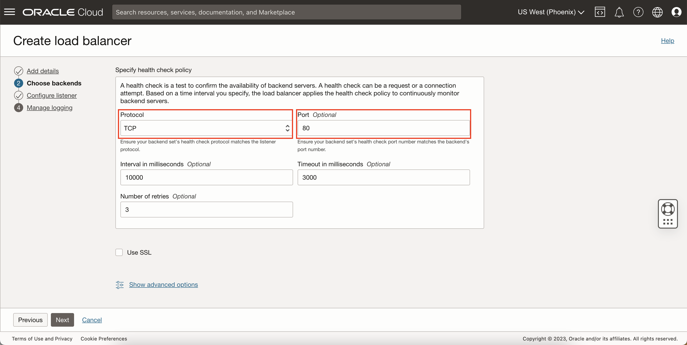
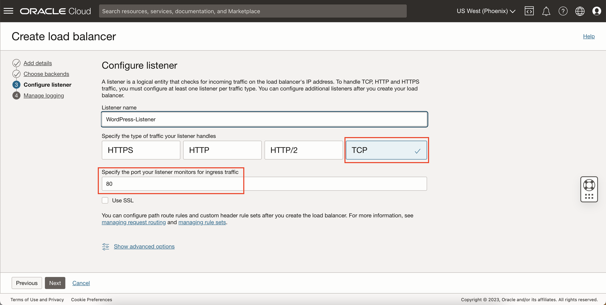

# Set Up a Load Balancer

## Introduction

This lab will show you how to set up a load balancer for HTTP connections. You will be using this later to connect to the web server made on your WordPress instance in your private subnet.

Estimated Lab Time: 10 minutes

### Objectives

In this lab, you will:
* Create a load balancer to connect to your WordPress instance using HTTP

### Prerequisites

This lab assumes you have:
* An Oracle Cloud account
* All previous labs successfully completed

## Task 1: Provision a Load Balancer

1. Click Navigation

  Select Networking

  Select 'Load Balancers'

	

2. Select 'Create Load Balancer'

  

3. Select 'Load balancer' type and create

  

4. Add details

    - Visibility: Public
    - Public IP Address: Ephemeral

    

5. Choose Networking

    - VCN: Select **WordPress-VCN**
    - Subnet: Select **public subnet**

  

    Click **Next**

6. Select Load Balancing Policy

  You can choose your desired load balancing policy you want for your application. For this lab's purposes, **Weighted Round Robin** is selected.

  

7. Specify Health Check Policy

  Ensure the following are set:
    - Protocol: TCP
    - Port: 80

  

  Click Next

8. Configure Listener

    - Name: WordPressLB_Listener
    - Traffic: TCP
    - Port: 80

  

    Click Next

9. Accept default for logging and click 'Submit' to create the load balancer

  

10. Once the Load Balancer is 'Active', take note of it's public IP address.

  

  > Note: Notice the health check on the load balancer. This is because no backend sets have been added yet. You can ignore this for now since you will add backends in later labs.

You may now **proceed to the next lab.**

## Acknowledgements
* **Author** - Bernie Castro, Cloud Engineer
* **Last Updated By/Date** - Bernie Castro, May 2023