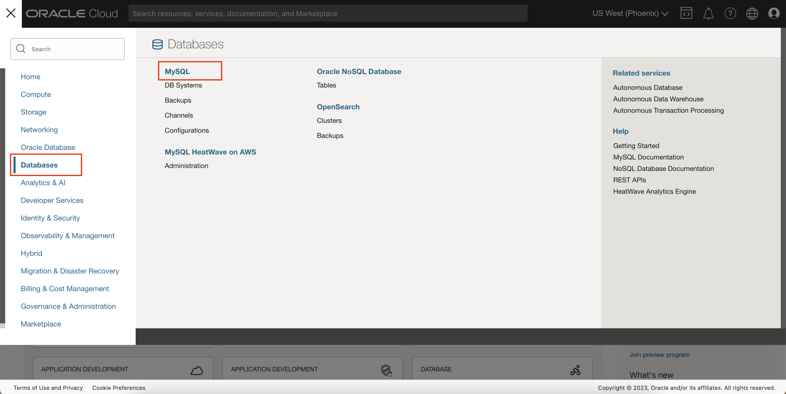
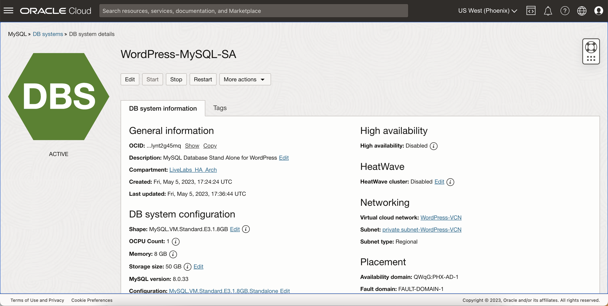

# Configure a MySQL Database

## Introduction

This lab will walk you through creating and configuring an Oracle MySQL Database Service instance.

Estimated Time: 10 minutes

### Objectives

In this lab, you will:
* Create and configure a Standalone MySQL Database System

### Prerequisites

This lab assumes you have:
* An Oracle Cloud account
* All previous labs successfully completed

## Task 1: Create a Standalone MySQL Database Service instance

1. Click Navigation

  Select Databases

  Select MySQL or 'DB Systems'

	

2. Click 'Create DB system'

  

3. Fill out the Instance Information:
    - Production
    - Compartment: *Select Your Compartment*
    - Name: WordPress-MySQL-SA
    - Description: MySQL Database Stand Alone for WordPress
    - Standalone

    

4. Create Administrator Credentials
    - Username: admin
    - Password: ???
    - Confirm Password: ???

    

5. Configure Networking
    - VCN: Select **WordPress-VCN**
    - Subnet: Select the **private subnet**

    

6. Configure Placement
    - Availability Domain: *Leave as default*

    

7. Configure Hardware
    - Change shape to: **MySQL.VM.Standard.E3.1.8GB**
    - Data Storage Size: 50 GB

    

8. Configure Backup Plan

    - Keep on 'Enable Automatic Backup'

    

9. Click 'Create'

    

    The MySQL instance can take 10+ minutes to be ready. Once the state turns to 'Active' and the icon turns to green, the DB system is ready for use.

    

10. On the MySQL page, check the Endpoint (Private IP) and Save It For Later

    

You may now **proceed to the next lab.**

## Acknowledgements
* **Author** - Bernie Castro, Cloud Engineer
* **Last Updated By/Date** - Bernie Castro, May 2023
