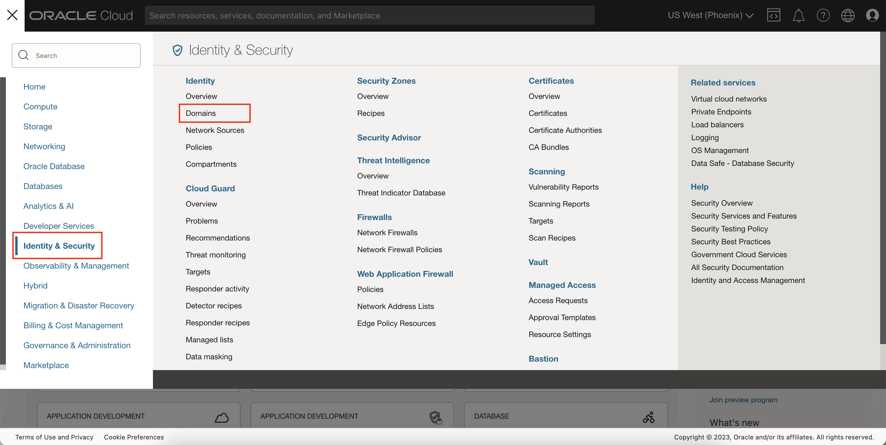
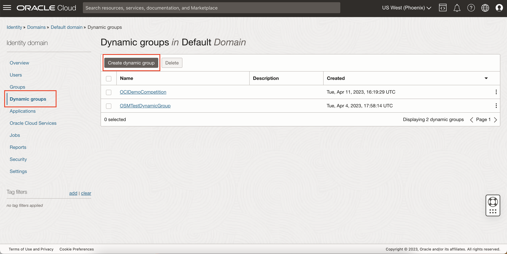
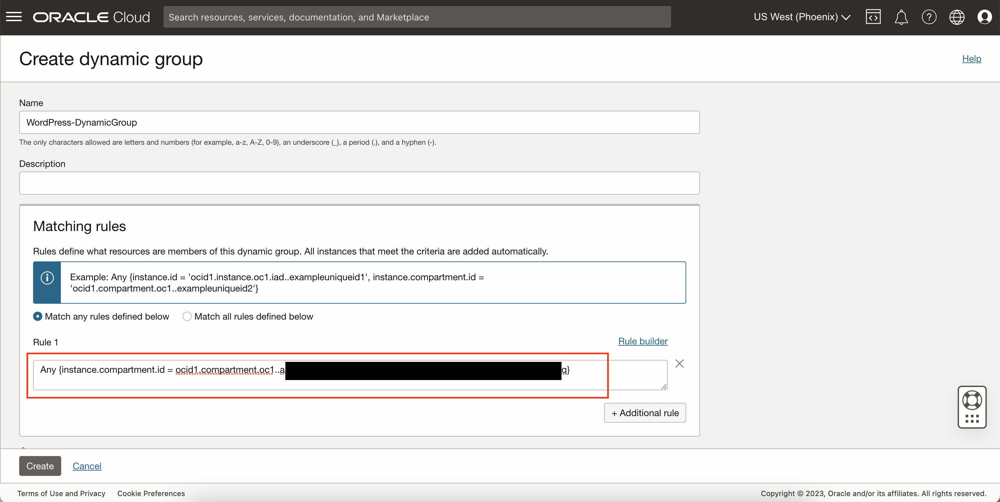
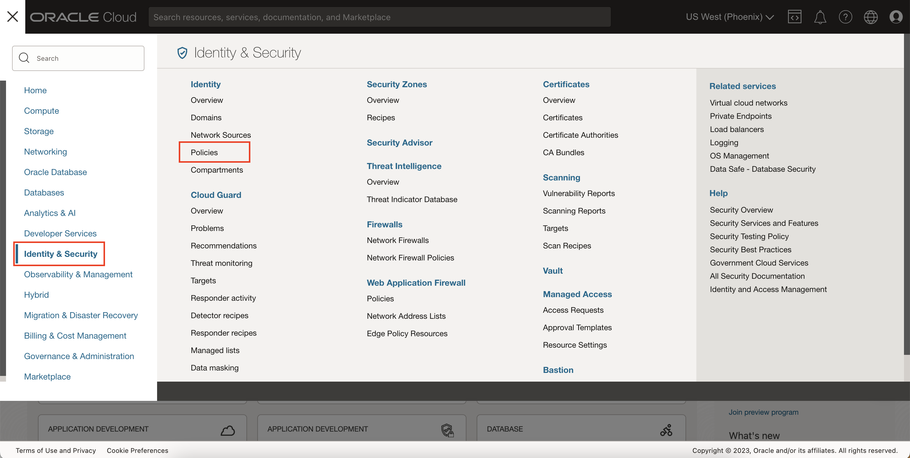
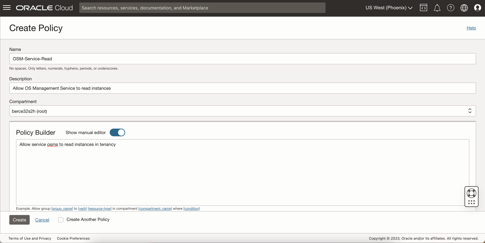
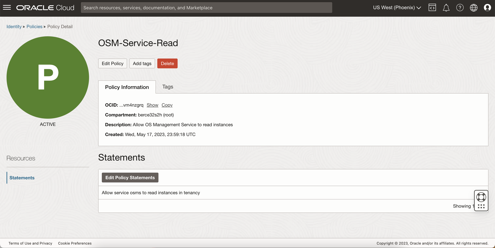
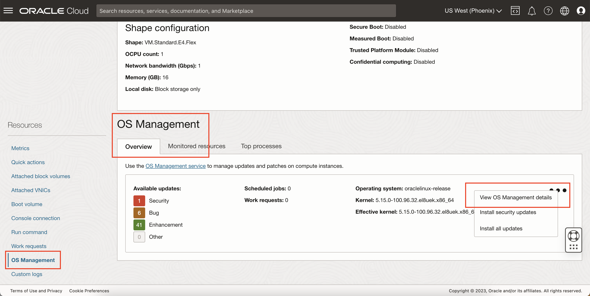
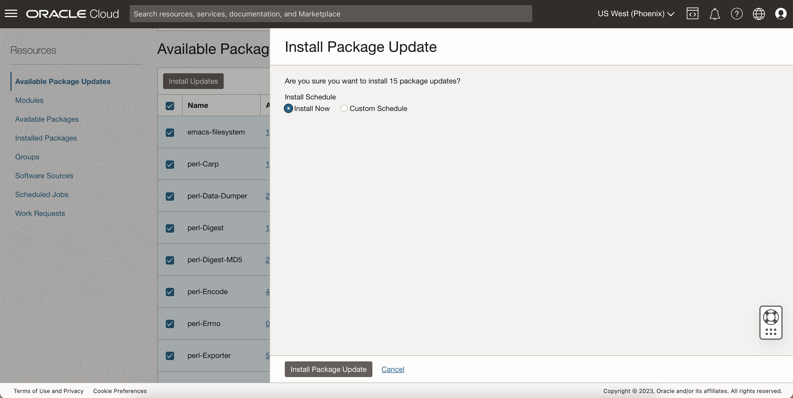

# Use OS Management For Patches and Updates

## Introduction

This lab will walk you through enabling the OS Management service on your WordPress instance and show you how you can download software packages for upgrading and patching. The OS Management agent is a useful tool that will help you in future development as well as providing you suggested package updates for a variety of reasons. Currently, it will recommend updates based on one of the following reasons: Security, Bug, Enhancement, or Other. The tool will let you install these and any other packages you want to install based on a schedule you can define.

Estimated Time: 15 minutes

### Objectives

In this lab, you will:
* Enable the OS Management service
* Download software packages to your instance

### Prerequisites (Optional)

This lab assumes you have:
* An Oracle Cloud account
* All previous labs successfully completed

## Task 1: Create a Dynamic Group For Your WordPress Instance(s)

1. Click Navigation


  Select Identity & Security


  Under Identity, select Domains

	

2. Click the "Default" domain or optionally create a new domain

  

3. Go to Dynamic Groups and click "Create dynamic group"

  

4. Fill out the dynamic group name and matching rules


  For the dynamic group matching rules, you can either include individual instance through their instance OCID, or include every instance inside a compartment by the compartment's OCID. Use the rule(s) you prefer. However, this lab will use the compartment for the rule.

  ```
  <copy>Any {instance.compartment.id = 'ocid1.compartment.oc1..exampleuniqueid’}</copy>
  ```

  

  > Note: You can find the instance or compartment OCID by navigating to the respective OCI console page.

5. Click Create

  

## Task 2: Create Required Policies

1. Click Navigation


  Select Identity & Security


  Under Identity, select Policies

	

2. Click Create Policy

3. Fill out the following policy information:

    - Name: WordPressDG-OSM-Access
    - Description: WordPress Dynamic Group access for OS Management Service
    - Compartment: Select your compartment
    - Show manual editor: On
    - Policy Builder: Insert the following 2 lines

  ```
  <copy>Allow dynamic-group <dynamic_group_name> to read instance-family in compartment <compartment_name></copy>
  ```

  ```
  <copy>Allow dynamic-group <dynamic_group_name> to use osms-managed-instances in compartment <compartment_name></copy>
  ```

  

4. Click Create

  

5. Create one more policy using the following info:

    - Name: OSM-Service-Read
    - Description: Allow OS Management Service to read instances
    - Compartment: Select your root compartment
    - Show manual editor: On
    - Policy Builder: Insert the following line

  ```
  <copy>Allow service osms to read instances in tenancy</copy>
  ```

  

6. Click Create

  

## Task 3: Enable OS Management On Your Compute Instance

1. Go to your WordPress compute instance console page

2. Under the Oracle Cloud Agent tab, enable the OS Management Agent if not already enabled.

  

3. In your terminal, SSH into your WordPress instance like you did in the previous labs.

  ```
  <copy>ssh WordPressServer</copy>
  ```

4. Restart the Oracle Cloud Agent by running the following command:

  ```
  <copy>sudo systemctl restart oracle-cloud-agent.service</copy>
  ```

  > Note: It can take up to 10 minutes for the change to take effect.

5. Validate whether your instance can reach the OS Management ingestion service.

  ```
  <copy>curl https://ingestion.osms.<region>.oci.oraclecloud.com/</copy>
  ```


  For <region>, specify the region identifier (for example, us-phoenix-1). See [Regions and Availability Domains](https://docs.oracle.com/en-us/iaas/Content/General/Concepts/regions.htm) for more information about region identifiers.


  The 403 Forbidden status code message is expected in the output.

  

6. Check if the OSM Agent is enabled and active using:

  ```
  <copy>systemctl is-enabled oracle-cloud-agent && systemctl is-active oracle-cloud-agent</copy>
  ```

7. Back on the OCI console WordPress page, go to OS Management under Resources.

  

## Task 4: Installing Recommended Packages with OS Management

1. Select the 3 dots on the right of the OS Management section, and click View OS Management details.

2. On the OS Management instance page, take note of the suggested package updates.

  


  Clicking the links under the version and the notice type will provide you more information about the packages, affected modules, and affected OSM-enabled instances. Also notice the type of recommendation, which can be one of four: Security, Bug, Enhancement, or Other.

3. Select the recommended security update and then click Install Updates.

  

4. Notice you can install now or on a custom schedule. For this lab, choose Install Now and then click Install Package Update.

  

  

5. Your packages should now be installing. Wait for them to finish.

  

6. Success! You have successfully installed a recommended package using the OS Management service.

  

You may now **proceed to the next lab.**

## Acknowledgements
* **Author** - Bernie Castro, Cloud Engineer
* **Last Updated By/Date** - Bernie Castro, May 2023
