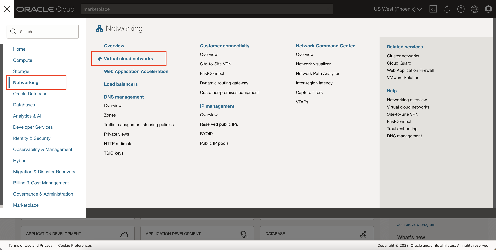
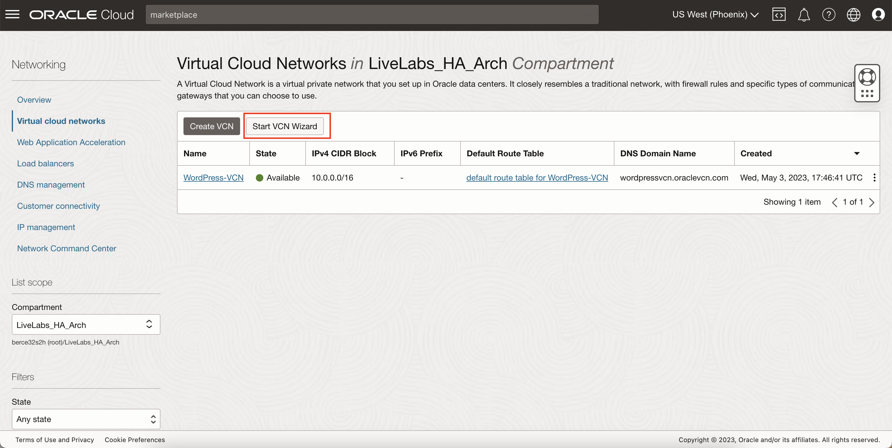
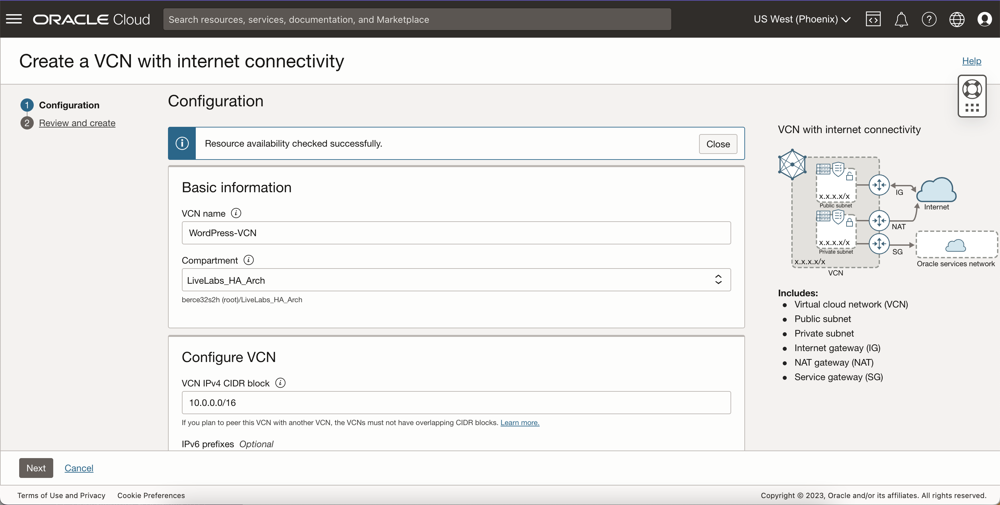
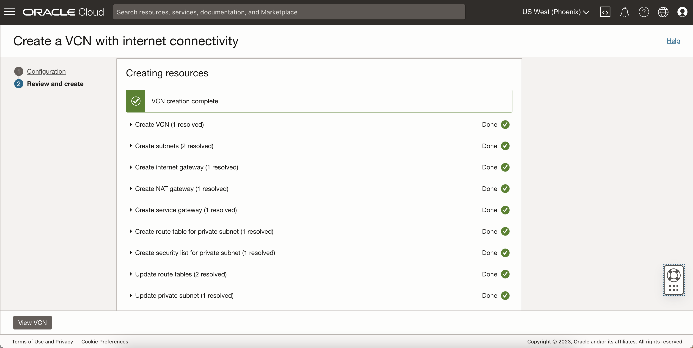
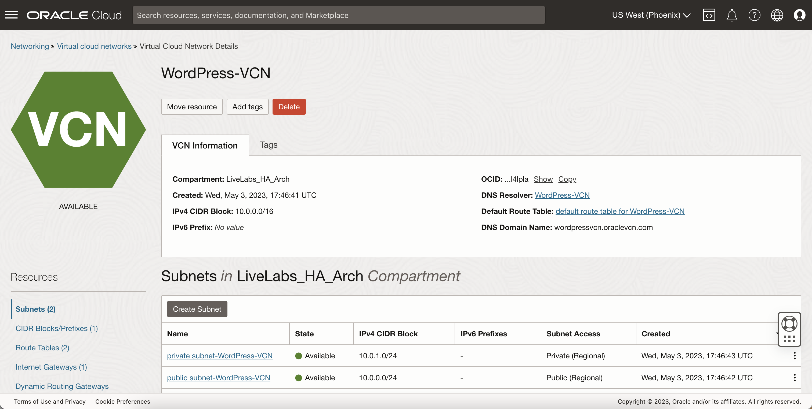
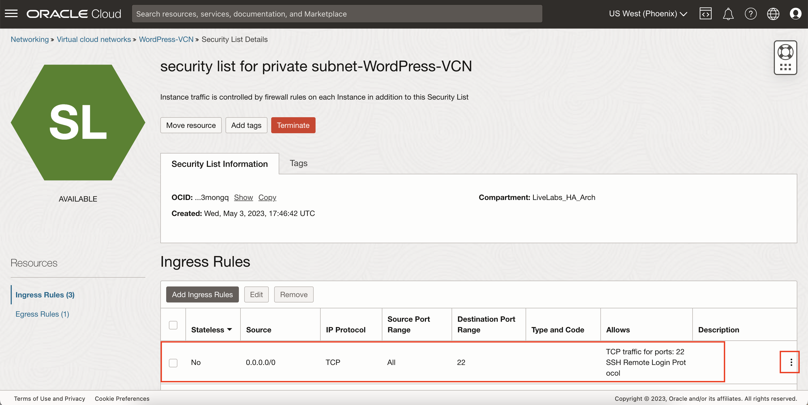

# Create a Virtual Cloud Network

## Introduction

This lab walks you through the steps to create a Virtual Cloud Network (VCN) on the OCI Console that will allow the desired connectivity to your instances.

Estimated Time: -- minutes

### Objectives

In this lab, you will:
* Create a Virtual Cloud Network using the VCN Wizard
* Edit Security Lists to Allow SSH and HTTP connections
* Configure a Network Security Group to allow MySQL connections

### Prerequisites

* An Oracle Cloud account
* Login to the OCI Dashboard
* A Child Compartment in your OCI Tenancy for this Lab (optional)

## Task 1: Create a Virtual Cloud Network using the VCN Wizard

1. Click Navigation

  Select Networking

  Select Virtual Cloud Networks

	

2. Click **Start VCN Wizard**

  

3. Select 'Create VCN with Internet Connectivity' then click 'Start Wizard'

  

4. Fill out the 'Configuration' page
  * VCN Name: *WordPress-VCN*
  * Compartment: *Select Your Compartment*

  

    Click 'Next'

5. Review VCN, Subnets, and Gateways

6. Click 'Create' to create the VCN
	> **Note:** This step should take less than a minute

  

7. Click 'View Virtual Cloud Network' to display the created VCN

  

## Task 2: Configure Security Lists

1. In the WordPress-VCN page, go to 'Security Lists'

  Click the security list for the **private subnet**

  

2. Edit the default SSH (port 22) ingress rule

  

    - CIDR Block: 10.0.0.0/24 (Public Subnet's CIDR Block)
    - Description: Allows SSH Access from the Public Subnet Only

  

3. Click 'Add Ingress Rules' and add the following rule

  

    - Stateless: unchecked
    - Source CIDR: 10.0.0.0/24 (CIDR block for public subnet)
    - IP Protocol: TCP
    - Destination Port: 80
    - Description: Allows HTTPs Access from the Public Subnet Only

  

4. Go back to the WordPress-VCN 'Security Lists' page

  Click the security list for the **public subnet**

  

5. Click 'Add Ingress Rules'

  Add the following rule:

    Rule 1:
    - Stateless: unchecked
    - Source CIDR: 0.0.0.0/0
    - IP Protocol: TCP
    - Destination Port: 80
    - Description: Allows HTTPs Access from the Public Internet

    

    Add the Ingress Rule

6. Allow  SSH Access Into Your Public Subnet From a Specific Set of IP Addresses (optional)
    > **Note:** This step is a recommended best practice when implementing an actual architecture you do not want getting hacked or reached by unknown entities. Performing this step will only allow a certain set of IP addresses you define to reach your public subnet's resources.

  In the **public subnet** security list, edit the SSH (port 22) ingress rule:

    

  Source CIDR: 0.0.0.0/0 -> <your desired public IP Range>

  For example, if you only wanted your local computer to SSH into the public subnet's resources:
   - 10.10.10.10/32

## Task 3: Create a Network Security Group for MySQL Connections

1. Go back to the WordPress-VCN and go to 'Network Security Groups'

  

2. Click 'Create Network Security Group'

  Fill in a name (i.e MySQL-NSG) and click 'Next'

  

3. Add the following rule:
    - Stateless: unchecked
    - Direction: Ingress
    - Source CIDR: 10.0.0.0/24
    - IP Protocol: TCP
    - Destination Port: 3306, 33060
    - Description: Allows MySQL Port Access from Public Subnet Only

    

4. Click 'Create'

Congratulations! You have successfully set up your VCN! Please proceed with the next lab

## Acknowledgements
* **Author** - <Bernie Castro, Cloud Engineer>
* **Last Updated By/Date** - <Bernie Castro, May 2023>
