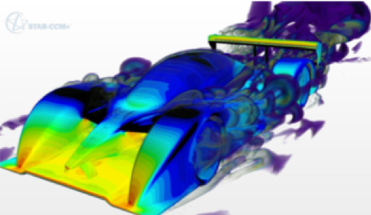
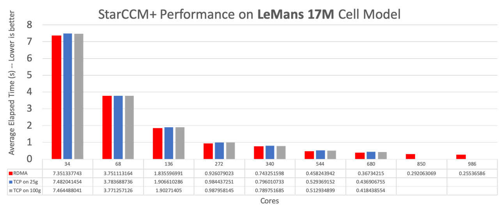
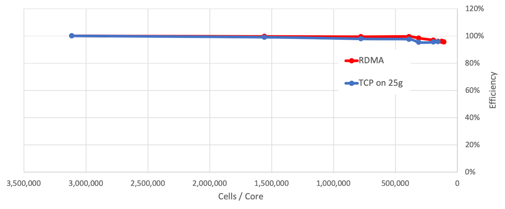

## **Benchmark Example**

Performances of STAR-CCM+ are often measured using the LeMans benchmark with 17 and 105 Millions cells. The next graphs are showing how using more nodes impact the runtime, with a scaling really close to 100%. RDMA network, which has not been discussed in this runbook, only start to differentiate versus regular TCP runs if the Cells / Core ratio starts to go down.

**17 Million Cells**

**105 Million Cells**

## Acknowledgements
* **Author** - High Performance Compute Team
* **Contributors** -  Chris Iwicki, Harrison Dvoor, Gloria Lee, Selene Song, Bre Mendonca, Samrat Khosla
* **Last Updated By/Date** - Samrat Khosla, October 2020

