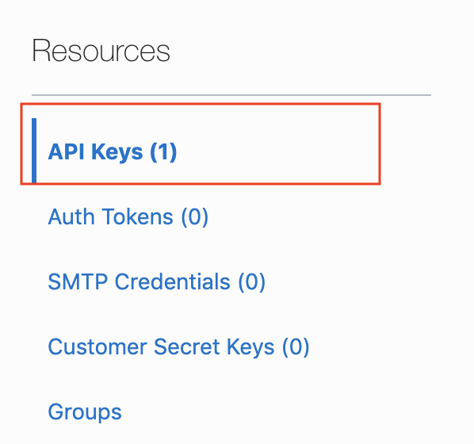
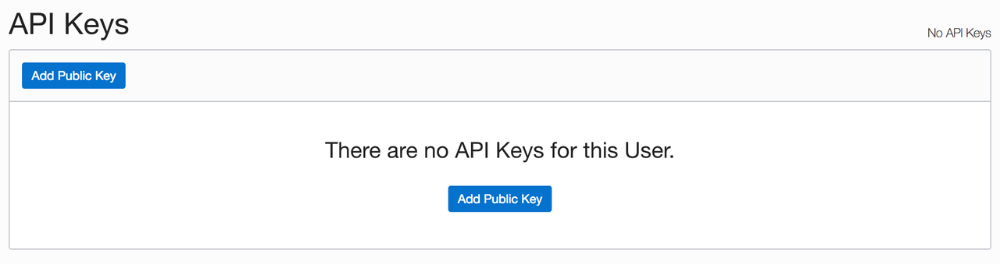
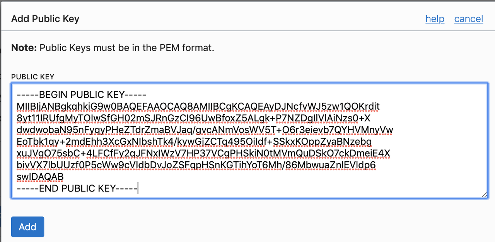
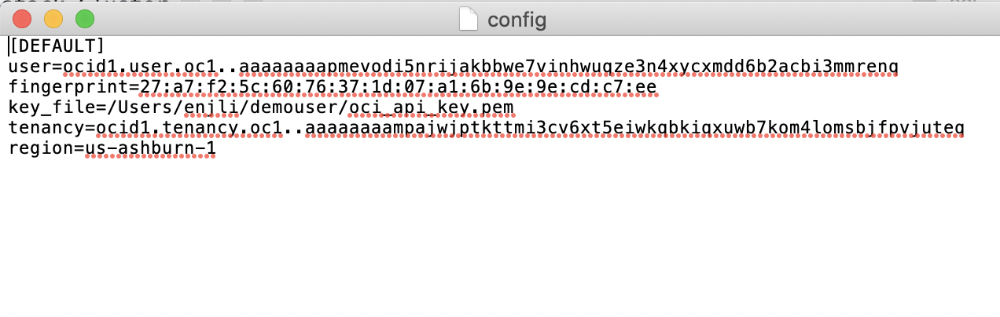
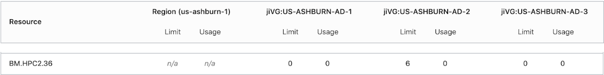

# Use OCI CLI commands and Terraform to work with HPC

## Introduction 

`ocihpc` is a tool for simplifying deployments of HPC applications in Oracle Cloud Infrastructure (OCI).
The HPC Command Line Interface (CLI) enables you to use a single command to deploy HPC clusters of any size with our dedicated bare metal HPC compute instances and Mellanox RDMA networking. You don’t need to understand Terraform or Oracle Cloud Infrastructure Resource Manager to use the HPC CLI. It’s built on top of the core Oracle Cloud Infrastructure CLI, and includes prebuilt Terraform scripts.

Benefits of using HPC CLI include:

1. Fast Launch a complete compute cluster with RDMA over converged Ethernet (RoCE) v2 quickly through a single command.
2. Easy to Use No knowledge of Terraform or Oracle Cloud Infrastructure Resource Manager required to launch a basic cluster network.
3. Supports Message Passing Interface (MPI) Deployment includes a complete set of software packages for running parallel processing with RDMA, including Mellanox OFED with Open MPI, Intel MPI, and Platform MPI.
4. Customizable You can execute your own terraform scripts or add to the existing scripts provided with the tool to install your own applications.

Estimated Lab Time: 60 minutes

### Objectives

As a Developer or Data Engineer,

1. Deploy HPC Cluster Network using Oracle Command Line Interface
2. View, run and manage the Stack via Cli

### Prerequisites

1. An Oracle Cloud Infrastructure account that has user credentials sufficient to execute a Terraform stack. 
2. Generated SSH keys

### Policies

The OCI user account you use in `ocihpc` should have the necessary policies configured for OCI Resource Manager. Please check [this link](https://docs.cloud.oracle.com/en-us/iaas/Content/Identity/Tasks/managingstacksandjobs.htm) for information on required policies.


## Task 1: Installing ocihpc on macOS/Linux

1. Download the latest release with the following command and extract it:
    ```sh
    $ curl -LO https://github.com/oracle-quickstart/oci-ocihpc/releases/download/v1.0.0/ocihpc_v1.0.0_darwin_x86_64.tar.gz
    ```
2. Unzip the file you downloaded in Step 1.
    ```sh
    $ gunzip -c ocihpc_v1.0.0_darwin_x86_64.tar.gz | tar xopf -
    ```


3. Make the ocihpc binary executable.
    ```sh
    $ chmod +x ./ocihpc 
    ```

4. Move the ocihpc binary to your PATH.
    ```sh
    $ sudo mv ./ocihpc /usr/local/bin/ocihpc 
    ```

5. Test that it works.
    
    ```sh
    $ ocihpc version 
    ```

## Task 2: Installing ocihpc on Windows

1. Download the latest release from [this link](https://github.com/oracle-quickstart/oci-ocihpc/releases/download/v1.0.0/ocihpc_v1.0.0_windows_x86_64.zip) and extract it.

2. Add the ocihpc binary to your PATH.

3. Test that it works.
    
    ```sh
    $ ocihpc.exe version 
    ```

## Task 3: Creating an ssh keypair on the Command Line

Please refer to [this link](https://docs.cloud.oracle.com/en-us/iaas/Content/GSG/Tasks/creatingkeys.htm) if you are using windows.

1. Open a shell or terminal for entering the commands.


2. Navigate to your .oci folder
    ```sh
    $ cd Users/enjli/.ssh
    ```

3. If you haven't already created the folder, create a .ssh directory to store the credentials:
    ```sh
    $ mkdir Users/enjli/.ssh
    ```

4. If you don't see any id_rsa key pairs in the folder, enter the following command and provide a name and passphrase when prompted. The keys will be created with the default values: RSA keys of 2048 bits.


    ```sh
    $ ssh-keygen
    ```


## Task 4: Generate an API Signing Key

Your API requests will be signed with your private key, and Oracle will use the public key to verify the authenticity of the request.
Please refer to [this link](https://docs.cloud.oracle.com/en-us/iaas/Content/API/Concepts/apisigningkey.htm#Other) if you are using windows.


1. If you haven't already, create a .oci directory to store the credentials:
    ```sh
    $ mkdir Users/enjli/.oci
    ```

2. Generate the private key with  following commands.
    ```sh
    $ openssl genrsa -out ~/.oci/oci_api_key.pem 2048
    ```
3. Ensure that only you can read the private key file:
    ```sh
    $ chmod go-rwx ~/.oci/oci_api_key.pem
    ```

4. Generate the public key:
    
    ```sh
    $ openssl rsa -pubout -in ~/.oci/oci_api_key.pem -out ~/.oci/oci_api_key_public.pem
    ```

## Task 5: Add public key to Oracle Cloud Infrastructure

Now that you have a private / public key combo , you must add it to OCI console under user setting:

1. Navigate to your .oci folder containing `oci_api_key_public.pem`,  copy the public key.

2. Login to your OCI console and click on Menu and select Identity and Users. Select a User and navigate to User Detail page.

3. Click on Add Public Key under API Keys section.



4. Paste Public key which you copied from CLI in Add Public Key


## Task 6: Configure

This step describes the required configuration for the CLI and includes optional configurations that enable you to extend CLI functionality.

1. Before using the CLI, you have to create a config file in your .oci folder that contains the required credentials for working with your Oracle Cloud Infrastructure account. You can create this file using a setup dialog or manually, using a text editor.

2. Run *ocihpc configure* to check if you have a valid configuration to access OCI. The tool will walk you through creating a configuration.

  You will be notified where your config file is written to:

  *Configuration file saved to: /Users/enjli/.oci/config*

  In order to create your config file, you will need:
      1. Your user OCID (found in profile section at the top right of the screen under > user settings > user information tab),
      2. Tenancy OCID (Administration > Tenancy Details > Tenancy Information tab),
      3. The region you are working out of (i.e. us-phoenix-1, us-ashburn-1, etc.),
      4. User's fingerprint(found in user information tab),
      5. Path to your API private signing key. 
   
  An example `config` file would look like this:
  

## Task 7: List

You can get the list of available stacks by running `ocihpc list`.

Example:

    ```
    sh
    $ ocihpc list

    List of available stacks:

    ClusterNetwork
    Gromacs
    OpenFOAM
    ```

## Task 8: Initialize

1. Create a folder that you will use as the deployment source.

IMPORTANT: Use a different folder per stack. Do not initialize more than one stack in the same folder. Otherwise, the tool will overwrite the previous one.

2. Change to that folder and run `ocihpc init <stack name>`. `ocihpc` will download the necessary files to that folder.


    ```
    $ mkdir ocihpc-test
    $ cd ocihpc-test
    $ ocihpc init --stack ClusterNetwork

    Downloading stack: ClusterNetwork

    ClusterNetwork downloaded to /Users/enjli/ocihpc-test/

    ```
**IMPORTANT**: Edit the contents of the /Users/enjli/ocihpc-test/config.json file before running ocihpc deploy command

## Task 9: Deploy

1. Before deploying, you need to change the values in `config.json` file. The variables depend on the stack you deploy. An example `config.json` for Cluster Network would look like this:

    ```json
    {
      "variables": {
        "ad": "kWVD:PHX-AD-1",
        "bastion_ad": "kWVD:PHX-AD-2",
        "bastion_shape": "VM.Standard2.1",
        "node_count": "2",
        "ssh_key": "ssh-rsa AAAAB3NzaC1yc2EAAAA......W6 enjli@enjli-mac"
      }
    }
    ```

2. To modify your `config.json` file, navigate to your newly created directory (ocihpc-test in this case) and open the “config.json” file using texteditor or notepad.


Note that this is not the same config file we configured in step 1.

For this config file, we will need:
  1. The availability domain information that contains the HPC resources in our tenancy (Administration > Tenancy Details > Scroll down to the Service Limits section > Compute > and scroll down to find “BM.HPC2.36”) - In the screenshot below, we can see that we have a total of 6 BM.HPC2.36 machines to use in AD-2, 0 of which are currently in use.
  

  2. The Bastion AD can be any AD you chose as long as there are resources (VM.standard2.1 shape)
Bastion shape should be filled in already - VM.Standard2.1
  3. Node count - for the purposes of this lab, we will go with 2 so as to use up all HPC resources
  4. Our public ssh key 

**Notes**
  1. After you change the values in `config.json`, you can deploy the stack with `ocihpc deploy <arguments>`. This command will create a Stack on Oracle Cloud Resource Manager and deploy the stack using it.

  2. For supported stacks, you can set the number of nodes you want to deploy by adding it to the `ocihpc deploy` command. If the stack does not support it or if you don't provide a value, the tool will deploy with the default numbers. 

  3. For example, the following command will deploy a Cluster Network with 5 nodes:

      ```
      $ ocihpc deploy --stack ClusterNetwork --node-count 5 --region us-ashburn-1 --compartment-id ocid1.compartment.oc1..6zvhnus3q
      ```

  4. The tool will generate a deployment name that consists of `<stack name>-<current directory>-<random-number>`.

      Example:

      ```
      $ ocihpc deploy --stack ClusterNetwork --node-count 5 --region us-ashburn-1 --compartment-id ocid1.compartment.oc1..6zvhnus3q

      Deploying ClusterNetwork-ocihpc-test-7355 [0min 0sec]
      Deploying ClusterNetwork-ocihpc-test-7355 [0min 17sec]
      Deploying ClusterNetwork-ocihpc-test-7355 [0min 35sec]
      ...
      ```


## Task 10: Connect

When deployment is completed, you will see the the bastion/headnode IP that you can connect to:

    ```
    $ Successfully deployed ClusterNetwork-ocihpc-test-7355

    $ You can connect to your head node using the command: ssh opc@$123.221.10.8 -i <location of the private key you used>
    ```

You can also get the connection details by running `ocihpc get ip` command.

## Task 11: Manage
In addition, you can use cli commands to easily manage and keep tracks of your resources:

  1. To generate a list of all the stacks deployed in a specific compartment: `oci resource-manager job list -c [OCID OF COMPARTMENT]`

  2. To generate a list of jobs in a stack or compartment, ordered by time created: `oci resource-manager job list -c [COMPARTMENT OCID]`

  3. To review a job along with the job details: `oci resource-manager job get --job-id [OCID OF THE JOB]`

  4. To view log entries for the specified job in JSON format: `oci resource-manager job get-job-logs --job-id [OCID OF THE JOB]`

  5. To move a Stack and it's associated Jobs into a different compartment: `oci resource-manager stack change-compartment -c [OCID OF NEW COMPARTMENT] --stack-id [OCID OF THE STACK]`


## Task 12: Delete
When you are done with your deployment, you can delete it by changing to the stack folder and running `ocihpc delete --stack <stack name>`.

    Example:
    ```
    $ ocihpc delete --stack ClusterNetwork

    Deleting ClusterNetwork-ocihpc-test-7355 [0min 0sec]
    Deleting ClusterNetwork-ocihpc-test-7355 [0min 17sec]
    Deleting ClusterNetwork-ocihpc-test-7355 [0min 35sec]
    ...

    Successfully deleted ClusterNetwork-ocihpc-test-7355
    ```

All Done! You have successfully deployed your first High Performance Compute Instance using OCI CLI tool.

*You may now proceed to the next lab*

This is detailed information about managing High Performance Compute Instance. For a complete command reference, check out OCI documentation [here](https://docs.cloud.oracle.com/en-us/iaas/Content/Compute/Tasks/managingclusternetworks.htm?Highlight=hpc).

## Acknowledgements
* **Author** - High Performance Compute Team
* **Contributors** -  Chris Iwicki, Harrison Dvoor, Gloria Lee, Selene Song, Bre Mendonca
* **Last Updated By/Date** - Harrison Dvoor, October 2020


