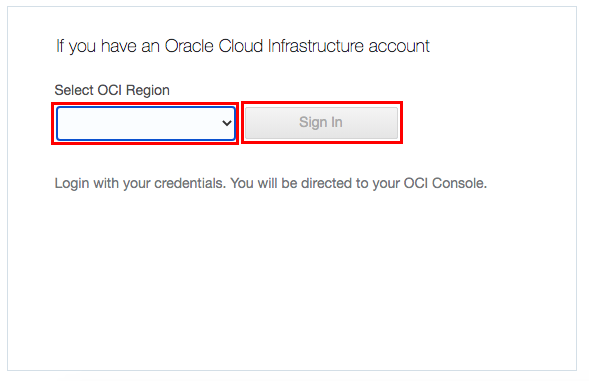
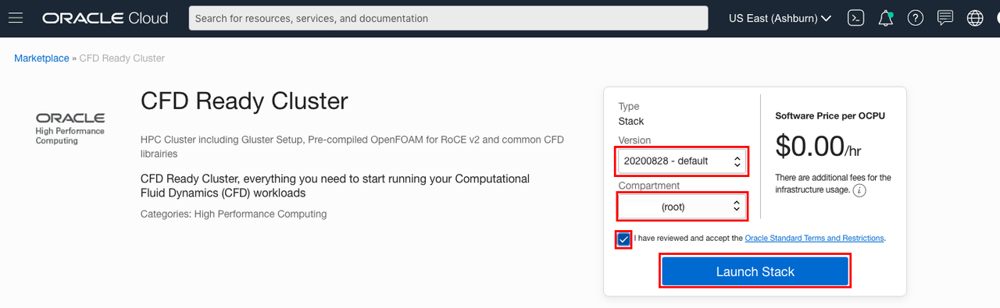
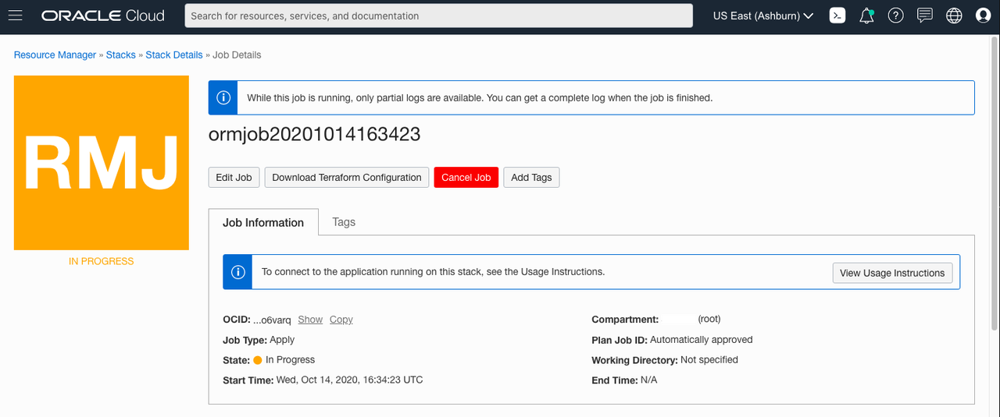

# Launch HPC Cluster Network

## Introduction

There are many ways to launch an HPC Cluster Network, this solutions guide will cover two different methods:

* Via Marketplace
* Manually Depending on your OS, you will want to go with a specific method. If the HPC Cluster Network marketplace image or our OCI HPC CN Terraform scripts are used, this is for Oracle Linux 7 only. If you want to use CentOS, Ubuntu or another OS, manual configuration is required.

Estimated Lab Time: 30 minutes

### Objectives

In this lab:
* We will walk you through the different steps required to launch a High Performance Computing(HPC) Cluster Network on OCI  

### Prerequisites

* Familiarity with Oracle Cloud Infrastructure (OCI) is helpful
* Familiarity with networking is helpful

## **OPTION 1**: Creation of Cluster Network through Marketplace

Marketplace holds applications and images that can be deployed with our infrastructure. For customers that want to use Oracle Linux, an HPC Cluster Network image is available and can be launched from directly within marketplace. We suggest launching the [CFD Ready Cluster](https://cloudmarketplace.oracle.com/marketplace/en_US/listing/75645211) that will contain librairies needed for CFD.

1. Within marketplace, select Get App at the top right.
    

2. Select the OCI Region then click Sign In.
    

3. After signing in, verify the version of the HPC Cluster image and then select the Compartment where the cluster will be launched. Accept the terms and conditions, then Launch Stack.

    

4. Fill out the remaining details of the stack:
    * Select the desired AD for the compute shapes and the bastion.
    * Copy-paste your public ssh key
    * Type in the number of Compute instances for the cluster
    * Uncheck Install OpenFOAM
    * If you need more than 6TB of Shared disk space, check GlusterFS and select how many servers you would  need. (6TB per server)

5. Click Create.

6. Navigate to Terraform Actions then click Apply. This will launch the CN provisioning.

    

7. Wait until the job shows ‘Succeeded’ then navigate to Outputs to obtain the bastion and compute node private IP’s.

## **OPTION 2**: Creation of Cluster Network through Manual Configuration

Marketplace holds applications and images that can be deployed with our infrastructure. For customers that want to use Oracle Linux, you can manually create a cluster network as follows:

1. Select the OCI Region on the top right.
2. In the main menu, select Networking and Virtual Cloud Networks

3. Click on Start VCN Wizard, and select VCN with Internet Connectivity

4. Choose and name, the right compartment, and use 172.16.0.0/16 as VCN CIDR, 172.16.0.0/24 for Public Subnet and 172.16.1.0/24 for Private Subnet. Click **Next** then **Create**.

5. In the main menu, select Compute, Instances, then Create Instance

6. Select **Change Image** and select Oracle Linux 7 - HPC Cluster Networking Image, under the Oracle Image tab. 

7. Select the Availability Domain in which you can spin up a BM.HPC2.36 instance
8. Change the shape to BM.HPC2.36 under Bare Metal and Specialty
9. Select the VCN and the public subnet you created.
10. Add a public key to connect to the instance. This key will be used on all compute instances.
11. Once the machine is up, click on the created instance. Under More Actions, select Create Instance Configuration. You can now terminate the instance under More Actions.
12. In the main menu, select Compute, then Cluster Networks
13. Click Create Cluster Network and fill in all the options. Use the VCN, private subnet and instance configuration that you just created. Select the AD in which you can launch BM.HPC2.36 instances.
14. Launch the cluster network.
15. While it is loading, create another instance under Main Menu, Compute and Instances.
16. Put it in the public subnet that was just created, using your public key and shape should be VM.Standard2.1 or similar. This will be the bastion that we will use to connect to the cluster.
17. SCP the key to the cluster on the bastion at /home/opc/.ssh/cluster\_key and copy it also to /home/opc/.ssh/id\_rsa
18. Install the Provisioning Tool on the bastion via the following command:
    
    ```
    <copy>
    sudo rpm -Uvh https://objectstorage.us-ashburn-1.oraclecloud.com/n/hpc/b/rpms/o/oci-hpc-provision-20190905-63.7.2.x86_64.rpm
    </copy>
    ```
19. Navigate to Compute then Instance Pools in the Console and collect all the IP addresses for the cluster network pool. Or use this command on the bastion if you have nothing else running on your private subnet.

    ```
    <copy>
    for i in `nmap -sL Private_Subnet_CIDR | grep "Nmap scan report for" | grep ")" | awk '{print $6}'`;do echo ${i:1:-1} >> /tmp/ips; done
    </copy>
    ```

20. Install the Provisioning Tool via the following command:

    ```
    <copy>
    ips=`cat /tmp/ips`
    /opt/oci-hpc/setup-tools/cluster-provision/hpc_provision_cluster_nodes.sh -p -i /home/opc/.ssh/id_rsa $ips
    </copy>
    ```
    
## Acknowledgements
* **Author** - High Performance Compute Team
* **Contributors** -  Chris Iwicki, Harrison Dvoor, Gloria Lee, Selene Song, Bre Mendonca, Samrat Khosla
* **Last Updated By/Date** - Samrat Khosla, October 2020

