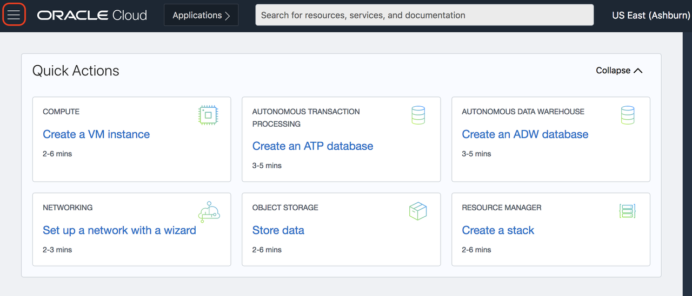
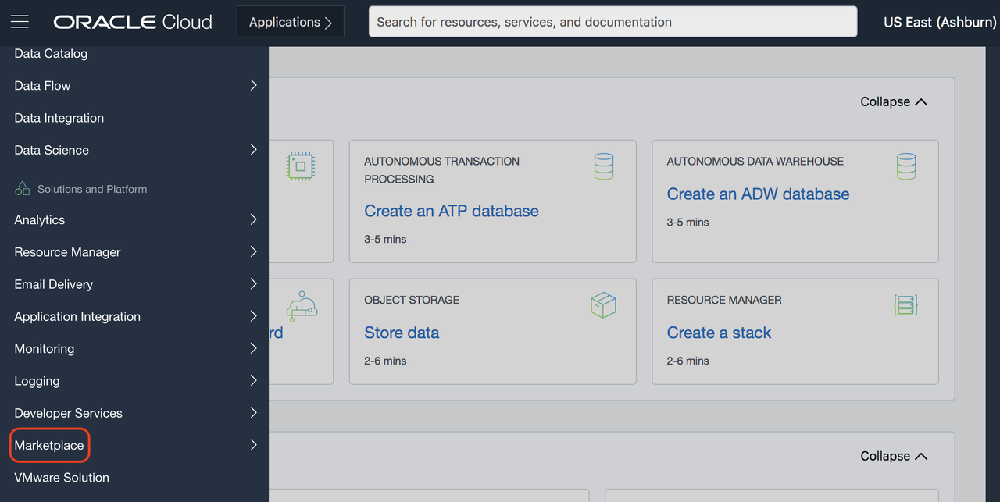
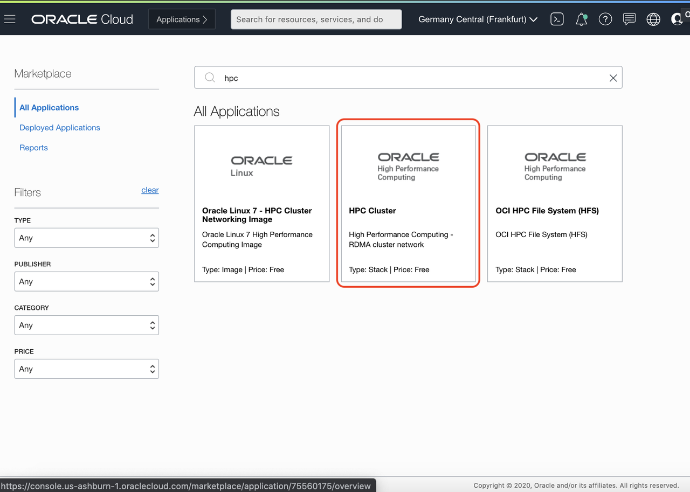
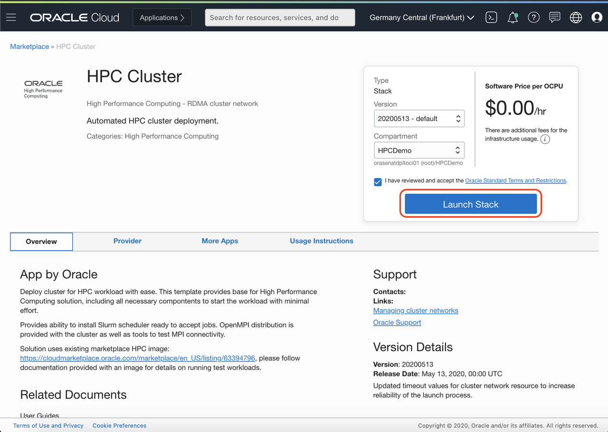
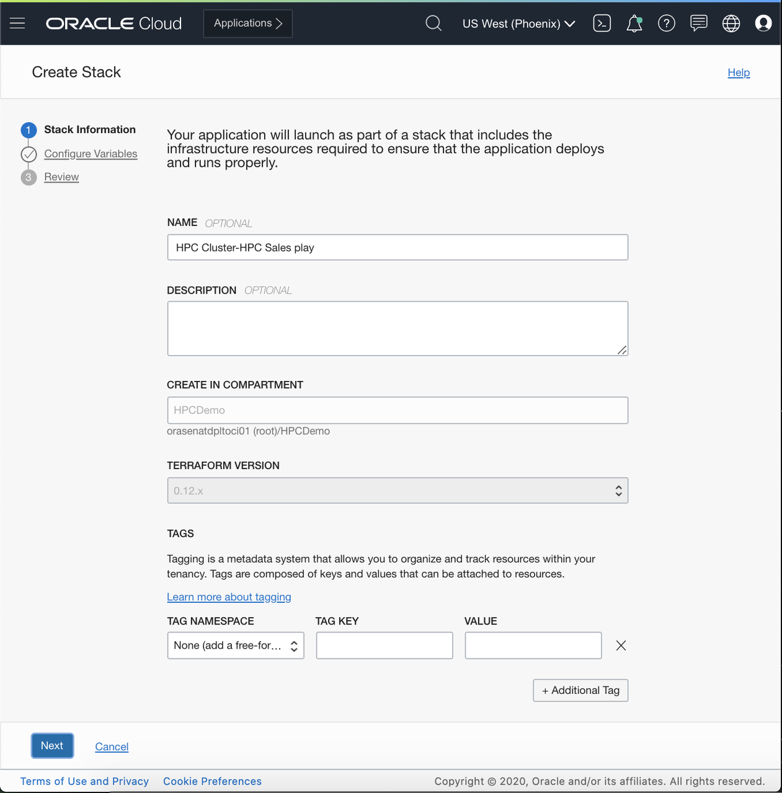
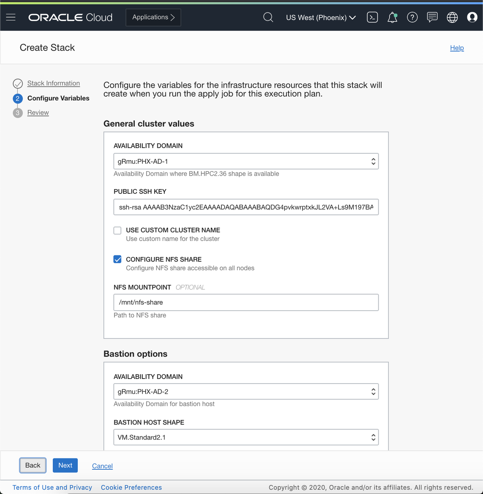
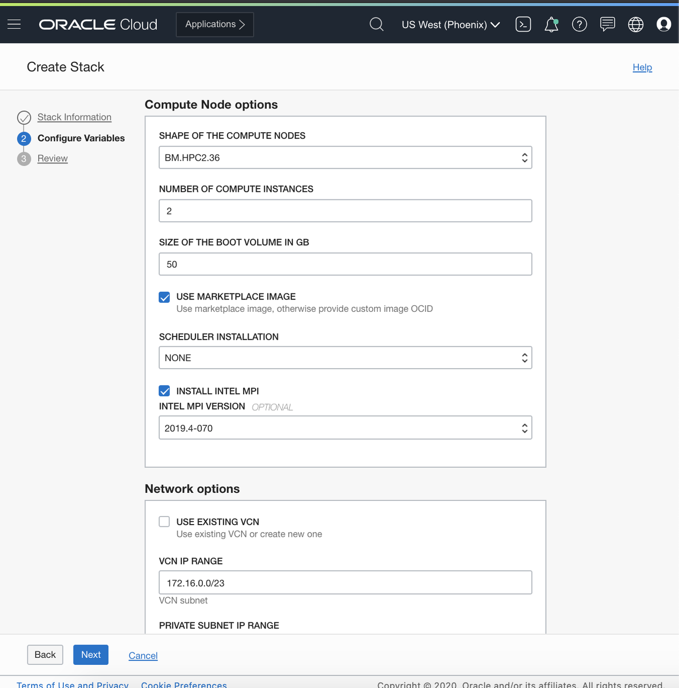
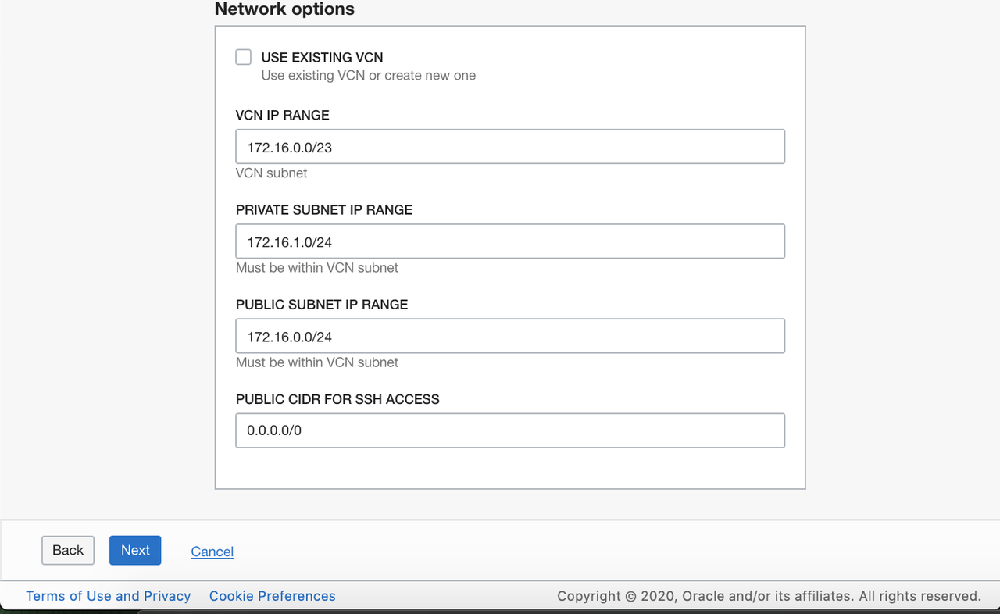
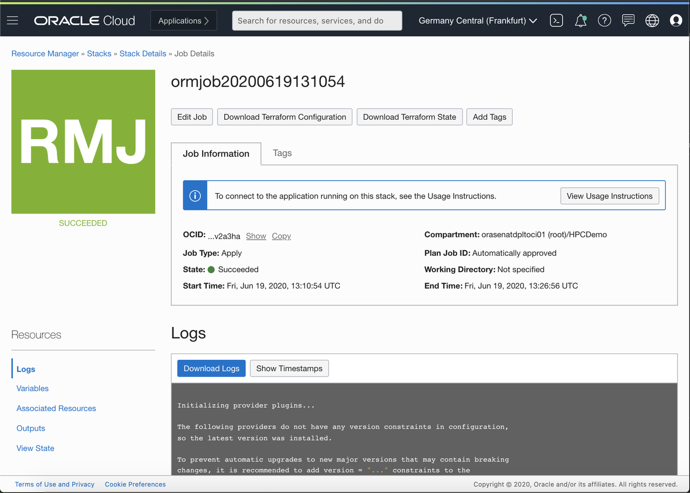
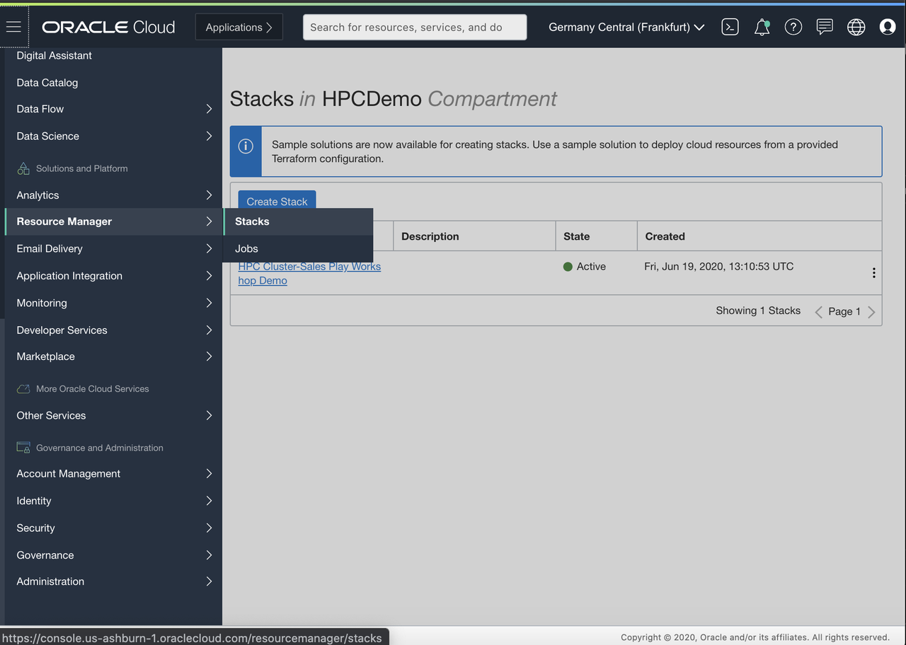

# Provision HPC Cluster from Oracle Marketplace Image

## Introduction

In this lab you will be provisioning an HPC Cluster from the OCI Marketplace. The OCI Marketplace is a one-stop shop for a wide variety of industry solutions that can easily be deployed within our cloud console. Here you will be leveraging this marketplace for Automated HPC Cluster Deployment. The template from the marketplace provides a base for a High Performance Computing solution, including all necessary components to start a workload with minimum effort. As these labs progress, you will see how such a baseline can be integrated and utilized by third party applications to accelerate your workflow.

Estimated Lab Time: 60 minutes

### Objectives

As a Developer or Data Engineer, 

- Navigate to OCI Marketplace
- Deploy HPC Cluster image from the OCI Marketplace
- View and Run a Stack on OCI

### Prerequisites

- An Oracle Cloud Infrastructure account with privileges to create an instance VM standard 2.1 or BM.HPC2.36 shape. 

## Task 1: Navigate to the OCI Marketplace
1. Click the Hamburger Menu (≡) on the top left corner.
 
2. Scroll down and click Marketplace.

3. Search the marketplace for **HPC** and select HPC Cluster.

4. Review the and accept the **Oracle Standard Terms and Restrictions** and
click **Launch Stack**.

## Task 2: Configure the HPC Stack
After launching the stack you'll be redirected to the Create Stack Wizard where you'll fill in the Stack information.

1. In **Stack Information** give the Stack a name and *(optionally)* specify to deploy in a compartment that you are currently not in.

2. Select the desired **AD** for the compute shapes and the bastion.

3. Copy-paste your public **ssh key**

4. Type in the number of **Compute Instances** for the cluster

5. Under **Network Options** leave the defaults

6. Click **Next** to review the configuration.

7. Click **Create**

**Note:** It will take approximately 15 minutes to provision the Stack.

## Task 3: View the running Stack

Once you've created the Stack it will redirect you to a page where you can view the stack job running. It should look something like below. Here you can view:
1. **Logs**
2. **Variables** passed to or generated by the Terraform script
3. **Associated Resources** provisioned by the Terraform script
4. **Outputs**
5. **View State** of the job

 

 To navigate to this page where you can view all your Stacks in your current compartment click on the Hamburger Menu (≡) on the top left and under **Solutions and Platform** hover over **Resource Manager** > **Stacks**.

 

All Done! This completes the demo for provisioning an HPC Cluster from Oracle Marketplace Image. 

*You may now proceed to the next lab*

## Acknowledgements
* **Author** - High Performance Compute Team
* **Contributors** -  Chris Iwicki, Harrison Dvoor, Gloria Lee, Selene Song, Bre Mendonca
* **Last Updated By/Date** - Harrison Dvoor, October 2020

