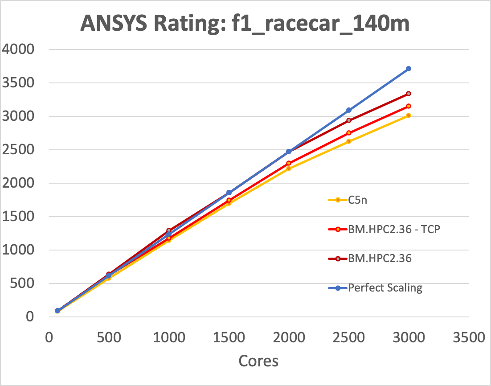

# Run ANSYS Fluent

## Introduction
In this lab, you will Run ANSYS Fluent.

Estimated Lab Time: 10 minutes

### Objectives

In this final lab:
* We will walk you through the different steps for running the ANSYS Fluent Software on OCI, and later showcase the Fluent software performance on OCI using a benchmark example

### Prerequisites

* Complete Lab 7 : Install ANSYS Fluent 
* Familiarity with Oracle Cloud Infrastructure (OCI) is helpful
* Familiarity with networking is helpful

## Task 1: Running ANSYS Fluent
1. Running Fluent is pretty straightforward: You can either start the GUI if you have a VNC session started with

    ```
    <copy>
    /mnt/gluster-share/install/fluent/v190/fluent/bin/fluent
    </copy>

    ```
2. To specify the host you need to run on, you need to create a machinefile. You can generate it as follow, or manually. Format is hostname:corenumber.

    ```
    <copy>
    sed 's/$/:36/' /etc/opt/oci-hpc/hostfile > machinefile
    </copy>

    ```
3. To run on multiple nodes, place the model on the share drive (Ex:/mnt/nfs-share/work/). Example provided here is to run any of the benchmark model provided on the ANSYS website. You can add it to object storage like the installer and download it or scp it to the machine.

    ```
    <copy>
    wget https://objectstorage.us-phoenix-1.oraclecloud.com/p/qwbdhqwdhqh/n/tenancy/b/bucket/o/f1_racecar_140m.tar  -O - | tar x
    mkdir f1_racecar_140m
    mv bench/fluent/v6/f1_racecar_140m/cas_dat/* f1_racecar_140m/
    gunzip f1_racecar_140m/*
    rm -rf bench/
    </copy>

    ```

4. Now that you have set up the model, you can run it with the following command (change the modelname and core number):

    ```
    <copy>
    modelname=f1_racecar_140m
    N=288
    fluentbench.pl -ssh -noloadchk -casdat=$modelname -t$N -cnf=machinefile -mpi=intel
    </copy>

    ```

    Intel is the prefered MPI for ANSYS Fluent on OCI.


## Task 2: Benchmark Example

Performances of Fluent are often measured using the Formula 1 benchmark with 140 Millions cells. The next graph is showing how using more nodes impact the runtime, with a scaling really close to 100%. RDMA network only start to differentiate versus regular TCP runs if the Cells / Core ratio starts to go down. Here is a comparison with AWS C5n HPC machines.




## Acknowledgements
* **Author** - High Performance Compute Team
* **Contributors** -  Chris Iwicki, Harrison Dvoor, Gloria Lee, Selene Song, Bre Mendonca, Samrat Khosla
* **Last Updated By/Date** - Samrat Khosla, October 2020

