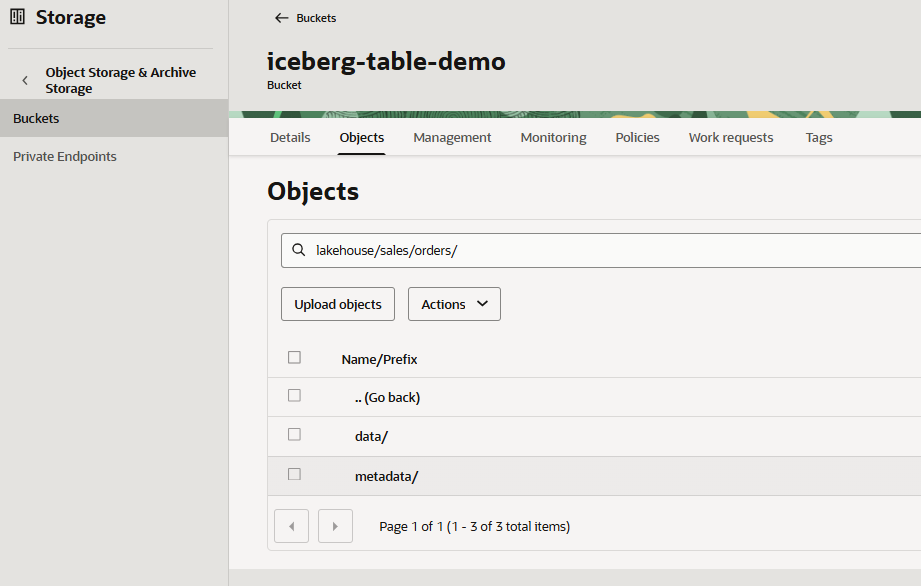
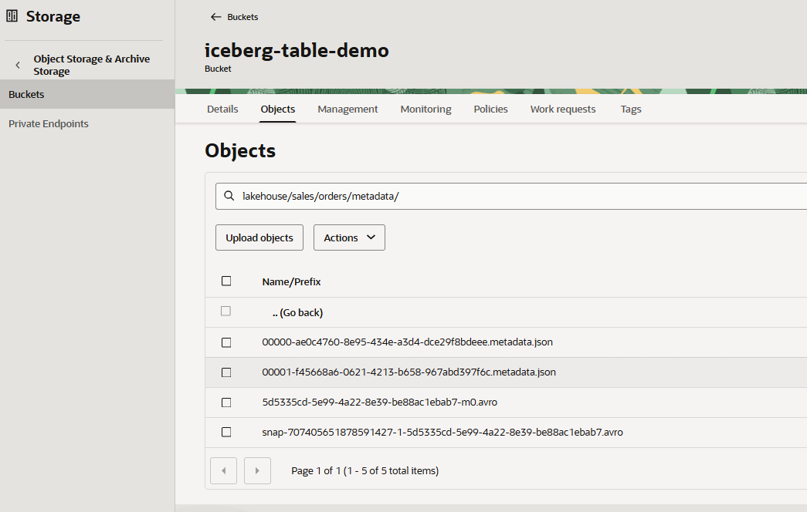

# Copy Iceberg Files to OCI Object Storage

## Introduction

In this lab, you will copy the generated Iceberg table files from the VM to OCI Object Storage. The copy script uses OCI CLI with instance principal authentication, so you do not need to put secret keys in Terraform variables or lab commands for this step.

Estimated Time: 20 minutes

### Objectives

By the end of this lab, you will:

* Copy the generated Iceberg `data/` and `metadata/` files to OCI Object Storage.
* Confirm the target Object Storage prefix contains the migrated files.
* Understand how to use a local exported Iceberg table as an alternate source.

### Prerequisites

This lab assumes you have:

* Completed Lab 1 (Provision Infrastructure).
* Completed Lab 2 (Generate the Source Iceberg Table).
* SSH access to the compute VM.
* Instance principal access from the VM to Object Storage.

## Task 1: Copy the generated source to OCI

1. Run the copy script on the VM:

    ```bash
    /opt/iceberg/copy-simulated-source-to-oci.sh
    ```

2. The script performs the following actions:

    * Reads the generated source from `/opt/iceberg/generated_aws_source`.
    * Deletes the target Object Storage prefix to avoid stale metadata.
    * Syncs the Iceberg files to OCI Object Storage.

3. The default target location is:

    ```text
    s3://iceberg-table-demo/lakehouse/sales/orders/
    ```

## Task 2: Verify the copied objects

You can verify the copied Iceberg files from the VM with OCI CLI or from the OCI Console.

### Verify with OCI CLI

1. List the copied objects from the VM:

    ```bash
    oci os object list \
      --auth instance_principal \
      --bucket-name iceberg-table-demo \
      --prefix lakehouse/sales/orders/ \
      --fields name \
      --all
    ```

2. Confirm that the output includes objects under:

    ```text
    lakehouse/sales/orders/data/
    lakehouse/sales/orders/metadata/
    ```

3. Confirm at least one Iceberg metadata JSON file exists:

    ```bash
    oci os object list \
      --auth instance_principal \
      --bucket-name iceberg-table-demo \
      --prefix lakehouse/sales/orders/metadata/ \
      --fields name \
      --all \
      --query 'data[].name'
    ```

### Verify in the OCI Console

1. Open the OCI Console.

2. Open the navigation menu and select **Storage**.

3. Under **Object Storage & Archive Storage**, select **Buckets**.

4. Make sure you are in the compartment used for this workshop.

5. Open the bucket:

    ```text
    iceberg-table-demo
    ```

6. In **Objects**, browse to:

    ```text
    lakehouse/sales/orders/
    ```

    

7. Confirm the prefix contains folders or object names for:

    ```text
    data/
    metadata/
    ```

8. Open `metadata/` and confirm at least one file ends with:

    ```text
    .metadata.json
    ```

    

## Task 3: Optional local export source

If you already have a local exported Iceberg table folder on the VM, you can use it instead of the generated MinIO source.

The folder must contain real Iceberg files similar to:

```text
/path/to/exported/iceberg/table/
  data/
  metadata/
    *.metadata.json
    *.avro
```

Run the copy script with `SOURCE_DIR`:

```bash
SOURCE_DIR=/path/to/exported/iceberg/table \
BUCKET=iceberg-table-demo \
TABLE_PREFIX=lakehouse/sales/orders \
/opt/iceberg/copy-simulated-source-to-oci.sh
```

## Learn More

* [OCI CLI Object Storage Commands](https://docs.oracle.com/en-us/iaas/tools/oci-cli/latest/oci_cli_docs/cmdref/os/object.html)
* [Apache Iceberg Table Spec](https://iceberg.apache.org/spec/)

You may now proceed to the next lab.

## Acknowledgements

* **Author** - Adina Nicolescu, Principal Cloud Architect, NACIE
* **Last Updated By/Date** - Adina Nicolescu, June 2026
