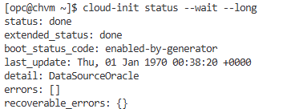

# Provision Infrastructure

## Introduction

In this lab, you will deploy the OCI resources required for the Iceberg table migration demo. Terraform creates the network, compute VM, Object Storage bucket, and cloud-init bootstrap used by the rest of the workshop.

Estimated Time: 40 minutes

### Objectives

By the end of this lab, you will:

* Review the Terraform automation.
* Configure the required Terraform variables.
* Provision the OCI infrastructure.
* Connect to the compute VM and confirm cloud-init completed.
* Confirm the Iceberg helper scripts are available.

### Prerequisites

This lab assumes you have:

* Completed the Get Started lab.
* Terraform installed locally.
* OCI API key credentials configured for Terraform.
* An SSH public/private key pair.
* Permission to create VCN, compute, and Object Storage resources in the selected compartment.

## Task 1: Review the automation

1. Download [icebergtables.zip](files/icebergtables.zip) from the lab files. Create an `icebergtables` folder and unzip the file into it:

    ```bash
    mkdir icebergtables
    unzip icebergtables.zip -d icebergtables
    ```

2. Change to the Terraform automation folder:

    ```bash
    cd icebergtables
    ```

3. Review the files:

    ```bash
    ls
    ```

    The automation includes:

    * `main.tf`, `variables.tf`, and `outputs.tf`
    * `terraform.tfvars`
    * `provider.auto.tfvars`
    * `modules/network`
    * `modules/instances`
    * `modules/object-storage`
    * `userdata/cloudinit.sh.tftpl`
    * `scripts`

## Task 2: Configure Terraform variables

1. Open `provider.auto.tfvars`.

2. Set your OCI provider values:

    ```hcl
    provider_oci = {
      tenancy_ocid     = "<tenancy_ocid>"
      user_ocid        = "<user_ocid>"
      fingerprint      = "<api_key_fingerprint>"
      private_key_path = "<path_to_api_private_key>"
      region           = "<oci_region>"
    }

    compartment_ids = {
      sandbox = "<compartment_ocid>"
    }
    ```

3. Open `terraform.tfvars`.

4. Complete the `linux_images` map for your target region. Use the OCID for `Oracle-Linux-9.6-2025.11.20-0` from the [Oracle Linux 9.6 image OCID table](https://docs.oracle.com/en-us/iaas/images/oracle-linux-9x/oracle-linux-9-6-2025-11-20-0.htm):

    ```hcl
    linux_images = {
      <oci_region> = {
        oel9 = "<oracle_linux_9_6_image_ocid>"
      }
    }
    ```

5. Confirm or update the following values for your tenancy:

    ```hcl
    ssh_public_key = "<path_to_ssh_public_key>"
    ssh_private_key = "<path_to_ssh_private_key>"
    registry       = "<ocir_region_key>.ocir.io"
    ```

6. Confirm the VM, network, and bucket settings match your target region and compartment.

7. Decide whether to enable Trino validation. Spark validation always runs. To add Trino validation, keep:

    ```hcl
    validation_engines = ["spark", "trino"]
    ```

    To run Spark validation only, use:

    ```hcl
    validation_engines = ["spark"]
    ```

## Task 3: Deploy the infrastructure

1. Initialize Terraform:

    ```bash
    terraform init
    ```

2. Validate the configuration:

    ```bash
    terraform validate
    ```

3. Review the execution plan:

    ```bash
    terraform plan
    ```

4. Apply the configuration:

    ```bash
    terraform apply
    ```

5. When prompted, enter:

    ```text
    yes
    ```

6. When the apply completes, note the public IP address from the `linux_instances` output.

## Task 4: Connect to the compute VM

1. Use SSH to connect to the VM:

    ```bash
    ssh opc@<vm_public_ip>
    ```

2. Check what cloud-init is doing and wait for cloud-init to complete, which will take a while:

    ```bash
    tail -f /var/log/cloud-init-output.log
    cloud-init status --wait --long   
    ```
    When cloud-init finishes you should see something like this:

    

3. Confirm the helper scripts exist after cloud-init completes:

    ```bash
    ls -l /opt/iceberg/
    ```

    You should see files similar to:

    ```text
    copy-simulated-source-to-oci.sh
    docker-compose.yml
    generate-simulated-aws-iceberg-table.sh
    register-simulated-oci-table.sh
    spark-sql-oci.sh
    validate-with-trino.sh
    ```

4. If the scripts are missing, inspect the cloud-init log:

    ```bash
    sudo tail -n 100 /var/log/cloud-init-output.log
    ```

## Learn More

* [Terraform OCI Provider Documentation](https://registry.terraform.io/providers/oracle/oci/latest/docs)
* [OCI Compute Documentation](https://docs.oracle.com/en-us/iaas/Content/Compute/home.htm)
* [OCI Object Storage Documentation](https://docs.oracle.com/en-us/iaas/Content/Object/home.htm)

You may now proceed to the next lab.

## Acknowledgements

* **Author** - Adina Nicolescu, Principal Cloud Architect, NACIE
* **Last Updated By/Date** - Adina Nicolescu, June 2026
