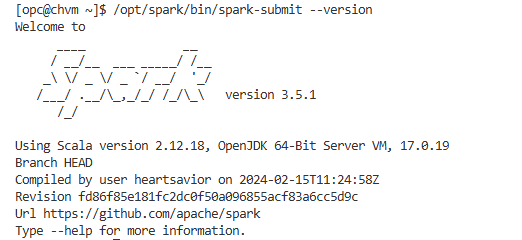
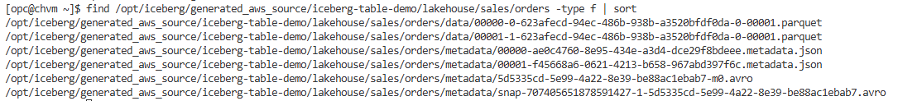
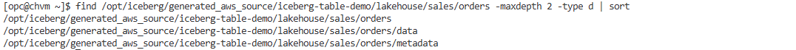

# Generate the Source Iceberg Table

## Introduction

In this lab, you will generate the source table used by the migration demo. The automation provides a script that starts MinIO as a simulated AWS S3 endpoint, creates a real Iceberg table with Spark, inserts sample rows, and exports the generated Iceberg files to the VM filesystem.

Estimated Time: 20 minutes

### Objectives

By the end of this lab, you will:

* Start the simulated AWS S3 source.
* Generate a real Iceberg table with Spark.
* Confirm the exported Iceberg `data/` and `metadata/` files exist.
* Understand where the source export is stored on the VM.

### Prerequisites

This lab assumes you have:

* Completed the Provision Infrastructure lab.
* SSH access to the compute VM.
* Cloud-init completed successfully on the VM.

## Task 1: Confirm the VM is ready

1. Connect to the VM if you are not already connected:

    ```bash
    ssh opc@<vm_public_ip>
    ```

2. Confirm cloud-init is complete:

    ```bash
    cloud-init status --wait --long
    ```

3. Confirm Docker and Spark are available:

    ```bash
    docker version
    /opt/spark/bin/spark-submit --version
    ```
    

4. Confirm the Iceberg scripts are available:

    ```bash
    ls -l /opt/iceberg/
    ```

    The folder should contain files similar to:

    ```text
    copy-simulated-source-to-oci.sh
    docker-compose.yml
    generate-simulated-aws-iceberg-table.sh
    jars/
    register-simulated-oci-table.sh
    spark-sql-oci.sh
    validate-with-trino.sh
    ```

5. Confirm the generator script is executable:

    ```bash
    ls -l /opt/iceberg/generate-simulated-aws-iceberg-table.sh
    ```

## Task 2: Optional source settings

The `/opt/iceberg/generate-simulated-aws-iceberg-table.sh` script has defaults for the bucket, table prefix, database, and table name. If you want to use the default workshop values, skip this task and continue to Task 3.

If you want non-default values, set them when you run the generator script. The same values must also be used in the copy and registration labs.
    
    ```bash
    BUCKET=iceberg-table-demo \
    TABLE_PREFIX=lakehouse/sales/orders \
    DATABASE=sales \
    TABLE=orders \
    /opt/iceberg/generate-simulated-aws-iceberg-table.sh
    ```

## Task 3: Generate the simulated AWS Iceberg source

1. If you are using the default workshop values, run the source generation script:

    ```bash
    /opt/iceberg/generate-simulated-aws-iceberg-table.sh
    ```

2. If you chose custom values in Task 2, run the same generator script with a command similar to the example shown in Task 2.

3. The script performs the following actions:

    * Starts MinIO locally as a simulated AWS S3 service.
    * Creates the bucket used by the demo.
    * Uses Spark and Iceberg to create the source table.
    * Inserts sample rows into `sales.orders`.
    * Exports the generated Iceberg files to the VM.

4. At the end of the script output, note the generated source path. The default export location is:

    ```text
    /opt/iceberg/generated_aws_source/iceberg-table-demo/lakehouse/sales/orders/
    ```

## Task 4: Inspect the generated Iceberg files

1. List the exported table files:

    ```bash
    find /opt/iceberg/generated_aws_source/iceberg-table-demo/lakehouse/sales/orders -type f | sort
    ```

    The output includes Parquet, JSON, and Avro files. The Parquet files contain the table data rows, the JSON files contain Iceberg table metadata such as schema and snapshot information, and the Avro files contain Iceberg manifest data that tracks the data files included in each snapshot.

    

2. Confirm the export includes `data/` and `metadata/` content:

    ```bash
    find /opt/iceberg/generated_aws_source/iceberg-table-demo/lakehouse/sales/orders -maxdepth 2 -type d | sort
    ```

    This command lists the directories under the exported table path, up to two levels deep, and sorts the output. Use it to confirm that the Iceberg export has the expected `data/` directory for table data files and `metadata/` directory for Iceberg metadata and manifests.

    

3. Confirm an Iceberg metadata JSON file exists:

    ```bash
    find /opt/iceberg/generated_aws_source/iceberg-table-demo/lakehouse/sales/orders/metadata -name "*.metadata.json" -type f | sort
    ```

## Learn More

* [Apache Iceberg Spark Documentation](https://iceberg.apache.org/docs/latest/spark-getting-started/)
* [MinIO Documentation](https://min.io/docs/minio/linux/index.html)

You may now proceed to the next lab.

## Acknowledgements

* **Author** - Adina Nicolescu, Principal Cloud Architect, NACIE
* **Last Updated By/Date** - Adina Nicolescu, June 2026
