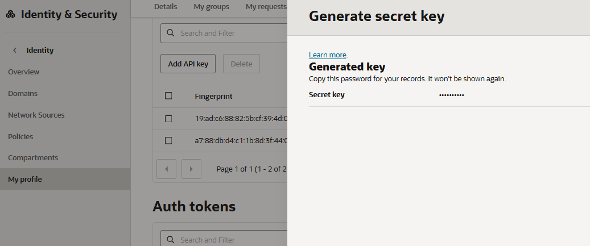
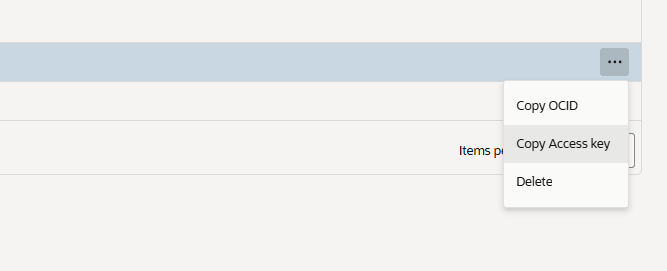

# Register and Validate the Iceberg Table

## Introduction

In this lab, you will register the copied Iceberg table in an Iceberg JDBC catalog and validate it with Spark. If Trino validation is enabled, the same script also runs a Trino SQL read check.

Estimated Time: 20 minutes

### Objectives

By the end of this lab, you will:

* Configure OCI S3-compatible credentials for Spark and Iceberg.
* Register the copied Iceberg table from its latest metadata JSON file.
* Validate the table schema and row count with Spark.
* Optionally validate the table with Trino.

### Prerequisites

This lab assumes you have:

* Completed Lab 1 (Provision Infrastructure).
* Completed Lab 2 (Generate the Source Iceberg Table).
* Completed Lab 3 (Copy Iceberg Files to OCI Object Storage).
* Permission to create or use an OCI Customer Secret Key for S3-compatible Object Storage access.

## Task 1: Create an OCI Customer Secret Key

Spark validation uses Iceberg `S3FileIO` against the OCI Object Storage S3-compatible endpoint. For this access pattern, OCI uses a Customer Secret Key, which contains an Access Key and Secret Key pair.

1. Open the OCI Console.

2. Open the **Profile** menu in the upper-right corner.

3. Select your username -> **My Profile**.

4. Then select **Tokens and keys**.

5. Go to the **Customer secret Keys** section and select **Generate Secret Key**.

6. Enter a friendly name, for example:

    ```text
    iceberg-livelab
    ```

7. Select **Generate Secret Key**.

8. Copy the generated **Secret Key** immediately and store it temporarily in a secure place. The secret key is displayed only once.

    

9. Close the dialog.

10. In the **Customer Secret Keys** list, find the row for the key you just created and show or copy its **Access Key**. This is the access key ID paired with the one-time **Secret Key** you copied from the dialog.

    

    You will need these values in the following steps. Associate them like this:

    ```text
    OCI_ACCESS_KEY_ID     = Access Key
    OCI_SECRET_ACCESS_KEY = Secret Key
    ```

    **NOTE**: Do not place the Secret Key in screenshots, Terraform variables, `.tfvars` files, outputs, logs, or source control.

## Task 2: Configure OCI S3-compatible credentials

Set your Customer Secret Key values as environment variables on the VM.

1. Export your S3-compatible access key:

    ```bash
    export OCI_ACCESS_KEY_ID="<access-key>"
    ```

2. Export your S3-compatible secret key:

    ```bash
    export OCI_SECRET_ACCESS_KEY="<secret-key>"
    ```

3. If the script cannot infer the region or endpoint, set the region explicitly:

    ```bash
    export OCI_REGION="<oci_region>"
    ```

    For example, for Frankfurt:

    ```bash
    export OCI_REGION="eu-frankfurt-1"
    ```

4. If needed, set the endpoint explicitly:

    ```bash
    export OCI_S3_ENDPOINT="https://<namespace>.compat.objectstorage.<oci_region>.oci.customer-oci.com"
    ```

    For example, for Frankfurt:

    ```bash
    export OCI_S3_ENDPOINT="https://<namespace>.compat.objectstorage.eu-frankfurt-1.oci.customer-oci.com"
    ```

    You can find the Object Storage namespace in the OCI Console under **Tenancy details** or in the bucket **General** section.

## Task 3: Register and validate with Spark

1. Run the registration script:

    ```bash
    /opt/iceberg/register-simulated-oci-table.sh
    ```

2. The script performs the following actions:

    * Lists the copied Iceberg metadata files in OCI Object Storage.
    * Finds the latest `*.metadata.json` file.
    * Removes stale target catalog rows for the demo table.
    * Registers the table as `oci.sales.orders`.
    * Runs Spark SQL validation.

3. Confirm the output includes:

    ```text
    Spark Web UI available at http://<vm-hostname>:4040
    Spark master: local[*], Application Id: local-<generated_id>
    orders
    order_id                bigint
    customer_id             string
    order_total             decimal(10,2)
    order_date              date
    3
    Trino validated table: iceberg.sales.orders
    Registered table: oci.sales.orders
    Metadata file: s3://iceberg-table-demo/lakehouse/sales/orders/metadata/<metadata-file>.metadata.json
    ```

4. Confirm Spark returns a row count for the migrated table.

## Task 4: Optional Trino validation

If `validation_engines` includes `trino`, the registration script runs Trino validation automatically.

You can also enable Trino for one run:

```bash
export VALIDATION_ENGINES="spark,trino"
/opt/iceberg/register-simulated-oci-table.sh
```

The Trino validation checks:

```sql
SHOW TABLES FROM iceberg.sales;
DESCRIBE iceberg.sales.orders;
SELECT COUNT(*) AS row_count FROM iceberg.sales.orders;
```

## Task 5: Run a manual Spark query

You can open the preconfigured Spark SQL launcher and query the registered table:

```bash
/opt/iceberg/spark-sql-oci.sh
```

At the Spark SQL prompt, run:

```sql
SHOW TABLES IN oci.sales;
DESCRIBE oci.sales.orders;
SELECT * FROM oci.sales.orders;
```

Exit Spark SQL:

```sql
exit;
```

## Learn More

* [Apache Iceberg Spark Queries](https://iceberg.apache.org/docs/latest/spark-queries/)
* [Apache Iceberg JDBC Catalog](https://iceberg.apache.org/docs/latest/jdbc/)
* [Trino Iceberg Connector](https://trino.io/docs/current/connector/iceberg.html)

You may now proceed to the next lab.

## Acknowledgements

* **Author** - Adina Nicolescu, Principal Cloud Architect, NACIE
* **Last Updated By/Date** - Adina Nicolescu, June 2026
