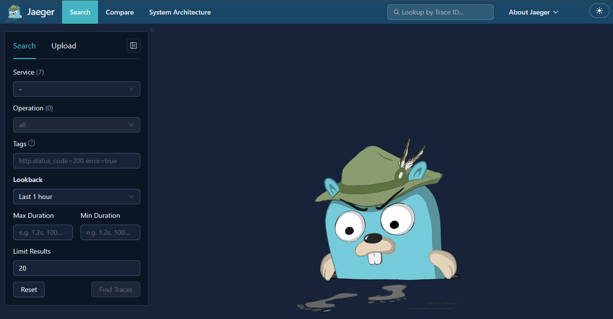
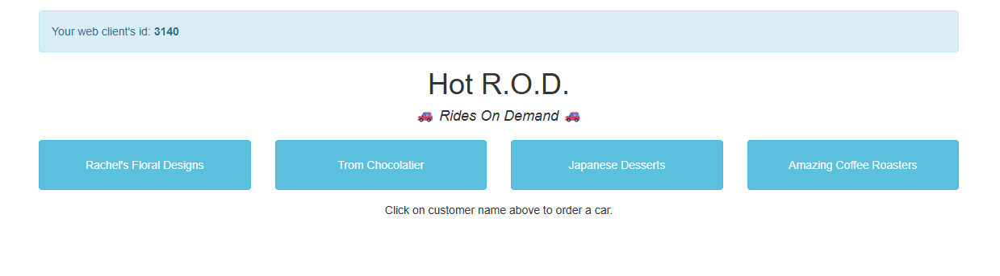
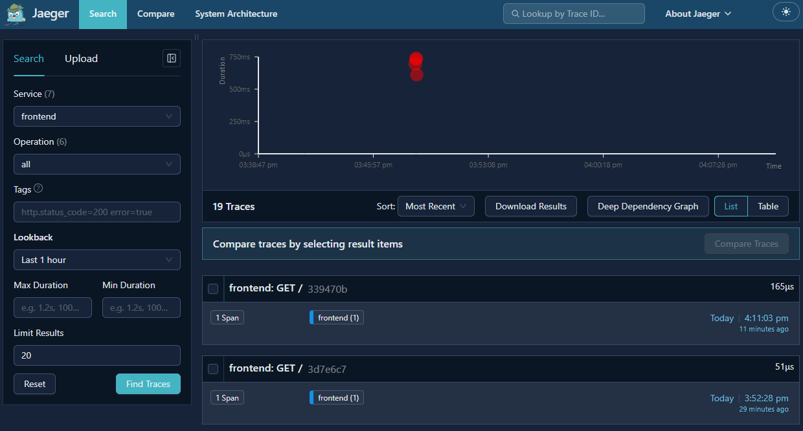
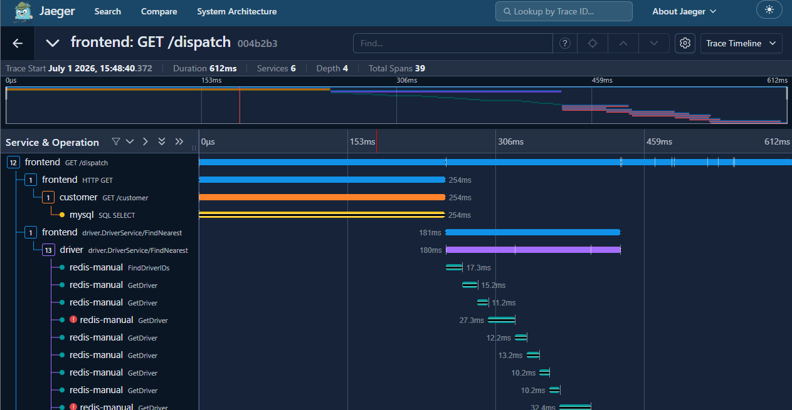

# Explore Jaeger Traces with HotROD

## Introduction

In this lab, you will use the Jaeger and HotROD deployment created in the previous lab. You will open the Jaeger UI, access the HotROD demo application, generate sample traces, and inspect those traces in Jaeger.

Estimated Time: 15 minutes

### Objectives

Hands-on experience with:

* Accessing the Jaeger UI from the Terraform output.
* Accessing the HotROD demo application.
* Generating sample distributed traces from HotROD.
* Searching for traces in Jaeger by service name.
* Inspecting trace details, spans, timings, and service interactions.

### Prerequisites

This lab assumes you have:

* Completed the previous provisioning lab.
* The Terraform output values from the deployment.
* Browser access to the Jaeger UI and HotROD URLs.
* SSH access to the Jaeger VM, if you want to generate traces from the command line.

## Task 1: Review the Terraform outputs

1. After `terraform apply` completes, review the output values printed in your terminal.

2. Locate the following outputs:

    - **jaeger_ui_urls**: The URL for the Jaeger UI.
    - **hotrod_urls**: The URL for the HotROD demo application.
    - **ssh_commands**: The command used to connect to the VM.
    - **next_steps**: A generated checklist with the main validation steps.

3. Wait 2-5 minutes after Terraform completes to allow cloud-init to finish installing Docker and starting the containers.

4. If you closed the terminal where Terraform ran, return to the Terraform folder and display the outputs again:

    ```
    terraform output
    ```

## Task 2: Open the Jaeger UI

1. Copy the URL from the `jaeger_ui_urls` output.

2. Open the URL in your browser.

3. Confirm that the Jaeger UI loads successfully.

    The URL should use port `16686`, for example:

    ```
    http://<public_ip>:16686
    ```

    

4. If the page does not load immediately, wait a few more minutes and refresh the browser.

## Task 3: Open the HotROD demo application

1. Copy the URL from the `hotrod_urls` output.

2. Open the URL in a new browser tab.

    The URL should use port `8080`, for example:

    ```
    http://<public_ip>:8080
    ```

3. Confirm that the HotROD demo application loads successfully.

    

## Task 4: Generate traces from HotROD

1. In the HotROD application, click the buttons for the sample applications, such as **Rachel's Floral Designs**, **Trom Chocolatier**, **Japanese Desserts**, or **Amazing Coffee Roasters**.

2. Each click simulates a ride request and generates a trace. Repeat the action several times so that Jaeger has multiple traces to display.

3. After generating requests, HotROD should display output similar to the following:

    ```
    HotROD T789586C arriving in 2min [req: 3140-4, latency: 656ms] [find trace] [open trace]
    HotROD T794658C arriving in 2min [req: 3140-3, latency: 780ms] [find trace] [open trace]
    HotROD T795986C arriving in 2min [req: 3140-2, latency: 780ms] [find trace] [open trace]
    HotROD T740524C arriving in 2min [req: 3140-1, latency: 779ms] [find trace] [open trace]
    ```

4. You can click **find trace** or **open trace** directly from HotROD, or return to the Jaeger UI browser tab and search for the traces manually.

## Task 5: Find traces in Jaeger

1. In the Jaeger UI, open the service dropdown.

2. Select the `frontend` service.

3. Click **Find Traces**.

    

4. Open one of the returned traces.

    

5. Review the trace details:

    - The total request duration.
    - The list of spans.
    - The relationship between services.
    - Any slow spans or visible timing gaps.

    HotROD may also produce traces with errors. These are useful for learning because they show how failed or problematic spans appear in the Jaeger timeline.

6. Return to the trace search page and try selecting other available services to compare their traces.

## Task 6: Generate traces from the VM

1. Copy the command from the `ssh_commands` Terraform output.

2. Connect to the VM:

    ```
    ssh -i <path_to_private_key> opc@<public_ip>
    ```

3. Check the Jaeger deployment status:

    ```
    jaeger-status
    ```

    The output should show the `jaeger` and `jaeger-hotrod` containers running, followed by a health confirmation similar to this:

    ```
    CONTAINER ID   IMAGE                                                     COMMAND                  CREATED       STATUS       PORTS                                                                                                                                                                                                                                                         NAMES
    <container>    cr.jaegertracing.io/jaegertracing/example-hotrod:latest   "/go/bin/hotrod-linu..." 2 hours ago   Up 2 hours   0.0.0.0:8080->8080/tcp, [::]:8080->8080/tcp, 8081-8083/tcp                                                                                                                                       jaeger-hotrod
    <container>    cr.jaegertracing.io/jaegertracing/jaeger:2.19.0           "/cmd/jaeger/jaeger-..." 2 hours ago   Up 2 hours   0.0.0.0:4317-4318->4317-4318/tcp, [::]:4317-4318->4317-4318/tcp, 0.0.0.0:5778->5778/tcp, 0.0.0.0:9411->9411/tcp, 0.0.0.0:16686->16686/tcp   jaeger

    Jaeger UI is healthy
    ```

4. Generate sample traces from the VM:

    ```
    jaeger-generate-traces 20 1
    ```

    The first value, `20`, is the number of requests to generate. The second value, `1`, is the delay in seconds between requests.

    The command should return output similar to this:

    ```
    Generated 20 HotROD requests. Open Jaeger UI and search for service: frontend.
    ```

5. Return to the Jaeger UI.

6. Select service `frontend` and click **Find Traces** again.

7. Open one of the new traces and confirm that spans are visible.

    The `jaeger-generate-traces 20 1` command generates 20 HotROD requests. Each request creates one trace, and each trace can contain multiple spans. A span represents one timed operation within the request, such as a frontend call, route lookup, customer lookup, or Redis/MySQL operation. Depending on the request path, a single trace may contain 20, 30, or 40+ spans.

## Task 7: Review OTLP endpoints

1. Review the Terraform outputs for external trace ingestion endpoints:

    - **otlp_grpc_endpoints**
    - **otlp_http_endpoints**

2. Use these endpoints if you want to send traces from another application or trace generator into this Jaeger deployment.

3. Keep these endpoints restricted to trusted sources. They are useful for testing OpenTelemetry clients, but should not be exposed broadly in production environments.

You may now **proceed to the next lab**.

## Acknowledgements

**Authors**

* **Adina Nicolescu**, Principal Cloud Architect, NACIE
* Last Updated - Adina Nicolescu, July 2026
