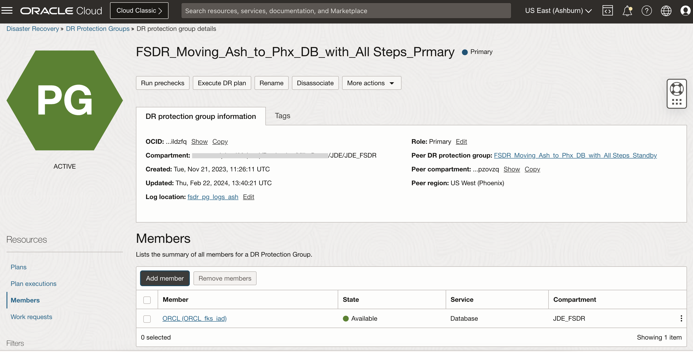
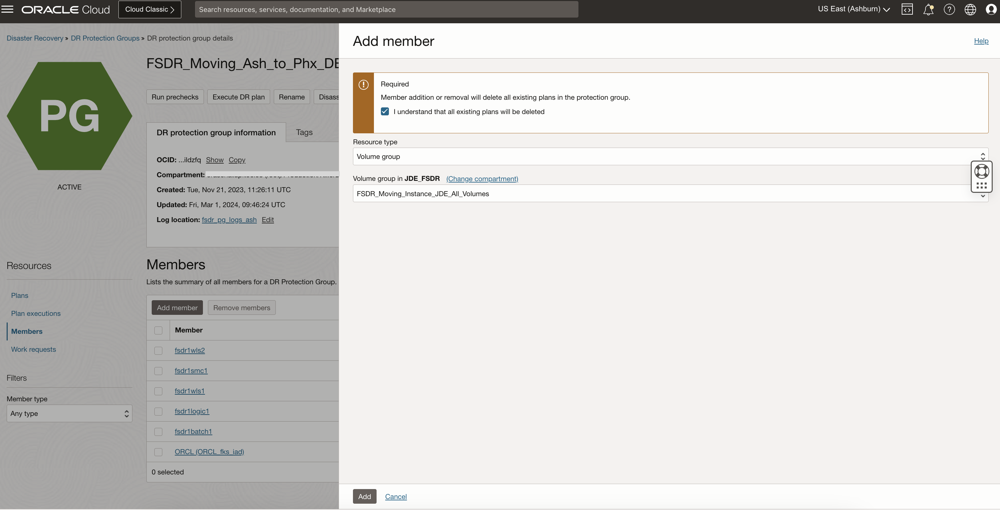
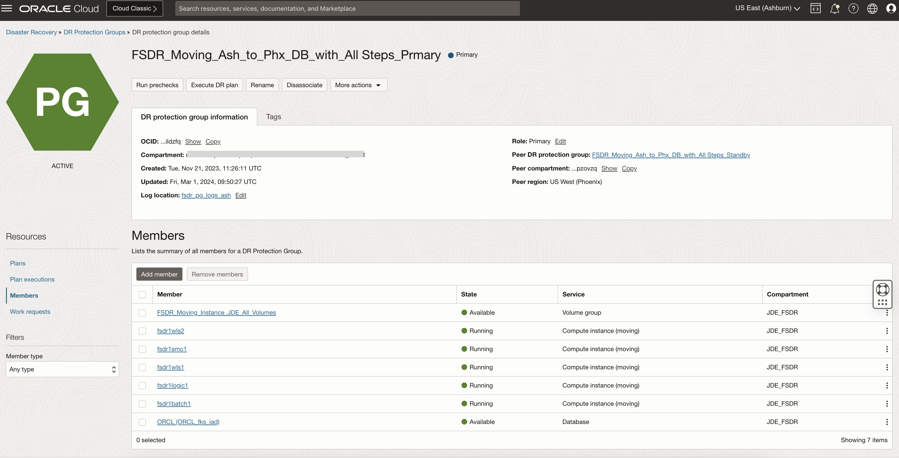
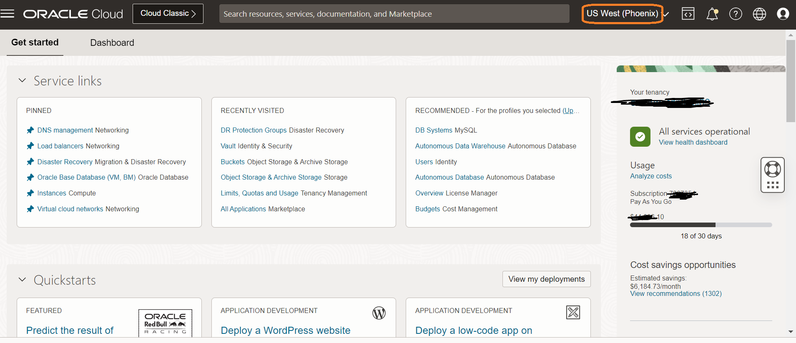
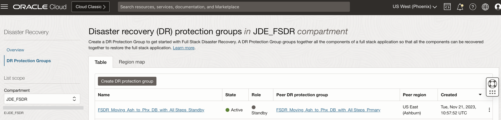
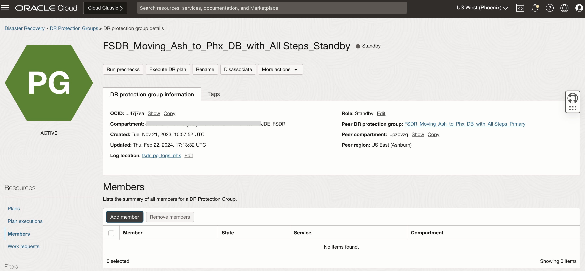
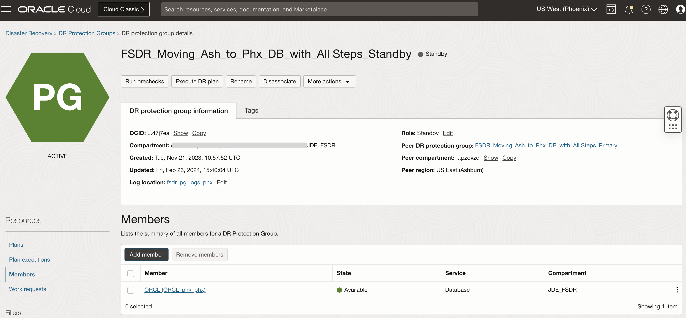

# Add members to the DR Protection groups

## Introduction

In this lab, we will add members to the DR Protection groups created and associated in the previous lab. Ashburn is the primary region and Phoenix is the standby region.

Estimated Time: 10 Minutes

### Objectives

- Add members to Ashburn DRPG (Primary)
- Add members to Phoenix DRPG (Standby)

In Ashburn (Primary) region, members to be added are as below.

- JDE Primary Database hosted on Oracle Base DB Services
- JDE Batch Server Compute Instance
- JDE Logic Server Compute Instance
- JDE Web Server Compute Instance
- JDE SMC Server Compute Instance

In Phoenix (Standby), members to be added are as below.

- JDE Standby Database hosted on Oracle Base DB Services

  Note: *We do not need to add other servers in a Movable setup as those will be created as a part of switchover. Only Database needs to be selected to keep both DB in sync via DataGuard*.

## Task 1: Add members to Ashburn DRPG (Primary)

1. Navigate to the Ashburn region "DR protection group details" page to add the members in the group **FSDR\_Moving\_Ash\_to\_Phx\_DB\_with\_All Steps\_Prmary**

2. Add Primary Oracle Base DB Services.

   Select **FSDR\_Moving\_Ash\_to\_Phx\_DB\_with\_All Steps\_Prmary** DRPG, navigate to **Members** in the **Resources** section, and hit **Add Member**

   

      - Resource Type is **Database**
      - Database Type is **Oracle Base Database**
      - Database System will be JDE Primary Database shown in the dropdown.
      - Database Home will be auto-populated
      - Database will be auto-populated
      - Database password secret will be the secret created in Lab 1.

   Make sure to check the box **"I understand that all existing plans will be deleted"**.

   Click on **Add**.

   

   **FSDR\_Moving\_Ash\_to\_Phx\_DB\_with\_All Steps\_Prmary** DRPG status will change to updating; wait for a few seconds. You should see that the database is added as a member. Refresh the DRPG page if required. You can monitor the request's status in the **Work requests** section under Resources.

   Navigate back to the DR Protection group page; the status of DRPG should be active.

   

3. Before adding the **Compute Instances** as a member to the DRPG with a **Moving Instance** strategy, we need to add a Volume Group as a member with all their block and boot volumes.

   Select **FSDR\_Moving\_Ash\_to\_Phx\_DB\_with\_All Steps\_Prmary** DRPG, navigate to **Members** in the *Resources* section, and hit **Add Member**
   

   Select the **Volume Group** from the Resource type drop down list. 
   

      - Make sure to check the box **"I understand that all existing plans will be deleted"**
      - Resource Type - **Volume Group**
      - Volume Group - **Select the Volume Group created in the pre-requisite setup with all volumes from the drop down** 
   
   
      Click **Add** and proceed to add the JDE Servers.
      
4. Add JDE Batch Server Compute instance.

   Select **FSDR\_Moving\_Ash\_to\_Phx\_DB\_with\_All Steps\_Prmary** DRPG, navigate to **Members** in the *Resources* section, and hit **Add Member**

   

   It will show various resource types to fill in. See below for details.
   

      - Resource Type - **Compute**
      - Instance - **Select the batch server in the compartment**
      - Compute instance type - **Moving Instance**
      - Make sure to check the box **"I understand that all existing plans will be deleted"**
      - Click on **Add VNIC mapping** which will open another page
      - VNIC - **Select the batch server VM**
      - Destination VCN - **Select the VCN created for standby**
      - Destination subnet - **PrivateRegSub** for keeping the servers on private subnet
      - Destination primary private IP Address and hostname label - **Leave it blank to populate on its own**
      - Destination network security group - **Provide the same NSG associated for the server**
      - Click Add to close the VNIC section, click Add again to add the member.

   **FSDR\_Moving\_Ash\_to\_Phx\_DB\_with\_All Steps\_Prmary** DRPG status will change to updating, wait for a few seconds. DRPG status will change to active. You should be able to see that JDE Batch Server compute instance has been added as a member. Refresh the DRPG page if required. You can monitor the status in the *Work requests* section under Resources.

   

    Navigate back to the DR Protection group page, the status of DRPG should be active.

5. Add the JDE Logic, JDE Web and JDE SMC servers as a member to the DRPG following the above steps. Below screenshot shows all the members added.
   

## Task 2: Add members to Phoenix DRPG (Standby)

1. Login into OCI Console. The standby region should be **Phoenix**.

   

2. Select **Migration and Disaster Recovery** from the Hamburger menu, then **Disaster Recovery** -> **DR Protection Groups**. Verify the region is **Phoenix**.

   

3. You will land on the Disaster Recovery Protection group home page; make sure you have selected the *Phoenix* region. Click on **FSDR\_Moving\_Ash\_to\_Phx\_DB\_with\_All Steps\_Standby** DRPG.

   

   In the Phoenix region DRPG page, add the members required in the DR Protection Group.

4. Add Standby Oracle Base DB Services.

   Select **FSDR\_Moving\_Ash\_to\_Phx\_DB\_with\_All Steps\_Standby** DRPG, navigate to **Members** in the *Resources* section, and hit **Add Member**

   

      - Resource Type is **Database**
      - Database Type is **Oracle Base Database**
      - Database System will be JDE Database at the standby region
      - Database Home will be auto-populated
      - Database will be auto-populated
      - Database password secret will be the secret created earlier for standby region

  Make sure to check the box **"I understand that all existing plans will be deleted"**.

  Click on **Add**.

   

  **FSDR\_Moving\_Ash\_to\_Phx\_DB\_with\_All Steps\_Standby** DRPG status will change to updating, wait for a few seconds. You should see that the database is added as a member. Refresh the DRPG page if required. You can monitor the request's status in the **Work requests** section under Resources.

  Navigate back to the DR Protection group page; the status of DRPG should be active.

   

  Note: No other servers are needed to be added as members for this movable instance setup.

  You may now **proceed to the next lab**.

## Troubleshooting tips

1. After adding the member, in case if the member is not showing up. Re-add the member again.

## Acknowledgements

- **Author:** Tarani Meher, Senior JDE Specialist
- **Last Updated By/Date:** Tarani Meher, Senior JDE Specialist, 01/2024
