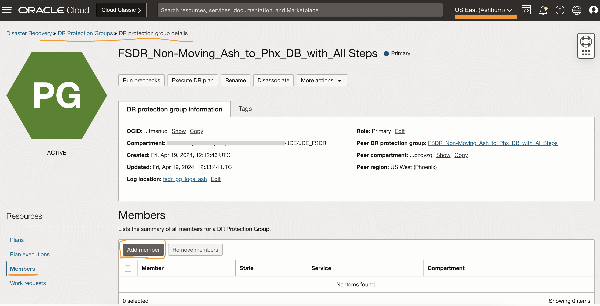
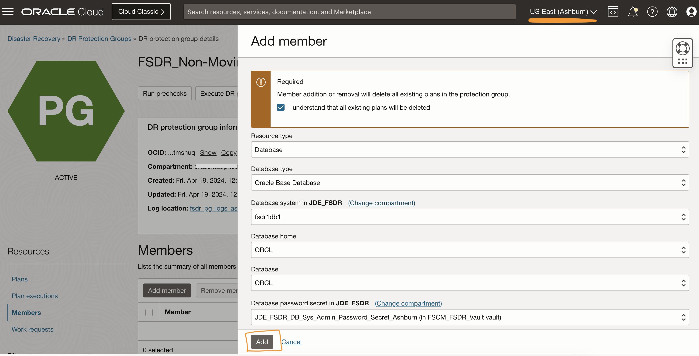
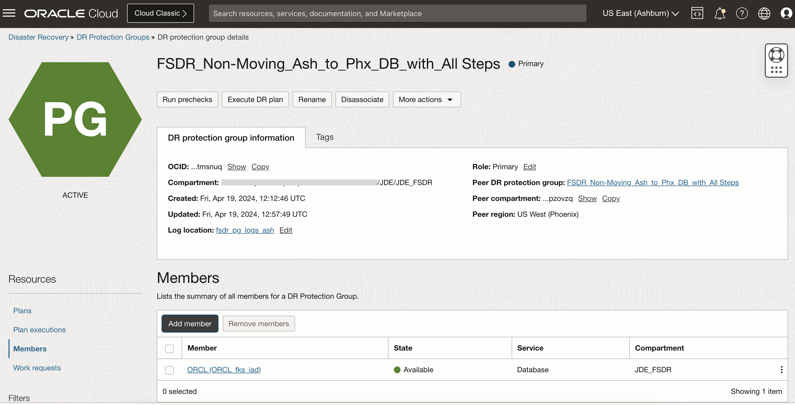
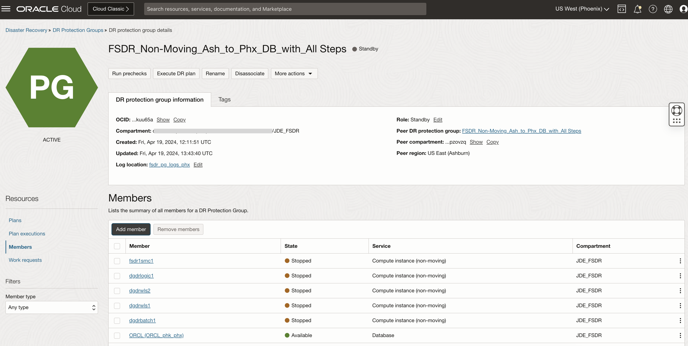

# Add members to the DR Protection groups

## Introduction

In this lab, we will add members to the DR Protection groups created and associated in the previous lab. Ashburn is the primary region and Phoenix is the standby region.

Estimated Time: 10 Minutes

### Objectives

- Add members to Ashburn DRPG (Primary)
- Add members to Phoenix DRPG (Standby)

In Ashburn (Primary) region, For the Non-Moving Compute plan, we only need to add the Database in the primary region.

- JDE Primary Database hosted on Oracle Base DB Services

In Phoenix (Standby) region, members to be added are as below.

- JDE Standby Database hosted on Oracle Base DB Services
- JDE Batch Server Compute Instance
- JDE Logic Server Compute Instance
- JDE Web Server Compute Instance
- JDE SMC Server Compute Instance

## Task 1: Add members to Ashburn DRPG (Primary)

1. Navigate to the Ashburn region "DR protection group details" page to add the members in the group **FSDR\_Non-Moving\_Ash\_to\_Phx\_DB\_with\_All Steps**

2. Add Primary Oracle Base DB Services.

   Select **FSDR\_Non-Moving\_Ash\_to\_Phx\_DB\_with\_All Steps** DRPG, navigate to **Members** in the **Resources** section, and hit **Add Member**

   

      - Resource Type is **Database**
      - Database Type is **Oracle Base Database**
      - Database System will be JDE Primary Database shown in the dropdown.
      - Database Home will be auto-populated
      - Database will be auto-populated
      - Database password secret will be the secret created in Lab 1.

   Make sure to check the box **"I understand that all existing plans will be deleted"**.

   Click on **Add**.

   

   **FSDR\_Non-Moving\_Ash\_to\_Phx\_DB\_with\_All Steps** DRPG status will change to updating; wait for a few seconds. You should see that the database is added as a member. Refresh the DRPG page if required. You can monitor the request's status in the **Work requests** section under Resources.

   Navigate back to the DR Protection group page; the status of DRPG should be active.

   

   **Note:** For Non-Moving compute, we only need to add the DB server as the member on the primary DRPG as all other servers are already present on the standby region. 

## Task 2: Add members to Phoenix DRPG (Standby)

1. Login into OCI Console. The standby region should be **Phoenix**.

   

2. Select **Migration and Disaster Recovery** from the Hamburger menu, then **Disaster Recovery** -> **DR Protection Groups**. Verify the region is **Phoenix**.

   

3. You will land on the Disaster Recovery Protection group home page; make sure you have selected the *Phoenix* region. Click on **FSDR\_Non-Moving\_Ash\_to\_Phx\_DB\_with\_All Steps** DRPG.

   

   In the Phoenix region DRPG page, add the members required in the DR Protection Group.

4. Add Standby Oracle Base DB Services.

   Select **FSDR\_Non-Moving\_Ash\_to\_Phx\_DB\_with\_All Steps** DRPG, navigate to **Members** in the *Resources* section, and hit **Add Member**

   

      - Resource Type is **Database**
      - Database Type is **Oracle Base Database**
      - Database System will be JDE Database at the standby region
      - Database Home will be auto-populated
      - Database will be auto-populated
      - Database password secret will be the secret created earlier for standby region

  Make sure to check the box **"I understand that all existing plans will be deleted"**.

  Click on **Add**.

   

  **FSDR\_Non-Moving\_Ash\_to\_Phx\_DB\_with\_All Steps** DRPG status will change to updating, wait for a few seconds. You should see that the database is added as a member. Refresh the DRPG page if required. You can monitor the request's status in the **Work requests** section under Resources.

  Navigate back to the DR Protection group page; the status of DRPG should be active.

   

5. Add JDE Batch Server Compute instance. 

   Click **Add Member** to add the JDE Batch Server as a compute instance. It will show various resource types to fill in. See below for details.
   

      - Resource Type - **Compute**
      - Instance - **Select the batch server in the compartment**
      - Compute instance type - **Non-moving Instance**
      - Make sure to check the box **"I understand that all existing plans will be deleted"**
      - Click **Show advanced options** and select the **Start and stop instance on failover/switchover** which will add a group in the plan to start the VMs as a part of the DR Plan while DR switch over. Do it for all JDE servers added as a member.

   

   **FSDR\_Non-Moving\_Ash\_to\_Phx\_DB\_with\_All Steps** DRPG status will change to updating, wait for a few seconds. DRPG status will change to active. You should be able to see that JDE Batch Server compute instance has been added as a member. Refresh the DRPG page if required. You can monitor the status in the *Work requests* section under Resources.

    Navigate back to the DR Protection group page, the status of DRPG should be active.

6. Add the JDE Logic, JDE Web and JDE SMC servers as a member to the DRPG following the above steps. Below screenshot shows all the members added.
   

  You may now **proceed to the next lab**.

## Troubleshooting tips

1. After adding the member, in case if the member is not showing up. Re-add the member again.

## Acknowledgements

* **Author:** Tarani Meher, Principal Cloud Architect
* **Last Updated By/Date:** Tarani Meher, Principal Cloud Architect, May-2024
