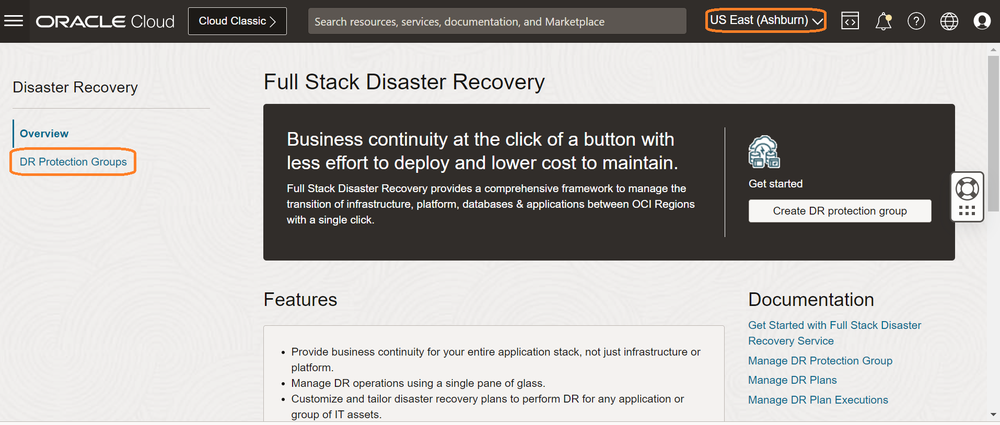
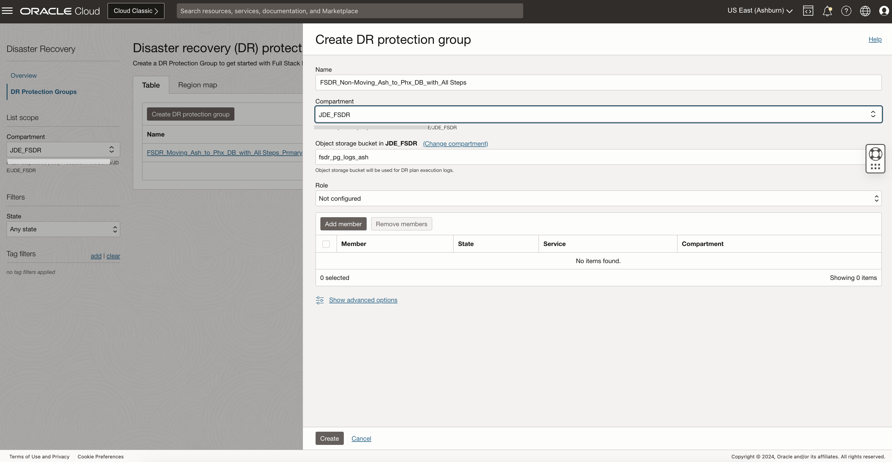
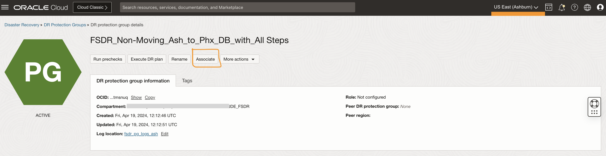
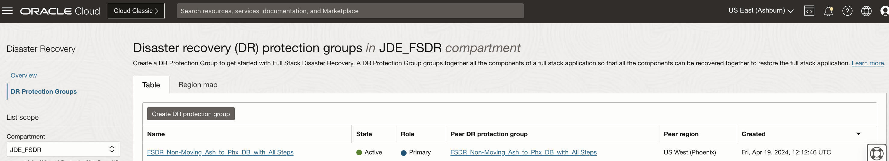

# Create and Associate Disaster Recovery Protection Groups

## Introduction

In this lab, we will do the Disaster Recovery setup with warm standby (non-moving) where a JDE instance is already present at the standby region. The standby JDE instance was created by the One-Click Provisioning as a part of disaster recovery environment at phoenix region. We are starting with Ashburn as the primary region and Phoenix as the standby region. Note that the earlier labs for moving instance does not have any impact on this.

Estimated Time: 15 Minutes

### Objectives

- Create DRPG in Ashburn and Phoenix regions.
- Associate Ashburn DRPG as primary and Phoenix DRPG as Standby

## Task 1: Create DRPG in Ashburn and Phoenix regions

1. Login into OCI Console. The primary region should be **Ashburn**.

    

   Open another browser tab and then select the region as **Phoenix** (Standby Region)

    

2. In the first browser tab,Select **Migration and Disaster Recovery** from the Hamburger menu, then **Disaster Recovery** -> **DR Protection Groups**. Verify the region is **Ashburn**

    

3. In the second browser tab,Select **Migration and Disaster Recovery** from the Hamburger menu, then **Disaster Recovery** -> **DR Protection Groups** Verify the region is **Phoenix**

    

4. You will land up at the Full Stack Disaster Recovery home page; click on DR Protection Groups and make sure to have two tabs opened for Ashburn and Phoenix region.

    
    

5. Create DRPG in the Ashburn region. Click on Create DR Protection group in the Ashburn region browser tab.

    - Provide a name for the Full Stack Disaster Recovery Protection Group
    - Select the right compartment
    - Select the object storage bucket created as **fsdr\_pg\_logs\_ash**
    - Ignore Role and leave as **Not Configured**
    - Ignore Add member 

    

    Click on Create.

6. Create DRPG in the Phoenix region. Select Create DR Protection group in the Phoenix region browser tab.

    - Provide a name for the Full Stack Disaster Recovery Protection Group
    - Select the right compartment
    - Select the object storage bucket created as **fsdr\_pg\_logs\_phx**
    - Ignore Role and leave as **Not Configured**
    - Ignore Add member

    

    Click on Create.

## Task 2: Associate Ashburn DRPG as primary and Phoenix DRPG as Standby

1. From the Ashburn region OCI console, select **FSDR\_Non-Moving\_Ash\_to\_Phx\_DB\_with\_All Steps** DRPG. Select the **Associate** button

   

   - Select Role as **Primary**
   - Select Peer Region as **US West (Phoenix)**,
   - Select Peer DR Protection group in the compartment (change assigned compartment if required); you should select **FSDR\_Non-Moving\_Ash\_to\_Phx\_DB\_with\_All Steps**
   - Verify and associate

  

  Navigate back to the DR Protection group home page. You should be able to see DRPG **FSDR\_Non-Moving\_Ash\_to\_Phx\_DB\_with\_All Steps** state as *Active*, role as *Primary*, peer region as *US West (Phoenix)*

  

   Now, we have associated **FSDR\_Non-Moving\_Ash\_to\_Phx\_DB\_with\_All Steps** on Ashburn as *Primary DRPG* and **FSDR\_Non-Moving\_Ash\_to\_Phx\_DB\_with\_All Steps** on Phoenix as *Standby DRPG*

   You may now **proceed to the next lab**.

## Acknowledgements

* **Author:** Tarani Meher, Principal Cloud Architect
* **Last Updated By/Date:** Tarani Meher, Principal Cloud Architect, May-2024
